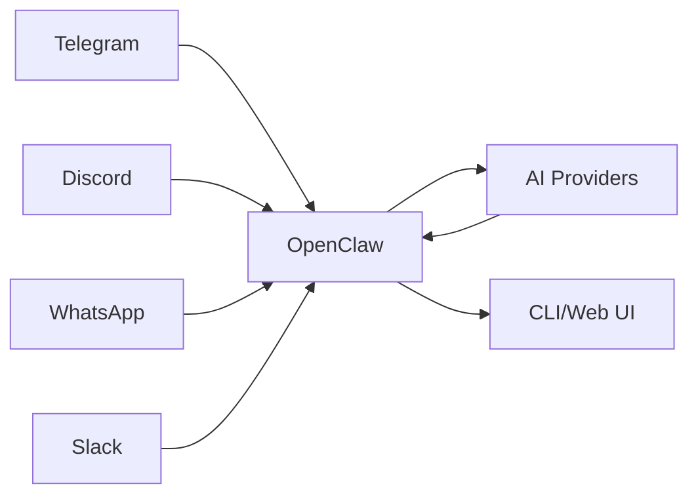
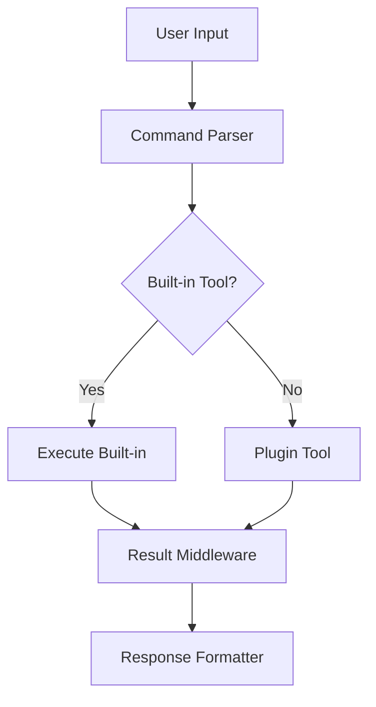

# Introduction to OpenClaw

## What is OpenClaw?

OpenClaw is an open-source, self-hosted AI gateway that bridges chat platforms with AI agents. It provides a unified interface for managing multiple messaging channels, AI providers, and agent runtimes in a single, composable system.



## Design Philosophy

OpenClaw follows several core principles:

### 1. Plugin-Based Architecture

Everything in OpenClaw is a plugin. Providers, channels, tools, and runtimes are all plugins that can be added, removed, or customized without modifying the core system.

**Key benefits:**
- Extensibility without core changes
- Clear boundaries between components
- Independent versioning and deployment

### 2. Self-Hosted First

OpenClaw runs entirely on your infrastructure. No vendor lock-in, no cloud dependencies, full control over your data.

**What this means:**
- Your messages never leave your server
- Complete privacy and compliance
- Works offline and in air-gapped environments

### 3. Core Stays Plugin-Agnostic

The core system has no built-in knowledge of specific providers, channels, or AI models. All capabilities come through well-defined plugin interfaces.

**Design implications:**
- Core is smaller and more maintainable
- Plugin ecosystem can evolve independently
- New integrations don't require core changes

### 4. Contract-First Design

Plugins communicate through strict contracts (TypeScript interfaces and Zod schemas). This ensures type safety, validation, and clear boundaries.

```typescript
// Example: Plugin contract definition
interface ProviderContract {
  readonly id: string;
  readonly name: string;
  listModels(): Promise<Model[]>;
  createCompletion(params: CompletionParams): Promise<CompletionResult>;
}
```

## Core Features

### Multi-Channel Support

OpenClaw natively supports numerous messaging platforms:

| Channel | Protocol | Features |
|---------|----------|----------|
| Telegram | Bot API | Messages, media, groups, channels |
| Discord | Webhook/Gateway | Rich messages, threads, slash commands |
| WhatsApp | Baileys | Messages, media, status |
| Slack | Web API | Messages, modal, scheduled messages |
| Matrix | Client-Server API | E2E encryption, rooms |
| iMessage | Private API | Messages, tapbacks |
| Feishu | Webhook/API | Messages, cards, mini programs |

### Multi-Provider Support

Connect to any AI provider without changing your agent code:

| Provider | Type | Models |
|----------|------|--------|
| OpenAI | Official SDK | GPT-4, GPT-4o, o1, o3 |
| Anthropic | Official SDK | Claude 3.5, Claude 3.7 |
| Google | Vertex AI | Gemini 1.5, Gemini 2.0 |
| Azure | OpenAI on Azure | GPT-4, Codex |
| Ollama | Local | Llama, Mistral, Qwen |
| LM Studio | Local | Any GGUF model |
| DeepSeek | Official API | DeepSeek Coder, V3 |
| OpenRouter | Unified API | 100+ models |

### Agent Runtimes

Multiple agent execution strategies:

- **PI Runtime** - Embedded agent with direct model access
- **Codex Runtime** - OpenAI Codex app-server integration
- **ACP Runtime** - Agent Communication Protocol for distributed agents

### Tool System

Flexible tool execution with hooks and middleware:



### Session Management

Sophisticated session handling with isolation strategies:

- **Per-user sessions** - Each user has a private context
- **Per-channel sessions** - Shared context across channel
- **Per-group sessions** - Group-specific isolation
- **Cross-channel sessions** - Unified context across platforms

### Memory System

Hierarchical memory architecture:

1. **Working Memory** - Current session context
2. **Short-term Memory** - Recent interactions (MEMORY)
3. **Long-term Memory** - Persistent knowledge (wiki)
4. **Active Memory** - Inferred facts and commitments

## Use Cases

### Personal AI Assistant

Deploy your own AI assistant connected to your favorite chat platform:

```
Telegram Bot → OpenClaw → Claude → Telegram Bot
                 ↓
            Long-term memory
```

### Team Bot

Shared AI assistant for your team:

```
Slack/Discord → OpenClaw → GPT-4 → Team responses
                    ↓
              Shared knowledge base
```

### Multi-Platform Hub

Unified AI interface across all your channels:

```
Telegram ─┐
WhatsApp ─┼→ OpenClaw → Agent → Responses
Discord ──┤           ↓
Slack ────┘         Channel routing
```

### Enterprise Gateway

Self-hosted AI gateway for your organization:

- SSO integration
- Audit logging
- Data residency compliance
- Custom plugins

## Technical Stack

| Component | Technology |
|-----------|------------|
| Runtime | Node.js 22+ (Node 24 recommended) |
| Language | TypeScript (ESM, strict mode) |
| Build | tsdown |
| Testing | Vitest |
| Package Manager | pnpm |
| Protocol | WebSocket + JSON |
| Types | TypeBox + Zod |

## License

OpenClaw is released under the MIT License, making it free for personal and commercial use.

## Getting Started

See the [Quick Start Guide](/start/quick-start) to set up OpenClaw in minutes.

For plugin development, see [Plugin Architecture](/architecture-book/part-3-plugin-system/01-plugin-architecture).