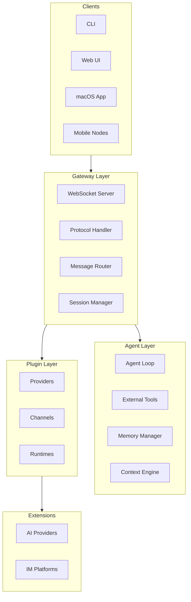
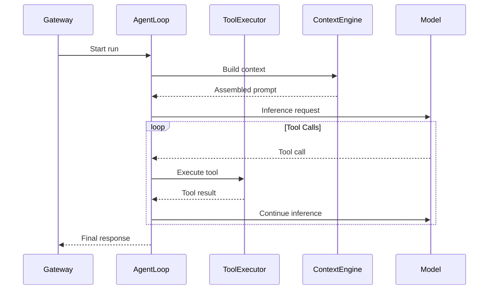
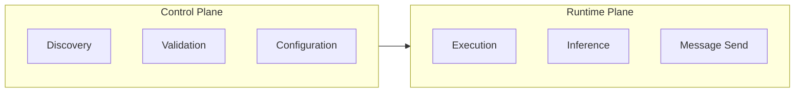
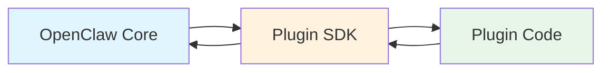
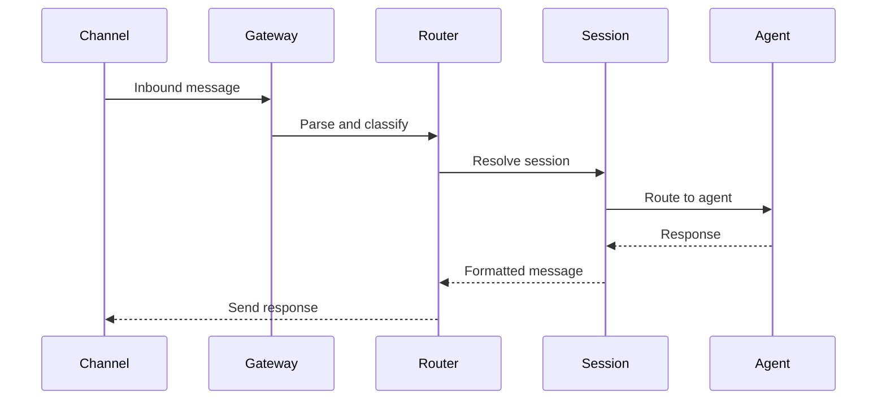
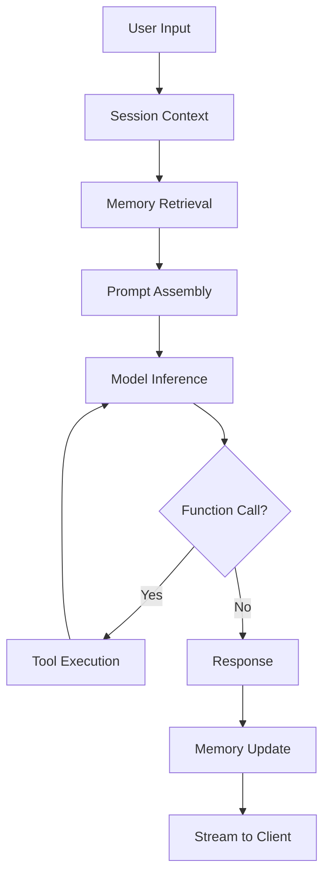
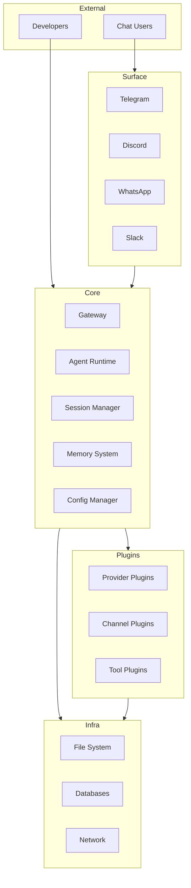

# System Architecture Overview

## Layered Architecture

OpenClaw follows a strict layered architecture where each layer has clear responsibilities and boundaries:



## Layer Responsibilities

### Gateway Layer

The Gateway is the central hub that owns all messaging surfaces.

**Core responsibilities:**

| Component | Responsibility |
|-----------|----------------|
| WebSocket Server | Client connections, protocol framing |
| Protocol Handler | Message validation, routing |
| Message Router | Session resolution, agent routing |
| Session Manager | Session lifecycle, state management |

**Key invariants:**
- Exactly one Gateway controls messaging per host
- Handshake is mandatory before any communication
- All clients must authenticate before use

### Agent Layer

The Agent layer handles AI interaction and tool execution.

**Core responsibilities:**

| Component | Responsibility |
|-----------|----------------|
| Agent Loop | Inference, tool calling, response streaming |
| Tool Executor | Tool discovery, execution, result handling |
| Memory Manager | Context assembly, compaction, retrieval |
| Context Engine | Prompt assembly, token budgeting |

**Execution model:**


### Plugin Layer

The Plugin layer provides extensibility through providers, channels, and runtimes.

**Plugin types:**

| Type | Description | Example |
|------|-------------|---------|
| Provider | AI provider integration | openai, anthropic |
| Channel | Messaging platform | telegram, discord |
| Tool | External capability | browser, tavily |
| Runtime | Agent execution | pi, codex |
| Memory | Knowledge storage | wiki, lancedb |

## Core Design Principles

### 1. Control Plane vs Runtime Plane

OpenClaw separates control plane operations from runtime operations:

**Control plane (lightweight):**
- Plugin discovery and inventory
- Manifest parsing and validation
- Configuration checking
- Status queries

**Runtime plane (on-demand):**
- Actual plugin execution
- Model inference
- Message sending
- Tool execution



### 2. Manifest-First Design

Plugin configuration is derived from manifest metadata before runtime execution:

```typescript
// Plugin manifest defines behavior
{
  "id": "provider/openai",
  "name": "OpenAI Provider",
  "version": "1.0.0",
  "providers": [{
    "id": "openai",
    "models": ["gpt-4o", "gpt-4o-mini"]
  }]
}

// Control plane uses manifest
const config = await pluginRegistry.validate(manifest);

// Runtime plane uses validated config
const result = await provider.createCompletion(config);
```

### 3. Lazy Loading

Plugins are loaded on-demand, not eagerly at startup:

```typescript
// Lazy activation pattern
const loader = new PluginRuntimeLoader({
  lazy: true,
  manifestResolver: new ManifestResolver(),
});

await loader.activate("provider/openai", { lazy: true });
```

### 4. Contract Boundaries

Plugins cross into core only through well-defined contracts:



**Allowed crossings:**
- `openclaw/plugin-sdk/*` - Public SDK surface
- `manifest.json` - Metadata only
- Injected runtime helpers
- Documented barrel exports

**Forbidden crossings:**
- `src/**` internal modules
- Other plugin internals
- Core implementation details

## Data Flow

### Message Flow (Inbound)



### Agent Execution Flow



## Component Diagram

### Complete System



## State Management

### Session State

Each session maintains independent state:

```typescript
interface SessionState {
  id: string;
  channel: string;
  context: ConversationContext;
  memory: MemorySnapshot;
  tools: ToolBindings;
  metadata: SessionMetadata;
}
```

### Gateway State

Gateway maintains global state:

```typescript
interface GatewayState {
  sessions: Map<SessionKey, Session>;
  plugins: PluginRegistry;
  channels: ChannelRegistry;
  providers: ProviderRegistry;
  health: HealthStatus;
}
```

## Error Handling

### Layer-Specific Errors

Each layer handles its own error domain:

| Layer | Error Type | Handling |
|-------|------------|----------|
| Gateway | Connection, protocol errors | Reject and close |
| Agent | Inference, tool errors | Graceful degradation |
| Plugin | Load, execution errors | Plugin isolation |
| Channel | Send, receive errors | Retry and queue |

### Error Propagation

Errors flow up through layers with context:

```typescript
// Error with context
throw new PluginError("provider/openai", "Model unavailable", {
  cause: originalError,
  recoverable: true,
  retryAfter: 5000,
});
```

## Related

- [Core Concepts](/architecture-book/part-1-foundations/03-core-concepts) - Key abstractions
- [Gateway Protocol](/architecture-book/part-4-gateway-protocol/01-protocol-overview) - Protocol details
- [Plugin System](/architecture-book/part-3-plugin-system/01-plugin-architecture) - Plugin architecture