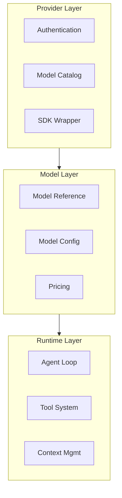
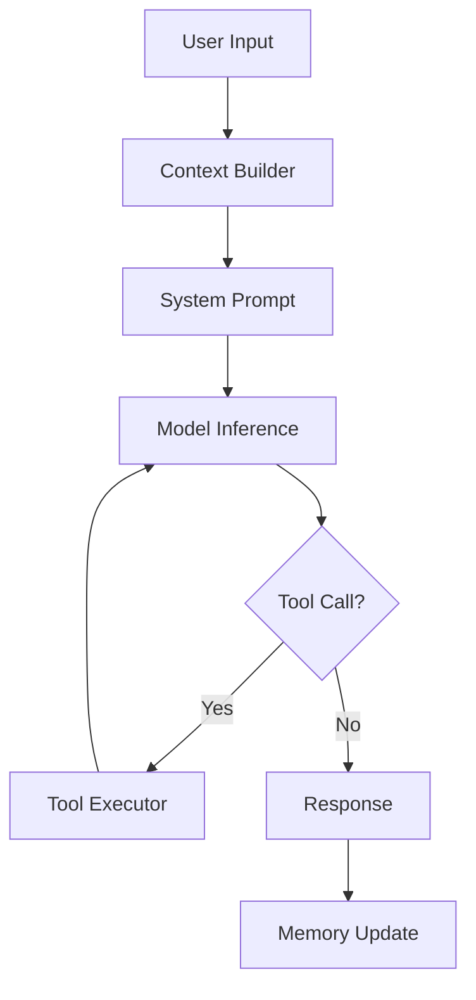
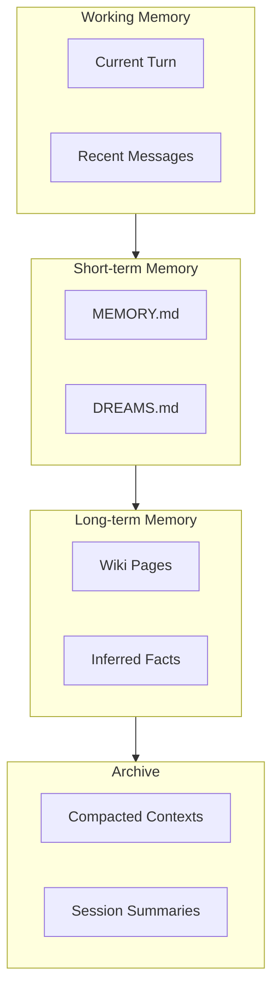
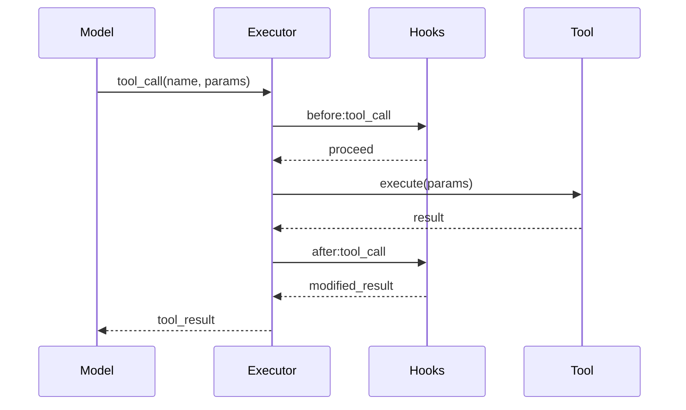

# Core Design Concepts

## The Three-Layer Model

OpenClaw distinguishes between three distinct layers that work together to provide AI capabilities:



| Layer | Responsibility | Examples |
|-------|----------------|----------|
| Provider | Auth, discovery, SDK integration | openai, anthropic |
| Model | Model selection, configuration | gpt-4o, claude-opus-4 |
| Runtime | Loop execution, tool calling | pi, codex |

### Why This Distinction Matters

**Provider ≠ Model:**
- A provider can serve multiple models
- Models have different capabilities and pricing
- Switching models doesn't require changing provider credentials

**Model ≠ Runtime:**
- The same model can run under different runtimes
- Runtimes provide different execution strategies
- Tool interfaces are runtime-specific

## Provider System

### Provider Definition

A provider is a plugin that wraps an AI service's SDK:

```typescript
interface Provider {
  readonly id: string;           // "openai", "anthropic"
  readonly name: string;          // "OpenAI", "Anthropic"
  readonly sdk: SDK;              // Official or custom SDK
  readonly authProfiles: AuthProfile[];
  readonly defaultModel?: string;
}
```

### Provider Interface

```typescript
interface ProviderContract {
  // Discovery
  listModels(): Promise<Model[]>;
  getModel(id: string): Promise<Model | null>;

  // Inference
  createCompletion(params: CompletionParams): Promise<AsyncIterable<CompletionDelta>>;
  createStructuredCompletion<T>(params: StructuredCompletionParams): Promise<T>;

  // Health
  healthCheck(): Promise<HealthStatus>;
}
```

### Provider Types

| Type | Description | Example |
|------|-------------|---------|
| Official | Native SDK integration | openai, anthropic |
| Proxy | Unified API gateway | openrouter |
| Local | Self-hosted models | ollama, lmstudio |
| Cloud | Cloud platform integration | vertex-ai, azure-openai |

## Model System

### Model Reference

A model is identified by a reference string that encodes provider and model:

```
openai:gpt-4o
anthropic:claude-opus-4-7
google:gemini-2.0-flash
ollama:llama3.1:8b
```

### Model Capabilities

```typescript
interface Model {
  readonly ref: string;                    // Provider-scoped ID
  readonly name: string;                    // Human-readable name
  readonly provider: string;                // Provider ID

  // Capabilities
  readonly maxTokens: number;
  readonly supportsStreaming: boolean;
  readonly supportsFunctionCalling: boolean;
  readonly supportsVision: boolean;
  readonly supportsJSONMode: boolean;

  // Context
  readonly contextWindow: number;
  readonly maxOutputTokens: number;

  // Pricing (per 1M tokens)
  readonly inputCost?: number;
  readonly outputCost?: number;
}
```

### Model Selection

Models are selected based on capability requirements:

```typescript
const model = await provider.selectModel({
  requiredCapabilities: ["streaming", "function_calling"],
  maxTokens: 4096,
  preferCheapest: false,
});
```

## Runtime System

### Runtime Definition

A runtime is the execution engine for agent logic:

| Runtime | Type | Description |
|---------|------|-------------|
| PI | Embedded | Built-in agent with direct model access |
| Codex | External | OpenAI Codex app-server integration |
| ACP | Protocol | Agent Communication Protocol for distributed agents |

### PI Runtime

The embedded runtime with direct model access:



### Runtime Interface

```typescript
interface AgentRuntime {
  readonly id: string;
  readonly type: "pi" | "codex" | "acp";

  // Lifecycle
  start(config: RuntimeConfig): Promise<void>;
  stop(): Promise<void>;

  // Execution
  run(params: RunParams): AsyncIterable<RunEvent>;
  abort(runId: string): Promise<void>;

  // Tools
  registerTools(tools: Tool[]): void;
  unregisterTools(toolNames: string[]): void;
}
```

## Channel System

### Channel Definition

A channel is an abstraction over a messaging platform:

```typescript
interface Channel {
  readonly id: string;              // "telegram", "discord"
  readonly platform: string;         // Platform identifier

  // Connection
  connect(): Promise<void>;
  disconnect(): Promise<void>;

  // Messaging
  send(target: Target, message: OutboundMessage): Promise<void>;
  editMessage(target: Target, messageId: string, content: string): Promise<void>;
  deleteMessage(target: Target, messageId: string): Promise<void>;

  // Events
  onMessage(handler: MessageHandler): void;
  onReaction(handler: ReactionHandler): void;
  onEdit(handler: EditHandler): void;
}
```

### Channel Features

| Feature | Description | Support |
|---------|-------------|--------|
| Text | Plain text messages | All channels |
| Media | Images, videos, files | Most channels |
| Formatting | Markdown, HTML | Varies by platform |
| Reactions | Emoji reactions | All channels |
| Threads | Threaded replies | Discord, Slack |
| Ephemeral | Temporary messages | Some channels |

### Channel vs Plugin

A channel plugin wraps a channel implementation:

```typescript
// Channel plugin structure
{
  "id": "channel/telegram",
  "name": "Telegram",
  "type": "channel",
  "entry": "./dist/index.js",
  "channel": {
    "apiId": "telegram-bot-token",
    "commands": ["/start", "/help", "/settings"]
  }
}
```

## Session System

### Session Definition

A session is an isolated conversation context:

```typescript
interface Session {
  readonly id: string;
  readonly key: SessionKey;
  readonly channel: ChannelRef;
  readonly agent: AgentRef;
  readonly createdAt: Date;

  // State
  context: ConversationContext;
  memory: MemorySnapshot;
  metadata: SessionMetadata;

  // Operations
  addMessage(message: Message): Promise<void>;
  getHistory(limit?: number): Promise<Message[]>;
  reset(): Promise<void>;
}
```

### Session Key

Session keys determine isolation boundaries:

```typescript
type SessionKey = {
  channel: string;           // "telegram:123456789"
  scope: SessionScope;       // Isolation level
  target?: string;           // DM, group, or broadcast target
};
```

### Session Isolation Strategies

| Strategy | Key Pattern | Use Case |
|----------|-------------|----------|
| Per-user | `{channel}:{userId}` | Private conversations |
| Per-channel | `{channel}` | Channel-wide context |
| Per-group | `{channel}:{groupId}` | Group discussions |
| Global | `main` | Single shared context |

## Memory System

### Memory Architecture

OpenClaw uses a hierarchical memory system:



### Memory Files

| File | Purpose | Content |
|------|---------|----------|
| MEMORY.md | Session memory | Current session context |
| DREAMS.md | Inferred knowledge | Model-generated reflections |
| `memory/*.md` | Archived sessions | Historical context |

### Memory Operations

```typescript
interface MemoryManager {
  // Retrieval
  search(query: string, limit?: number): Promise<MemoryResult[]>;
  get(key: string): Promise<MemoryEntry | null>;

  // Storage
  store(entry: MemoryEntry): Promise<void>;
  update(key: string, entry: Partial<MemoryEntry>): Promise<void>;

  // Compaction
  compact(sessionId: string, strategy: CompactionStrategy): Promise<void>;
}
```

## Tool System

### Tool Definition

Tools extend agent capabilities beyond model inference:

```typescript
interface Tool {
  readonly name: string;               // "wikipedia_search"
  readonly description: string;       // Human-readable description
  readonly schema: JsonSchema;         // Input validation schema

  execute(params: unknown): Promise<ToolResult>;
}
```

### Tool Categories

| Category | Examples | Purpose |
|----------|----------|---------|
| Search | web_search, wikipedia | Information retrieval |
| Compute | calculator, code_execute | Data processing |
| File | read_file, write_file | File operations |
| Web | fetch_url, browser | Web interaction |
| Messaging | send_email, send_sms | External communication |

### Tool Execution Pipeline



## Hook System

### Hook Types

Hooks provide extensibility at key points:

```typescript
interface Hooks {
  // Lifecycle hooks
  "gateway:start": () => Promise<void>;
  "gateway:stop": () => Promise<void>;

  // Message hooks
  "message:receive": (msg: Message) => Promise<void>;
  "message:send": (msg: OutboundMessage) => Promise<void>;
  "message:error": (err: Error) => Promise<void>;

  // Agent hooks
  "agent:before_run": (params: RunParams) => Promise<void>;
  "agent:after_run": (result: RunResult) => Promise<void>;

  // Tool hooks
  "tool:before": (tool: Tool, params: unknown) => Promise<void>;
  "tool:after": (tool: Tool, result: ToolResult) => Promise<void>;
}
```

### Hook Registration

```typescript
// Plugin hooks
export const hooks = {
  "message:receive": async (msg) => {
    // Process incoming message
    return msg;
  },
};
```

## Related

- [Gateway](/architecture-book/part-2-core-modules/01-gateway) - Gateway implementation
- [Agents](/architecture-book/part-2-core-modules/02-agents) - Agent runtimes
- [Sessions](/architecture-book/part-2-core-modules/03-sessions) - Session management
- [Memory](/architecture-book/part-2-core-modules/04-memory) - Memory system