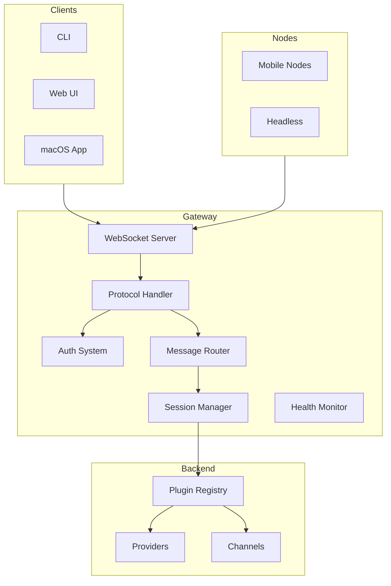
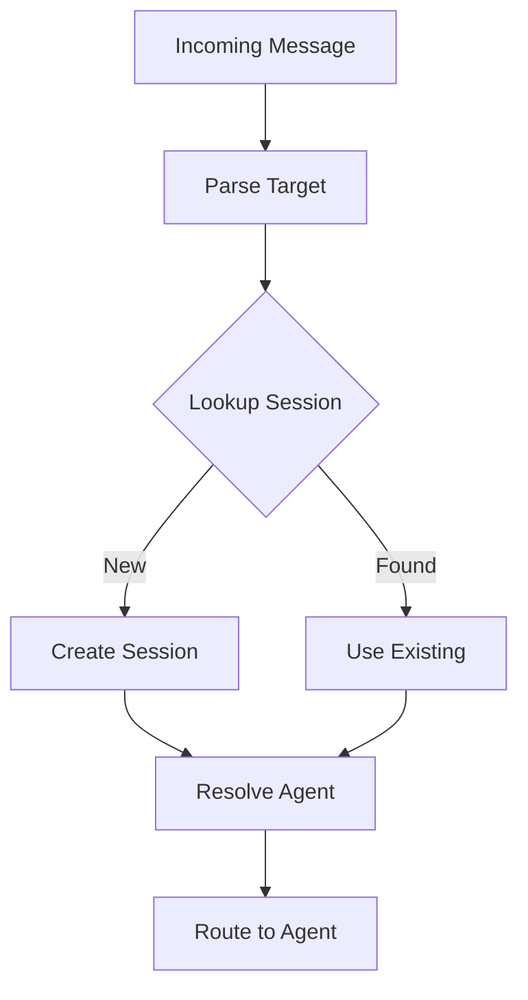
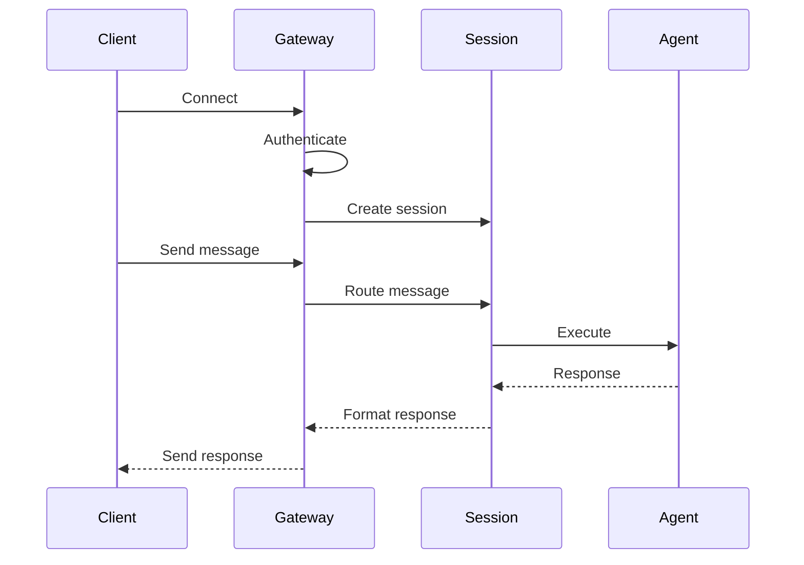
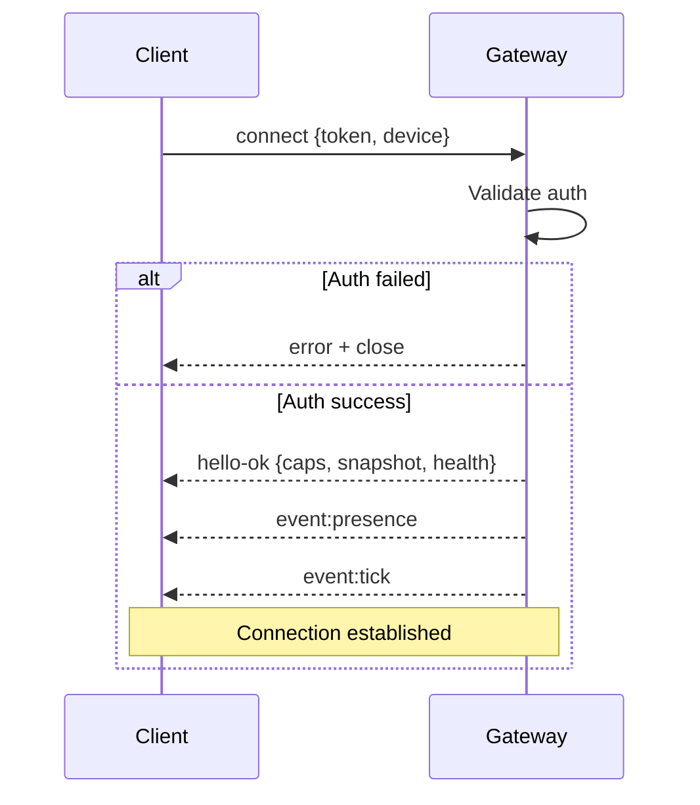

# Gateway Core

## Overview

The Gateway is the central hub of OpenClaw, owning all messaging surfaces and providing a typed WebSocket API for clients and nodes.



## Architecture Principles

### Single Source of Truth

The Gateway maintains:

1. **Session State** - All active conversations
2. **Plugin Registry** - Loaded plugin metadata
3. **Channel Connections** - Active messaging platform connections
4. **Health Status** - System and component health

### Protocol-First Design

The Gateway exposes a typed WebSocket API:

```typescript
// Request
{ type: "req", id: "uuid", method: "agent", params: {...} }

// Response
{ type: "res", id: "uuid", ok: true, payload: {...} }

// Event (server push)
{ type: "event", event: "agent", payload: {...} }
```

## Component Responsibilities

### WebSocket Server

The Gateway listens on a configurable host/port (default `127.0.0.1:18789`):

```typescript
interface GatewayConfig {
  host: string;      // Bind address
  port: number;      // Port number
  auth: AuthConfig;  // Authentication mode
}

// Connection lifecycle
async function handleConnection(ws: WebSocket, req: IncomingMessage) {
  // 1. Parse first frame
  // 2. Validate handshake
  // 3. Authenticate
  // 4. Establish session
  // 5. Route messages
}
```

### Protocol Handler

The protocol handler validates and routes messages:

```typescript
interface ProtocolHandler {
  validateFrame(frame: unknown): ParsedFrame | ValidationError;
  handleRequest(frame: RequestFrame): Promise<ResponseFrame>;
  handleEvent(frame: EventFrame): void;
}
```

### Auth System

Authentication modes supported:

| Mode | Description | Use Case |
|------|-------------|----------|
| `token` | Shared secret token | Local development |
| `password` | Password-based auth | Single user |
| `trusted-proxy` | Trust upstream proxy | Behind reverse proxy |
| `tailscale` | Tailscale Serve integration | Remote access |
| `none` | No auth (local only) | Development only |

### Message Router

The router resolves messages to sessions and agents:



## Session Management

### Session Key Format

Sessions are keyed by channel and target:

```typescript
type SessionKey = {
  channel: string;     // "telegram"
  peer: string;        // "123456789" or "channel:chat_id"
  scope: SessionScope; // "dm", "group", "channel"
};
```

### Session Lifecycle



## Connection Lifecycle

### Handshake Protocol

1. **Client connects** with first frame as `connect`
2. **Gateway validates** auth credentials
3. **Gateway responds** with `hello-ok` containing:
   - Server capabilities
   - Current presence snapshot
   - Health status



### Idempotency

Side-effecting operations require idempotency keys:

```typescript
interface IdempotentRequest {
  idemKey: string;      // Client-provided key
  method: string;       // e.g., "agent", "send"
  params: unknown;       // Method parameters
}
```

## Health Monitoring

### Health Checks

The Gateway exposes health status:

```typescript
interface HealthStatus {
  status: "healthy" | "degraded" | "unhealthy";
  uptime: number;
  components: {
    plugins: ComponentHealth;
    channels: ComponentHealth;
    sessions: ComponentHealth;
  };
}
```

### Event Emission

Health events are emitted periodically:

```typescript
// Periodic tick event
{ type: "event", event: "tick", payload: { health, stats } }

// Presence event
{ type: "event", event: "presence", payload: { channels, agents } }
```

## Canvas Host

The Gateway serves canvas files:

| Path | Purpose |
|------|---------|
| `/__openclaw__/canvas/` | Agent-editable HTML/CSS/JS |
| `/__openclaw__/a2ui/` | A2UI host |

## Gateway Lifecycle

### Start Sequence

```typescript
async function startGateway(config: OpenClawConfig) {
  // 1. Load configuration
  // 2. Initialize plugin registry
  // 3. Connect channels
  // 4. Start WebSocket server
  // 5. Begin health monitoring
  // 6. Run boot sequence (optional)
}
```

### Stop Sequence

```typescript
async function stopGateway() {
  // 1. Stop accepting connections
  // 2. Notify connected clients
  // 3. Save session state
  // 4. Disconnect channels
  // 5. Unload plugins
  // 6. Release resources
}
```

## TypeBox Schemas

The protocol uses TypeBox for schema definitions:

```typescript
import { Type } from "@sinclair/typebox";

// Example: Connect request
const ConnectRequestSchema = Type.Object({
  type: Type.Literal("connect"),
  params: Type.Object({
    auth: AuthSchema,
    device: DeviceSchema,
    client: ClientInfoSchema,
  }),
});

// Example: Agent request
const AgentRequestSchema = Type.Object({
  type: Type.Literal("req"),
  id: Type.String(),
  method: Type.Literal("agent"),
  params: Type.Object({
    sessionKey: Type.String(),
    agentId: Type.String(),
    input: Type.String(),
    idemKey: Type.Optional(Type.String()),
  }),
});
```

## Error Handling

### Error Responses

```typescript
interface ErrorResponse {
  type: "res";
  id: string;           // Original request ID
  ok: false;
  error: {
    code: string;        // e.g., "AUTH_FAILED"
    message: string;     // Human-readable
    details?: unknown;    // Additional context
  };
}
```

### Error Codes

| Code | Description |
|------|-------------|
| `AUTH_FAILED` | Authentication failed |
| `VALIDATION_ERROR` | Request validation failed |
| `SESSION_NOT_FOUND` | Session does not exist |
| `AGENT_ERROR` | Agent execution error |
| `RATE_LIMITED` | Too many requests |
| `INTERNAL_ERROR` | Server error |

## Remote Access

### Tailscale Integration

When `gateway.auth.allowTailscale: true`:

1. Tailscale provides identity in headers
2. Gateway trusts Tailscale identity
3. No additional auth required

### SSH Tunnel

```bash
ssh -N -L 18789:127.0.0.1:18789 user@host
```

The same handshake and token auth apply over the tunnel.

## Related

- [Protocol Overview](/architecture-book/part-4-gateway-protocol/01-protocol-overview) - Protocol details
- [WebSocket Transport](/architecture-book/part-4-gateway-protocol/02-ws-transport) - Transport layer
- [Events and RPC](/architecture-book/part-4-gateway-protocol/04-events-and-rpc) - Communication patterns
- [Session Management](/architecture-book/part-8-session-memory/01-session-management) - Session architecture