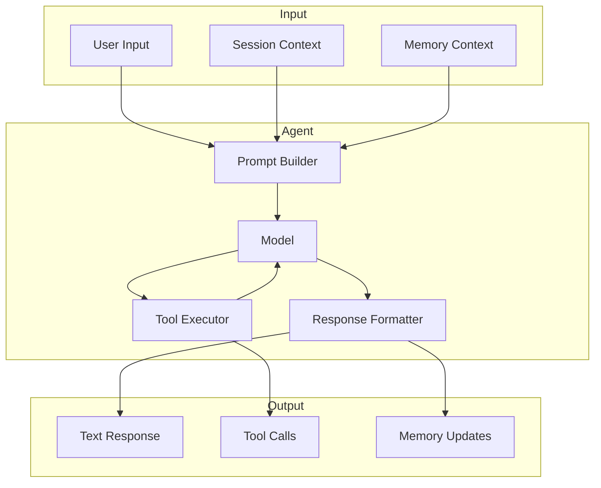
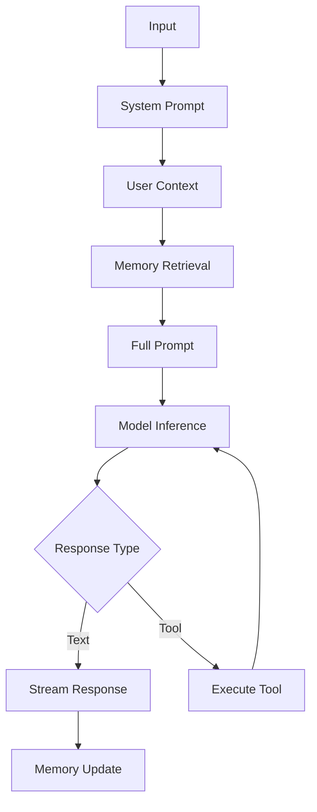
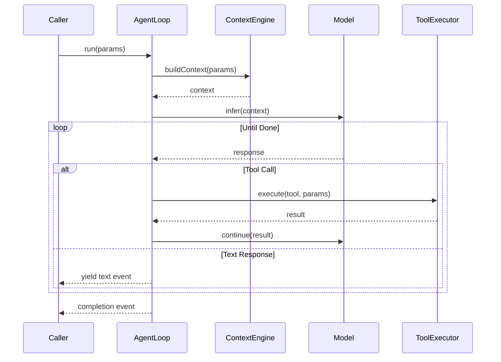
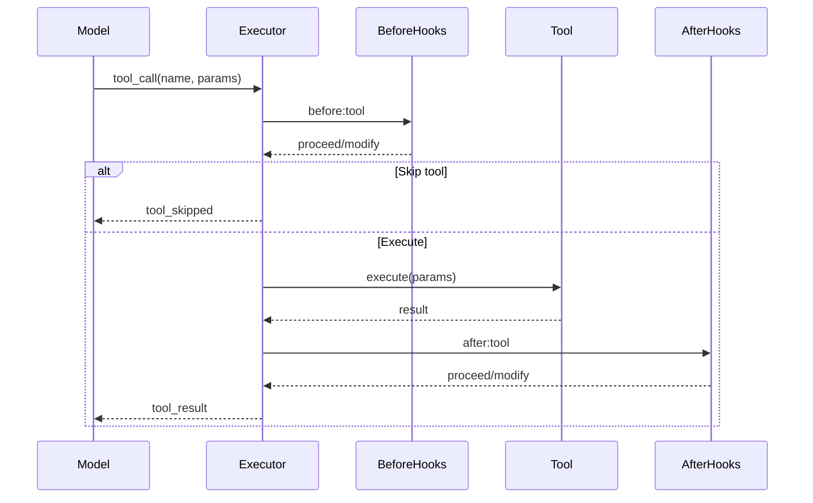
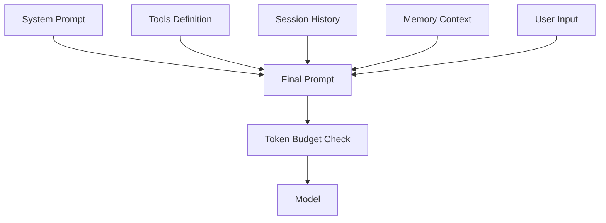
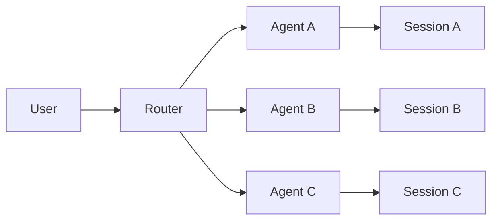

# Agent System

## Overview

The Agent system is the core execution engine that runs AI inference and manages tool calls.



## Agent Runtimes

OpenClaw supports multiple agent runtime implementations:

| Runtime | Type | Description |
|---------|------|-------------|
| PI | Embedded | Built-in agent with direct model access |
| Codex | External | OpenAI Codex app-server integration |
| ACP | Protocol | Agent Communication Protocol |

### PI Runtime

The embedded runtime provides direct model access:



### Runtime Interface

```typescript
interface AgentRuntime {
  readonly id: string;
  readonly type: "pi" | "codex" | "acp";
  readonly capabilities: RuntimeCapabilities;

  // Lifecycle
  start(config: RuntimeConfig): Promise<void>;
  stop(): Promise<void>;

  // Execution
  run(params: RunParams): AsyncIterable<RunEvent>;
  abort(runId: string): Promise<void>;

  // Tools
  registerTools(tools: Tool[]): void;
  unregisterTools(toolNames: string[]): void;
}
```

## Agent Loop

### Execution Flow



### Run Parameters

```typescript
interface RunParams {
  sessionKey: string;
  agentId: string;
  input: string;

  // Optional
  systemPrompt?: string;
  tools?: Tool[];
  modelRef?: string;
  temperature?: number;
  maxTokens?: number;

  // Idempotency
  idemKey?: string;
}
```

### Run Events

```typescript
type RunEvent =
  | { type: "start"; runId: string }
  | { type: "assistant.delta"; delta: string }
  | { type: "assistant.text"; text: string }
  | { type: "tool_use"; tool: string; input: unknown }
  | { type: "tool_result"; tool: string; result: unknown }
  | { type: "complete"; summary?: string }
  | { type: "error"; error: string };
```

## Tool System

### Tool Definition

```typescript
interface Tool {
  readonly name: string;
  readonly description: string;
  readonly schema: JsonSchema;
  readonly category?: ToolCategory;

  execute(params: unknown, context: ToolContext): Promise<ToolResult>;
}
```

### Tool Categories

| Category | Examples | Purpose |
|----------|----------|---------|
| search | web_search, wikipedia | Information retrieval |
| compute | calculator, code_execute | Data processing |
| file | read_file, write_file | File operations |
| web | fetch_url, browser | Web interaction |
| messaging | send_message, send_email | External communication |
| system | shell, run_command | System operations |

### Tool Execution Pipeline



### Built-in Tools

OpenClaw provides built-in tools:

```typescript
const builtInTools: Tool[] = [
  {
    name: "bash",
    description: "Execute bash commands",
    schema: { command: "string" },
  },
  {
    name: "read_file",
    description: "Read file contents",
    schema: { path: "string", limit: "number?" },
  },
  {
    name: "write_file",
    description: "Write content to file",
    schema: { path: "string", content: "string" },
  },
  {
    name: "web_search",
    description: "Search the web",
    schema: { query: "string", limit: "number?" },
  },
  {
    name: "image_generation",
    description: "Generate images",
    schema: { prompt: "string", size: "string?" },
  },
];
```

## Prompt Assembly

### Context Building



### Token Budgeting

```typescript
interface TokenBudget {
  systemPrompt: number;
  tools: number;
  history: number;
  memory: number;
  userInput: number;
  available: number;    // maxTokens - reserved
  total: number;        // contextWindow
}
```

## Session Integration

### Session Context

Each agent run operates within a session:

```typescript
interface SessionContext {
  sessionKey: string;
  channel: string;
  peer: string;
  history: Message[];
  metadata: SessionMetadata;
  activeAgent?: string;
}
```

### Memory Integration

```typescript
interface MemoryContext {
  workingMemory: Message[];       // Current turn
  recentHistory: Message[];        // Last N messages
  shortTerm: MemoryEntry[];         // MEMORY.md, DREAMS.md
  longTerm: MemoryEntry[];         // Wiki, facts
  compacted: CompactedContext[];    // Summarized sessions
}
```

## Multi-Agent Support

### Agent Isolation

Agents can be isolated or shared:



### Agent Selection

Agents are selected based on:

1. **Explicit routing** - Session or message metadata
2. **Capability matching** - Required capabilities
3. **Load balancing** - Across instances

## Error Handling

### Error Recovery

```typescript
interface ToolErrorHandler {
  onError(error: Error, tool: Tool): ToolErrorAction;
}

type ToolErrorAction =
  | { action: "retry"; after?: number }
  | { action: "skip"; message?: string }
  | { action: "fail"; error: string };
```

### Timeout Handling

```typescript
interface ToolConfig {
  timeout?: number;           // Max execution time (ms)
  retries?: number;            // Retry count
  retryDelay?: number;         // Delay between retries (ms)
}
```

## Monitoring

### Run Metrics

```typescript
interface RunMetrics {
  runId: string;
  startTime: Date;
  endTime?: Date;
  duration?: number;

  inputTokens: number;
  outputTokens: number;
  totalTokens: number;

  toolCalls: number;
  toolErrors: number;

  cacheHits: number;
  cacheMisses: number;
}
```

## Related

- [Session Management](/architecture-book/part-8-session-memory/01-session-management) - Session architecture
- [Memory System](/architecture-book/part-8-session-memory/00-session-memory-overview) - Memory architecture
- [Context Engine](/architecture-book/part-8-session-memory/03-context-engine) - Context assembly
- [MCP Support](/architecture-book/part-2-core-modules/06-mcp) - MCP integration