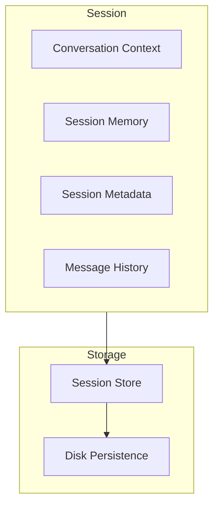
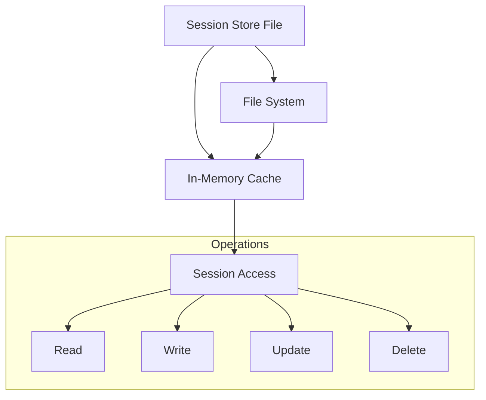
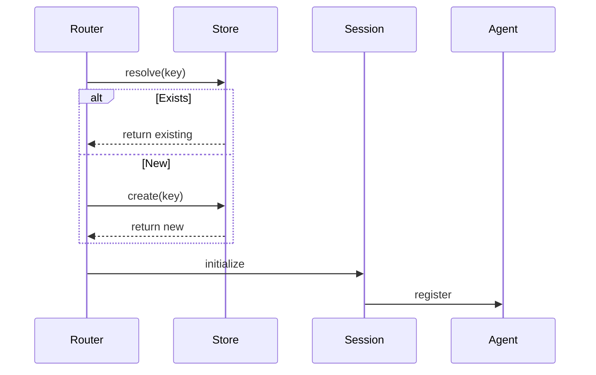
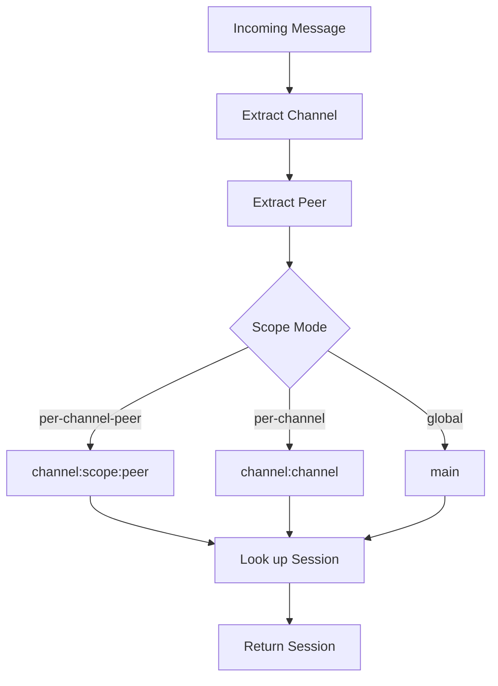

# Session Management

## Overview

Sessions are the fundamental unit of conversation isolation in OpenClaw. Each session maintains independent state, memory, and context.



## Session Key

### Key Format

Sessions are identified by a composite key:

```typescript
type SessionKey = string;
// Format: {channel}:{scope}:{target}

// Examples:
const dmKey = "telegram:dm:123456789";      // Telegram DM with user 123456789
const groupKey = "discord:group:987654321"; // Discord group 987654321
const mainKey = "main";                     // Main shared session
```

### Key Components

| Component | Description | Example |
|-----------|-------------|---------|
| channel | Messaging platform | telegram, discord |
| scope | Isolation level | dm, group, channel, main |
| target | Platform-specific ID | user_id, chat_id |

## Session Store

### Store Architecture



### Store Location

Default store path: `~/.openclaw/agents/{agentId}/sessions.json`

```typescript
interface SessionStore {
  [sessionKey: string]: SessionEntry;
}

interface SessionEntry {
  channel: string;
  peer: string;
  scope: SessionScope;
  activeSessionKey: string;
  createdAt: string;
  updatedAt: string;
  metadata?: Record<string, unknown>;
}
```

## Isolation Strategies

### DM Scope

Each user has their own session:

```typescript
config: {
  session: {
    dmScope: "per-channel-peer"
  }
}
```

Session keys:
- `telegram:dm:123456789` - Telegram with user 123456789
- `discord:dm:987654321` - Discord with user 987654321

### Group Scope

Each group has its own session:

```typescript
config: {
  session: {
    dmScope: "per-channel-peer"
  }
}
```

Session keys:
- `telegram:group:chat_id`
- `discord:group:channel_id`

### Channel Scope

All users in a channel share context:

```typescript
config: {
  session: {
    scope: "per-channel"
  }
}
```

Session keys:
- `telegram:channel` - All Telegram users share one session

### Global Scope

Single shared session across all channels:

```typescript
config: {
  session: {
    scope: "global"
  }
}
```

Session key: `main`

## Session Lifecycle

### Creation



### Message Flow

```typescript
interface Session {
  readonly id: string;
  readonly key: SessionKey;
  readonly channel: string;
  readonly peer: string;
  readonly createdAt: Date;

  // State
  context: ConversationContext;
  history: Message[];

  // Operations
  addMessage(message: Message): Promise<void>;
  getHistory(limit?: number): Promise<Message[]>;
  reset(): Promise<void>;
}
```

### Reset Behavior

Sessions can be reset based on:

| Trigger | Description |
|---------|-------------|
| Idle timeout | No activity for N minutes |
| Daily reset | Reset at specific time |
| Manual | Explicit reset command |
| Error | Too many consecutive errors |

```typescript
config: {
  session: {
    reset: {
      idleMinutes: 60,
      time: "04:00"  // Daily at 4 AM
    }
  }
}
```

## Session Maintenance

### Pruning

Old sessions are automatically pruned:

```typescript
config: {
  session: {
    maintenance: {
      mode: "enforce",
      pruneAfter: "30d",    // Delete sessions older than 30 days
      maxEntries: 500        // Or more than 500 entries
    }
  }
}
```

### Write Locking

Concurrent access to the same session is serialized:

```typescript
// Session write lock pattern
async function withSessionLock<T>(
  key: string,
  fn: () => Promise<T>
): Promise<T> {
  const lock = sessionLocks.get(key);
  await lock.acquire();
  try {
    return await fn();
  } finally {
    lock.release();
  }
}
```

## Message History

### History Storage

Messages are stored with the session:

```typescript
interface Message {
  id: string;
  role: "user" | "assistant" | "system";
  content: string;
  timestamp: Date;
  metadata?: MessageMetadata;
}

interface MessageMetadata {
  channel?: string;
  messageId?: string;
  attachments?: Attachment[];
  toolCalls?: ToolCall[];
}
```

### History Limits

```typescript
config: {
  session: {
    history: {
      maxMessages: 100,      // Keep last 100 messages
      maxTokens: 8000        // Or up to 8k tokens
    }
  }
}
```

## Session Resolution

### Resolution Flow



### Session Resolver

```typescript
interface SessionResolver {
  resolve(request: InboundMessage): SessionKey;
  resolveFromKey(key: string): Session;
  createSession(key: string): Session;
  deleteSession(key: string): Promise<void>;
}
```

## Multi-Agent Sessions

### Agent Binding

Sessions can be bound to specific agents:

```typescript
interface AgentBinding {
  agentId: string;
  defaultModel?: string;
  systemPrompt?: string;
  tools?: string[];
}
```

### Cross-Agent Communication

Agents can share sessions:

```typescript
config: {
  agents: {
    router: {
      sessionScope: "shared"
    }
  }
}
```

## Session Events

### Event Types

| Event | Description |
|-------|-------------|
| `session:created` | New session created |
| `session:accessed` | Session was accessed |
| `session:reset` | Session was reset |
| `session:pruned` | Session was deleted |
| `session:locked` | Session lock acquired |
| `session:unlocked` | Session lock released |

## Configuration

### Full Configuration Example

```typescript
const config = {
  session: {
    // Isolation strategy
    dmScope: "per-channel-peer",  // "per-channel-peer", "per-channel", "global"
    groupScope: "per-channel-peer",

    // Reset triggers
    reset: {
      idleMinutes: 60,
      time: "04:00",           // Daily reset time
    },

    // Maintenance
    maintenance: {
      mode: "enforce",
      pruneAfter: "30d",
      maxEntries: 500,
    },

    // History
    history: {
      maxMessages: 100,
      maxTokens: 8000,
      includeSystem: false,
    },

    // Storage
    store: "~/.openclaw/agents/{agentId}/sessions.json",
  }
};
```

## Related

- [Memory System](/architecture-book/part-8-session-memory/00-session-memory-overview) - Memory architecture
- [Context Engine](/architecture-book/part-8-session-memory/03-context-engine) - Context assembly
- [Multi-Agent](/architecture-book/part-8-session-memory/05-multi-agent) - Multi-agent routing
- [Configuration](/architecture-book/part-7-config-system/01-config-overview) - Config system