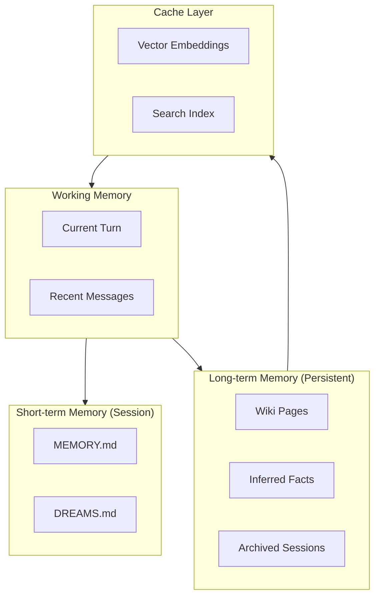
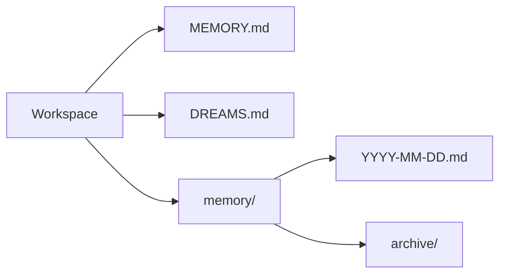
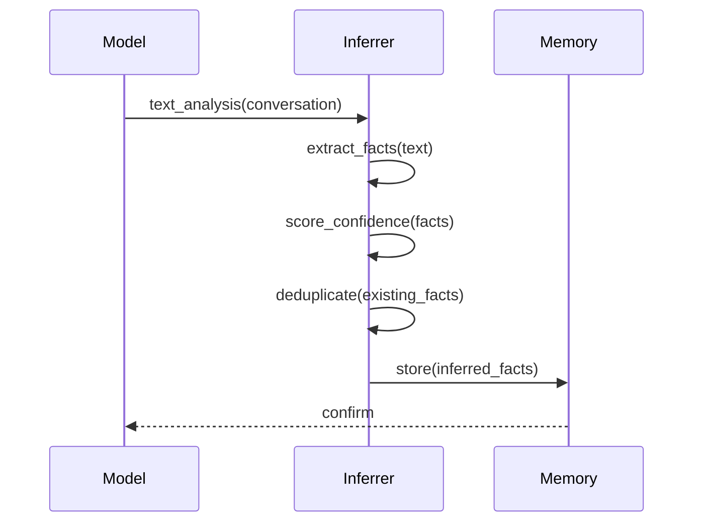
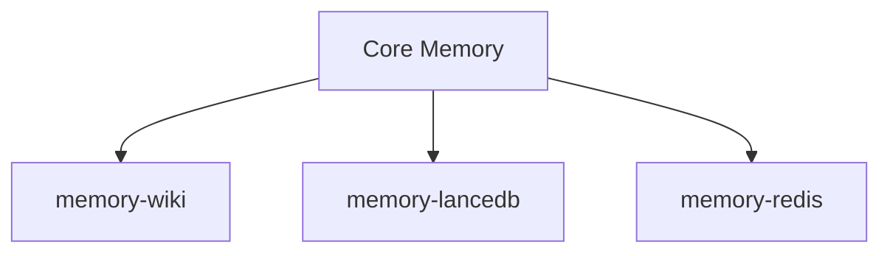
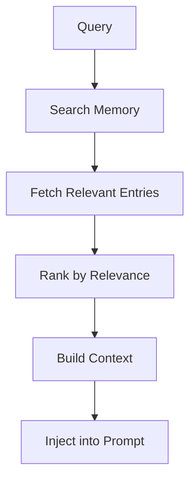
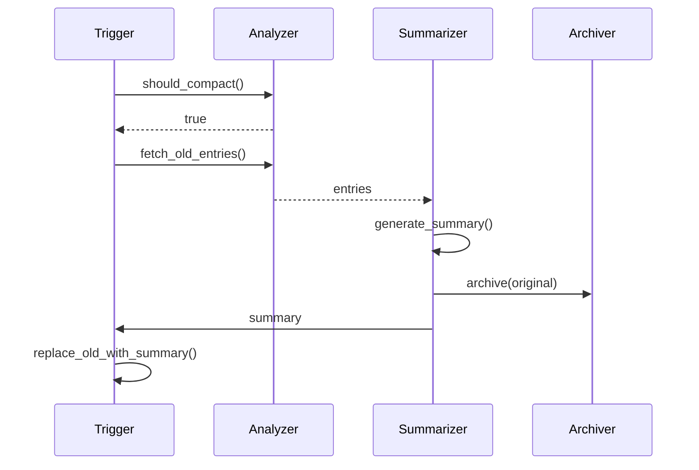

# Memory System

## Overview

OpenClaw uses a hierarchical memory system that combines working memory, short-term memory, and long-term memory to provide context-aware AI responses.



## Memory Architecture

### Three-Tier Model

| Tier | Duration | Capacity | Use Case |
|------|----------|----------|----------|
| Working | Current turn | Full context | Immediate processing |
| Short-term | Session | ~8k tokens | Recent context |
| Long-term | Persistent | Unlimited | Knowledge base |

### Memory File Structure



### File Purposes

| File | Purpose | Content |
|------|---------|----------|
| `MEMORY.md` | Session memory | Current context, ongoing tasks |
| `DREAMS.md` | Inferred knowledge | Model reflections, facts |
| `memory/YYYY-MM-DD.md` | Archived sessions | Daily session summaries |
| `memory/archive/` | Long-term storage | Compacted sessions |

## Memory Manager

### Core Interface

```typescript
interface MemoryManager {
  // Retrieval
  search(query: string, options?: SearchOptions): Promise<MemoryResult[]>;
  get(key: string): Promise<MemoryEntry | null>;
  getRecent(limit?: number): Promise<MemoryEntry[]>;

  // Storage
  store(entry: MemoryEntry): Promise<void>;
  update(key: string, entry: Partial<MemoryEntry>): Promise<void>;
  delete(key: string): Promise<void>;

  // Compaction
  compact(sessionId: string, strategy?: CompactionStrategy): Promise<void>;

  // Context
  buildContext(prompt: string): Promise<MemoryContext>;
}
```

### Search Options

```typescript
interface SearchOptions {
  limit?: number;              // Max results
  threshold?: number;          // Similarity threshold
  categories?: string[];       // Filter by type
  dateRange?: DateRange;       // Filter by date
  includeArchived?: boolean;   // Include archived
}
```

## Memory Entry

### Entry Structure

```typescript
interface MemoryEntry {
  id: string;
  key: string;                  // Unique identifier
  type: MemoryType;            // Entry type
  content: string;              // Memory content
  metadata: MemoryMetadata;    // Additional data
  createdAt: Date;
  updatedAt: Date;
  embedding?: number[];        // Vector embedding
}

type MemoryType =
  | "fact"        // Inferred fact
  | "task"        // Task or goal
  | "preference"  // User preference
  | "knowledge"   // General knowledge
  | "context"     // Conversation context
  | "summary"     // Compaction summary
  | "reflection"  // Model reflection
  | "commitment"; // Stated commitment
```

### Memory Metadata

```typescript
interface MemoryMetadata {
  source: "user" | "model" | "system" | "plugin";
  sessionKey?: string;
  channel?: string;
  importance?: number;          // 0-1 importance score
  confidence?: number;         // 0-1 confidence score
  tags?: string[];
  links?: string[];            // Related memory IDs
}
```

## Knowledge Distillation

### Fact Inference

The system infers facts from conversations:



### Fact Types

| Type | Example | Extraction |
|------|---------|------------|
| Preference | User prefers dark mode | Direct statement |
| Fact | User works at Acme | Implied or stated |
| Relationship | User is married | Explicit statement |
| Habit | User checks email morning | Pattern detection |

## DREAMS System

### What is DREAMS?

DREAMS.md contains model-generated reflections about the session:

```markdown
# DREAMS

## 2024-01-15

- User asked about setting up a webhook
- They seem to prefer practical examples over documentation
- The project uses TypeScript and Express

## 2024-01-14

- User completed OAuth integration
- They mentioned upcoming feature: payment processing
- Need to remember: user prefers async communication
```

### DREAMS Generation

```typescript
interface DreamsGenerator {
  shouldGenerate(session: Session): boolean;
  generateReflection(session: Session): Promise<string>;
  mergeWithExisting(newReflection: string): Promise<void>;
}
```

## Memory Plugins

### Plugin Architecture



### Available Plugins

| Plugin | Backend | Use Case |
|--------|---------|----------|
| memory-core | Filesystem | Default, no deps |
| memory-wiki | Markdown | Knowledge base |
| memory-lancedb | LanceDB | Vector search |
| memory-redis | Redis | Distributed caching |

## Context Assembly

### Build Pipeline



### Token Budgeting

```typescript
interface ContextBudget {
  totalLimit: number;          // e.g., 128k tokens
  reserved: {
    system: number;
    tools: number;
    output: number;
  };
  available: number;           // For context
  used: number;
}

// Dynamic adjustment based on model
const budgets: Record<string, ContextBudget> = {
  "gpt-4o": { totalLimit: 128000, reserved: {...}, available: 100000 },
  "claude-opus-4": { totalLimit: 200000, reserved: {...}, available: 180000 },
};
```

## Memory Compaction

### Compaction Triggers

| Trigger | Condition |
|---------|-----------|
| Token limit | Exceeds threshold |
| Idle | No activity for period |
| Manual | Explicit command |
| Scheduled | Daily cron job |

### Compaction Strategies

```typescript
type CompactionStrategy =
  | { type: "summarize"; maxTokens: number }
  | { type: "selective"; keepTypes: MemoryType[] }
  | { type: "archive"; archiveOlderThan: number }
  | { type: "compress"; algorithm: "gzip" | "lz4" };
```

### Compaction Pipeline



## Memory Access Control

### Access Policies

```typescript
interface MemoryPolicy {
  defaultAccess: "read" | "write" | "none";
  perPlugin?: Record<string, AccessLevel>;
  perChannel?: Record<string, AccessLevel>;
}
```

## Related

- [Context Engine](/architecture-book/part-8-session-memory/03-context-engine) - Context assembly
- [Compaction](/architecture-book/part-8-session-memory/04-compaction) - Memory compaction
- [Multi-Agent](/architecture-book/part-8-session-memory/05-multi-agent) - Multi-agent memory
- [Session Management](/architecture-book/part-8-session-memory/00-session-memory-overview) - Session architecture