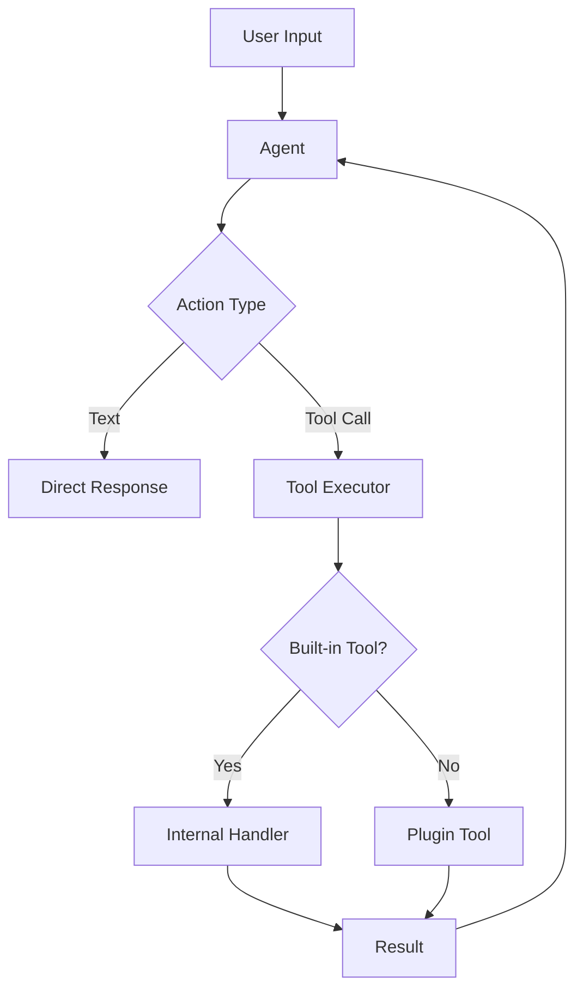
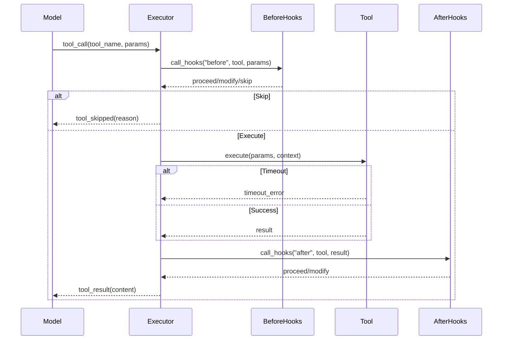

# Agent Tools

## Overview

Tools extend the agent's capabilities beyond text generation, allowing it to interact with external systems, execute code, and perform actions.



## Tool Interface

### Core Definition

```typescript
interface Tool {
  readonly name: string;
  readonly description: string;
  readonly schema: JsonSchema;
  readonly category?: ToolCategory;
  readonly examples?: ToolExample[];

  execute(params: unknown, context: ToolContext): Promise<ToolResult>;
}
```

### Tool Schema

Tools use JSON Schema for parameter validation:

```typescript
// Example tool schema
const toolSchema = {
  type: "object",
  properties: {
    query: {
      type: "string",
      description: "Search query",
    },
    limit: {
      type: "number",
      description: "Max results",
      default: 10,
    },
  },
  required: ["query"],
};
```

### Tool Result

```typescript
interface ToolResult {
  success: boolean;
  content: ToolContent;
  metadata?: ToolMetadata;
}

type ToolContent =
  | { type: "text"; text: string }
  | { type: "json"; data: unknown }
  | { type: "file"; path: string }
  | { type: "image"; url: string }
  | { type: "error"; message: string };

interface ToolMetadata {
  duration?: number;
  tokens?: number;
  cacheHit?: boolean;
}
```

## Tool Categories

### Category Hierarchy

| Category | Description | Examples |
|----------|-------------|----------|
| search | Information retrieval | web_search, wikipedia |
| compute | Data processing | calculator, code_execute |
| file | File operations | read_file, write_file |
| web | Web interaction | fetch_url, browser |
| messaging | External communication | send_email, send_sms |
| system | System operations | shell, run_command |
| media | Media processing | image_gen, tts |
| database | Data storage | query, insert |

### Built-in Tools

#### File Tools

```typescript
const fileTools: Tool[] = [
  {
    name: "read_file",
    description: "Read contents of a file",
    schema: {
      properties: {
        path: { type: "string" },
        limit: { type: "number" },
        offset: { type: "number" },
      },
      required: ["path"],
    },
  },
  {
    name: "write_file",
    description: "Write content to a file",
    schema: {
      properties: {
        path: { type: "string" },
        content: { type: "string" },
      },
      required: ["path", "content"],
    },
  },
  {
    name: "list_files",
    description: "List files in a directory",
    schema: {
      properties: {
        path: { type: "string" },
        recursive: { type: "boolean" },
      },
    },
  },
];
```

#### Web Tools

```typescript
const webTools: Tool[] = [
  {
    name: "web_search",
    description: "Search the web for information",
    schema: {
      properties: {
        query: { type: "string" },
        limit: { type: "number" },
      },
      required: ["query"],
    },
  },
  {
    name: "fetch_url",
    description: "Fetch content from a URL",
    schema: {
      properties: {
        url: { type: "string" },
        method: { type: "string", enum: ["GET", "POST"] },
        headers: { type: "object" },
      },
      required: ["url"],
    },
  },
];
```

#### Shell Tools

```typescript
const shellTool: Tool = {
  name: "bash",
  description: "Execute bash commands",
  category: "system",
  schema: {
    properties: {
      command: { type: "string" },
      timeout: { type: "number" },
      cwd: { type: "string" },
    },
    required: ["command"],
  },
};
```

## Tool Execution Pipeline

### Execution Flow



### Hook System

```typescript
interface ToolHooks {
  before?: (
    tool: Tool,
    params: unknown
  ) => Promise<HookResult>;
  after?: (
    tool: Tool,
    result: ToolResult
  ) => Promise<HookResult>;
}

type HookResult =
  | { action: "proceed" }
  | { action: "modify"; params: unknown }
  | { action: "skip"; reason: string }
  | { action: "error"; error: string };
```

### Hook Examples

```typescript
const hooks: ToolHooks = {
  before: async (tool, params) => {
    // Log tool calls
    logger.debug(`Tool call: ${tool.name}`, { params });
    return { action: "proceed" };
  },
  after: async (tool, result) => {
    // Sanitize sensitive data
    if (result.content.type === "text") {
      result.content.text = sanitizeOutput(result.content.text);
    }
    return { action: "proceed", result };
  },
};
```

## Tool Registry

### Registry Interface

```typescript
interface ToolRegistry {
  register(tool: Tool): void;
  unregister(name: string): void;
  get(name: string): Tool | undefined;
  list(category?: ToolCategory): Tool[];
  search(query: string): Tool[];
}
```

### Tool Discovery

```typescript
// Discover all available tools
const tools = await registry.list();

// Search by category
const searchTools = await registry.list("search");

// Search by name
const browserTool = registry.get("browser");
```

## Tool Configuration

### Tool Settings

```typescript
interface ToolConfig {
  enabled: boolean;
  timeout?: number;
  retries?: number;
  retryDelay?: number;
  permissions?: ToolPermission[];
}

interface ToolPermission {
  type: "allow" | "deny";
  patterns?: string[];      // For file paths, URLs, etc.
  commands?: string[];      // For shell commands
  domains?: string[];        // For network requests
}
```

### Global Configuration

```typescript
const config = {
  tools: {
    timeout: 30000,          // 30 second default timeout
    retries: 3,
    retryDelay: 1000,
    bash: {
      enabled: true,
      timeout: 60000,
      permissions: {
        allow: ["/usr/bin/*", "/bin/*"],
        deny: ["rm -rf /*", "dd if=*"],
      },
    },
    web_search: {
      enabled: true,
      provider: "tavily",
    },
  },
};
```

## Plugin Tools

### Tool Plugins

Tools can be provided by plugins:

```typescript
// In a tool plugin
export const tools: Tool[] = [
  {
    name: "my_custom_tool",
    description: "A custom tool from plugin",
    schema: { /* ... */ },
  },
];

export const hooks: ToolHooks = {
  before: async (tool, params) => {
    // Plugin-specific validation
    return { action: "proceed" };
  },
};
```

### MCP Tool Bridging

Tools from MCP servers are bridged:

```typescript
interface MCPToolBridge {
  registerServer(server: MCPServer): void;
  bridgeTool(mcpTool: MCPTool): Tool;
  handleRequest(tool: string, params: unknown): Promise<ToolResult>;
}
```

## Error Handling

### Error Types

```typescript
type ToolError =
  | { type: "validation"; message: string }
  | { type: "timeout"; limit: number }
  | { type: "permission"; required: string }
  | { type: "execution"; cause: Error }
  | { type: "not_found"; tool: string };
```

### Error Recovery

```typescript
const toolExecutor = new ToolExecutor({
  onError: (error, tool) => {
    if (error.type === "timeout") {
      return { action: "retry", after: 5000 };
    }
    if (error.type === "permission") {
      return { action: "skip", reason: "Permission denied" };
    }
    return { action: "error", error: error.message };
  },
});
```

## Tool Testing

### Test Pattern

```typescript
describe("my_tool", () => {
  const tool = createTestTool({
    name: "my_tool",
    execute: async (params) => {
      return { success: true, content: { type: "text", text: "ok" } };
    },
  });

  it("should validate params", async () => {
    const result = await tool.execute({});
    expect(result.success).toBe(false);
    expect(result.content.type).toBe("error");
  });

  it("should execute with valid params", async () => {
    const result = await tool.execute({ param: "value" });
    expect(result.success).toBe(true);
  });
});
```

## Related

- [MCP Support](/architecture-book/part-2-core-modules/06-mcp) - MCP integration
- [Plugin System](/architecture-book/part-3-plugin-system/01-plugin-architecture) - Plugin architecture
- [Context Engine](/architecture-book/part-8-session-memory/03-context-engine) - Context assembly