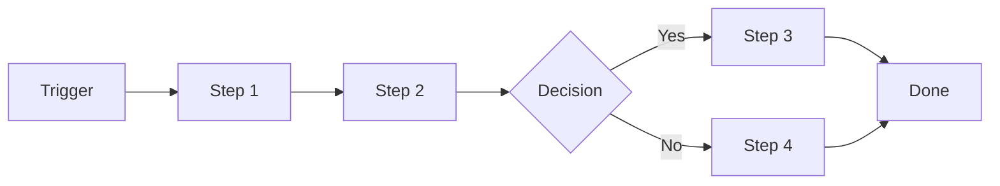
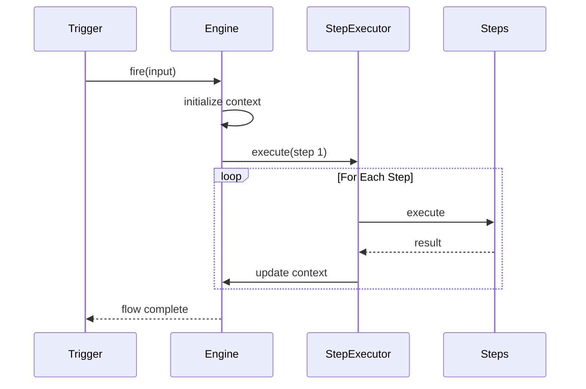
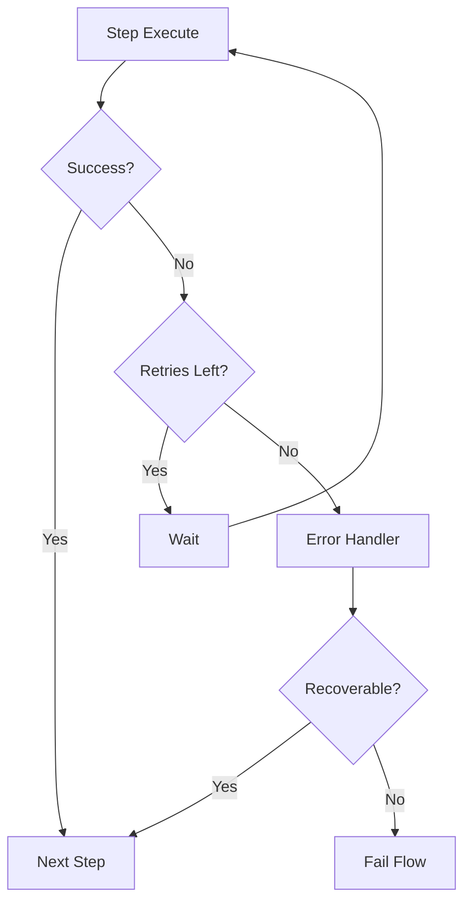

# Workflow Orchestration

## Overview

The Flows system provides a way to define and execute complex, multi-step workflows that can coordinate multiple agents, tools, and external services.



## Flow Definition

### Flow Structure

```typescript
interface Flow {
  id: string;
  name: string;
  description?: string;
  version: string;

  trigger: Trigger;
  steps: Step[];
  errorHandling: ErrorConfig;
}

interface Trigger {
  type: "manual" | "schedule" | "webhook" | "event";
  config: TriggerConfig;
}

interface Step {
  id: string;
  name: string;
  type: StepType;
  config: StepConfig;
  next?: string;            // Next step ID
  onError?: string;        // Error handler step
}
```

### Step Types

| Type | Description | Use Case |
|------|-------------|----------|
| `agent` | Run an agent | AI processing |
| `tool` | Execute a tool | External operations |
| `condition` | Branch logic | Decision making |
| `loop` | Repeat steps | Batch processing |
| `delay` | Wait | Rate limiting |
| `http` | HTTP request | API calls |
| `transform` | Transform data | Data processing |
| `subflow` | Run subflow | Reusable workflows |

## Flow Examples

### Simple Agent Flow

```typescript
const flow: Flow = {
  id: "analyze-pr",
  name: "PR Analysis",
  version: "1.0.0",

  trigger: {
    type: "webhook",
    config: { path: "/webhooks/github" },
  },

  steps: [
    {
      id: "fetch",
      name: "Fetch PR Details",
      type: "http",
      config: {
        url: "${env.GITHUB_API}/pulls/${input.prNumber}",
        method: "GET",
      },
    },
    {
      id: "analyze",
      name: "Analyze Code",
      type: "agent",
      config: {
        prompt: "Analyze this PR: ${steps.fetch.body}",
        model: "claude-opus-4",
      },
      next: "notify",
    },
    {
      id: "notify",
      name: "Notify Team",
      type: "tool",
      config: {
        tool: "send_slack",
        message: "PR analysis complete: ${steps.analyze.summary}",
      },
    },
  ],

  errorHandling: {
    onError: "notify-error",
    maxRetries: 3,
  },
};
```

### Conditional Flow

```typescript
const flow: Flow = {
  id: "process-order",
  name: "Order Processing",

  steps: [
    {
      id: "validate",
      name: "Validate Order",
      type: "agent",
      config: { prompt: "Validate this order: ${input}" },
    },
    {
      id: "check-inventory",
      name: "Check Inventory",
      type: "tool",
      config: { tool: "check_stock", sku: "${input.sku}" },
    },
    {
      id: "decision",
      name: "Stock Check",
      type: "condition",
      config: {
        if: "${steps.check-inventory.inStock} == true",
        then: "process-payment",
        else: "notify-out-of-stock",
      },
    },
    {
      id: "process-payment",
      name: "Process Payment",
      type: "tool",
      config: { tool: "charge_card", amount: "${input.amount}" },
    },
    {
      id: "notify-out-of-stock",
      name: "Notify Customer",
      type: "tool",
      config: { tool: "send_email", template: "out-of-stock" },
    },
  ],
};
```

### Loop Flow

```typescript
const flow: Flow = {
  id: "batch-process",
  name: "Batch File Processing",

  steps: [
    {
      id: "get-files",
      name: "List Files",
      type: "tool",
      config: { tool: "list_files", path: "./input" },
    },
    {
      id: "process-loop",
      name: "Process Each File",
      type: "loop",
      config: {
        items: "${steps.get-files.files}",
        variable: "file",
        steps: [
          {
            id: "process",
            name: "Process File",
            type: "agent",
            config: {
              prompt: "Process file: ${variable.name}",
            },
          },
          {
            id: "archive",
            name: "Move to Archive",
            type: "tool",
            config: {
              tool: "move_file",
              from: "${variable.path}",
              to: "./archive/${variable.name}",
            },
          },
        ],
      },
    },
  ],
};
```

## Flow Execution

### Execution Engine



### Context Management

```typescript
interface FlowContext {
  flowId: string;
  runId: string;
  input: unknown;
  state: Record<string, unknown>;
  results: Map<string, StepResult>;
  errors: StepError[];
}
```

### Step Result

```typescript
interface StepResult {
  stepId: string;
  success: boolean;
  output?: unknown;
  duration: number;
  metadata?: Record<string, unknown>;
}
```

## Error Handling

### Error Strategy

```typescript
interface ErrorConfig {
  onError: string;          // Step ID to execute on error
  maxRetries: number;       // Max retry count
  retryDelay: number;       // Delay between retries (ms)
  exponentialBackoff: boolean;
  continueOnError?: string[];  // Steps that can fail without stopping
}

const flow: Flow = {
  steps: [
    {
      id: "risky-operation",
      name: "Risky API Call",
      type: "http",
      config: { url: "https://api.example.com/data" },
      onError: "fallback",
    },
    {
      id: "fallback",
      name: "Fallback Operation",
      type: "tool",
      config: { tool: "use_cache", key: "last-known" },
    },
  ],
  errorHandling: {
    onError: "notify-error",
    maxRetries: 3,
    retryDelay: 1000,
    exponentialBackoff: true,
  },
};
```

### Error Recovery



## Scheduling

### Cron Triggers

```typescript
const flow: Flow = {
  trigger: {
    type: "schedule",
    config: {
      cron: "0 9 * * 1-5",  // 9 AM, weekdays
      timezone: "America/New_York",
    },
  },
  steps: [
    // Morning tasks
  ],
};
```

### Webhook Triggers

```typescript
const flow: Flow = {
  trigger: {
    type: "webhook",
    config: {
      path: "/webhooks/github",
      method: "POST",
      auth: "github-signature",
    },
  },
};
```

### Event Triggers

```typescript
const flow: Flow = {
  trigger: {
    type: "event",
    config: {
      source: "github",
      event: "pull_request.opened",
      filter: "action == 'opened' && repository == 'my-repo'",
    },
  },
};
```

## Flow Composition

### Subflows

```typescript
const subflow: Flow = {
  id: "send-notification",
  name: "Send Notification",
  isSubflow: true,

  steps: [
    {
      id: "format",
      name: "Format Message",
      type: "transform",
      config: { template: "${input.message}" },
    },
    {
      id: "send",
      name: "Send",
      type: "tool",
      config: { tool: "send_email", ... },
    },
  ],
};

const mainFlow: Flow = {
  steps: [
    {
      id: "task",
      name: "Process Task",
      type: "agent",
      config: { ... },
    },
    {
      id: "notify",
      name: "Notify",
      type: "subflow",
      config: {
        flow: "send-notification",
        input: { message: "Task complete: ${steps.task.result}" },
      },
    },
  ],
};
```

## Monitoring

### Run Status

```typescript
interface FlowRun {
  id: string;
  flowId: string;
  status: "running" | "completed" | "failed" | "cancelled";
  startTime: Date;
  endTime?: Date;
  currentStep?: string;
  steps: StepResult[];
  error?: string;
}
```

### Webhook Notifications

```typescript
const flow: Flow = {
  config: {
    notifications: {
      onStart: "https://hooks.example.com/start",
      onComplete: "https://hooks.example.com/complete",
      onError: "https://hooks.example.com/error",
    },
  },
};
```

## Related

- [Tasks](08-tasks) - Task management
- [Agent](02-agents) - Agent integration
- [Tools](05-tools) - Tool system