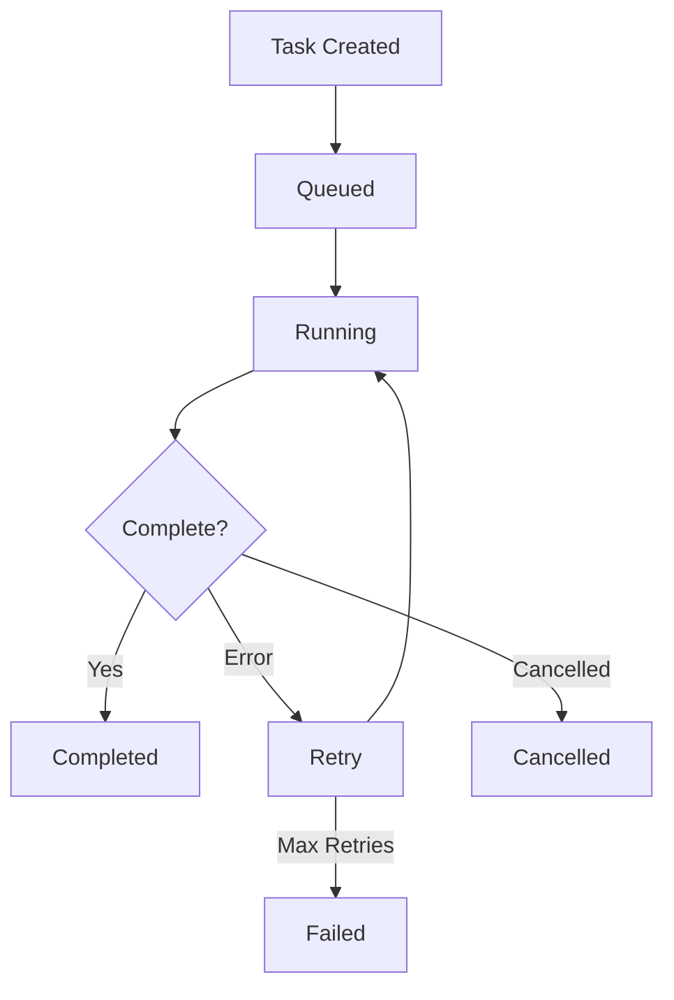
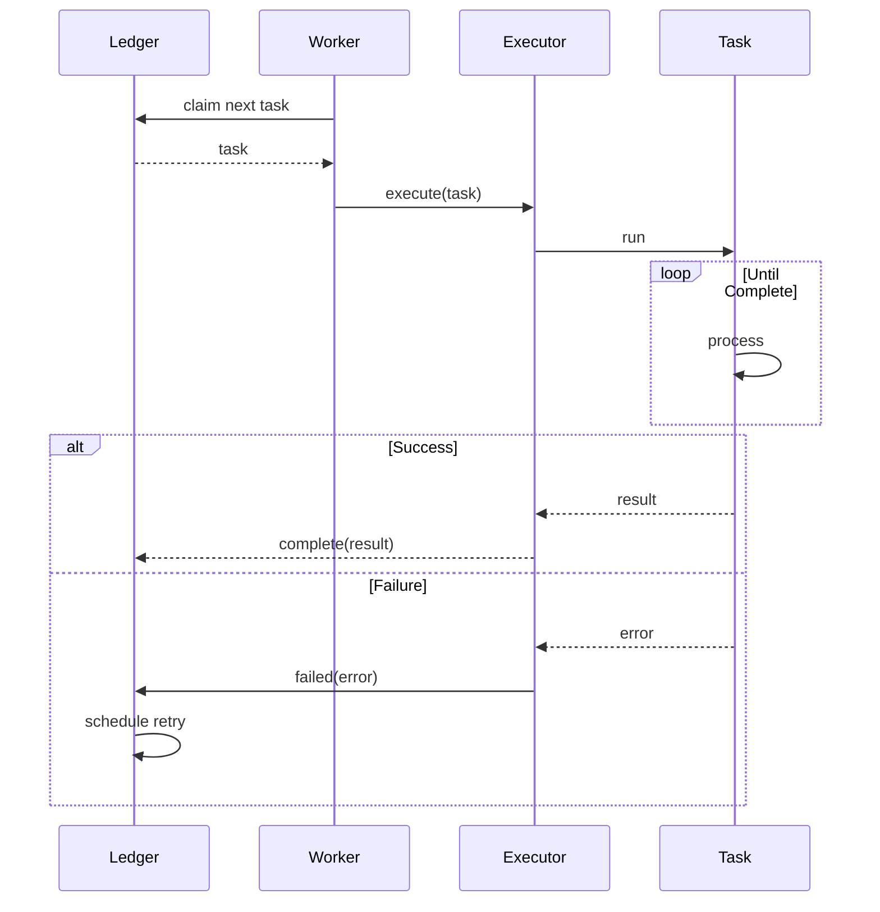
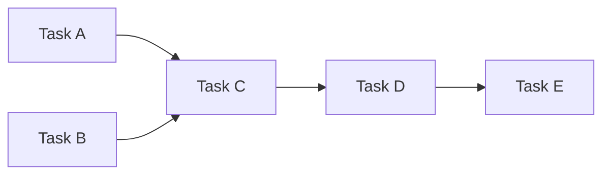
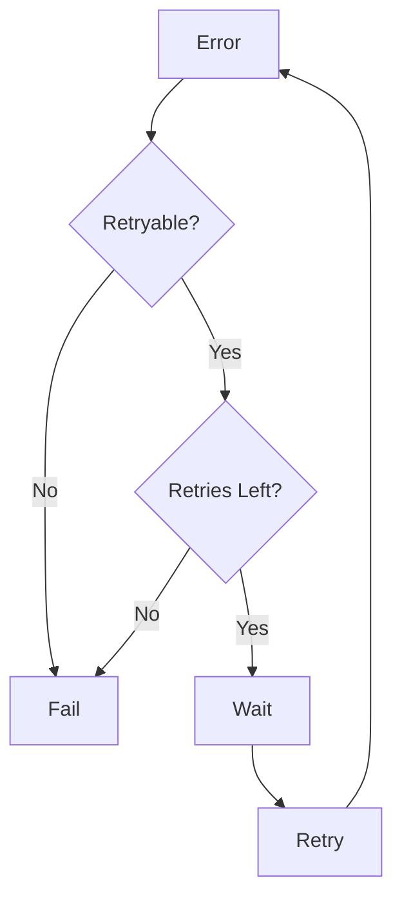

# Task Management

## Overview

The Tasks system manages long-running and background operations, providing reliable execution, status tracking, and result retrieval.



## Task Model

### Task Definition

```typescript
interface Task {
  id: string;
  type: string;
  status: TaskStatus;
  priority: TaskPriority;

  // Payload
  params: unknown;
  result?: unknown;

  // Execution
  createdAt: Date;
  startedAt?: Date;
  completedAt?: Date;
  retryCount: number;

  // Scheduling
  scheduledFor?: Date;
  timeout?: number;

  // Tracking
  metadata: TaskMetadata;
}

type TaskStatus =
  | "pending"
  | "queued"
  | "running"
  | "completed"
  | "failed"
  | "cancelled";

type TaskPriority = "low" | "normal" | "high" | "urgent";
```

### Task Types

| Type | Description | Example |
|------|-------------|---------|
| `agent` | Agent run task | "Analyze this data" |
| `tool` | Tool execution | "Fetch URL content" |
| `flow` | Flow execution | "Process order" |
| `system` | System operation | "Cleanup sessions" |
| `cron` | Scheduled task | "Daily report" |

## Task Ledger

### Ledger Interface

```typescript
interface TaskLedger {
  // CRUD
  create(task: CreateTaskParams): Promise<Task>;
  get(id: string): Promise<Task | null>;
  update(id: string, updates: Partial<Task>): Promise<Task>;
  delete(id: string): Promise<void>;

  // Queries
  list(filter?: TaskFilter): Promise<Task[]>;
  listByStatus(status: TaskStatus): Promise<Task[]>;
  listByType(type: string): Promise<Task[]>;
  count(filter?: TaskFilter): Promise<number>;

  // Operations
  enqueue(id: string): Promise<void>;
  cancel(id: string): Promise<void>;
  retry(id: string): Promise<Task>;
}
```

### Ledger Storage

```typescript
interface LedgerConfig {
  backend: "memory" | "redis" | "sqlite" | "postgres";
  connection?: string;
  persist?: boolean;
}

const config: LedgerConfig = {
  backend: "redis",
  connection: "redis://localhost:6379",
  persist: true,
};
```

## Task Execution

### Worker Model



### Task Executor

```typescript
interface TaskExecutor {
  execute(task: Task): Promise<TaskResult>;
  abort(taskId: string): Promise<void>;
}

interface TaskResult {
  success: boolean;
  result?: unknown;
  error?: TaskError;
  duration: number;
}
```

### Worker Pool

```typescript
interface WorkerPool {
  // Pool management
  start(workers: number): Promise<void>;
  stop(): Promise<void>;
  scale(count: number): Promise<void>;

  // Task handling
  process(task: Task): Promise<void>;
  requeue(task: Task): Promise<void>;
}

const pool = new WorkerPool({
  concurrency: 5,
  maxRetries: 3,
  retryDelay: 5000,
});
```

## Scheduling

### Scheduled Tasks

```typescript
interface ScheduledTask {
  id: string;
  cron: string;
  task: CreateTaskParams;
  enabled: boolean;
  lastRun?: Date;
  nextRun?: Date;
}

const scheduledTask: ScheduledTask = {
  id: "daily-report",
  cron: "0 0 * * *",     // Midnight daily
  task: {
    type: "flow",
    params: { flowId: "generate-report" },
  },
  enabled: true,
};
```

### Delayed Tasks

```typescript
// Execute after delay
await taskLedger.create({
  type: "tool",
  params: { tool: "send_reminder", ... },
  scheduledFor: new Date(Date.now() + 3600000),  // 1 hour later
});
```

## Priority System

### Priority Levels

| Priority | Value | Use Case |
|----------|-------|----------|
| urgent | 100 | Critical operations |
| high | 75 | Important tasks |
| normal | 50 | Default tasks |
| low | 25 | Background jobs |

### Queue Ordering

```typescript
// Priority queue ordering
const queueOrder = [
  "urgent",
  "high",
  "normal",
  "low",
];

// With FIFO within priority
const queue = new PriorityQueue<Task>({
  compare: (a, b) => {
    if (a.priority !== b.priority) {
      return b.priority - a.priority;
    }
    return a.createdAt.getTime() - b.createdAt.getTime();
  },
});
```

## Task Dependencies

### Dependency Graph

```typescript
interface TaskDependency {
  taskId: string;
  dependsOn: string[];      // Task IDs that must complete first
  blocking?: boolean;       // Block dependent tasks on failure
}

// Task with dependencies
const task: Task = {
  id: "step-2",
  dependsOn: ["step-1"],
  blocking: true,
};
```

### Dependency Resolution



```typescript
async function resolveDependencies(taskId: string): Promise<Task[]> {
  const task = await ledger.get(taskId);
  const deps = task.dependsOn || [];

  const result: Task[] = [];
  for (const depId of deps) {
    const depTask = await resolveDependencies(depId);
    result.push(...depTask);
    result.push(await ledger.get(depId));
  }

  return result;
}
```

## Cancellation

### Cancel Request

```typescript
interface CancelRequest {
  taskId: string;
  reason?: string;
  force?: boolean;         // Force cancel even if running
}

// Graceful cancellation
async function cancelTask(request: CancelRequest): Promise<void> {
  const task = await ledger.get(request.taskId);

  if (task.status === "pending" || task.status === "queued") {
    await ledger.update(task.id, { status: "cancelled" });
    return;
  }

  if (request.force && task.status === "running") {
    await executor.abort(task.id);
    await ledger.update(task.id, { status: "cancelled" });
    return;
  }

  throw new Error("Cannot cancel task in current state");
}
```

## Error Handling

### Retry Configuration

```typescript
interface RetryConfig {
  maxRetries: number;
  initialDelay: number;      // ms
  maxDelay: number;           // ms
  backoffMultiplier: number;
  retryableErrors?: string[]; // Error codes to retry
}

const retryConfig: RetryConfig = {
  maxRetries: 3,
  initialDelay: 1000,
  maxDelay: 60000,
  backoffMultiplier: 2,
  retryableErrors: ["TIMEOUT", "RATE_LIMIT", "NETWORK_ERROR"],
};
```

### Retry Decision



## Task Events

### Event Types

| Event | Description | Payload |
|-------|-------------|---------|
| `task:created` | Task created | task |
| `task:queued` | Task enqueued | task |
| `task:started` | Task started | task |
| `task:progress` | Progress update | task, progress |
| `task:completed` | Task completed | task, result |
| `task:failed` | Task failed | task, error |
| `task:cancelled` | Task cancelled | task, reason |

### Event Subscriptions

```typescript
interface TaskEvents {
  onTaskCreated(handler: (task: Task) => void): void;
  onTaskCompleted(handler: (task: Task, result: unknown) => void): void;
  onTaskFailed(handler: (task: Task, error: Error) => void): void;
  onTaskProgress(handler: (task: Task, progress: number) => void): void;
}

taskLedger.on("task:failed", (task, error) => {
  console.error(`Task ${task.id} failed:`, error.message);
  // Send alerts, log, etc.
});
```

## Monitoring

### Task Metrics

```typescript
interface TaskMetrics {
  totalTasks: number;
  pendingTasks: number;
  runningTasks: number;
  completedTasks: number;
  failedTasks: number;
  averageDuration: number;
  throughput: number;           // Tasks per minute
  successRate: number;          // 0-100%
}
```

### Health Checks

```typescript
interface TaskHealthCheck {
  status: "healthy" | "degraded" | "unhealthy";
  issues: string[];
  recommendations: string[];
}

// Example check
const health = {
  status: "degraded",
  issues: [
    "Worker pool at 80% capacity",
    "High failure rate on 'image-process' tasks",
  ],
  recommendations: [
    "Scale worker pool to 10 workers",
    "Investigate image processing errors",
  ],
};
```

## Configuration

### Full Configuration

```typescript
const taskConfig = {
  ledger: {
    backend: "redis",
    connection: "redis://localhost:6379",
  },

  workers: {
    count: 5,
    concurrency: 5,
    prefetch: 2,
  },

  retry: {
    maxRetries: 3,
    initialDelay: 1000,
    maxDelay: 60000,
    backoffMultiplier: 2,
  },

  timeout: {
    default: 300000,      // 5 minutes
    overrides: {
      "agent": 600000,    // 10 minutes for agent tasks
      "tool": 60000,      // 1 minute for tool tasks
    },
  },
};
```

## Related

- [Flows](/architecture-book/part-2-core-modules/07-flows) - Workflow orchestration
- [Agent System](/architecture-book/part-2-core-modules/02-agents) - Agent integration
- [Tools](/architecture-book/part-2-core-modules/05-tools) - Tool system