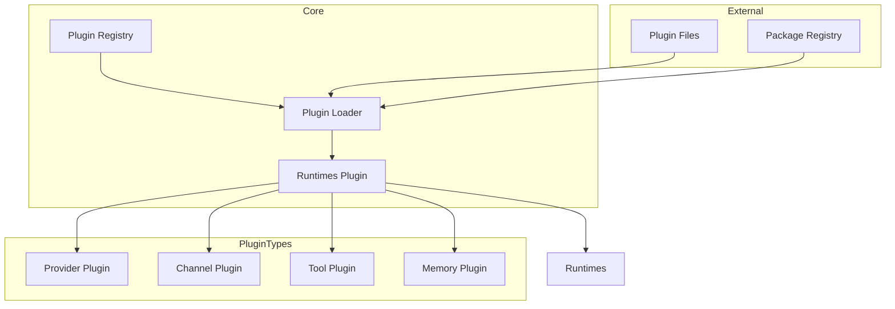
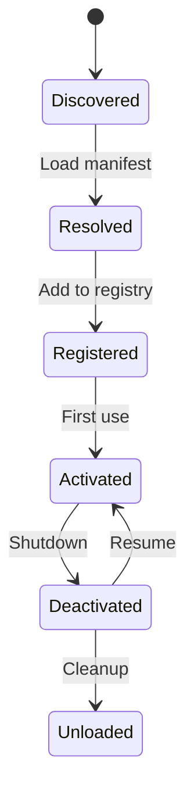
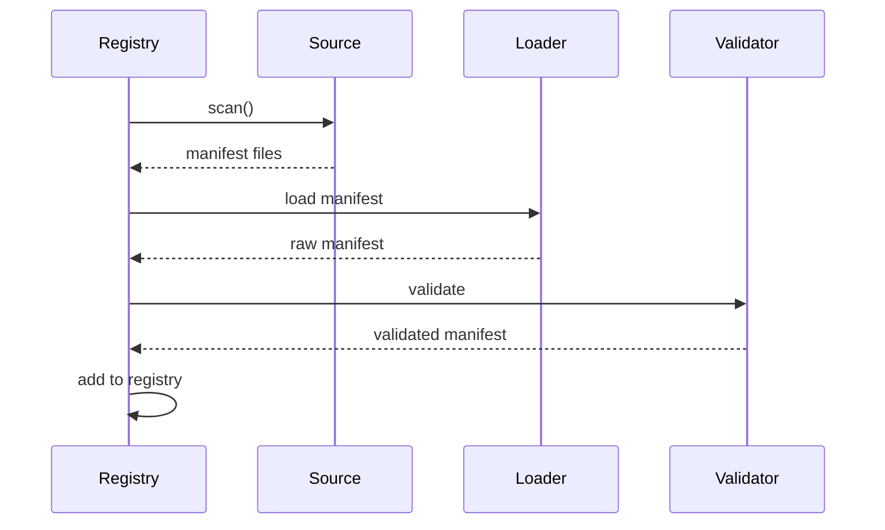

# Plugin Architecture

## Overview

OpenClaw uses a plugin-based architecture that allows the core system to remain agnostic while enabling extensive customization through plugins.



## Design Principles

### Core Stays Plugin-Agnostic

The core system has no built-in knowledge of:
- Specific providers (OpenAI, Anthropic, etc.)
- Specific channels (Telegram, Discord, etc.)
- Specific tools
- Specific AI models

All capabilities come through well-defined plugin interfaces.

### Contract-First Design

Plugins communicate through strict contracts:

```typescript
interface PluginContract {
  readonly id: string;
  readonly name: string;
  readonly version: string;
  readonly type: PluginType;

  // Lifecycle
  activate(context: PluginContext): Promise<void>;
  deactivate(): Promise<void>;
}
```

### Manifest-First Behavior

Plugin configuration is derived from manifest metadata before runtime:

```typescript
// 1. Control plane: validate manifest
const validatedConfig = await registry.validate(manifest);

// 2. Runtime plane: execute with validated config
await provider.createCompletion(validatedConfig);
```

### Lazy Loading

Plugins are loaded on-demand:

```typescript
const loader = new PluginLoader({
  lazy: true,
  activationPolicy: "on-demand",
});

// Plugin activated only when first used
await loader.activate("provider/openai");
```

## Plugin Types

### Type Hierarchy

| Type | Description | Entry Point |
|------|-------------|-------------|
| provider | AI model providers | `providerEntry()` |
| channel | Messaging platforms | `channelEntry()` |
| tool | External capabilities | `toolEntry()` |
| memory | Knowledge storage | `memoryEntry()` |
| runtime | Agent execution | `runtimeEntry()` |

### Provider Plugins

Connect to AI model providers:

```typescript
// extensions/openai/src/index.ts
export const entry = providerEntry({
  id: "openai",
  name: "OpenAI",

  // Provider methods
  async listModels() {
    // Return available models
    return [
      { ref: "openai:gpt-4o", name: "GPT-4o", ... },
      { ref: "openai:gpt-4o-mini", name: "GPT-4o Mini", ... },
    ];
  },

  async createCompletion(params) {
    // Create completion
    return openai.chat.completions.create(params);
  },
});
```

### Channel Plugins

Connect to messaging platforms:

```typescript
// extensions/telegram/src/index.ts
export const entry = channelEntry({
  id: "telegram",
  name: "Telegram",

  async connect(config) {
    // Connect to Telegram
    return new TelegramBot(config.token);
  },

  async send(target, message) {
    // Send message
    await bot.sendMessage(target.peer, message.content);
  },

  onMessage(handler) {
    // Handle incoming messages
    bot.on("message", handler);
  },
});
```

### Tool Plugins

Provide external capabilities:

```typescript
// extensions/tavily/src/index.ts
export const entry = toolEntry({
  id: "tavily",
  name: "Tavily Search",
  tools: [
    {
      name: "web_search",
      description: "Search the web",
      schema: { query: "string" },
    },
  ],

  async execute(tool, params, context) {
    const result = await tavily.search(params.query);
    return { success: true, content: { type: "text", text: result } };
  },
});
```

## Plugin Manifest

### Manifest Structure

```json
{
  "id": "provider/openai",
  "name": "OpenAI Provider",
  "version": "1.0.0",
  "type": "provider",
  "description": "OpenAI GPT models provider",
  "entry": "./dist/index.js",
  "runtime": {
    "node": ">=18.0.0"
  },
  "dependencies": {
    "openai": "^4.0.0"
  },
  "providers": [
    {
      "id": "openai",
      "models": ["gpt-4o", "gpt-4o-mini", "gpt-4-turbo"],
      "capabilities": ["streaming", "function_calling", "vision"]
    }
  ],
  "config": {
    "schema": { /* Zod schema */ }
  }
}
```

### Manifest Validation

```typescript
const manifestSchema = z.object({
  id: z.string().regex(/^[a-z]+\/[a-z-]+$/),
  name: z.string(),
  version: z.string().regex(/^\d+\.\d+\.\d+/),
  type: z.enum(["provider", "channel", "tool", "memory", "runtime"]),
  entry: z.string(),
  runtime: z.object({
    node: z.string().optional(),
  }).optional(),
  dependencies: z.record(z.string()).optional(),
});

function validateManifest(manifest: unknown) {
  return manifestSchema.parse(manifest);
}
```

## Plugin Lifecycle

### Lifecycle States



### Lifecycle Methods

```typescript
interface PluginLifecycle {
  // Called when plugin is first activated
  activate(context: PluginContext): Promise<void>;

  // Called when plugin is deactivated
  deactivate(): Promise<void>;

  // Health check
  healthCheck(): Promise<HealthStatus>;
}
```

## Plugin Registry

### Registry Interface

```typescript
interface PluginRegistry {
  // Discovery
  discover(patterns: string[]): Promise<DiscoveredPlugin[]>;
  resolve(id: string): Promise<ResolvedPlugin>;

  // Registration
  register(plugin: Plugin): void;
  unregister(id: string): void;
  get(id: string): Plugin | undefined;
  list(type?: PluginType): Plugin[];

  // Activation
  activate(id: string, options?: ActivationOptions): Promise<void>;
  deactivate(id: string): Promise<void>;

  // Status
  getStatus(id: string): PluginStatus;
}
```

### Registry Operations

```typescript
// Discover plugins
const plugins = await registry.discover([
  "extensions/providers/*",
  "extensions/channels/*",
]);

// Register a plugin
registry.register({
  manifest: validatedManifest,
  module: loadedModule,
});

// Activate on demand
await registry.activate("provider/openai");

// Check status
const status = registry.getStatus("provider/openai");
// { status: "active", activatedAt: Date, ... }
```

## Plugin Context

### Context Object

```typescript
interface PluginContext {
  // Configuration
  config: Readonly<PluginConfig>;
  secrets: SecretsManager;

  // Services
  logger: Logger;
  httpClient: HttpClient;
  storage: Storage;

  // OpenClaw APIs
  session: SessionAPI;
  memory: MemoryAPI;
  tools: ToolsAPI;

  // Lifecycle hooks
  hooks: HooksAPI;
}
```

### Using Context

```typescript
export async function activate(context: PluginContext) {
  const { config, logger, secrets } = context;

  // Access configuration
  const apiKey = await secrets.get("OPENAI_API_KEY");

  // Use services
  logger.info("Initializing OpenAI provider");

  // Register with APIs
  context.tools.register(myTools);

  // Register hooks
  context.hooks.on("before:message", myHandler);
}
```

## Plugin Discovery

### Discovery Sources

```typescript
interface DiscoverySource {
  type: "directory" | "npm" | "url";
  path: string;
  patterns?: string[];
}

// Built-in discovery
const sources: DiscoverySource[] = [
  { type: "directory", path: "./extensions" },
  { type: "directory", path: "~/.openclaw/plugins" },
];

// Custom discovery
await registry.addSource({
  type: "npm",
  package: "@openclaw/plugin-*",
});
```

### Discovery Process



## Bundled vs External Plugins

### Bundled Plugins

Built into the OpenClaw distribution:

```
extensions/              # Bundled in core
├── providers/
│   ├── openai/
│   ├── anthropic/
│   └── ...
├── channels/
│   ├── telegram/
│   ├── discord/
│   └── ...
└── tools/
    ├── browser/
    └── ...
```

### External Plugins

Installed separately:

```bash
npm install @openclaw/plugin-custom-provider
```

```typescript
// Configuration
const config = {
  plugins: {
    external: [
      {
        name: "@custom/plugin",
        source: "npm",
      },
    ],
  },
};
```

## Security Considerations

### Plugin Isolation

Plugins run with minimal privileges:

| Permission | Default | Configurable |
|------------|---------|--------------|
| File system | Read current dir | Per-plugin |
| Network | None | Per-plugin |
| Secrets | None | Explicit grant |
| Tools | None | Explicit grant |

### Sandboxing

```typescript
const sandboxConfig = {
  permissions: {
    fs: { allow: ["./workspace/*"], deny: ["~/.openclaw/*"] },
    net: { allow: ["api.example.com"], deny: [] },
    exec: { allow: [], deny: ["rm", "dd", "mkfs"] },
  },
  timeout: 30000,
  memoryLimit: "256MB",
};
```

## Related

- [Plugin SDK](/architecture-book/part-3-plugin-system/02-plugin-sdk) - SDK documentation
- [Plugin Contracts](/architecture-book/part-3-plugin-system/03-plugin-contracts) - Contract definitions
- [Plugin Runtime](/architecture-book/part-3-plugin-system/04-plugin-runtime) - Runtime implementation
- [Writing Plugins](/architecture-book/part-3-plugin-system/05-writing-plugins) - Plugin development