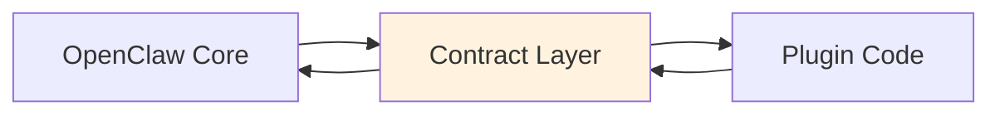
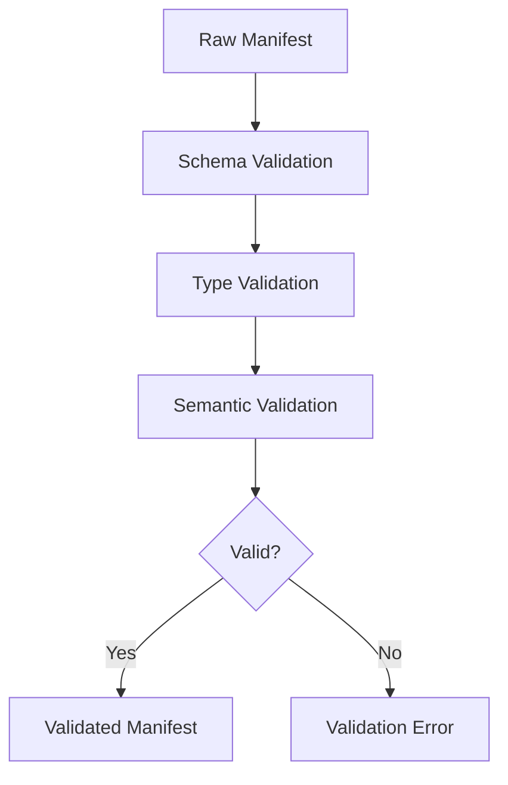

# Plugin Contracts

## Overview

OpenClaw uses a contract-based design to ensure type safety, validation, and clear boundaries between the core system and plugins.



## Contract Design Principles

### What is a Contract?

A contract defines the agreed interface between two parties:

| Aspect | Description |
|--------|-------------|
| Types | Data structures and interfaces |
| Methods | Available operations |
| Constraints | Preconditions and postconditions |
| Events | Observable behaviors |
| Errors | Error conditions and codes |

### Contract vs Interface

```typescript
// Interface: what methods exist
interface Provider {
  listModels(): Promise<Model[]>;
  createCompletion(params: CompletionParams): Promise<CompletionResult>;
}

// Contract: interface + constraints + semantics
interface ProviderContract extends Provider {
  // Constraint: listModels must return at least one model
  listModels(): Promise<Model[] & { length: number }>;

  // Constraint: models must have unique refs
  listModels(): Promise<Model[]>; // { every m => isUnique(m.ref) }
}
```

## Registry Contracts

### Registry Interface

```typescript
interface RegistryContract {
  // Discovery
  discover(patterns: string[]): Promise<DiscoveredPlugin[]>;
  resolve(id: string): Promise<ResolvedPlugin>;

  // Registration
  register(plugin: RegisteredPlugin): void;
  unregister(id: string): void;

  // Status
  getStatus(id: string): PluginStatus;
  list(type?: PluginType): RegisteredPlugin[];

  // Activation
  activate(id: string): Promise<void>;
  deactivate(id: string): Promise<void>;
}
```

### Registry Invariants

The registry maintains these invariants:

```typescript
const registryInvariants = {
  // Unique IDs
  uniqueId: () => "all plugins have unique ids",

  // Type consistency
  typeConsistent: () => "plugin.type matches manifest.type",

  // Lifecycle consistency
  lifecycleConsistent: (plugin) =>
    plugin.status === "active" ? plugin.activatedAt : !plugin.activatedAt,

  // Dependency satisfied: () =>
  //   "all plugin.dependencies resolve to registered plugins",
};
```

## Provider Contracts

### Provider Interface

```typescript
interface ProviderContract {
  readonly id: string;
  readonly name: string;

  // Discovery
  listModels(): Promise<Model[]>;
  getModel(ref: string): Promise<Model | null>;

  // Inference
  createCompletion(params: CompletionParams): Promise<AsyncIterable<CompletionDelta>>;
  createStructuredCompletion<T>(
    params: StructuredCompletionParams<T>
  ): Promise<T>;

  // Health
  healthCheck(): Promise<HealthStatus>;
}
```

### Provider Constraints

```typescript
// Constraints that provider plugins must satisfy

interface ProviderConstraints {
  // Models must have unique references
  uniqueModelRefs: (models: Model[]) =>
    new Set(models.map((m) => m.ref)).size === models.length,

  // Model references must be namespaced
  namespacedRefs: (models: Model[]) =>
    models.every((m) => m.ref.includes(":")),

  // Streaming must be supported if claimed
  streamingSupport: (model: Model) =>
    model.supportsStreaming ? true : true, // Provider supports streaming API

  // Vision models must accept images
  visionCapability: (model: Model) =>
    model.supportsVision ? true : true,
}
```

### Model Schema

```typescript
const modelSchema = z.object({
  ref: z.string().regex(/^[a-z]+:[a-z0-9-]+$/),
  name: z.string(),
  provider: z.string(),

  // Capabilities
  maxTokens: z.number().positive(),
  supportsStreaming: z.boolean(),
  supportsFunctionCalling: z.boolean().default(false),
  supportsVision: z.boolean().default(false),
  supportsJSONMode: z.boolean().default(false),

  // Context
  contextWindow: z.number().positive(),
  maxOutputTokens: z.number().positive(),

  // Pricing
  inputCost: z.number().nonnegative().optional(),
  outputCost: z.number().nonnegative().optional(),
});
```

## Channel Contracts

### Channel Interface

```typescript
interface ChannelContract {
  readonly id: string;
  readonly name: string;
  readonly platform: string;

  // Connection lifecycle
  connect(config: ChannelConfig): Promise<void>;
  disconnect(): Promise<void>;
  isConnected(): boolean;

  // Messaging
  send(target: ChannelTarget, message: OutboundMessage): Promise<void>;
  editMessage(target: ChannelTarget, messageId: string, content: string): Promise<void>;
  deleteMessage(target: ChannelTarget, messageId: string): Promise<void>;

  // Media
  uploadMedia(data: Buffer, type: MediaType): Promise<MediaId>;

  // Events
  onMessage(handler: MessageHandler): void;
  onEdit(handler: EditHandler): void;
  onReaction(handler: ReactionHandler): void;
}
```

### Channel Constraints

```typescript
interface ChannelConstraints {
  // Target must be valid
  validTarget: (target: ChannelTarget) =>
    target.peer && typeof target.peer === "string",

  // Message must have content or media
  nonEmptyMessage: (message: OutboundMessage) =>
    message.content || message.media,

  // Target must match channel type
  channelTargetMatch: (target: ChannelTarget, channel: Channel) =>
    channel.platform === target.channel,
}
```

## Tool Contracts

### Tool Interface

```typescript
interface ToolContract {
  readonly name: string;
  readonly description: string;
  readonly schema: JsonSchema;
  readonly category?: ToolCategory;

  execute(params: unknown, context: ToolContext): Promise<ToolResult>;
}
```

### Tool Constraints

```typescript
interface ToolConstraints {
  // Schema must be valid JSON Schema
  validSchema: (schema: JsonSchema) =>
    isValidJsonSchema(schema),

  // Name must be alphanumeric with underscores
  validName: (name: string) =>
    /^[a-z][a-z0-9_]*$/.test(name),

  // Result must have content
  nonEmptyResult: (result: ToolResult) =>
    result.success && result.content !== null,

  // Timeout must be positive
  validTimeout: (timeout?: number) =>
    timeout === undefined || timeout > 0,
}
```

## Runtime Contracts

### Runtime Interface

```typescript
interface RuntimeContract {
  readonly id: string;
  readonly type: RuntimeType;
  readonly capabilities: RuntimeCapabilities;

  // Lifecycle
  start(config: RuntimeConfig): Promise<void>;
  stop(): Promise<void>;

  // Execution
  run(params: RunParams): AsyncIterable<RunEvent>;
  abort(runId: string): Promise<void>;

  // Tools
  registerTools(tools: Tool[]): void;
  unregisterTools(names: string[]): void;
}
```

### Runtime Capabilities

```typescript
interface RuntimeCapabilities {
  streaming: boolean;
  functionCalling: boolean;
  vision: boolean;
  jsonMode: boolean;
  customModes?: string[];
}
```

## Contract Validation

### Validation Pipeline



### Validation Functions

```typescript
interface ValidationResult {
  valid: boolean;
  errors: ValidationError[];
}

function validateProviderManifest(manifest: unknown): ValidationResult {
  // Step 1: Schema validation
  const schemaResult = providerManifestSchema.safeParse(manifest);
  if (!schemaResult.success) {
    return { valid: false, errors: schemaResult.error.issues };
  }

  // Step 2: Model uniqueness
  const refs = schemaResult.data.providers.flatMap(p => p.models);
  const uniqueRefs = new Set(refs);
  if (refs.length !== uniqueRefs.size) {
    return {
      valid: false,
      errors: [{ path: "providers.models", message: "Duplicate model refs" }],
    };
  }

  return { valid: true, errors: [] };
}
```

## Extension Package Contracts

### Extension Package Schema

```typescript
const extensionPackageSchema = z.object({
  name: z.string().regex(/^@openclaw\/plugin-[a-z-]+$/),
  version: z.string(),
  type: z.literal("openclaw-plugin"),

  // Plugin metadata
  openclaw: z.object({
    id: z.string(),
    type: z.enum(["provider", "channel", "tool", "memory", "runtime"]),
    name: z.string(),
    description: z.string().optional(),
  }),

  // Entry points
  exports: z.object({
    entry: z.string(),
    types: z.string().optional(),
  }),

  // Runtime requirements
  runtime: z.object({
    node: z.string().optional(),
    openclaw: z.string(),
  }),
});
```

## Contract Testing

### Contract Tests

```typescript
describe("Provider Contract", () => {
  it("should enforce model uniqueness", () => {
    const manifest = {
      providers: [{ id: "test", models: ["m1", "m1"] }], // Duplicate!
    };
    const result = validateProviderManifest(manifest);
    expect(result.valid).toBe(false);
    expect(result.errors).toContainEqual(
      expect.objectContaining({ message: expect.stringContaining("Duplicate") })
    );
  });

  it("should enforce namespaced refs", () => {
    const manifest = {
      providers: [{ id: "test", models: ["invalid"] }], // No namespace!
    };
    const result = validateProviderManifest(manifest);
    expect(result.valid).toBe(false);
  });
});
```

### Invariant Testing

```typescript
describe("Registry Invariants", () => {
  it("should maintain unique plugin IDs", () => {
    const registry = new PluginRegistry();
    registry.register(plugin1);
    registry.register(plugin2);

    expect(() => registry.register(pluginWithDuplicateId)).toThrow();
  });

  it("should maintain lifecycle consistency", () => {
    const plugin = registry.get("test-plugin");

    expect(plugin.status).toBe("registered");
    expect(plugin.activatedAt).toBeUndefined();

    registry.activate("test-plugin");

    expect(plugin.status).toBe("active");
    expect(plugin.activatedAt).toBeDefined();
  });
});
```

## Error Codes

### Contract Errors

```typescript
const CONTRACT_ERRORS = {
  MANIFEST_INVALID: "CONTRACT_001",
  MANIFEST_MISSING_REQUIRED: "CONTRACT_002",
  MODEL_REF_NOT_UNIQUE: "CONTRACT_003",
  MODEL_REF_NOT_NAMESPACED: "CONTRACT_004",
  TARGET_INVALID: "CONTRACT_005",
  TOOL_NAME_INVALID: "CONTRACT_006",
  TOOL_SCHEMA_INVALID: "CONTRACT_007",
  DEPENDENCY_UNSATISFIED: "CONTRACT_008",
  RUNTIME_INCOMPATIBLE: "CONTRACT_009",
};
```

## Related

- [Plugin Architecture](/architecture-book/part-3-plugin-system/01-plugin-architecture) - Plugin design
- [Plugin SDK](/architecture-book/part-3-plugin-system/02-plugin-sdk) - SDK documentation
- [Plugin Runtime](/architecture-book/part-3-plugin-system/04-plugin-runtime) - Runtime implementation