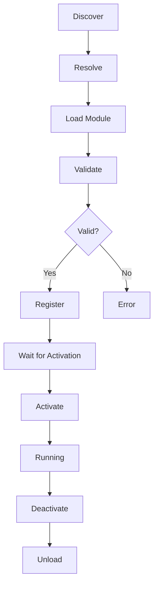
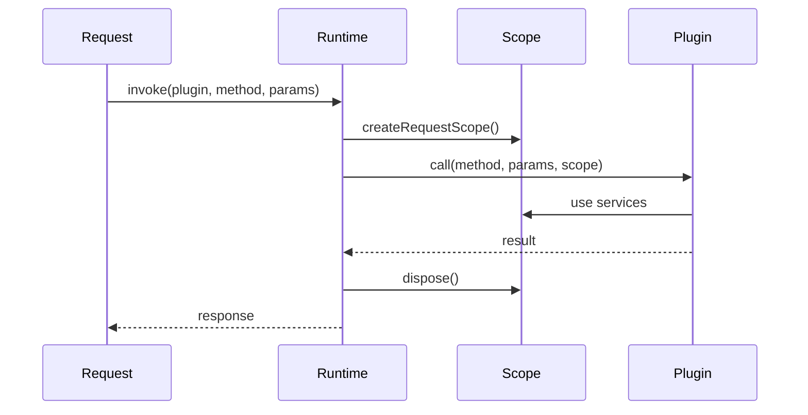
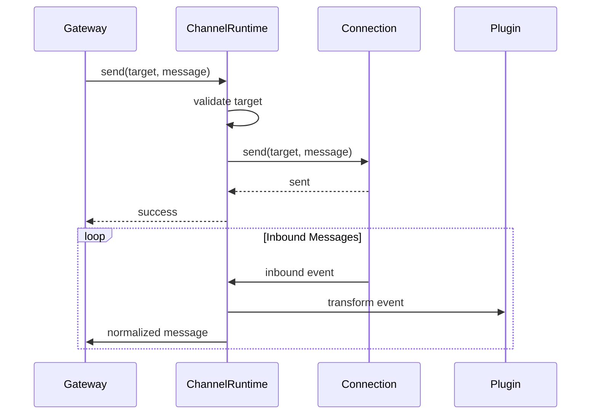

# Plugin Runtime

## Overview

The Plugin Runtime manages plugin loading, activation, and execution, providing lazy loading, dependency resolution, and isolation.



## Loading Architecture

### Module Loader

```typescript
interface PluginModuleLoader {
  load(id: string, path: string): Promise<PluginModule>;
  reload(id: string): Promise<PluginModule>;
  unload(id: string): Promise<void>;
  getLoaded(id: string): PluginModule | undefined;
}
```

### Lazy Loading Strategy

```typescript
class LazyPluginLoader {
  private modules = new Map<string, LazyModule>();
  private activations = new Map<string, ActivationPromise>();

  async load(id: string, path: string): Promise<PluginModule> {
    // Don't load until needed
    const lazyModule = new LazyModule(path);

    // Validate manifest only (lightweight)
    const manifest = await lazyModule.loadManifest();
    this.validateManifest(manifest);

    this.modules.set(id, lazyModule);
    return lazyModule;
  }

  async activate(id: string): Promise<void> {
    // Only now load full module
    if (this.activations.has(id)) {
      return this.activations.get(id);
    }

    const activation = (async () => {
      const lazyModule = this.modules.get(id);
      if (!lazyModule) throw new Error("Module not loaded");

      // Full load only on activation
      const module = await lazyModule.loadFull();
      const context = await this.createContext(id);

      await module.entry.activate(context);
    })();

    this.activations.set(id, activation);
    return activation;
  }
}
```

## Request Scope

### Scope Isolation

```typescript
interface RequestScope {
  readonly id: string;
  readonly pluginId: string;
  readonly config: PluginConfig;
  readonly logger: ScopedLogger;

  // Services scoped to request
  services: {
    http: ScopedHttpClient;
    storage: ScopedStorage;
    cache: ScopedCache;
  };
}

// Creating a request scope
function createRequestScope(pluginId: string): RequestScope {
  return {
    id: crypto.randomUUID(),
    pluginId,
    config: getPluginConfig(pluginId),
    logger: createScopedLogger(pluginId),
    services: {
      http: createScopedHttpClient({ timeout: 30000 }),
      storage: createScopedStorage(pluginId),
      cache: createScopedCache(),
    },
  };
}
```

### Scope Lifecycle



## Registry Loader

### Registry Operations

```typescript
class RegistryLoader {
  private registry: PluginRegistry;
  private loader: PluginModuleLoader;
  private contexts = new Map<string, PluginContext>();

  async register(manifest: PluginManifest, module: PluginModule): Promise<void> {
    const validated = this.validate(manifest);

    const plugin: RegisteredPlugin = {
      manifest: validated,
      module,
      status: "registered",
      registeredAt: new Date(),
    };

    this.registry.register(plugin);
  }

  async activate(id: string): Promise<void> {
    const plugin = this.registry.get(id);
    if (!plugin) throw new Error(`Plugin not found: ${id}`);

    if (plugin.status === "active") return;

    const context = await this.createContext(id);
    this.contexts.set(id, context);

    try {
      await plugin.module.entry.activate(context);
      this.registry.updateStatus(id, "active");
    } catch (error) {
      this.contexts.delete(id);
      throw error;
    }
  }
}
```

## Task Flow Runtime

### Task Execution

```typescript
interface TaskFlowRuntime {
  // Start a task flow
  startFlow(flowId: string, input: unknown): Promise<string>; // returns runId

  // Check status
  getStatus(runId: string): FlowStatus;

  // Wait for completion
  awaitCompletion(runId: string): Promise<FlowResult>;

  // Cancel
  cancel(runId: string): Promise<void>;
}

interface FlowStatus {
  runId: string;
  flowId: string;
  status: "pending" | "running" | "completed" | "failed" | "cancelled";
  currentStep?: string;
  progress?: number;
  error?: string;
}
```

### Flow Runtime Implementation

```typescript
class TaskFlowRuntimeImpl implements TaskFlowRuntime {
  private flows = new Map<string, Flow>();
  private runs = new Map<string, FlowRun>();

  async startFlow(flowId: string, input: unknown): Promise<string> {
    const flow = this.flows.get(flowId);
    if (!flow) throw new Error(`Flow not found: ${flowId}`);

    const run: FlowRun = {
      id: crypto.randomUUID(),
      flowId,
      input,
      status: "pending",
      steps: [],
      startTime: new Date(),
    };

    this.runs.set(run.id, run);
    this.executeFlow(run);

    return run.id;
  }

  private async executeFlow(run: FlowRun): Promise<void> {
    run.status = "running";

    for (const step of run.flow.steps) {
      try {
        const result = await this.executeStep(run, step);
        run.steps.push({ stepId: step.id, result, success: true });
      } catch (error) {
        run.steps.push({ stepId: step.id, error, success: false });
        if (!step.onError) {
          run.status = "failed";
          run.error = String(error);
          return;
        }
        // Handle error step
      }
    }

    run.status = "completed";
    run.endTime = new Date();
  }
}
```

## Channel Runtime

### Channel Context

```typescript
interface ChannelRuntimeContext {
  readonly channel: string;
  readonly config: ChannelConfig;
  readonly connection: ChannelConnection;

  // Messaging
  send(target: ChannelTarget, message: OutboundMessage): Promise<void>;

  // State
  getState<T>(key: string, defaultValue: T): T;
  setState<T>(key: string, value: T): void;

  // Events
  onMessage(handler: MessageHandler): void;
  onError(handler: ErrorHandler): void;
}
```

### Channel Runtime Implementation



## Memory Runtime

### Memory Context

```typescript
interface MemoryRuntimeContext {
  // Store operations
  store(entry: MemoryEntry): Promise<void>;
  get(key: string): Promise<MemoryEntry | null>;
  update(key: string, updates: Partial<MemoryEntry>): Promise<void>;
  delete(key: string): Promise<void>;

  // Search
  search(query: string, options?: SearchOptions): Promise<MemoryResult[]>;

  // Context building
  buildContext(sessionId: string, prompt: string): Promise<MemoryContext>;

  // Compaction
  compact(sessionId: string, strategy?: CompactionStrategy): Promise<void>;
}
```

### Memory Runtime Implementation

```typescript
class MemoryRuntimeImpl implements MemoryRuntime {
  private store: MemoryStore;
  private index: SearchIndex;

  async search(query: string, options?: SearchOptions): Promise<MemoryResult[]> {
    // Vector search
    const embedding = await this.embed(query);
    const results = await this.index.search(embedding, {
      limit: options?.limit ?? 10,
      threshold: options?.threshold ?? 0.7,
    });

    // Filter by category
    let filtered = results;
    if (options?.categories) {
      filtered = filtered.filter(r => options.categories!.includes(r.entry.type));
    }

    // Transform to MemoryResult
    return filtered.map(result => ({
      entry: result.entry,
      score: result.score,
      snippet: this.extractSnippet(result.entry.content, query),
    }));
  }
}
```

## Dependency Resolution

### Dependency Graph

```typescript
interface DependencyGraph {
  nodes: Map<string, PluginNode>;
  edges: Map<string, string[]>;  // plugin -> dependencies

  addNode(plugin: PluginManifest): void;
  removeNode(id: string): void;
  getDependencies(id: string): string[];
  getDependents(id: string): string[];

  // Topological sort for activation order
  getActivationOrder(): string[];

  // Cycle detection
  hasCycle(): boolean;
  getCycle(): string[] | null;
}
```

### Resolution Algorithm

```typescript
function resolveDependencies(plugins: PluginManifest[]): ResolutionOrder {
  const graph = buildGraph(plugins);

  // Check for cycles
  if (graph.hasCycle()) {
    const cycle = graph.getCycle();
    throw new CyclicDependencyError(cycle);
  }

  // Topological sort
  const order: string[] = [];
  const visited = new Set<string>();
  const temp = new Set<string>();

  function visit(id: string) {
    if (temp.has(id)) throw new CyclicDependencyError([id]);
    if (visited.has(id)) return;

    temp.add(id);
    for (const dep of graph.getDependencies(id)) {
      visit(dep);
    }
    temp.delete(id);
    visited.add(id);
    order.push(id);
  }

  for (const plugin of plugins) {
    visit(plugin.id);
  }

  return order;
}
```

## Performance Optimization

### Hot Path Optimization

```typescript
class OptimizedPluginLoader {
  // Pre-compute facts in hot paths
  private pluginFacts = new Map<string, PluginFacts>();

  async preloadFacts(id: string): Promise<void> {
    const plugin = await this.registry.get(id);
    this.pluginFacts.set(id, {
      providerId: plugin.manifest.providers?.[0]?.id,
      channelId: plugin.manifest.channels?.[0]?.id,
      capabilities: extractCapabilities(plugin.manifest),
      configSchema: buildConfigSchema(plugin.manifest),
    });
  }

  // Avoid repeated lookups in hot paths
  getProviderId(id: string): string | undefined {
    // Use pre-computed fact
    return this.pluginFacts.get(id)?.providerId;
  }
}
```

### Memory Optimization

```typescript
class MemoryOptimizedLoader {
  // Use WeakMap for automatic cleanup
  private contexts = new WeakMap<PluginModule, PluginContext>();

  // Lazy initialization of heavy objects
  private heavyObjects = new Map<string, () => unknown>();

  registerHeavy(id: string, factory: () => unknown): void {
    this.heavyObjects.set(id, factory);
  }

  getHeavy(id: string): unknown {
    const factory = this.heavyObjects.get(id);
    return factory ? factory() : undefined;
  }
}
```

## Related

- [Plugin Architecture](/architecture-book/part-3-plugin-system/01-plugin-architecture) - Plugin design
- [Plugin Contracts](/architecture-book/part-3-plugin-system/03-plugin-contracts) - Contract system
- [Writing Plugins](/architecture-book/part-3-plugin-system/05-writing-plugins) - Plugin development