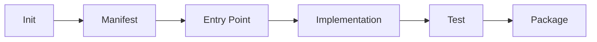

# Writing Plugins

## Overview

This guide walks through creating a complete OpenClaw plugin from scratch.



## Plugin Types

Choose your plugin type based on what you want to add:

| Type | Use Case | Entry Function |
|------|----------|----------------|
| provider | AI model access | `providerEntry()` |
| channel | Messaging platform | `channelEntry()` |
| tool | External capability | `toolEntry()` |
| memory | Knowledge storage | `memoryEntry()` |
| runtime | Agent execution | `runtimeEntry()` |

## Step 1: Project Setup

### Create Plugin Directory

```bash
mkdir -p extensions/my-plugin/src
cd extensions/my-plugin
```

### Initialize Package

```json
{
  "name": "@openclaw/plugin-my-plugin",
  "version": "1.0.0",
  "type": "module",
  "main": "./dist/index.js",
  "types": "./dist/index.d.ts",
  "exports": {
    ".": {
      "import": "./dist/index.js",
      "types": "./dist/index.d.ts"
    }
  },
  "scripts": {
    "build": "tsdown",
    "test": "vitest"
  },
  "dependencies": {},
  "devDependencies": {
    "typescript": "^5.0.0",
    "tsdown": "^0.11.0",
    "@openclaw/plugin-sdk": "workspace:*"
  }
}
```

### tsdown Configuration

```typescript
// tsdown.config.ts
import { defineConfig } from "tsdown";

export default defineConfig({
  entry: "./src/index.ts",
  outDir: "./dist",
  dts: true,
  splitting: false,
});
```

## Step 2: Create Manifest

### Manifest File

```json
{
  "id": "my-plugin",
  "name": "My Plugin",
  "version": "1.0.0",
  "type": "provider",
  "description": "A custom AI provider plugin",
  "entry": "./dist/index.js",
  "runtime": {
    "node": ">=18.0.0"
  },
  "providers": [
    {
      "id": "my-provider",
      "models": ["my-model-v1", "my-model-v2"]
    }
  ]
}
```

### Plugin JSON

```json
{
  "id": "my-plugin",
  "name": "My Plugin",
  "version": "1.0.0",
  "type": "provider",
  "description": "A custom AI provider plugin"
}
```

## Step 3: Write Entry Point

### Basic Entry Structure

```typescript
// src/index.ts
import { providerEntry } from "@openclaw/plugin-sdk/runtime/provider";

export const entry = providerEntry({
  id: "my-provider",
  name: "My Provider",

  async listModels(config) {
    return [
      {
        ref: "my-provider:my-model-v1",
        name: "My Model V1",
        provider: "my-provider",
        maxTokens: 4096,
        supportsStreaming: true,
        supportsFunctionCalling: true,
        contextWindow: 128000,
        maxOutputTokens: 4096,
      },
      {
        ref: "my-provider:my-model-v2",
        name: "My Model V2",
        provider: "my-provider",
        maxTokens: 8192,
        supportsStreaming: true,
        supportsFunctionCalling: true,
        supportsVision: true,
        contextWindow: 256000,
        maxOutputTokens: 8192,
      },
    ];
  },

  async createCompletion(config, params) {
    const { model, messages, stream = true } = params;

    // Call your API
    const response = await callMyAPI({
      model: model.replace("my-provider:", ""),
      messages,
      stream,
    });

    return response;
  },
});
```

## Step 4: Implement Features

### Configuration

```typescript
import { defineConfig } from "@openclaw/plugin-sdk/config";

// Configuration schema
export const config = defineConfig({
  apiKey: {
    type: "secret",
    required: true,
    description: "API key for My Provider",
  },

  baseUrl: {
    type: "string",
    default: "https://api.my-provider.com",
    description: "API base URL",
  },

  model: {
    type: "string",
    default: "my-model-v1",
    description: "Default model to use",
  },

  temperature: {
    type: "number",
    default: 0.7,
    min: 0,
    max: 2,
  },

  maxTokens: {
    type: "number",
    default: 4096,
  },
});
```

### Activation with Config

```typescript
import { providerEntry } from "@openclaw/plugin-sdk/runtime/provider";
import { config, type MyPluginConfig } from "./config.js";

export const entry = providerEntry({
  id: "my-provider",
  name: "My Provider",
  config,  // Attach config schema

  async activate(context) {
    const { config, logger } = context;

    // Use validated config
    const apiKey = await context.secrets.get("MY_PROVIDER_API_KEY");

    logger.info("My Provider plugin activated", {
      model: config.model,
      baseUrl: config.baseUrl,
    });

    // Initialize API client
    context.state.client = createClient({
      apiKey,
      baseUrl: config.baseUrl,
    });
  },

  async listModels(config) {
    // Use config
    return fetchModelList(config.baseUrl);
  },

  async createCompletion(config, params) {
    // Use config
    return this.state.client.complete({
      model: config.model,
      messages: params.messages,
      temperature: config.temperature,
      maxTokens: config.maxTokens,
      stream: params.stream,
    });
  },
});
```

### Error Handling

```typescript
import { RetryableError, ProviderError } from "@openclaw/plugin-sdk/errors";

export const entry = providerEntry({
  id: "my-provider",
  name: "My Provider",

  async createCompletion(config, params) {
    try {
      const response = await callAPI(params);

      if (response.error) {
        throw new ProviderError(response.error.message, {
          code: response.error.code,
        });
      }

      return response;
    } catch (error) {
      if (error instanceof RateLimitError) {
        throw new RetryableError("Rate limited", {
          retryAfter: error.retryAfter,
        });
      }

      if (error instanceof NetworkError) {
        throw new RetryableError("Network error", {
          retryAfter: 1000,
        });
      }

      throw error;
    }
  },
});
```

## Step 5: Write Tests

### Test Setup

```typescript
// src/index.test.ts
import { describe, it, expect, vi, beforeEach } from "vitest";
import { createTestPlugin, mockContext } from "@openclaw/plugin-sdk/testing";
import { entry } from "./index.js";

describe("My Provider Plugin", () => {
  let plugin: TestPlugin;
  const mockCtx = mockContext({
    config: {
      apiKey: "test-key",
      baseUrl: "https://test.example.com",
      model: "test-model",
    },
  });

  beforeEach(() => {
    plugin = createTestPlugin({
      manifest: testManifest,
      entry,
    });
  });

  it("should activate successfully", async () => {
    await plugin.activate(mockCtx);
    expect(plugin.status).toBe("active");
  });

  it("should list models", async () => {
    await plugin.activate(mockCtx);
    const models = await plugin.module.listModels();
    expect(models).toHaveLength(2);
    expect(models[0].ref).toBe("my-provider:my-model-v1");
  });

  it("should create completion", async () => {
    await plugin.activate(mockCtx);

    const mockStream = new MockStream([
      { choices: [{ delta: { content: "Hello" } }] },
      { choices: [{ delta: { content: " world" } }] },
    ]);

    vi.stubGlobal("callMyAPI", vi.fn().mockResolvedValue(mockStream));

    const result = await plugin.module.createCompletion({
      model: "my-provider:my-model-v1",
      messages: [{ role: "user", content: "Hi" }],
      stream: true,
    });

    expect(callMyAPI).toHaveBeenCalled();
  });
});
```

### Test Manifest

```typescript
const testManifest = {
  id: "my-plugin",
  name: "My Plugin",
  version: "1.0.0",
  type: "provider",
  entry: "./dist/index.js",
  providers: [
    {
      id: "my-provider",
      models: ["my-model-v1", "my-model-v2"],
    },
  ],
};
```

## Step 6: Build and Package

### Build

```bash
pnpm build
```

### Output Structure

```
dist/
├── index.js          # ESM bundle
├── index.d.ts        # Type declarations
└── index.d.ts.map    # Source map
```

### Local Testing

```bash
# Link plugin locally
cd extensions/my-plugin
npm link

# In openclaw root
npm link @openclaw/plugin-my-plugin

# Test
pnpm openclaw status
```

## Complete Example

### File Structure

```
extensions/my-plugin/
├── package.json
├── tsdown.config.ts
├── openclaw.plugin.json
├── src/
│   ├── index.ts
│   ├── config.ts
│   ├── client.ts
│   └── index.test.ts
└── README.md
```

### Complete Source

```typescript
// src/index.ts
import { providerEntry } from "@openclaw/plugin-sdk/runtime/provider";
import { defineConfig } from "@openclaw/plugin-sdk/config";
import { createClient } from "./client.js";

export const config = defineConfig({
  apiKey: {
    type: "secret",
    required: true,
  },
  baseUrl: {
    type: "string",
    default: "https://api.my-provider.com",
  },
  model: {
    type: "string",
    default: "my-model-v1",
  },
});

export const entry = providerEntry({
  id: "my-provider",
  name: "My Provider",
  config,

  async activate(context) {
    const apiKey = await context.secrets.get("MY_PROVIDER_API_KEY");
    context.state.client = createClient({
      apiKey,
      baseUrl: context.config.baseUrl,
    });
    context.logger.info("My Provider activated");
  },

  async listModels() {
    return [
      {
        ref: "my-provider:my-model-v1",
        name: "My Model V1",
        provider: "my-provider",
        maxTokens: 4096,
        supportsStreaming: true,
        contextWindow: 128000,
        maxOutputTokens: 4096,
      },
    ];
  },

  async createCompletion(config, params) {
    const client = this.state.client;
    return client.complete({
      model: config.model,
      messages: params.messages,
      stream: params.stream ?? true,
    });
  },
});
```

## Publishing

### npm Publish

```bash
# Login
npm login

# Publish
npm publish --access public
```

### Version Management

```bash
# Update version
npm version patch  # 1.0.0 -> 1.0.1
npm version minor  # 1.0.1 -> 1.1.0
npm version major  # 1.1.0 -> 2.0.0

# Publish
npm publish
```

## Related

- [Plugin Architecture](/architecture-book/part-3-plugin-system/01-plugin-architecture) - Plugin design
- [Plugin SDK](/architecture-book/part-3-plugin-system/02-plugin-sdk) - SDK documentation
- [Plugin Contracts](/architecture-book/part-3-plugin-system/03-plugin-contracts) - Contract system