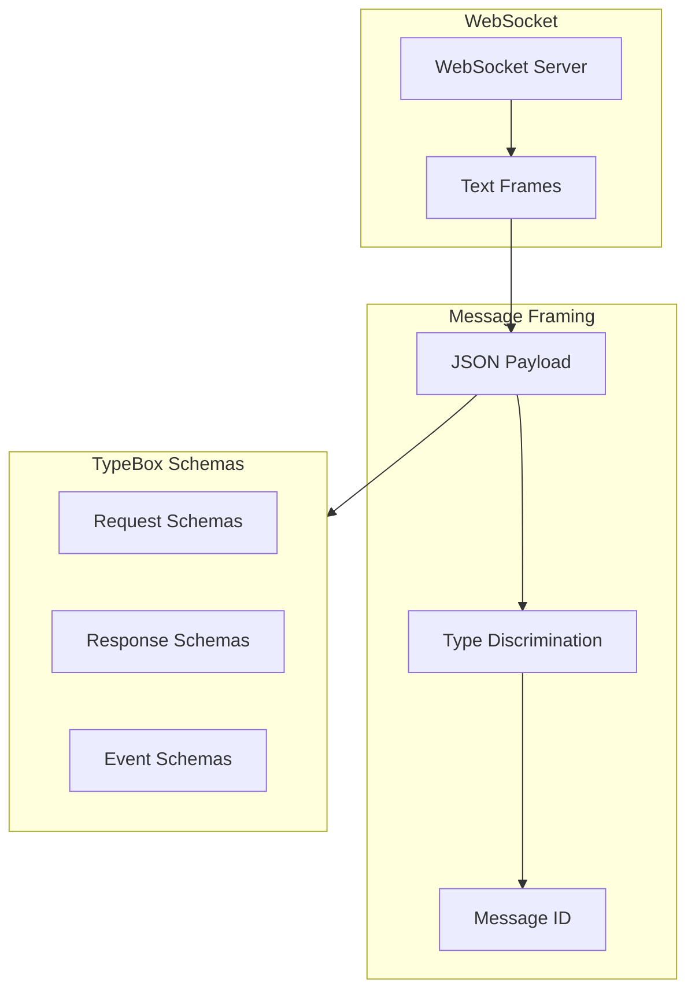
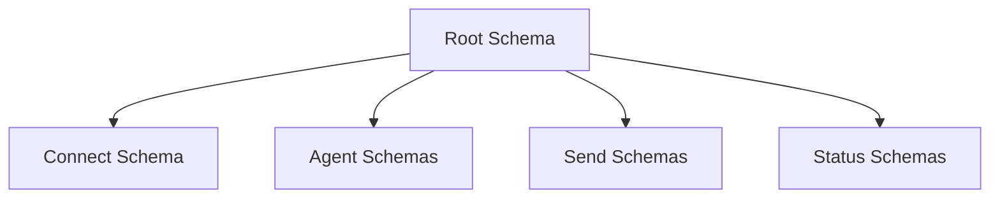
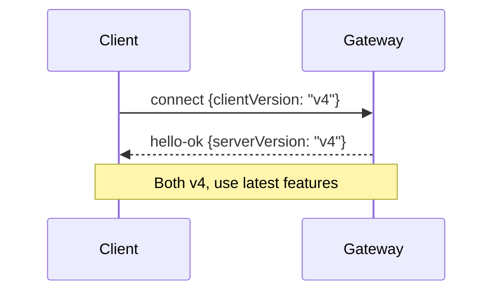
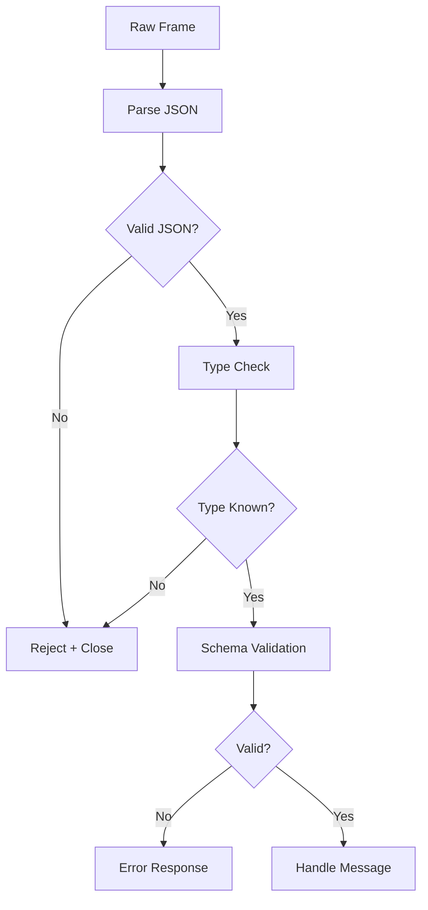

# Protocol Overview

## Overview

The OpenClaw Gateway uses a typed WebSocket protocol for all communication between clients and the gateway. This protocol is designed for reliability, type safety, and extensibility.

## Design Goals

| Goal | Implementation |
|------|----------------|
| Type Safety | TypeBox schemas for all messages |
| Reliability | Idempotency keys, acknowledgment |
| Extensibility | Additive protocol versions |
| Performance | Streaming, compression |
| Security | Auth on every connection |

## Protocol Stack



## Message Types

### Three Message Types

| Type | Direction | Description |
|------|-----------|-------------|
| `req` | Client to Gateway | Request with response |
| `res` | Gateway to Client | Response to request |
| `event` | Gateway to Client | Server-push event |

### Request

```typescript
interface RequestFrame {
  type: "req";
  id: string;           // Unique request ID
  method: string;       // RPC method name
  params: unknown;      // Method parameters
  idemKey?: string;     // Idempotency key
}
```

### Response

```typescript
interface ResponseFrame {
  type: "res";
  id: string;           // Matching request ID
  ok: boolean;
  payload?: unknown;    // Success payload
  error?: {
    code: string;
    message: string;
    details?: unknown;
  };
}
```

### Event

```typescript
interface EventFrame {
  type: "event";
  event: string;        // Event type name
  payload: unknown;     // Event data
  seq?: number;         // Sequence number
  stateVersion?: number; // For state sync
}
```

## TypeBox Schema System

### Schema Hierarchy



### Schema Definition

```typescript
import { Type } from "@sinclair/typebox";

// Connection request
const ConnectRequestSchema = Type.Object({
  type: Type.Literal("connect"),
  params: Type.Object({
    auth: Type.Object({
      token: Type.Optional(Type.String()),
      password: Type.Optional(Type.String()),
    }),
    device: Type.Object({
      id: Type.String(),
      name: Type.String(),
      platform: Type.String(),
    }),
    client: Type.Object({
      version: Type.String(),
      name: Type.String(),
    }),
  }),
});

// Agent request
const AgentRequestSchema = Type.Object({
  type: Type.Literal("req"),
  id: Type.String(),
  method: Type.Literal("agent"),
  params: Type.Object({
    sessionKey: Type.String(),
    agentId: Type.String(),
    input: Type.String(),
    idemKey: Type.Optional(Type.String()),
    modelRef: Type.Optional(Type.String()),
  }),
});
```

## Versioning Strategy

### Version Compatibility

| Version | Changes | Compatibility |
|---------|---------|---------------|
| v1 | Initial | Base protocol |
| v2 | Added streaming | Additive |
| v3 | Device metadata | Additive |
| v4 | Idempotency keys | Additive |

### Version Negotiation



## RPC Methods

### Core Methods

| Method | Description | Idempotent |
|--------|-------------|------------|
| `connect` | Initial handshake | N/A |
| `agent` | Run agent | Yes |
| `send` | Send message | Yes |
| `health` | Health check | Yes |
| `status` | System status | Yes |

### Agent Method

```typescript
// Request
{
  type: "req",
  id: "req-123",
  method: "agent",
  params: {
    sessionKey: "telegram:dm:123456",
    agentId: "main",
    input: "What is the weather?",
    idemKey: "msg-456"  // For retry safety
  }
}

// Response (streaming)
{
  type: "event",
  event: "agent",
  payload: {
    runId: "run-789",
    delta: "The weather in"
  }
}

// Final response
{
  type: "res",
  id: "req-123",
  ok: true,
  payload: {
    runId: "run-789",
    status: "complete",
    summary: "The weather is sunny..."
  }
}
```

### Send Method

```typescript
// Request
{
  type: "req",
  id: "req-456",
  method: "send",
  params: {
    channel: "telegram",
    target: "123456",
    message: {
      content: "Hello, world!"
    },
    idemKey: "send-789"
  }
}

// Response
{
  type: "res",
  id: "req-456",
  ok: true,
  payload: {
    messageId: "msg-out-001"
  }
}
```

## Event Types

### Event Categories

| Category | Events |
|----------|--------|
| Agent | `agent`, `agent.start`, `agent.complete` |
| Chat | `chat`, `chat.reaction`, `chat.edit` |
| Presence | `presence`, `presence.update` |
| Health | `tick`, `health`, `health.degraded` |
| System | `shutdown`, `restart` |

### Tick Event

```typescript
// Periodic health/event snapshot
{
  type: "event",
  event: "tick",
  payload: {
    timestamp: "2024-01-15T10:30:00Z",
    uptime: 86400,
    sessions: 5,
    channels: ["telegram", "discord"],
    health: "healthy"
  }
}
```

### Presence Event

```typescript
{
  type: "event",
  event: "presence",
  payload: {
    channels: [
      { id: "telegram", status: "connected", users: 3 },
      { id: "discord", status: "connected", users: 12 }
    ],
    agents: [
      { id: "main", sessions: 15, running: 1 }
    ]
  }
}
```

## Error Handling

### Error Codes

| Code | Description | HTTP Equivalent |
|------|-------------|-----------------|
| `AUTH_FAILED` | Authentication failed | 401 |
| `VALIDATION_ERROR` | Invalid request | 400 |
| `SESSION_NOT_FOUND` | Session doesn't exist | 404 |
| `AGENT_ERROR` | Agent execution failed | 500 |
| `RATE_LIMITED` | Too many requests | 429 |
| `INTERNAL_ERROR` | Gateway error | 500 |

### Error Response

```typescript
{
  type: "res",
  id: "req-123",
  ok: false,
  error: {
    code: "VALIDATION_ERROR",
    message: "Invalid session key format",
    details: {
      field: "params.sessionKey",
      expected: "channel:scope:target"
    }
  }
}
```

## Frame Validation

### Validation Pipeline



### Validation Errors

```typescript
function validateFrame(frame: unknown): ValidationResult {
  // Step 1: Parse JSON
  if (typeof frame !== "object" || frame === null) {
    return { valid: false, error: "Not an object" };
  }

  // Step 2: Check type field
  const obj = frame as Record<string, unknown>;
  if (!obj.type || typeof obj.type !== "string") {
    return { valid: false, error: "Missing type field" };
  }

  // Step 3: Validate against schema
  const schema = schemas[obj.type];
  if (!schema) {
    return { valid: false, error: `Unknown type: ${obj.type}` };
  }

  const result = schema.validate(obj);
  if (!result.valid) {
    return { valid: false, error: result.errors };
  }

  return { valid: true, data: result.data };
}
```

## Related

- [WebSocket Transport](/architecture-book/part-4-gateway-protocol/02-ws-transport) - Transport implementation
- [Message Flow](/architecture-book/part-4-gateway-protocol/03-message-flow) - Message processing
- [Events and RPC](/architecture-book/part-4-gateway-protocol/04-events-and-rpc) - Communication patterns