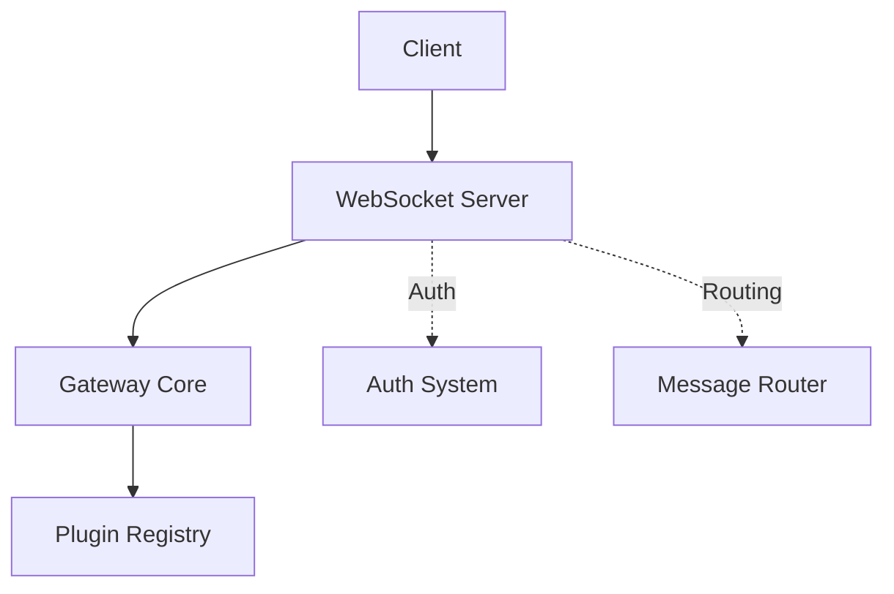
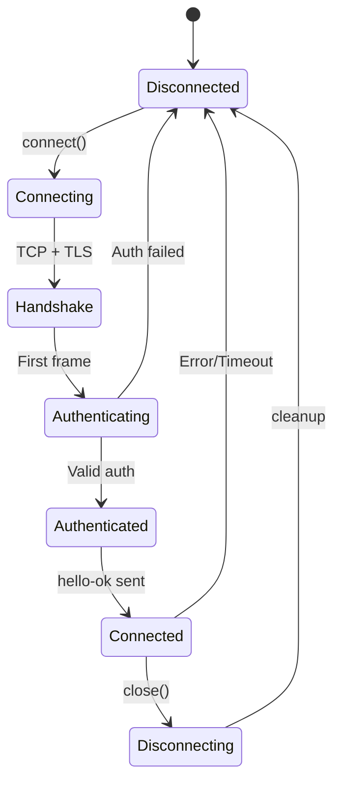
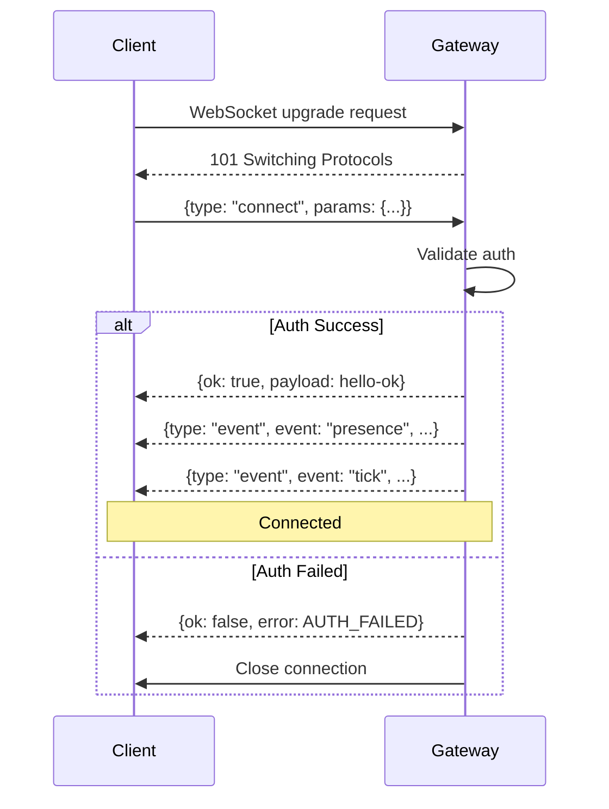
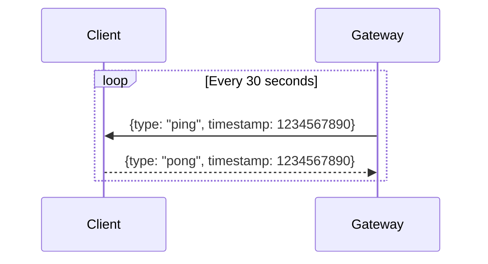
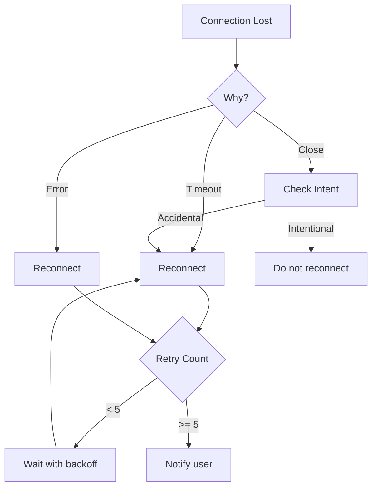

# WebSocket Transport

## Overview

The Gateway uses WebSocket as its transport layer, with a mandatory handshake protocol for connection establishment.

## Connection Architecture



## Connection Lifecycle

### Lifecycle States



### First Frame Requirement

**Critical**: The first frame on a new WebSocket connection MUST be a `connect` request. Any other frame results in immediate connection closure.

```typescript
// CORRECT - First frame is connect
socket.on("message", (data) => {
  const frame = JSON.parse(data);
  if (frame.type === "connect") {
    handleConnect(frame);
  } else {
    socket.close(4000, "First frame must be connect");
  }
});
```

## Handshake Protocol

### Connect Request

```typescript
interface ConnectRequest {
  type: "connect";
  params: {
    auth: {
      token?: string;      // Token auth
      password?: string;    // Password auth
    };
    device: {
      id: string;
      name: string;
      platform: string;
      family?: string;      // e.g., "iPhone", "Mac"
    };
    client: {
      version: string;
      name: string;         // e.g., "openclaw-cli", "openclaw-ui"
    };
    role?: "operator" | "node";
    capabilities?: string[];
  };
}
```

### Connect Response

```typescript
interface HelloOk {
  type: "res";          // Implicit for connect response
  ok: true;
  payload: {
    serverVersion: string;
    features: {
      methods: string[];
      events: string[];
      streaming: boolean;
    };
    health: HealthStatus;
    presence: PresenceSnapshot;
  };
}
```

### Handshake Flow



## Authentication Modes

### Token Authentication

```typescript
// Connect with token
{
  type: "connect",
  params: {
    auth: {
      token: "sk-openclaw-xxxxx"
    },
    device: {
      id: "device-uuid",
      name: "My Device",
      platform: "macos"
    },
    client: {
      version: "1.0.0",
      name: "openclaw-cli"
    }
  }
}
```

### Password Authentication

```typescript
// Connect with password
{
  type: "connect",
  params: {
    auth: {
      password: "my-password"
    },
    // ...
  }
}
```

### Tailscale Authentication

When `gateway.auth.allowTailscale: true`, Tailscale identity is trusted from request headers:

```typescript
// No auth params needed - use Tailscale identity
{
  type: "connect",
  params: {
    device: {
      id: "device-uuid",
      // ...
    }
    // No auth field
  }
}
```

## Heartbeat Mechanism

### Ping/Pong



### Timeout Handling

```typescript
const TIMEOUTS = {
  pongWait: 10000,      // Wait 10s for pong
  reconnectDelay: 1000, // Initial reconnect delay
  maxReconnectDelay: 30000,
};

function handlePong(timeout: number) {
  clearTimeout(timeout);
  lastPongReceived = Date.now();
}

function checkHeartbeat() {
  if (Date.now() - lastPongReceived > TIMEOUTS.pongWait) {
    console.warn("Heartbeat timeout, reconnecting...");
    reconnect();
  }
}
```

## Message Framing

### Frame Format

All messages are JSON text frames:

```typescript
// Request frame
{
  "type": "req",
  "id": "req-abc123",
  "method": "agent",
  "params": {
    "sessionKey": "main",
    "input": "Hello!"
  }
}

// Response frame
{
  "type": "res",
  "id": "req-abc123",
  "ok": true,
  "payload": { ... }
}

// Event frame
{
  "type": "event",
  "event": "tick",
  "payload": { ... }
}
```

### Large Message Handling

For messages exceeding WebSocket frame limits:

```typescript
interface ChunkedMessage {
  chunk: {
    total: number;      // Total chunks
    index: number;     // Current chunk (0-based)
    id: string;         // Message ID for reassembly
  };
  data: string;         // UTF-8 string chunk
}

function sendLarge(message: string) {
  const CHUNK_SIZE = 64 * 1024; // 64KB
  const chunks = splitIntoChunks(message, CHUNK_SIZE);

  chunks.forEach((chunk, i) => {
    socket.send(JSON.stringify({
      chunk: {
        total: chunks.length,
        index: i,
        id: generateId()
      },
      data: chunk
    }));
  });
}
```

## Reconnection Handling

### Reconnection Strategy



### Exponential Backoff

```typescript
function getReconnectDelay(attempt: number): number {
  const baseDelay = 1000;
  const maxDelay = 30000;
  const delay = Math.min(baseDelay * Math.pow(2, attempt), maxDelay);
  return delay + Math.random() * 1000; // Add jitter
}
```

## TLS Configuration

### TLS Options

```typescript
interface TLSConfig {
  enabled: boolean;
  certPath?: string;
  keyPath?: string;
  caPath?: string;
  verifyClient?: boolean;
}

const tlsConfig: TLSConfig = {
  enabled: true,
  certPath: "/path/to/cert.pem",
  keyPath: "/path/to/key.pem",
  verifyClient: true,  // Require client certificates
};
```

## Client Examples

### JavaScript Client

```typescript
import WebSocket from "ws";

class OpenClawClient {
  private ws?: WebSocket;
  private pendingRequests = new Map();
  private sequence = 0;

  async connect(url: string, token: string) {
    this.ws = new WebSocket(url);

    // Send connect as first frame
    await this.send({
      type: "connect",
      params: {
        auth: { token },
        device: {
          id: generateId(),
          name: "my-client",
          platform: "browser"
        },
        client: {
          version: "1.0.0",
          name: "my-app"
        }
      }
    });

    this.ws.on("message", (data) => this.handleMessage(JSON.parse(data)));
  }

  async request(method: string, params: unknown): Promise<unknown> {
    const id = `req-${++this.sequence}`;
    const promise = new Promise((resolve, reject) => {
      this.pendingRequests.set(id, { resolve, reject });
    });

    await this.send({ type: "req", id, method, params });
    return promise;
  }

  private handleMessage(frame: unknown) {
    if (frame.type === "res") {
      const pending = this.pendingRequests.get(frame.id);
      if (pending) {
        frame.ok ? pending.resolve(frame.payload) : pending.reject(frame.error);
        this.pendingRequests.delete(frame.id);
      }
    } else if (frame.type === "event") {
      this.emit(frame.event, frame.payload);
    }
  }
}
```

## Related

- [Protocol Overview](/architecture-book/part-4-gateway-protocol/01-protocol-overview) - Protocol design
- [Message Flow](/architecture-book/part-4-gateway-protocol/03-message-flow) - Message processing
- [Events and RPC](/architecture-book/part-4-gateway-protocol/04-events-and-rpc) - Communication patterns