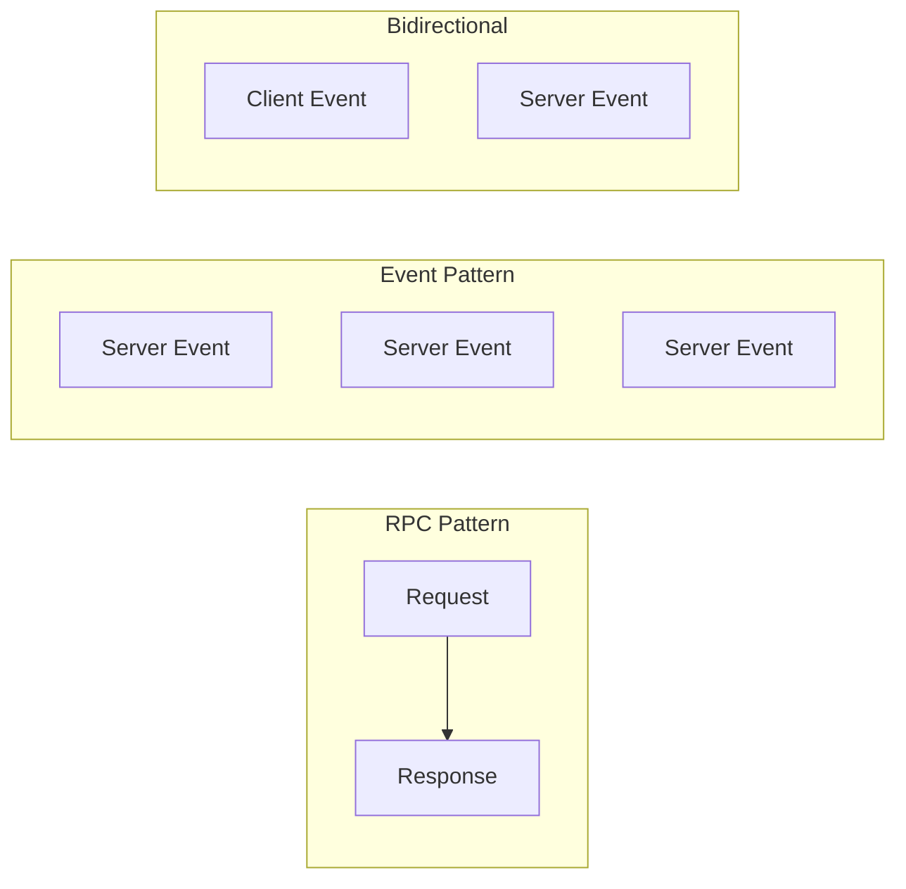
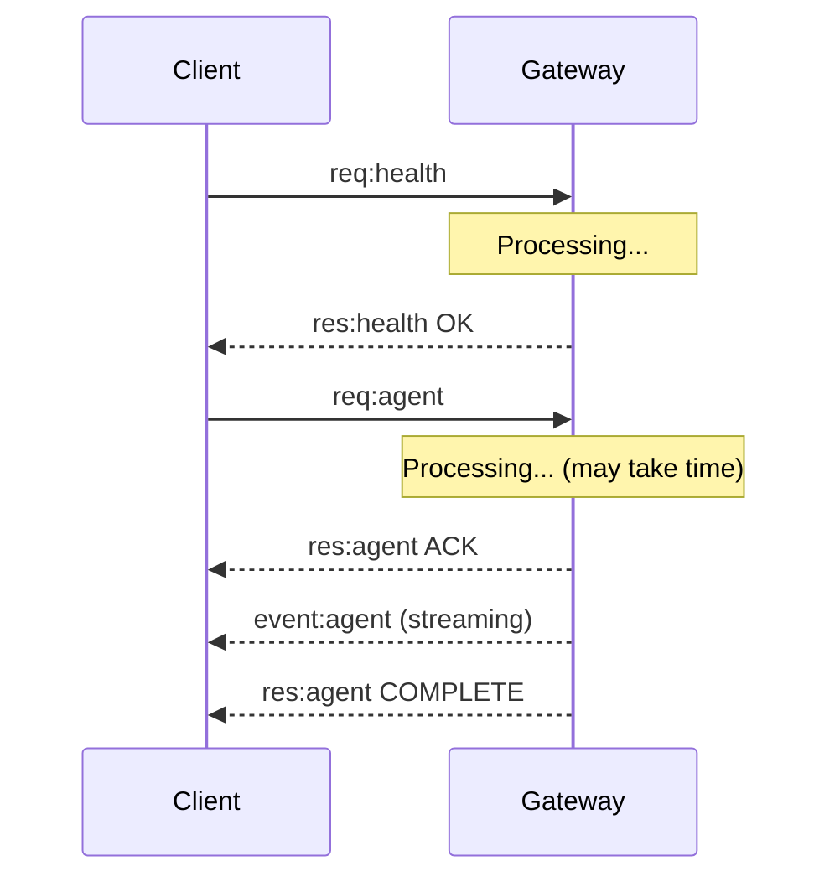
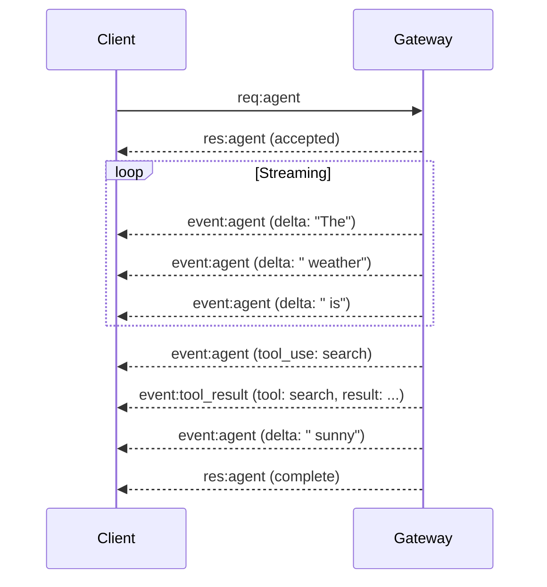

# Events and RPC

## Overview

OpenClaw uses a hybrid communication pattern combining RPC requests/responses with server-push events for real-time updates.

## Communication Patterns



## Request/Response Pattern

### Standard RPC Flow



### Request Structure

```typescript
interface RPCRequest {
  type: "req";
  id: string;             // Unique request ID
  method: string;         // Method name
  params: unknown;        // Parameters
  idemKey?: string;       // Idempotency key
  timeout?: number;       // Timeout in ms
}

// Example: Agent run request
{
  type: "req",
  id: "req-001",
  method: "agent",
  params: {
    sessionKey: "telegram:dm:123456",
    agentId: "main",
    input: "Hello, how are you?",
    modelRef: "openai:gpt-4o",
    idemKey: "msg-123"
  },
  timeout: 60000
}
```

### Response Structure

```typescript
interface RPCResponse {
  type: "res";
  id: string;             // Matches request ID
  ok: boolean;
  payload?: unknown;      // Success payload
  error?: {
    code: string;
    message: string;
    details?: unknown;
  };
}

// Success response
{
  type: "res",
  id: "req-001",
  ok: true,
  payload: {
    runId: "run-456",
    status: "accepted"
  }
}

// Error response
{
  type: "res",
  id: "req-001",
  ok: false,
  error: {
    code: "SESSION_NOT_FOUND",
    message: "Session 'xyz' does not exist",
    details: { sessionKey: "xyz" }
  }
}
```

## Streaming Responses

### Agent Streaming



### Streaming Events

```typescript
// Assistant delta event
{
  type: "event",
  event: "agent",
  payload: {
    runId: "run-456",
    type: "assistant.delta",
    delta: "The weather is"
  }
}

// Tool use event
{
  type: "event",
  event: "agent",
  payload: {
    runId: "run-456",
    type: "tool_use",
    tool: "web_search",
    input: { query: "weather today" }
  }
}

// Tool result event
{
  type: "event",
  event: "agent",
  payload: {
    runId: "run-456",
    type: "tool_result",
    tool: "web_search",
    result: { results: [...] }
  }
}

// Complete event
{
  type: "event",
  event: "agent",
  payload: {
    runId: "run-456",
    type: "complete",
    summary: "The weather is sunny today..."
  }
}
```

## Server-Push Events

### Event Categories

| Category | Events | Description |
|----------|--------|-------------|
| Agent | `agent` | Agent progress/result |
| Chat | `chat`, `chat.reaction` | Incoming messages |
| Presence | `presence` | Channel/user presence |
| Health | `tick`, `health` | System status |
| System | `shutdown`, `restart` | System events |

### Tick Event

```typescript
// Emitted every 5 seconds
{
  type: "event",
  event: "tick",
  payload: {
    timestamp: "2024-01-15T10:30:00.000Z",
    uptime: 86400,
    memory: { used: 128, total: 512 },
    sessions: {
      active: 15,
      total: 42
    },
    channels: [
      { id: "telegram", status: "connected", latency: 45 },
      { id: "discord", status: "connected", latency: 32 }
    ],
    health: "healthy"
  }
}
```

### Presence Event

```typescript
// Emitted on connection/disconnection
{
  type: "event",
  event: "presence",
  payload: {
    channels: [
      {
        id: "telegram",
        status: "connected",
        users: 5,
        details: { bot: "@mybot" }
      }
    ],
    agents: [
      {
        id: "main",
        status: "active",
        sessions: 8,
        running: 2
      }
    ]
  }
}
```

### Chat Event (Inbound)

```typescript
// When a message comes in from a channel
{
  type: "event",
  event: "chat",
  payload: {
    channel: "telegram",
    target: "123456",
    message: {
      id: "msg-789",
      from: { id: "456", name: "User" },
      content: "Hello!",
      timestamp: "2024-01-15T10:30:00.000Z"
    },
    sessionKey: "telegram:dm:456"
  }
}
```

## RPC Methods

### Core Methods Reference

```typescript
const RPC_METHODS = {
  // Connection
  connect: "Initial handshake",
  disconnect: "Graceful disconnect",

  // Agent operations
  agent: "Run agent with input",
  agent_abort: "Abort running agent",
  agent_status: "Get agent run status",

  // Messaging
  send: "Send message to channel",
  send_reply: "Reply to a message",

  // Session
  session_create: "Create session",
  session_get: "Get session info",
  session_reset: "Reset session context",

  // System
  health: "Get health status",
  status: "Get system status",
  config_get: "Get configuration",
};
```

### Agent Method

```typescript
// Request
{
  type: "req",
  id: "req-abc",
  method: "agent",
  params: {
    sessionKey: "telegram:dm:123456",
    agentId: "main",
    input: "What meetings do I have today?",
    modelRef: "anthropic:claude-opus-4",
    idemKey: "meetings-123"
  }
}

// Response (immediate acknowledgment)
{
  type: "res",
  id: "req-abc",
  ok: true,
  payload: {
    runId: "run-xyz",
    status: "accepted"
  }
}
```

### Send Method

```typescript
// Request
{
  type: "req",
  id: "req-def",
  method: "send",
  params: {
    channel: "telegram",
    target: "123456",
    message: {
      content: "Your meeting is at 2 PM",
      buttons: [
        [{ label: "Accept", data: "accept-123" }, { label: "Decline", data: "decline-123" }]
      ]
    },
    idemKey: "send-456"
  }
}

// Response
{
  type: "res",
  id: "req-def",
  ok: true,
  payload: {
    messageId: "msg-out-001",
    timestamp: "2024-01-15T10:35:00.000Z"
  }
}
```

## Client Implementation

### Request Queue

```typescript
class RequestQueue {
  private pending = new Map<string, Deferred>();
  private processing = false;
  private maxConcurrent = 5;

  async request<T>(method: string, params: unknown): Promise<T> {
    const id = generateId();
    const deferred = new Deferred<T>();
    this.pending.set(id, deferred);

    await this.send({ type: "req", id, method, params });

    return deferred.promise;
  }

  private handleResponse(frame: RPCResponse) {
    const deferred = this.pending.get(frame.id);
    if (!deferred) return;

    if (frame.ok) {
      deferred.resolve(frame.payload as T);
    } else {
      deferred.reject(new RPCError(frame.error));
    }

    this.pending.delete(frame.id);
  }
}
```

### Event Subscription

```typescript
class EventSubscriber {
  private handlers = new Map<string, Set<EventHandler>>();

  on(event: string, handler: EventHandler): void {
    if (!this.handlers.has(event)) {
      this.handlers.set(event, new Set());
    }
    this.handlers.get(event).add(handler);
  }

  off(event: string, handler: EventHandler): void {
    this.handlers.get(event)?.delete(handler);
  }

  handleEvent(frame: EventFrame) {
    const handlers = this.handlers.get(frame.event);
    handlers?.forEach(handler => {
      try {
        handler(frame.payload, frame);
      } catch (error) {
        console.error(`Handler error for ${frame.event}:`, error);
      }
    });

    // Also handle wildcard handlers
    const wildcards = this.handlers.get("*");
    wildcards?.forEach(handler => handler(frame.payload, frame));
  }
}
```

## Related

- [Protocol Overview](/architecture-book/part-4-gateway-protocol/01-protocol-overview) - Protocol design
- [WebSocket Transport](/architecture-book/part-4-gateway-protocol/02-ws-transport) - Transport layer
- [Message Flow](/architecture-book/part-4-gateway-protocol/03-message-flow) - Message processing