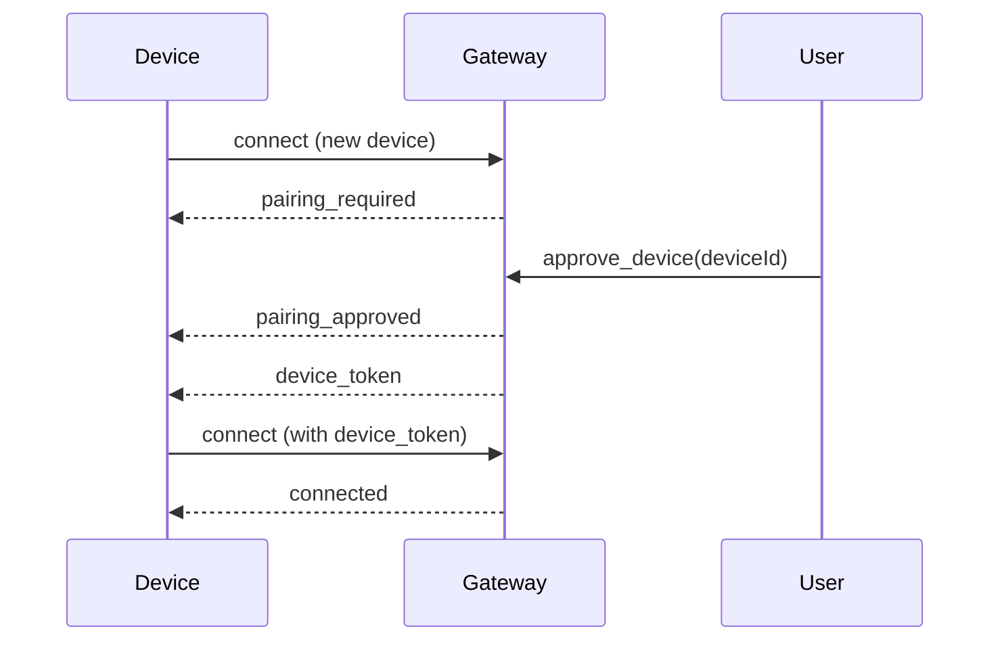
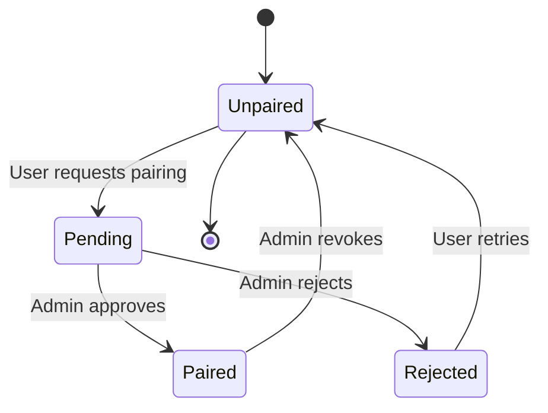
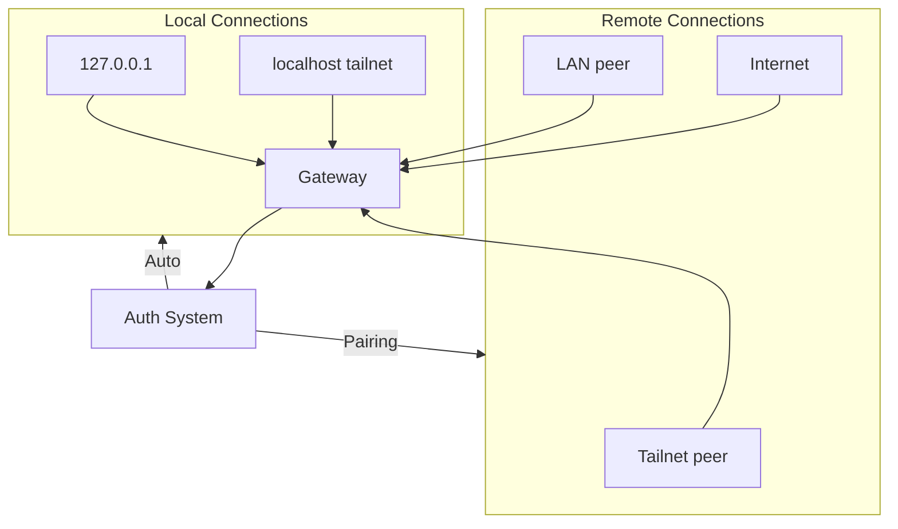

# Auth and Security

## Overview

OpenClaw implements multiple authentication modes and security measures to protect gateway access and device pairing.

## Authentication Modes

### Mode Comparison

| Mode | Use Case | Credentials | Trust Source |
|------|----------|-------------|--------------|
| `token` | Default | Shared secret token | Connect params |
| `password` | Simple auth | Password | Connect params |
| `tailscale` | Remote access | None | Tailscale identity |
| `trusted-proxy` | Behind proxy | None | Proxy headers |
| `none` | Local only | None | Loopback only |

### Token Authentication

```typescript
// Configuration
const config = {
  gateway: {
    auth: {
      mode: "token",
      token: process.env.OPENCLAW_GATEWAY_TOKEN,
    }
  }
};

// Client connect
{
  type: "connect",
  params: {
    auth: {
      token: "sk-openclaw-xxxxx"
    },
    // ...
  }
}
```

### Password Authentication

```typescript
const config = {
  gateway: {
    auth: {
      mode: "password",
      password: "secure-password",
    }
  }
};
```

## Device Pairing

### Pairing Flow



### Device Metadata

```typescript
interface DeviceMetadata {
  id: string;            // Unique device ID
  name: string;          // User-friendly name
  platform: string;      // macos, ios, android, etc.
  family?: string;       // iPhone, MacBook, etc.
  createdAt: string;
  lastSeen?: string;
  status: "pending" | "paired" | "rejected";
  pairingApprovedBy?: string;
}

interface DeviceToken {
  deviceId: string;
  token: string;
  expiresAt: string;
}
```

### Pairing States



## Tailscale Integration

### Tailscale Auth Mode

```typescript
const config = {
  gateway: {
    auth: {
      mode: "tailscale",
      allowTailscale: true,
    }
  }
};
```

### Tailscale Identity

When `allowTailscale: true`, the gateway trusts Tailscale identity from request headers:

```typescript
// No auth params needed - use Tailscale identity
{
  type: "connect",
  params: {
    device: {
      id: "device-uuid",
      name: "my-device",
      platform: "macos"
    },
    // No auth field
  }
}

// Gateway uses:
// - Tailscale identity (user@tailnet)
// - Device name from Tailscale
// - No additional auth required
```

### Tailscale-Specific Rules

| Aspect | Behavior |
|--------|----------|
| Loopback | Auto-approved |
| Tailnet | Requires pairing approval |
| LAN | Requires explicit pairing |
| Remote | Tailscale identity trusted |

## Signature Verification

### Challenge-Response

```typescript
interface ChallengeRequest {
  type: "challenge";
  challenge: string;     // Random nonce
  timestamp: number;     // Request timestamp
}

// Client must sign the challenge
interface SignedConnect {
  type: "connect";
  challenge: string;
  signature: string;      // HMAC of challenge
  signatureVersion: "v3";
}

function signChallenge(challenge: string, secret: string): string {
  return crypto
    .createHmac("sha256", secret)
    .update(challenge)
    .update(VERSION)      // "v3" binds platform + deviceFamily
    .digest("hex");
}
```

### Signature Version v3

The v3 signature binds additional metadata:

```typescript
function createSignatureV3(params: {
  challenge: string;
  secret: string;
  platform: string;
  deviceFamily: string;
}): string {
  const payload = [
    params.challenge,
    params.platform,
    params.deviceFamily,
  ].join(":");

  return crypto
    .createHmac("sha256", params.secret)
    .update(payload)
    .digest("hex");
}
```

## Trust Boundaries

### Connection Origins



### Trust Levels

| Origin | Trust Level | Auth Required |
|--------|-------------|---------------|
| Loopback (127.0.0.1) | High | Minimal |
| Tailscale (same tailnet) | High | Device pairing |
| LAN (same network) | Medium | Device pairing + auth |
| Internet | Low | Full auth + pairing |

## Security Hardening

### Recommended Configuration

```typescript
const hardenedConfig = {
  gateway: {
    auth: {
      mode: "token",
      token: process.env.SECURE_TOKEN,  // Use strong token
      allowTailscale: true,            // Remote access via Tailscale
      allowLocalAutoApprove: false,    // Require pairing even locally
    },

    // Rate limiting
    rateLimit: {
      windowMs: 60000,    // 1 minute window
      maxRequests: 100,   // Max requests per window
    },

    // TLS (for non-local access)
    tls: {
      enabled: true,
      certPath: "/path/to/cert.pem",
      keyPath: "/path/to/key.pem",
    },
  }
};
```

### Token Generation

```bash
# Generate secure token
openssl rand -hex 32

# Or use Python
python3 -c "import secrets; print(secrets.token_urlsafe(32))"
```

## Rate Limiting

### Rate Limit Configuration

```typescript
interface RateLimitConfig {
  windowMs: number;        // Time window in ms
  maxRequests: number;     // Max requests per window
  maxTokens: number;       // Max tokens per window (for token auth)
  blockDuration: number;   // Block duration after limit
}

const rateLimit: RateLimitConfig = {
  windowMs: 60000,         // 1 minute
  maxRequests: 100,
  maxTokens: 10000,
  blockDuration: 60000,    // Block 1 minute on breach
};
```

### Rate Limit Response

```typescript
// When rate limited
{
  type: "res",
  id: "req-123",
  ok: false,
  error: {
    code: "RATE_LIMITED",
    message: "Too many requests",
    details: {
      limit: 100,
      window: "1m",
      retryAfter: 45000
    }
  }
}
```

## Error Codes

### Auth Errors

| Code | Description | Action |
|------|-------------|--------|
| `AUTH_FAILED` | Invalid credentials | Check credentials |
| `AUTH_EXPIRED` | Token/secret expired | Regenerate |
| `AUTH_REQUIRED` | Auth not provided | Include auth |
| `DEVICE_NOT_PAIRED` | Device not approved | Request pairing |
| `DEVICE_REJECTED` | Pairing rejected | Contact admin |
| `SIGNATURE_INVALID` | Challenge signature bad | Retry signing |

### Error Response Format

```typescript
{
  type: "res",
  id: "req-123",
  ok: false,
  error: {
    code: "AUTH_FAILED",
    message: "Invalid authentication token",
    details: {
      reason: "Token does not match",
      hint: "Ensure OPENCLAW_GATEWAY_TOKEN is correct"
    }
  }
}
```

## Best Practices

### Security Checklist

- [ ] Use strong, randomly generated tokens
- [ ] Enable TLS for remote connections
- [ ] Prefer Tailscale over exposing to internet
- [ ] Require device pairing for new devices
- [ ] Enable rate limiting
- [ ] Monitor authentication failures
- [ ] Rotate tokens periodically
- [ ] Use environment variables for secrets

## Related

- [Protocol Overview](/architecture-book/part-4-gateway-protocol/01-protocol-overview) - Protocol design
- [WebSocket Transport](/architecture-book/part-4-gateway-protocol/02-ws-transport) - Transport layer
- [Gateway Core](/architecture-book/part-2-core-modules/01-gateway) - Gateway implementation