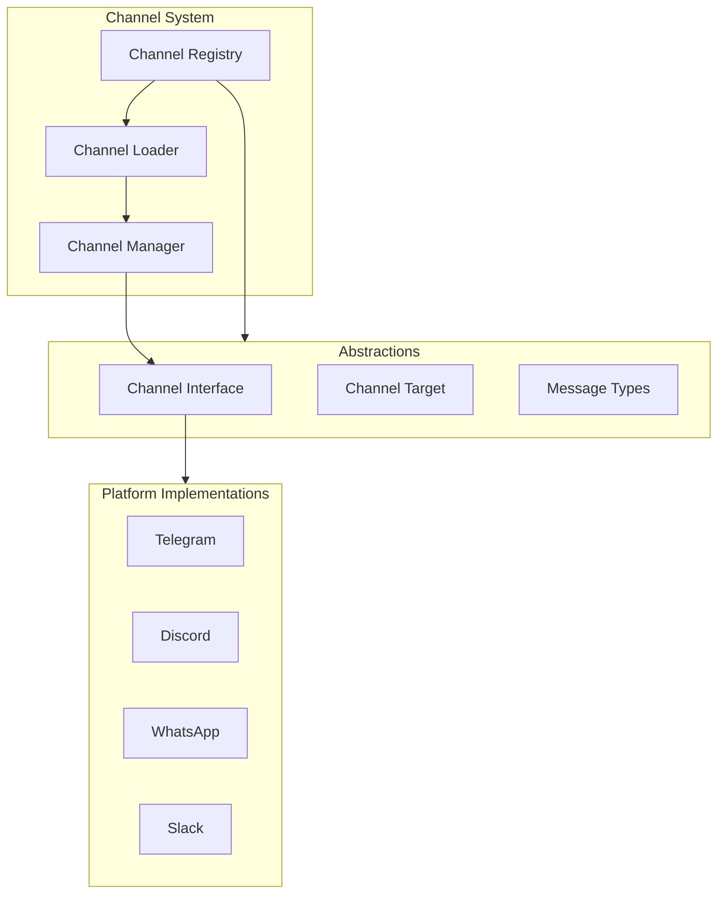
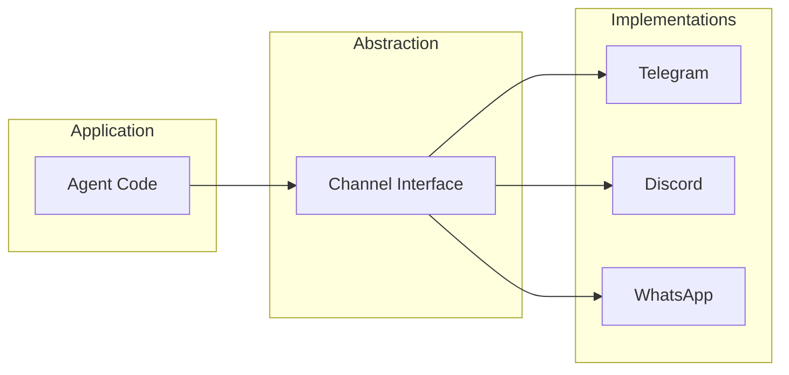
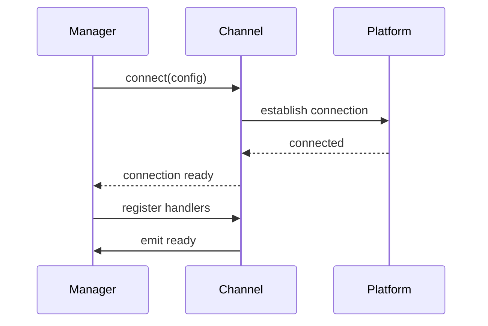
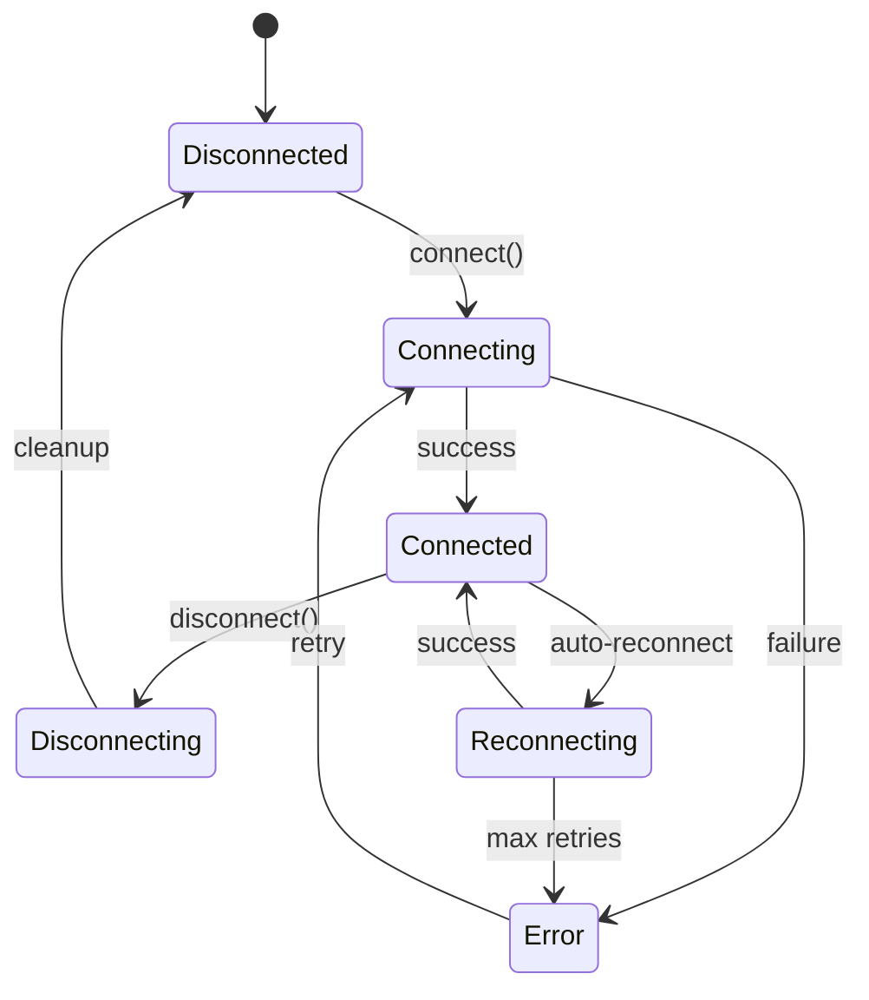

# Channel Architecture

## Overview

OpenClaw uses a channel abstraction layer to unify messaging platforms behind a consistent interface.



## Channel Abstraction Purpose

### Why Abstraction?

| Benefit | Description |
|---------|-------------|
| Unification | Single API for all platforms |
| Extensibility | Add platforms via plugins |
| Consistency | Same behavior across channels |
| Testability | Mock channels in tests |

### Abstraction Layers



## Channel Registry

### Registry Interface

```typescript
interface ChannelRegistry {
  // Registration
  register(channel: ChannelPlugin): void;
  unregister(id: string): void;

  // Lookup
  get(id: string): ChannelPlugin | undefined;
  getByPlatform(platform: string): ChannelPlugin | undefined;
  list(): ChannelPlugin[];
  listEnabled(): ChannelPlugin[];

  // Status
  isConnected(id: string): boolean;
  getStatus(id: string): ChannelStatus;
}

interface ChannelStatus {
  id: string;
  connected: boolean;
  users: number;
  lastMessage?: Date;
  error?: string;
}
```

### Registry Operations

```typescript
// Register a channel plugin
registry.register({
  id: "telegram",
  name: "Telegram",
  platform: "telegram",
  entry: "./dist/index.js",
});

// Get channel
const telegram = registry.get("telegram");

// List all channels
const channels = registry.list();

// Check status
if (registry.isConnected("telegram")) {
  console.log("Telegram is connected");
}
```

## Channel Manager

### Manager Responsibilities

```typescript
class ChannelManager {
  private channels = new Map<string, ChannelInstance>();
  private registry: ChannelRegistry;

  // Lifecycle
  async connect(channelId: string, config: ChannelConfig): Promise<void>;
  async disconnect(channelId: string): Promise<void>;
  async reconnect(channelId: string): Promise<void>;

  // Messaging
  async send(channelId: string, target: Target, message: OutboundMessage): Promise<void>;

  // Health
  async healthCheck(channelId: string): Promise<ChannelHealth>;
  async reconnectAll(): Promise<void>;
}
```

### Connection Management



## Capability System

### Capability Interface

```typescript
interface ChannelCapabilities {
  // Text
  supportsText: boolean;
  supportsMarkdown: boolean;
  supportsHtml: boolean;

  // Media
  supportsImages: boolean;
  supportsVideos: boolean;
  supportsAudio: boolean;
  supportsFiles: boolean;

  // Interactive
  supportsButtons: boolean;
  supportsInlineButtons: boolean;
  supportsReactions: boolean;
  supportsThreads: boolean;

  // Advanced
  supportsReplies: boolean;
  supportsForwarding: boolean;
  supportsEphemeral: boolean;
}
```

### Capability Examples

| Channel | Images | Buttons | Threads | Reactions |
|---------|--------|---------|---------|-----------|
| Telegram | Yes | Yes (inline) | Yes | Yes |
| Discord | Yes | Yes (components) | Yes | Yes |
| WhatsApp | Yes | No | No | Yes |
| Slack | Yes | Yes (blocks) | Yes | Yes |
| Matrix | Yes | No | Yes | Yes |

### Capability Checking

```typescript
async function sendWithFallback(
  channel: Channel,
  target: Target,
  message: OutboundMessage
): Promise<void> {
  // Check if channel supports buttons
  if (message.buttons && !channel.capabilities.supportsInlineButtons) {
    // Fallback: convert to text
    message.content = formatButtonsAsText(message.buttons);
    message.buttons = undefined;
  }

  // Check if content needs truncation
  if (message.content.length > channel.capabilities.maxMessageLength) {
    message.content = truncate(message.content, channel.capabilities.maxMessageLength);
  }

  await channel.send(target, message);
}
```

## Channel Configuration

### Config Schema

```typescript
interface ChannelConfig {
  enabled: boolean;
  polling?: PollingConfig;
  webhook?: WebhookConfig;
  commands?: CommandConfig[];
  filters?: FilterConfig[];
  rateLimit?: RateLimitConfig;
}

interface PollingConfig {
  enabled: boolean;
  interval?: number;
  timeout?: number;
}

interface WebhookConfig {
  enabled: boolean;
  path: string;
  secret?: string;
}
```

### Channel-Specific Config

```typescript
const telegramConfig: ChannelConfig = {
  enabled: true,
  polling: {
    enabled: true,
    interval: 1000,
  },
  commands: [
    { command: "start", description: "Start the bot" },
    { command: "help", description: "Get help" },
  ],
  filters: {
    allowlist: ["123456789"],  // Allowed user IDs
  },
};

const discordConfig: ChannelConfig = {
  enabled: true,
  webhook: {
    enabled: true,
    path: "/webhook/discord",
  },
  commands: [
    { command: "!", prefix: true },
  ],
};
```

## Channel Lifecycle

### Lifecycle States



### Error Recovery

```typescript
class ChannelConnection {
  private reconnectAttempts = 0;
  private readonly maxRetries = 5;

  async connect(): Promise<void> {
    try {
      await this.platform.connect();
      this.reconnectAttempts = 0;
      this.emit("connected");
    } catch (error) {
      this.handleConnectionError(error);
    }
  }

  private async handleConnectionError(error: Error): Promise<void> {
    this.emit("error", error);

    if (this.reconnectAttempts < this.maxRetries) {
      this.reconnectAttempts++;
      const delay = Math.min(1000 * Math.pow(2, this.reconnectAttempts), 30000);
      await sleep(delay);
      await this.connect();
    } else {
      this.emit("failed", error);
    }
  }
}
```

## Related

- [Channel Abstract](/architecture-book/part-5-channels/02-channel-abstract) - Interface definitions
- [Inbound Events](/architecture-book/part-5-channels/03-inbound-events) - Event handling
- [Message Processing](/architecture-book/part-5-channels/04-message-processing) - Processing pipeline