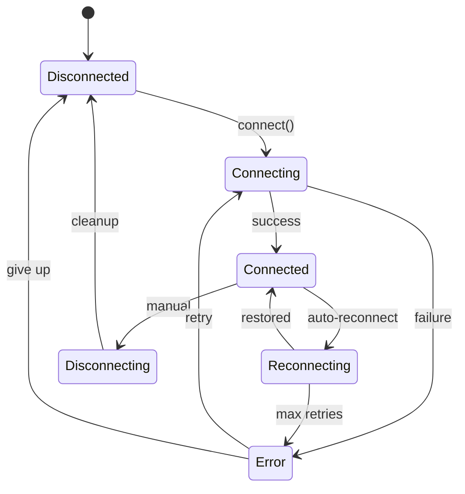

# Channel Abstract

## Overview

The channel abstract layer defines the interface contract that all channel implementations must follow.

## Channel Interface

### Core Interface

```typescript
interface Channel {
  readonly id: string;
  readonly name: string;
  readonly platform: string;
  readonly capabilities: ChannelCapabilities;

  // Lifecycle
  connect(config: ChannelConfig): Promise<void>;
  disconnect(): Promise<void>;
  isConnected(): boolean;

  // Messaging
  send(target: ChannelTarget, message: OutboundMessage): Promise<void>;
  editMessage(target: ChannelTarget, messageId: string, content: string): Promise<void>;
  deleteMessage(target: ChannelTarget, messageId: string): Promise<void>;

  // Media
  uploadMedia(data: Buffer, type: MediaType): Promise<MediaId>;
  resolveMediaUrl(mediaId: MediaId): Promise<string>;

  // Events
  onMessage(handler: MessageHandler): void;
  onEdit(handler: EditHandler): void;
  onDelete(handler: DeleteHandler): void;
  onReaction(handler: ReactionHandler): void;
  onCommand(handler: CommandHandler): void;
}
```

### Channel Target

```typescript
interface ChannelTarget {
  channel: string;     // Channel ID (e.g., "telegram")
  peer: string;       // Peer ID (e.g., "123456789")
  peerType: PeerType; // "user", "group", "channel"
}

type PeerType = "user" | "group" | "channel" | "bot";
```

### Outbound Message

```typescript
interface OutboundMessage {
  content?: string;
  media?: MediaAttachment;
  buttons?: InlineButton[][];
  format?: "markdown" | "html" | "plain";
  replyTo?: string;
  replyInThread?: string;
  ephemeral?: boolean;
}

interface InlineButton {
  label: string;
  data?: string;        // Callback data
  url?: string;         // URL button
  style?: "primary" | "secondary";
}
```

## Message Handler

### Handler Interface

```typescript
type MessageHandler = (
  message: InboundMessage
) => void | Promise<void>;

interface InboundMessage {
  id: string;
  channel: string;
  peer: string;
  peerType: PeerType;
  sender: Sender;
  content: string;
  media?: MediaAttachment;
  timestamp: Date;
  replyTo?: string;
  threadId?: string;
  metadata: MessageMetadata;
}

interface Sender {
  id: string;
  name: string;
  username?: string;
  mention?: string;
  isBot: boolean;
}
```

### Handler Example

```typescript
// Register message handler
channel.onMessage(async (message) => {
  console.log(`Received from ${message.sender.name}: ${message.content}`);

  // Process message
  const response = await agent.process(message.content);

  // Send response
  await channel.send(
    { channel: message.channel, peer: message.peer, peerType: message.peerType },
    { content: response }
  );
});
```

## Account Management

### Account Interface

```typescript
interface ChannelAccount {
  id: string;
  channel: string;
  username?: string;
  displayName?: string;
  isBot: boolean;
  permissions?: string[];
}

interface AccountManager {
  // Account info
  getAccount(channelId: string): Promise<ChannelAccount | null>;

  // Bot info
  getBotInfo(channelId: string): Promise<BotInfo | null>;

  // Peer info
  getPeerInfo(channelId: string, peer: string): Promise<PeerInfo | null>;

  // Permissions
  hasPermission(channelId: string, peer: string, permission: string): Promise<boolean>;
}
```

### Peer Information

```typescript
interface PeerInfo {
  id: string;
  type: PeerType;
  name: string;
  username?: string;

  // Group-specific
  memberCount?: number;
  isAdmin?: boolean;
  permissions?: string[];

  // Channel-specific
  subscriberCount?: number;
  isMember?: boolean;
}
```

## Connection States

### State Machine



### State Handling

```typescript
interface ChannelState {
  status: ConnectionStatus;
  connectedAt?: Date;
  lastMessageAt?: Date;
  error?: ConnectionError;
  retryCount: number;
}

type ConnectionStatus =
  | "disconnected"
  | "connecting"
  | "connected"
  | "reconnecting"
  | "error";

interface ConnectionError {
  code: string;
  message: string;
  retryable: boolean;
  retryAfter?: number;
}
```

### State Listeners

```typescript
channel.on("connecting", () => {
  console.log("Connecting to channel...");
});

channel.on("connected", () => {
  console.log("Connected to channel");
});

channel.on("disconnected", (reason) => {
  console.log("Disconnected:", reason);
});

channel.on("error", (error) => {
  console.error("Channel error:", error);
  if (error.retryable) {
    console.log(`Will retry in ${error.retryAfter}ms`);
  }
});
```

## Message Types

### Media Attachment

```typescript
interface MediaAttachment {
  id: string;
  type: MediaType;
  url?: string;
  mimeType: string;
  size?: number;

  // Image
  width?: number;
  height?: number;

  // Audio/Video
  duration?: number;

  // File
  filename?: string;

  // Thumbnails
  thumbnailUrl?: string;
  thumbnailWidth?: number;
  thumbnailHeight?: number;
}

type MediaType = "image" | "video" | "audio" | "document" | "sticker";
```

### Message Metadata

```typescript
interface MessageMetadata {
  // Source
  channelId: string;
  originalId?: string;      // Original message ID (for edits/reactions)

  // Threading
  threadId?: string;
  isThreadRoot?: boolean;

  // Reactions
  reactions?: Reaction[];

  // Edits
  editedAt?: Date;
  editedBy?: string;

  // Forwarding
  forwardedFrom?: {
    channel: string;
    messageId: string;
  };

  // Commands
  command?: string;
  commandArgs?: string[];

  // Callbacks
  callbackId?: string;
  callbackData?: string;
}
```

## Channel Events

### Event Types

```typescript
interface ChannelEvents {
  onMessage(handler: MessageHandler): void;
  onEdit(handler: EditHandler): void;
  onDelete(handler: DeleteHandler): void;
  onReaction(handler: ReactionHandler): void;
  onCommand(handler: CommandHandler): void;
  onCallback(handler: CallbackHandler): void;

  // Connection events
  onConnect(handler: () => void): void;
  onDisconnect(handler: (reason: string) => void): void;
  onError(handler: (error: Error) => void): void;
}

type EditHandler = (edit: MessageEdit) => void;
type DeleteHandler = (delete: MessageDelete) => void;
type ReactionHandler = (reaction: Reaction) => void;
type CommandHandler = (command: Command) => void;
type CallbackHandler = (callback: Callback) => void;
```

### Event Payloads

```typescript
interface MessageEdit {
  messageId: string;
  newContent: string;
  editedAt: Date;
  editor: Sender;
}

interface MessageDelete {
  messageId: string;
  deletedAt: Date;
  deletedBy?: Sender;
}

interface Reaction {
  messageId: string;
  userId: string;
  emoji: string;
  added: boolean;
}

interface Command {
  name: string;
  args: string[];
  message: InboundMessage;
}

interface Callback {
  id: string;
  data: string;
  messageId: string;
  user: Sender;
}
```

## Related

- [Channel Architecture](/architecture-book/part-5-channels/01-channel-architecture) - Channel design
- [Inbound Events](/architecture-book/part-5-channels/03-inbound-events) - Event handling
- [Message Processing](/architecture-book/part-5-channels/04-message-processing) - Processing pipeline