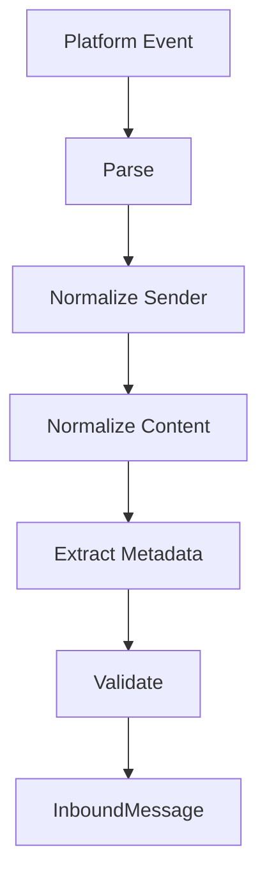

# Inbound Events

## Overview

Inbound events from messaging platforms are normalized into a standard format before being processed by the gateway.

## Event Normalization Pipeline



## Event Types

### Supported Event Types

| Event | Description | Handler |
|-------|-------------|---------|
| message | New message | `onMessage` |
| edited_message | Message edited | `onEdit` |
| deleted_message | Message deleted | `onDelete` |
| callback_query | Button click | `onCallback` |
| reaction | Reaction added/removed | `onReaction` |
| command | Bot command | `onCommand` |

## Sender Normalization

### Sender Resolution

```typescript
interface SenderResolver {
  resolve(rawSender: unknown, platform: string): Sender;
}

// Telegram sender
function resolveTelegramSender(raw: TelegramUser): Sender {
  return {
    id: raw.id.toString(),
    name: raw.first_name + (raw.last_name ? ` ${raw.last_name}` : ""),
    username: raw.username,
    isBot: raw.is_bot,
  };
}

// Discord sender
function resolveDiscordSender(raw: DiscordUser): Sender {
  return {
    id: raw.id,
    name: raw.global_name || raw.username,
    username: raw.username,
    isBot: raw.bot,
  };
}
```

### Anonymous vs Identified

```typescript
interface Sender {
  id: string;
  name: string;
  username?: string;
  mention?: string;
  isBot: boolean;
}

// Anonymous sender (group without user identity)
const anonymousSender: Sender = {
  id: "anonymous",
  name: "Anonymous",
  isBot: false,
};
```

## Conversation Binding

### Conversation Resolution

```typescript
interface ConversationBinding {
  channel: string;
  peer: string;
  peerType: PeerType;
  thread?: string;
}

function resolveConversation(
  event: PlatformEvent,
  platform: string
): ConversationBinding {
  switch (platform) {
    case "telegram":
      return resolveTelegramConversation(event);
    case "discord":
      return resolveDiscordConversation(event);
    default:
      throw new Error(`Unknown platform: ${platform}`);
  }
}

function resolveTelegramConversation(event: TelegramEvent): ConversationBinding {
  const chat = event.chat;

  if (chat.type === "private") {
    return {
      channel: "telegram",
      peer: chat.id.toString(),
      peerType: "user",
    };
  }

  if (chat.type === "group" || chat.type === "supergroup") {
    return {
      channel: "telegram",
      peer: chat.id.toString(),
      peerType: "group",
      thread: event.message_thread_id?.toString(),
    };
  }

  return {
    channel: "telegram",
    peer: chat.id.toString(),
    peerType: "channel",
  };
}
```

### Thread Resolution

```typescript
interface ThreadInfo {
  id: string;
  parentId?: string;
  title?: string;
  messageCount: number;
}

function resolveThread(event: PlatformEvent): string | undefined {
  // Telegram threads
  if (event.message_thread_id) {
    return event.message_thread_id.toString();
  }

  // Discord threads
  if (event.thread) {
    return event.thread.id;
  }

  // Slack threads
  if (event.thread_ts) {
    return event.thread_ts;
  }

  return undefined;
}
```

## Content Normalization

### Text Normalization

```typescript
function normalizeText(content: string, platform: string): string {
  let text = content.trim();

  // Remove platform-specific formatting tags
  text = removeFormatting(text, platform);

  // Normalize whitespace
  text = text.replace(/\s+/g, " ");

  // Handle mentions
  text = normalizeMentions(text, platform);

  // Handle commands
  text = normalizeCommands(text);

  return text;
}

function removeFormatting(text: string, platform: string): string {
  switch (platform) {
    case "telegram":
      return text
        .replace(/<b>(.*?)<\/b>/g, "*$1*")
        .replace(/<i>(.*?)<\/i>/g, "_$1_");
    case "discord":
      return text
        .replace(/\*\*(.*?)\*\*/g, "**$1**")
        .replace(/__(.*?)__/g, "__$1__");
    default:
      return text;
  }
}
```

### Mention Normalization

```typescript
function normalizeMentions(text: string, platform: string): string {
  switch (platform) {
    case "telegram":
      // @username -> @username
      // tg://user?id=123 -> @123
      return text.replace(/tg:\/\/user\?id=(\d+)/g, "@$1");

    case "discord":
      // <@123> -> @username
      // <#456> -> #channel
      return text
        .replace(/<@(\d+)>/g, "@user:$1")
        .replace(/<#(\d+)>/g, "#channel:$1")
        .replace(/<@&(\d+)>/g, "@role:$1");

    case "slack":
      // <@U123> -> @username
      // <#C456> -> #channel
      return text
        .replace(/<@U([A-Z0-9]+)\|([^>]+)>/g, "@$2")
        .replace(/<#C([A-Z0-9]+)\|([^>]+)>/g, "#$2");

    default:
      return text;
  }
}
```

## Command Extraction

### Command Detection

```typescript
interface Command {
  name: string;
  args: string[];
  raw: string;
}

function extractCommand(
  content: string,
  platform: string,
  botUsername?: string
): Command | null {
  // Check for command prefix
  const prefixes = getCommandPrefixes(platform);
  const prefix = prefixes.find(p => content.startsWith(p));

  if (!prefix) return null;

  const remainder = content.slice(prefix.length);
  const parts = remainder.split(/\s+/);
  let name = parts[0].toLowerCase();

  // Handle @botname suffix (Telegram)
  if (platform === "telegram" && botUsername) {
    const [, suffix] = name.split("@");
    if (suffix && suffix !== botUsername.toLowerCase()) {
      return null; // Command for different bot
    }
    name = name.split("@")[0];
  }

  return {
    name,
    args: parts.slice(1),
    raw: remainder,
  };
}

function getCommandPrefixes(platform: string): string[] {
  switch (platform) {
    case "telegram":
      return ["/"];
    case "discord":
      return ["!", "/"];
    case "slack":
      return ["/"];
    case "whatsapp":
      return ["/"];
    default:
      return ["/"];
  }
}
```

## Media Handling

### Media Extraction

```typescript
function extractMedia(event: PlatformEvent): MediaAttachment | undefined {
  if (event.photo) {
    const largest = event.photo[event.photo.length - 1];
    return {
      id: largest.file_id,
      type: "image",
      mimeType: "image/jpeg",
      width: largest.width,
      height: largest.height,
      size: largest.file_size,
    };
  }

  if (event.document) {
    return {
      id: event.document.file_id,
      type: event.document.mime_type?.startsWith("image/") ? "image" :
            event.document.mime_type?.startsWith("video/") ? "video" :
            event.document.mime_type?.startsWith("audio/") ? "audio" : "document",
      mimeType: event.document.mime_type || "application/octet-stream",
      filename: event.document.file_name,
      size: event.document.file_size,
    };
  }

  if (event.voice) {
    return {
      id: event.voice.file_id,
      type: "audio",
      mimeType: "audio/ogg",
      duration: event.voice.duration,
    };
  }

  return undefined;
}
```

## Metadata Extraction

### Platform-Specific Metadata

```typescript
interface MetadataExtractor {
  (event: PlatformEvent): MessageMetadata;
}

const telegramMetadataExtractor: MetadataExtractor = (event) => ({
  channelId: "telegram",
  originalId: event.message_id?.toString(),
  threadId: event.message_thread_id?.toString(),
  forwardedFrom: event.forward_from ? {
    channel: "telegram",
    messageId: event.forward_from_message_id?.toString(),
  } : undefined,
  command: extractCommand(event.text || event.caption || "", "telegram")?.name,
  commandArgs: extractCommand(event.text || event.caption || "", "telegram")?.args,
});

const discordMetadataExtractor: MetadataExtractor = (event) => ({
  channelId: "discord",
  originalId: event.id,
  threadId: event.thread?.id,
  guildId: event.guild_id,
  command: extractCommand(event.content, "discord")?.name,
});
```

## Validation

### Message Validation

```typescript
interface ValidationResult {
  valid: boolean;
  errors: ValidationError[];
}

function validateInboundMessage(message: InboundMessage): ValidationResult {
  const errors: ValidationError[] = [];

  // Check required fields
  if (!message.id) {
    errors.push({ field: "id", message: "Message ID is required" });
  }

  if (!message.channel) {
    errors.push({ field: "channel", message: "Channel is required" });
  }

  if (!message.peer) {
    errors.push({ field: "peer", message: "Peer is required" });
  }

  // Check content or media
  if (!message.content && !message.media) {
    errors.push({ field: "content", message: "Message must have content or media" });
  }

  // Validate sender
  if (!message.sender?.id) {
    errors.push({ field: "sender.id", message: "Sender ID is required" });
  }

  return {
    valid: errors.length === 0,
    errors,
  };
}
```

## Related

- [Channel Architecture](/architecture-book/part-5-channels/01-channel-architecture) - Channel design
- [Channel Abstract](/architecture-book/part-5-channels/02-channel-abstract) - Interface definitions
- [Message Processing](/architecture-book/part-5-channels/04-message-processing) - Processing pipeline