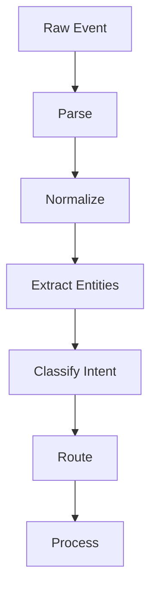

# Message Processing

## Overview

Message processing transforms raw inbound messages into structured data ready for agent consumption.

## Processing Pipeline



## Message Parsing

### Multi-Format Parsing

```typescript
interface MessageParser {
  parse(raw: unknown, format: string): ParsedMessage;
}

class MessageParserImpl implements MessageParser {
  parse(raw: unknown, format: string): ParsedMessage {
    switch (format) {
      case "json":
        return JSON.parse(raw as string);
      case "form-data":
        return this.parseFormData(raw);
      case "multipart":
        return this.parseMultipart(raw);
      default:
        throw new Error(`Unknown format: ${format}`);
    }
  }
}
```

### Text Parsing

```typescript
interface TextParser {
  parse(text: string): ParsedText;
}

interface ParsedText {
  content: string;
  entities: Entity[];
  mentions: Mention[];
  hashtags: string[];
  urls: string[];
  commands: Command[];
}

function parseText(text: string): ParsedText {
  return {
    content: text,
    entities: extractEntities(text),
    mentions: extractMentions(text),
    hashtags: extractHashtags(text),
    urls: extractUrls(text),
    commands: extractCommands(text),
  };
}
```

## Entity Extraction

### Entity Types

```typescript
interface Entity {
  type: EntityType;
  offset: number;
  length: number;
  value: string;
}

type EntityType =
  | "mention"
  | "hashtag"
  | "url"
  | "email"
  | "phone"
  | "code"
  | "pre"
  | "bold"
  | "italic"
  | "underline"
  | "strikethrough";
```

### Entity Extractors

```typescript
const ENTITY_PATTERNS: Record<EntityType, RegExp> = {
  mention: /@[a-zA-Z0-9_]+/g,
  hashtag: /#[a-zA-Z0-9_]+/g,
  url: /https?:\/\/[^\s]+/g,
  email: /[a-zA-Z0-9._%+-]+@[a-zA-Z0-9.-]+\.[a-zA-Z]{2,}/g,
  phone: /\+?[1-9]\d{1,14}/g,
  code: /`[^`]+`/g,
  pre: /```[\s\S]*?```/g,
  bold: /\*\*(.+?)\*\*/g,
  italic: /\*(.+?)\*/g,
};

function extractEntities(text: string): Entity[] {
  const entities: Entity[] = [];

  for (const [type, pattern] of Object.entries(ENTITY_PATTERNS)) {
    let match;
    const regex = new RegExp(pattern.source, "g");

    while ((match = regex.exec(text)) !== null) {
      entities.push({
        type: type as EntityType,
        offset: match.index,
        length: match[0].length,
        value: match[0],
      });
    }
  }

  return entities;
}
```

## Command Extraction

### Command Parser

```typescript
interface CommandParser {
  parse(text: string, config: CommandConfig): ParsedCommand | null;
}

interface ParsedCommand {
  name: string;
  args: string[];
  rawArgs: string;
  mentionsBot: boolean;
  quotedArgs: string[];
}

class CommandParserImpl implements CommandParser {
  parse(text: string, config: CommandConfig): ParsedCommand | null {
    const prefix = config.prefixes[0] || "/";
    if (!text.startsWith(prefix)) return null;

    const parts = this.tokenize(text.slice(prefix.length));
    const name = parts[0].toLowerCase().split("@")[0];

    return {
      name,
      args: parts.slice(1),
      rawArgs: parts.slice(1).join(" "),
      mentionsBot: parts[0].includes("@"),
      quotedArgs: this.extractQuoted(parts.slice(1).join(" ")),
    };
  }

  private tokenize(text: string): string[] {
    const tokens: string[] = [];
    let current = "";
    let inQuote = false;
    let quoteChar = "";

    for (const char of text) {
      if ((char === '"' || char === "'") && !inQuote) {
        inQuote = true;
        quoteChar = char;
      } else if (char === quoteChar && inQuote) {
        inQuote = false;
        quoteChar = "";
      } else if (char === " " && !inQuote) {
        if (current) {
          tokens.push(current);
          current = "";
        }
      } else {
        current += char;
      }
    }

    if (current) tokens.push(current);
    return tokens;
  }

  private extractQuoted(text: string): string[] {
    const matches = text.match(/(["'])(?:(?!\1)[^\\]|\\.)*\1/g) || [];
    return matches.map(m => m.slice(1, -1));
  }
}
```

### Command Routing

```typescript
const commandRegistry = new Map<string, CommandHandler>();

function registerCommand(name: string, handler: CommandHandler): void {
  commandRegistry.set(name.toLowerCase(), handler);
}

async function routeCommand(command: ParsedCommand): Promise<void> {
  const handler = commandRegistry.get(command.name);

  if (!handler) {
    throw new CommandNotFoundError(command.name);
  }

  await handler(command);
}

// Example
registerCommand("help", async (cmd) => {
  const helpText = `
Available commands:
/help - Show this help
/start - Start the bot
/status - Check status
  `.trim();

  await sendMessage(cmd.context, helpText);
});
```

## Media Processing

### Media Parser

```typescript
interface MediaProcessor {
  processMedia(media: MediaAttachment): Promise<ProcessedMedia>;
}

interface ProcessedMedia {
  type: MediaType;
  url: string;
  thumbnail?: string;
  metadata: MediaMetadata;
}

interface MediaMetadata {
  width?: number;
  height?: number;
  duration?: number;
  size: number;
  format: string;
}

class MediaProcessorImpl implements MediaProcessor {
  async processMedia(media: MediaAttachment): Promise<ProcessedMedia> {
    // Resolve URL if needed
    let url = media.url;
    if (!url && media.id) {
      url = await this.resolveMediaUrl(media.id);
    }

    // Generate thumbnail if needed
    let thumbnail: string | undefined;
    if (media.type === "image" || media.type === "video") {
      thumbnail = await this.generateThumbnail(media);
    }

    // Extract metadata
    const metadata = await this.extractMetadata(media);

    return {
      type: media.type,
      url,
      thumbnail,
      metadata,
    };
  }
}
```

### Image Processing

```typescript
interface ImageProcessor {
  resize(image: Buffer, options: ResizeOptions): Promise<Buffer>;
  compress(image: Buffer, quality: number): Promise<Buffer>;
  generateThumbnail(image: Buffer): Promise<Buffer>;
}

interface ResizeOptions {
  width?: number;
  height?: number;
  fit: "cover" | "contain" | "fill";
}

class ImageProcessorImpl implements ImageProcessor {
  async resize(image: Buffer, options: ResizeOptions): Promise<Buffer> {
    const sharp = await import("sharp");
    let pipeline = sharp(image);

    if (options.width || options.height) {
      pipeline = pipeline.resize(options.width, options.height, {
        fit: options.fit,
      });
    }

    return pipeline.toBuffer();
  }

  async compress(image: Buffer, quality: number): Promise<Buffer> {
    return sharp(image)
      .jpeg({ quality })
      .toBuffer();
  }
}
```

## Intent Classification

### Intent Parser

```typescript
interface Intent {
  type: IntentType;
  confidence: number;
  entities: IntentEntity[];
  parameters: Record<string, unknown>;
}

type IntentType =
  | "greeting"
  | "question"
  | "command"
  | "request"
  | "complaint"
  | "feedback"
  | "other";

class IntentClassifier {
  async classify(text: string): Promise<Intent> {
    // Pattern-based classification
    if (this.isGreeting(text)) {
      return { type: "greeting", confidence: 0.9, entities: [], parameters: {} };
    }

    if (this.isQuestion(text)) {
      return {
        type: "question",
        confidence: 0.85,
        entities: this.extractQuestionEntities(text),
        parameters: { questionType: this.getQuestionType(text) },
      };
    }

    return { type: "other", confidence: 0.5, entities: [], parameters: {} };
  }

  private isGreeting(text: string): boolean {
    const greetings = /^(hi|hello|hey|greetings|good (morning|afternoon|evening))/i;
    return greetings.test(text.trim());
  }

  private isQuestion(text: string): boolean {
    return text.includes("?") ||
           /^(what|who|where|when|why|how|can|could|would|should)/i.test(text);
  }
}
```

## Response Shaping

### Response Formatter

```typescript
interface ResponseFormatter {
  format(response: AgentResponse, target: ChannelTarget): OutboundMessage;
}

class ResponseFormatterImpl implements ResponseFormatter {
  format(response: AgentResponse, target: ChannelTarget): OutboundMessage {
    const caps = this.getCapabilities(target.channel);

    return {
      content: this.truncate(
        this.formatMarkdown(response.content, target.channel),
        caps.maxMessageLength
      ),
      media: response.media,
      buttons: response.suggestions?.map(s => [
        { label: s.label, data: s.action }
      ]),
      format: this.getFormat(target.channel),
    };
  }

  private formatMarkdown(text: string, channel: string): string {
    switch (channel) {
      case "telegram":
        return this.toTelegramMarkdown(text);
      case "discord":
        return this.toDiscordMarkdown(text);
      default:
        return this.toPlainText(text);
    }
  }
}
```

## Processing Examples

### Complete Pipeline

```typescript
async function processInboundMessage(event: PlatformEvent): Promise<void> {
  // 1. Parse raw event
  const parsed = parser.parse(event.raw, event.format);

  // 2. Normalize text
  const text = normalizeText(parsed.text, event.platform);

  // 3. Extract entities
  const entities = extractEntities(text);

  // 4. Extract command
  const command = commandParser.parse(text, config);

  // 5. Classify intent
  const intent = await intentClassifier.classify(text);

  // 6. Build inbound message
  const message: InboundMessage = {
    id: parsed.id,
    channel: event.platform,
    peer: parsed.peer,
    peerType: parsed.peerType,
    sender: parsed.sender,
    content: text,
    media: parsed.media,
    timestamp: new Date(parsed.timestamp),
    metadata: {
      entities,
      command: command?.name,
      commandArgs: command?.args,
      intent: intent.type,
    },
  };

  // 7. Route to agent
  await agent.process(message);
}
```

## Related

- [Channel Architecture](/architecture-book/part-5-channels/01-channel-architecture) - Channel design
- [Inbound Events](/architecture-book/part-5-channels/03-inbound-events) - Event handling
- [Transport Layer](/architecture-book/part-5-channels/05-transport-layer) - Network transport