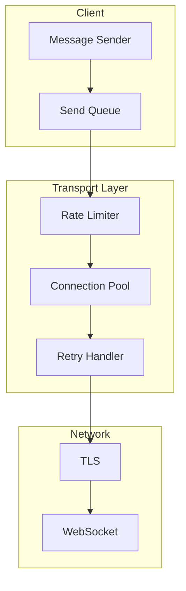
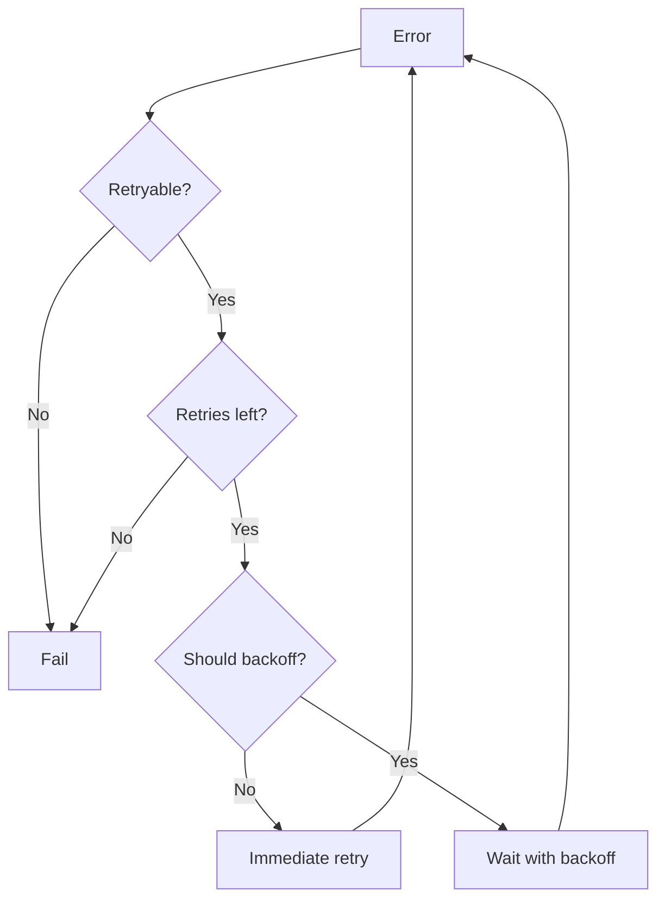
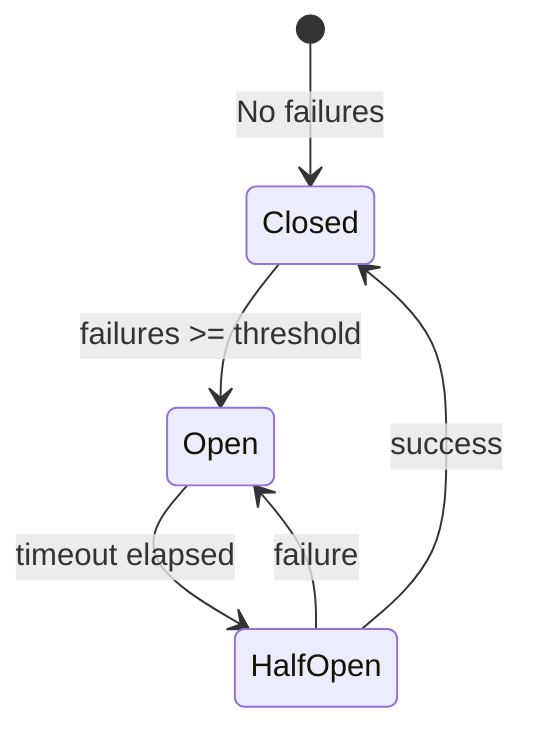

# Transport Layer

## Overview

The transport layer handles low-level network communication, including connection pooling, rate limiting, and retry logic.

## Transport Architecture



## Connection Pool

### Pool Interface

```typescript
interface ConnectionPool {
  acquire(): Promise<Connection>;
  release(connection: Connection): void;
  close(): Promise<void>;

  // Stats
  getStats(): PoolStats;
}

interface PoolStats {
  total: number;
  active: number;
  idle: number;
  waiting: number;
}
```

### Pool Implementation

```typescript
class ConnectionPoolImpl implements ConnectionPool {
  private connections: Connection[] = [];
  private waiting: Queue<Resolver<Connection>> = [];
  private readonly maxConnections = 10;
  private readonly minConnections = 2;

  constructor(private factory: ConnectionFactory) {}

  async acquire(): Promise<Connection> {
    // Try to get idle connection
    const idle = this.connections.find(c => c.idle);
    if (idle) {
      idle.idle = false;
      return idle;
    }

    // Create new if under limit
    if (this.connections.length < this.maxConnections) {
      const conn = await this.factory.create();
      conn.idle = false;
      this.connections.push(conn);
      return conn;
    }

    // Wait for available connection
    return new Promise(resolve => {
      this.waiting.push(resolve);
    });
  }

  release(connection: Connection): void {
    connection.idle = true;

    // Serve waiting request
    const waiting = this.waiting.shift();
    if (waiting) {
      connection.idle = false;
      waiting(connection);
    }

    // Close excess connections
    this.closeExcess();
  }
}
```

## Rate Limiting

### Rate Limiter Interface

```typescript
interface RateLimiter {
  // Check if request is allowed
  check(key: string): Promise<RateLimitResult>;

  // Record request
  record(key: string, tokens?: number): void;

  // Reset
  reset(key: string): void;
}

interface RateLimitResult {
  allowed: boolean;
  remaining: number;
  resetAt: Date;
  retryAfter?: number;
}
```

### Token Bucket Algorithm

```typescript
class TokenBucketRateLimiter implements RateLimiter {
  private buckets = new Map<string, TokenBucket>();

  constructor(
    private tokensPerSecond: number,
    private burstSize: number
  ) {}

  check(key: string): RateLimitResult {
    const bucket = this.getBucket(key);
    const now = Date.now();

    // Refill tokens
    const elapsed = (now - bucket.lastRefill) / 1000;
    bucket.tokens = Math.min(
      this.burstSize,
      bucket.tokens + elapsed * this.tokensPerSecond
    );
    bucket.lastRefill = now;

    if (bucket.tokens >= 1) {
      bucket.tokens -= 1;
      return {
        allowed: true,
        remaining: Math.floor(bucket.tokens),
        resetAt: new Date(now + (1 / this.tokensPerSecond) * 1000),
      };
    }

    const retryAfter = Math.ceil((1 - bucket.tokens) / this.tokensPerSecond * 1000);

    return {
      allowed: false,
      remaining: 0,
      resetAt: new Date(now + retryAfter),
      retryAfter,
    };
  }

  private getBucket(key: string): TokenBucket {
    if (!this.buckets.has(key)) {
      this.buckets.set(key, {
        tokens: this.burstSize,
        lastRefill: Date.now(),
      });
    }
    return this.buckets.get(key);
  }
}
```

### Per-Channel Rate Limits

```typescript
const channelRateLimits: Record<string, RateLimitConfig> = {
  telegram: {
    messagesPerSecond: 30,
    messagesPerMinute: 20,    // Reduced for group chats
    burstSize: 10,
  },
  discord: {
    messagesPerSecond: 5,
    messagesPerMinute: 100,
    burstSize: 5,
  },
  slack: {
    messagesPerSecond: 1,
    messagesPerMinute: 60,
    burstSize: 3,
  },
};
```

## Retry Logic

### Retry Configuration

```typescript
interface RetryConfig {
  maxRetries: number;
  initialDelay: number;
  maxDelay: number;
  backoffMultiplier: number;
  jitter: boolean;
  retryableErrors?: (error: Error) => boolean;
}

const defaultRetryConfig: RetryConfig = {
  maxRetries: 3,
  initialDelay: 1000,
  maxDelay: 30000,
  backoffMultiplier: 2,
  jitter: true,
  retryableErrors: isRetryableError,
};

function isRetryableError(error: Error): boolean {
  return (
    error instanceof NetworkError ||
    error instanceof TimeoutError ||
    error instanceof RateLimitError ||
    (error as { statusCode?: number }).statusCode >= 500
  );
}
```

### Retry Implementation

```typescript
async function withRetry<T>(
  operation: () => Promise<T>,
  config: RetryConfig
): Promise<T> {
  let lastError: Error;
  let delay = config.initialDelay;

  for (let attempt = 0; attempt <= config.maxRetries; attempt++) {
    try {
      return await operation();
    } catch (error) {
      lastError = error as Error;

      // Check if retryable
      if (!config.retryableErrors?.(lastError) || attempt === config.maxRetries) {
        throw lastError;
      }

      // Wait before retry
      const waitTime = config.jitter
        ? delay * (0.5 + Math.random())
        : delay;

      await sleep(waitTime);

      delay = Math.min(delay * config.backoffMultiplier, config.maxDelay);
    }
  }

  throw lastError!;
}
```

### Retry Decision Tree



## Message Queue

### Queue Interface

```typescript
interface MessageQueue {
  enqueue(message: QueuedMessage): Promise<string>;  // Returns queue ID
  dequeue(): Promise<QueuedMessage | null>;
  requeue(id: string, delay?: number): Promise<void>;
  remove(id: string): Promise<void>;
  getSize(): number;
}

interface QueuedMessage {
  id: string;
  target: ChannelTarget;
  message: OutboundMessage;
  enqueuedAt: Date;
  scheduledFor?: Date;
  retries: number;
}
```

### Priority Queue

```typescript
class PriorityMessageQueue implements MessageQueue {
  private queues = {
    urgent: [] as QueuedMessage[],
    high: [] as QueuedMessage[],
    normal: [] as QueuedMessage[],
    low: [] as QueuedMessage[],
  };

  async enqueue(message: QueuedMessage): Promise<string> {
    const queue = this.queues[message.priority || "normal"];
    queue.push(message);
    return message.id;
  }

  async dequeue(): Promise<QueuedMessage | null> {
    // Check in priority order
    for (const priority of ["urgent", "high", "normal", "low"]) {
      const queue = this.queues[priority];
      if (queue.length > 0) {
        return queue.shift()!;
      }
    }
    return null;
  }
}
```

## Circuit Breaker

### Circuit Breaker Pattern

```typescript
interface CircuitBreaker {
  state: CircuitState;
  recordSuccess(): void;
  recordFailure(): void;
  canExecute(): boolean;
}

type CircuitState = "closed" | "open" | "half-open";

class CircuitBreakerImpl implements CircuitBreaker {
  private failures = 0;
  private lastFailure: Date | null = null;

  constructor(
    private threshold: number = 5,
    private timeout: number = 60000  // 1 minute
  ) {}

  get state(): CircuitState {
    if (this.failures < this.threshold) {
      return "closed";
    }

    if (!this.lastFailure) {
      return "closed";
    }

    const elapsed = Date.now() - this.lastFailure.getTime();
    if (elapsed > this.timeout) {
      return "half-open";
    }

    return "open";
  }

  recordSuccess(): void {
    this.failures = 0;
    this.lastFailure = null;
  }

  recordFailure(): void {
    this.failures++;
    this.lastFailure = new Date();
  }

  canExecute(): boolean {
    return this.state !== "open";
  }
}
```

### Circuit Breaker States



## Health Monitoring

### Connection Health

```typescript
interface ConnectionHealth {
  latency: number;
  connected: boolean;
  lastMessageAt: Date | null;
  errors: number;
  recoveryTime?: Date;
}

class HealthMonitor {
  private health = new Map<string, ConnectionHealth>();

  recordLatency(channelId: string, latency: number): void {
    this.health.set(channelId, {
      ...this.get(channelId),
      latency,
      connected: true,
      lastMessageAt: new Date(),
    });
  }

  recordError(channelId: string): void {
    const current = this.get(channelId);
    this.health.set(channelId, {
      ...current,
      errors: current.errors + 1,
    });

    // Open circuit if too many errors
    if (current.errors >= 10) {
      this.openCircuit(channelId);
    }
  }

  get(channelId: string): ConnectionHealth {
    return this.health.get(channelId) || {
      latency: 0,
      connected: false,
      lastMessageAt: null,
      errors: 0,
    };
  }
}
```

## Related

- [Channel Architecture](/architecture-book/part-5-channels/01-channel-architecture) - Channel design
- [Message Processing](/architecture-book/part-5-channels/04-message-processing) - Processing pipeline
- [Channel Plugins](/architecture-book/part-3-plugin-system/06-channel-plugins) - Plugin implementation