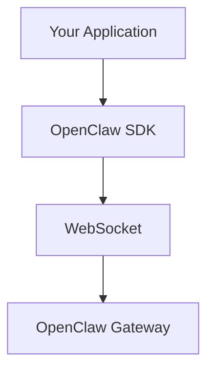

# App SDK

## Overview

The App SDK (`@openclaw/sdk`) provides a TypeScript client for connecting to the OpenClaw gateway.



## Installation

```bash
npm install @openclaw/sdk
# or
pnpm add @openclaw/sdk
```

## Quick Start

```typescript
import { OpenClaw } from "@openclaw/sdk";

const client = new OpenClaw({
  url: "ws://127.0.0.1:18789",
  token: process.env.OPENCLAW_GATEWAY_TOKEN,
});

await client.connect();

const run = await client.agents.get("main").run({
  input: "Hello, how are you?",
  sessionKey: "main",
});

for await (const event of run.events()) {
  if (event.type === "assistant.delta") {
    process.stdout.write(event.data.delta);
  }
}
```

## Client Configuration

### Configuration Options

```typescript
interface OpenClawConfig {
  // Connection
  url: string;
  token?: string;
  password?: string;

  // Device
  deviceId?: string;
  deviceName?: string;
  platform?: string;

  // Client info
  clientName?: string;
  clientVersion?: string;

  // Timeouts
  connectTimeout?: number;
  requestTimeout?: number;

  // Retry
  maxRetries?: number;

  // Debug
  debug?: boolean;
}

const client = new OpenClaw({
  url: "ws://127.0.0.1:18789",
  token: "sk-openclaw-xxxxx",
  deviceName: "my-app",
  platform: "node",
  requestTimeout: 60000,
});
```

## Connection Management

### Connecting

```typescript
async function connect(): Promise<void> {
  await client.connect();

  // Or with manual handling
  client.on("connected", () => {
    console.log("Connected to gateway");
  });

  client.on("disconnected", (reason) => {
    console.log("Disconnected:", reason);
  });

  client.on("error", (error) => {
    console.error("Connection error:", error);
  });
}
```

### Connection Events

```typescript
client.on("connected", () => {
  console.log("Connected to gateway");
});

client.on("disconnected", (reason) => {
  console.log("Disconnected:", reason);
});

client.on("error", (error) => {
  console.error("Error:", error);
});

client.on("reconnecting", (attempt) => {
  console.log("Reconnecting, attempt:", attempt);
});
```

## Agent Operations

### Running Agents

```typescript
// Simple run
const run = await client.agents.get("main").run({
  input: "What is the weather?",
  sessionKey: "main",
});

// With options
const run = await client.agents.get("main").run({
  input: "Analyze this code",
  modelRef: "anthropic:claude-opus-4",
  temperature: 0.7,
  sessionKey: "telegram:dm:123456",
});

// Iterate events
for await (const event of run.events()) {
  switch (event.type) {
    case "start":
      console.log("Run started:", event.runId);
      break;
    case "assistant.delta":
      process.stdout.write(event.delta);
      break;
    case "tool_use":
      console.log("Tool call:", event.tool);
      break;
    case "tool_result":
      console.log("Tool result:", event.result);
      break;
    case "complete":
      console.log("Done! Summary:", event.summary);
      break;
    case "error":
      console.error("Error:", event.error);
      break;
  }
}
```

### Run Events

```typescript
type RunEvent =
  | { type: "start"; runId: string }
  | { type: "assistant.delta"; delta: string }
  | { type: "assistant.text"; text: string }
  | { type: "tool_use"; tool: string; input: unknown }
  | { type: "tool_result"; tool: string; result: unknown }
  | { type: "complete"; summary: string }
  | { type: "error"; error: string };
```

### Agent Management

```typescript
// List agents
const agents = await client.agents.list();
// [{ id: "main", status: "active", sessions: 5 }, ...]

// Get agent info
const agent = await client.agents.get("main");
// { id: "main", status: "active", sessions: 5, running: 2 }

// Abort running agent
await client.agents.get("main").abort(runId);
```

## Session Operations

### Session Management

```typescript
// Get session info
const session = await client.sessions.get("main");
// {
//   key: "main",
//   agentId: "main",
//   createdAt: Date,
//   messageCount: 42,
//   lastMessageAt: Date
// }

// Get session history
const history = await client.sessions.getHistory("main", { limit: 50 });
// [{ role: "user", content: "...", timestamp: Date }, ...]

// Reset session
await client.sessions.reset("main");

// Delete session
await client.sessions.delete("main");
```

## Messaging

### Sending Messages

```typescript
// Send to channel
await client.messages.send({
  channel: "telegram",
  target: "123456789",
  content: "Hello from OpenClaw SDK!",
});

// Send with buttons
await client.messages.send({
  channel: "discord",
  target: "channel-id",
  content: "Choose an option:",
  buttons: [
    [
      { label: "Option A", data: "option_a" },
      { label: "Option B", data: "option_b" }
    ]
  ]
});

// Reply to message
await client.messages.sendReply({
  channel: "telegram",
  target: "123456789",
  content: "Replying to your message",
  replyTo: "original-message-id"
});
```

## Event Subscriptions

### Subscribing to Events

```typescript
// Subscribe to all events
client.on("event", (event) => {
  console.log("Gateway event:", event);
});

// Subscribe to specific events
client.on("chat", (message) => {
  console.log("New chat message:", message);
});

client.on("presence", (presence) => {
  console.log("Presence update:", presence);
});

client.on("tick", (tick) => {
  console.log("Gateway tick:", tick.health);
});

// Unsubscribe
const handler = (message) => console.log(message);
client.on("chat", handler);
client.off("chat", handler);
```

### Chat Events

```typescript
client.on("chat", (event) => {
  const { channel, target, message } = event;
  console.log(`New message on ${channel}:`, message.content);

  // message has:
  // - id: string
  // - from: { id, name, username }
  // - content: string
  // - timestamp: Date
  // - media?: MediaAttachment
});
```

## Health and Status

### Getting Status

```typescript
// Health check
const health = await client.health.check();
// {
//   status: "healthy",
//   uptime: 86400,
//   memory: { used: 128, total: 512 },
//   channels: [...]
// }

// System status
const status = await client.status.get();
// {
//   version: "1.0.0",
//   gateway: { status: "running" },
//   plugins: [...],
//   channels: [...]
// }

// Presence
const presence = await client.presence.get();
// {
//   channels: [{ id, status, users }],
//   agents: [{ id, status, sessions }]
// }
```

## Error Handling

### Error Types

```typescript
try {
  const run = await client.agents.get("main").run({
    input: "Hello",
    sessionKey: "main",
  });
} catch (error) {
  if (error instanceof OpenClawError) {
    switch (error.code) {
      case "AUTH_FAILED":
        console.error("Authentication failed");
        break;
      case "SESSION_NOT_FOUND":
        console.error("Session not found");
        break;
      case "RATE_LIMITED":
        console.error("Rate limited, retry after:", error.retryAfter);
        break;
      default:
        console.error("Error:", error.message);
    }
  }
}
```

### OpenClawError

```typescript
class OpenClawError extends Error {
  code: string;
  statusCode: number;
  retryAfter?: number;

  constructor(code: string, message: string, statusCode: number = 500) {
    super(message);
    this.name = "OpenClawError";
    this.code = code;
    this.statusCode = statusCode;
  }
}
```

## Streaming

### Streaming Responses

```typescript
// Using async iteration
const run = client.agents.get("main").run({ input: "Write a poem" });

for await (const event of run.events()) {
  if (event.type === "assistant.delta") {
    process.stdout.write(event.delta);
  }
}

// Using callback
run.on("delta", (delta) => {
  process.stdout.write(delta);
});

run.on("complete", (summary) => {
  console.log("\n\nSummary:", summary);
});
```

## Complete Example

```typescript
import { OpenClaw } from "@openclaw/sdk";

async function main() {
  const client = new OpenClaw({
    url: process.env.OPENCLAW_URL || "ws://127.0.0.1:18789",
    token: process.env.OPENCLAW_TOKEN,
    deviceName: "my-app",
  });

  // Connect
  await client.connect();
  console.log("Connected!");

  // Subscribe to incoming messages
  client.on("chat", async (event) => {
    if (event.message.content.startsWith("/ask ")) {
      const question = event.message.content.slice(5);

      // Run agent
      const run = await client.agents.get("main").run({
        input: question,
        sessionKey: `${event.channel}:dm:${event.message.from.id}`,
      });

      // Stream response
      let response = "";
      for await (const e of run.events()) {
        if (e.type === "assistant.delta") {
          response += e.delta;
        }
      }

      // Send reply
      await client.messages.send({
        channel: event.channel,
        target: event.target,
        content: response || "I don't have an answer for that.",
      });
    }
  });

  // Handle errors
  client.on("error", (error) => {
    console.error("Error:", error);
  });
}

main().catch(console.error);
```

## Related

- [Plugin SDK](/architecture-book/part-6-sdks-apis/02-plugin-sdk) - Plugin development SDK
- [Memory Host SDK](/architecture-book/part-6-sdks-apis/03-memory-host-sdk) - Memory integration
- [API Reference](/architecture-book/part-6-sdks-apis/04-api-reference) - Complete API reference