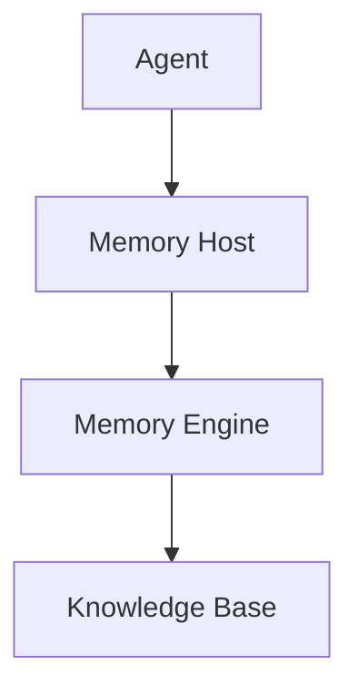

# Memory Host SDK

## Overview

The Memory Host SDK provides interfaces for building memory plugins that integrate with OpenClaw's memory system.



## SDK Structure

### Package Exports

```typescript
import { createMemoryHost } from "@openclaw/memory-host-sdk";
import type { MemoryHost, MemoryEntry, SearchOptions } from "@openclaw/memory-host-sdk";
```

## Memory Host

### Host Interface

```typescript
interface MemoryHost {
  // Lifecycle
  initialize(config: MemoryConfig): Promise<void>;
  shutdown(): Promise<void>;

  // Storage
  store(entry: MemoryEntry): Promise<void>;
  get(key: string): Promise<MemoryEntry | null>;
  update(key: string, entry: Partial<MemoryEntry>): Promise<void>;
  delete(key: string): Promise<void>;

  // Search
  search(query: string, options?: SearchOptions): Promise<MemoryResult[]>;
  suggest(partial: string): Promise<string[]>;

  // Context
  buildContext(sessionId: string, prompt: string): Promise<MemoryContext>;

  // Maintenance
  compact(sessionId: string): Promise<void>;
  vacuum(): Promise<void>;
}
```

## Memory Entry

### Entry Structure

```typescript
interface MemoryEntry {
  id: string;
  key: string;
  type: MemoryType;
  content: string;
  metadata: MemoryMetadata;
  createdAt: Date;
  updatedAt: Date;
  embedding?: number[];
}

type MemoryType =
  | "fact"
  | "task"
  | "preference"
  | "knowledge"
  | "context"
  | "summary"
  | "reflection"
  | "commitment";

interface MemoryMetadata {
  source: "user" | "model" | "system" | "plugin";
  sessionKey?: string;
  channel?: string;
  importance?: number;
  confidence?: number;
  tags?: string[];
  links?: string[];
}
```

## Memory Configuration

### Config Schema

```typescript
interface MemoryConfig {
  // Storage
  backend: "memory" | "file" | "vector" | "hybrid";
  path?: string;

  // Vector store
  vectorDb?: {
    type: "lancedb" | "qdrant" | "pinecone";
    url?: string;
    apiKey?: string;
    collection?: string;
  };

  // Embedding
  embedding?: {
    provider: "openai" | "anthropic" | "local";
    model?: string;
    dimension?: number;
  };

  // Behavior
  maxMemory?: number;
  compactThreshold?: number;
  retentionDays?: number;
}

const config: MemoryConfig = {
  backend: "hybrid",
  path: "./memory",
  vectorDb: {
    type: "lancedb",
    collection: "openclaw-memory",
  },
  embedding: {
    provider: "openai",
    model: "text-embedding-3-small",
    dimension: 1536,
  },
  maxMemory: 10000,
  compactThreshold: 0.8,
  retentionDays: 30,
};
```

## Search Integration

### Search Options

```typescript
interface SearchOptions {
  limit?: number;
  threshold?: number;
  types?: MemoryType[];
  tags?: string[];
  dateRange?: {
    start?: Date;
    end?: Date;
  };
  includeArchived?: boolean;
}

interface MemoryResult {
  entry: MemoryEntry;
  score: number;
  snippet?: string;
  highlights?: string[];
}
```

### Search Implementation

```typescript
class VectorSearchEngine implements SearchEngine {
  async search(
    query: string,
    options?: SearchOptions
  ): Promise<MemoryResult[]> {
    // Generate query embedding
    const queryEmbedding = await this.embeddingService.embed(query);

    // Search vector store
    const results = await this.vectorStore.search(queryEmbedding, {
      limit: options?.limit ?? 10,
      threshold: options?.threshold ?? 0.7,
      filter: this.buildFilter(options),
    });

    // Transform to MemoryResult
    return results.map((r) => ({
      entry: r.entry,
      score: r.score,
      snippet: this.extractSnippet(r.entry.content, query),
      highlights: this.extractHighlights(r.entry.content, query),
    }));
  }

  private extractSnippet(content: string, query: string): string {
    const index = content.toLowerCase().indexOf(query.toLowerCase());
    if (index === -1) return content.slice(0, 200);

    const start = Math.max(0, index - 50);
    const end = Math.min(content.length, index + 150);
    return "..." + content.slice(start, end) + "...";
  }
}
```

## Context Building

### Context Assembly

```typescript
interface MemoryContext {
  messages: Message[];
  memories: MemoryEntry[];
  recentFacts: Fact[];
  activeTasks: Task[];
}

async buildContext(
  sessionId: string,
  prompt: string
): Promise<MemoryContext> {
  const [session, recentMemories, facts, tasks] = await Promise.all([
    this.getSession(sessionId),
    this.search(prompt, { limit: 5, types: ["context"] }),
    this.getFacts(sessionId),
    this.getActiveTasks(sessionId),
  ]);

  return {
    messages: session.messages,
    memories: recentMemories.map((r) => r.entry),
    recentFacts: facts,
    activeTasks: tasks,
  };
}
```

### Prompt Integration

```typescript
function injectMemoryIntoPrompt(
  prompt: string,
  context: MemoryContext
): string {
  const sections: string[] = [];

  if (context.recentFacts.length > 0) {
    sections.push(`
## Known Facts
${context.recentFacts.map((f) => `- ${f.content}`).join("\n")}
    `.trim());
  }

  if (context.activeTasks.length > 0) {
    sections.push(`
## Active Tasks
${context.activeTasks.map((t) => `- [${t.status}] ${t.content}`).join("\n")}
    `.trim());
  }

  if (context.memories.length > 0) {
    sections.push(`
## Recent Context
${context.memories.map((m) => m.content).join("\n")}
    `.trim());
  }

  if (sections.length === 0) return prompt;

  return `${prompt}

${sections.join("\n\n")}
  `.trim();
}
```

## Fact Extraction

### Fact Inference

```typescript
interface FactExtractor {
  extract(conversation: Message[]): Promise<Fact[]>;
  merge(existing: Fact[], newFacts: Fact[]): Fact[];
}

class FactExtractorImpl implements FactExtractor {
  async extract(conversation: Message[]): Promise<Fact[]> {
    const text = conversation.map((m) => m.content).join("\n");

    const response = await this.model.complete({
      prompt: `
Extract key facts from this conversation:
${text}

Format each fact as: { "type": "fact", "content": "...", "confidence": 0.0-1.0 }
      `,
    });

    return JSON.parse(response).facts;
  }

  merge(existing: Fact[], newFacts: Fact[]): Fact[] {
    const merged = [...existing];

    for (const newFact of newFacts) {
      const existingIndex = merged.findIndex(
        (f) => this.similarity(f.content, newFact.content) > 0.8
      );

      if (existingIndex >= 0) {
        // Update existing fact with higher confidence
        if (newFact.confidence > merged[existingIndex].confidence) {
          merged[existingIndex] = newFact;
        }
      } else {
        merged.push(newFact);
      }
    }

    return merged;
  }
}
```

## Compaction

### Compaction Strategy

```typescript
interface CompactionStrategy {
  shouldCompact(session: Session): boolean;
  compact(session: Session): Promise<CompactedSession>;
}

class SummaryCompaction implements CompactionStrategy {
  shouldCompact(session: Session): boolean {
    return (
      session.messageCount > 100 ||
      session.tokenCount > 8000
    );
  }

  async compact(session: Session): Promise<CompactedSession> {
    // Generate summary
    const summary = await this.generateSummary(session);

    // Keep recent messages
    const recentMessages = session.messages.slice(-10);

    return {
      sessionId: session.id,
      summary,
      recentMessages,
      compactedAt: new Date(),
      originalMessageCount: session.messageCount,
    };
  }
}
```

## DREAMS System

### Reflection Generation

```typescript
interface DreamsGenerator {
  generateReflection(session: Session): Promise<string>;
  mergeWithExisting(dreams: string, newReflection: string): string;
}

class DreamsGeneratorImpl implements DreamsGenerator {
  async generateReflection(session: Session): Promise<string> {
    const response = await this.model.complete({
      prompt: `
Analyze this conversation session and generate insights:

Recent messages:
${session.recentMessages.map((m) => `${m.role}: ${m.content}`).join("\n")}

Generate a reflection that includes:
1. Key topics discussed
2. User preferences observed
3. Tasks or commitments made
4. Important context to remember

Format as a markdown list.
      `,
    });

    const date = new Date().toISOString().split("T")[0];
    return `## ${date}\n\n${response}`;
  }

  mergeWithExisting(dreams: string, newReflection: string): string {
    // Prepend new reflection
    return `${newReflection}\n\n---\n\n${dreams}`;
  }
}
```

## Complete Example

```typescript
import { createMemoryHost } from "@openclaw/memory-host-sdk";

const host = createMemoryHost({
  backend: "hybrid",
  path: "./memory",
  vectorDb: { type: "lancedb", collection: "openclaw" },
  embedding: { provider: "openai", model: "text-embedding-3-small" },
});

await host.initialize();

// Store a memory
await host.store({
  id: generateId(),
  key: "user:preference:dark-mode",
  type: "preference",
  content: "User prefers dark mode interface",
  metadata: {
    source: "user",
    importance: 0.8,
    confidence: 0.95,
  },
  createdAt: new Date(),
  updatedAt: new Date(),
});

// Search memories
const results = await host.search("What does the user prefer?", {
  limit: 5,
  threshold: 0.7,
});

console.log("Found:", results.length, "memories");

// Build context for agent
const context = await host.buildContext("session-123", "What is user's name?");
console.log("Context:", context);

// Compact old memories
await host.compact("session-123");

await host.shutdown();
```

## Related

- [Memory System](/architecture-book/part-8-session-memory/00-session-memory-overview) - Memory architecture
- [Context Engine](/architecture-book/part-8-session-memory/03-context-engine) - Context assembly
- [Compaction](/architecture-book/part-8-session-memory/04-compaction) - Memory compaction