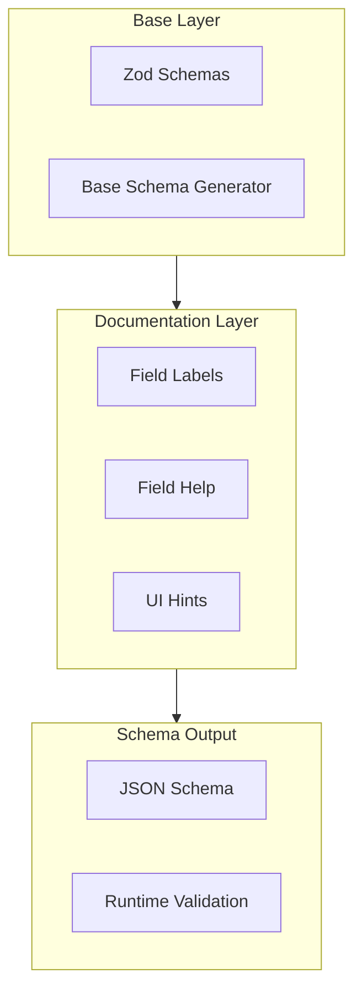

# Config Schema

## Overview

OpenClaw uses a layered config schema system that separates base schema generation, field documentation, and runtime validation. The system produces JSON Schema output for UI consumption while using Zod for TypeScript-level validation.



## Schema Architecture

### Layer Separation

| Layer | Purpose | Files |
|-------|---------|-------|
| Base | Zod schemas defining types | `zod-schema.ts` |
| Docs | Labels and help text | `schema.labels.ts`, `schema.help.ts` |
| Hints | UI metadata | `schema.hints.ts` |
| Output | Combined JSON Schema | `schema.ts` |

### Config Structure

```typescript
// Main config entry
interface OpenClawConfig {
  meta?: MetaConfig;
  env?: EnvConfig;
  wizard?: WizardConfig;
  diagnostics?: DiagnosticsConfig;
  logging?: LoggingConfig;
  cli?: CliConfig;
  update?: UpdateConfig;
  commitments?: CommitmentsConfig;
  agents?: AgentsConfig;
  gateway?: GatewayConfig;
  browser?: BrowserConfig;
  tools?: ToolsConfig;
  channels?: Record<string, ChannelConfig>;
  plugins?: Record<string, PluginConfig>;
  talk?: TalkConfig;
  acp?: AcpConfig;
}
```

### Schema Generation

```typescript
// Base schema response shape
interface BaseConfigSchemaResponse {
  schema: ConfigSchema;
  uiHints: ConfigUiHints;
}

// Full schema response with metadata
interface ConfigSchemaResponse {
  schema: ConfigSchema;
  uiHints: ConfigUiHints;
  version: string;
  generatedAt: string;
}
```

## Field Documentation

### Labels

Field labels provide human-readable titles for config paths:

```typescript
// schema.labels.ts
export const FIELD_LABELS: Record<string, string> = {
  gateway: "Gateway",
  "gateway.port": "Gateway Port",
  "gateway.auth": "Gateway Auth",
  "gateway.auth.mode": "Gateway Auth Mode",
  agents: "Agents",
  "agents.list": "Agent List",
  "agents.defaults": "Agent Defaults",
  // ...
};
```

### Help Text

Field descriptions explain purpose and usage:

```typescript
// schema.help.ts
export const FIELD_HELP: Record<string, string> = {
  gateway:
    "Gateway runtime surface for bind mode, auth, control UI, remote transport, and operational safety controls.",
  "gateway.port":
    "TCP port used by the gateway listener for API, control UI, and channel-facing ingress paths.",
  "gateway.auth":
    "Authentication policy for gateway HTTP/WebSocket access including mode, credentials, trusted-proxy behavior, and rate limiting.",
  // ...
};
```

## Config Paths

### Dot-path Notation

Config paths use dot-notation for nested fields:

```
gateway.port
gateway.auth.mode
agents.list[].skills
tools.media.image.enabled
```

### Array Notation

Arrays use `[]` for the array level and `[*]` or numbered indices for specific items:

```
agents.list[].skills         # All agent skills
agents.list[*].models.*      # All models for all agents
channels.telegram.botToken   # Specific channel config
```

## Schema Lookup

### Lookup API

```typescript
// Look up schema for a specific path
interface ConfigSchemaLookupResult {
  path: string;
  schema: JsonSchemaNode;
  hint?: ConfigUiHint;
  hintPath?: string;
  children: ConfigSchemaLookupChild[];
}

// Child fields for a schema node
interface ConfigSchemaLookupChild {
  key: string;
  path: string;
  type?: string | string[];
  required: boolean;
  hasChildren: boolean;
  hint?: ConfigUiHint;
  hintPath?: string;
}
```

### Lookup Restrictions

The schema lookup system enforces safety limits:

```typescript
// Forbidden path segments (prototype pollution prevention)
const FORBIDDEN_LOOKUP_SEGMENTS = new Set([
  "__proto__",
  "prototype",
  "constructor"
]);

// Maximum path depth
const MAX_LOOKUP_PATH_SEGMENTS = 32;

// Maximum nested form depth
const LOOKUP_SCHEMA_NESTED_FORM_DEPTH = 4;
```

## UI Hints

### Hint Types

```typescript
interface ConfigUiHint {
  label?: string;         // Display label
  help?: string;          // Help text
  placeholder?: string;   // Input placeholder
  advanced?: boolean;     // Advanced field marker
  sensitive?: boolean;    // Sensitive field (masked)
  tags?: string[];        // Category tags
}
```

### Hint Application

Hints are applied based on schema paths with wildcard support:

```typescript
// Apply hints to schema
applySensitiveHints(schema, hints);
applySensitiveUrlHints(schema, hints);

// Wildcard matching for arrays
"agents.list[].skills.*.name"  // Matches all skill names
"tools.media.image.*"           // Matches all image tool fields
```

## Config Validation

### Zod Schema Validation

```typescript
import { OpenClawSchema } from "./zod-schema.js";

// Validate config at runtime
const result = OpenClawSchema.safeParse(config);
if (!result.success) {
  // Handle validation errors
  console.error(result.error.format());
}
```

### Validation Layers

| Layer | Trigger | Error Handling |
|-------|---------|----------------|
| CLI args | Startup | Exit with message |
| Config file | Load | Doctor warning |
| Runtime | Gateway start | Block startup |
| Migration | Config write | Auto-fix if safe |

## Plugin Config Extension

### Plugin Schema Contribution

Plugins can extend the config schema:

```typescript
interface PluginUiMetadata {
  id: string;
  name?: string;
  description?: string;
  configUiHints?: Record<
    string,
    Pick<ConfigUiHint, "label" | "help" | "tags" | "advanced" | "sensitive" | "placeholder">
  >;
  configSchema?: JsonSchemaNode;
}
```

### Extension Limits

Plugin schemas have size limits to prevent response bloat:

```typescript
const EXTENSION_SCHEMA_MAX_BYTES = 256 * 1024;     // 256KB per plugin
const EXTENSION_SCHEMA_TOTAL_MAX_BYTES = 2 * 1024 * 1024;  // 2MB total
const EXTENSION_SCHEMA_MAX_ITEMS = 256;            // Max 256 plugins
```

### Omitted Schemas

When plugin schemas exceed limits, they're replaced:

```typescript
// Omitted schema placeholder
{
  type: "object",
  additionalProperties: true,
  description: "plugin config schema for ${id} was omitted..."
}
```

## Related

- [Config Reference](/architecture-book/part-6-sdks-apis/04-api-reference) - Full config reference
- [Gateway Config](/architecture-book/part-2-core-modules/01-gateway) - Gateway settings
- [Agent Config](/architecture-book/part-2-core-modules/02-agents) - Agent configuration