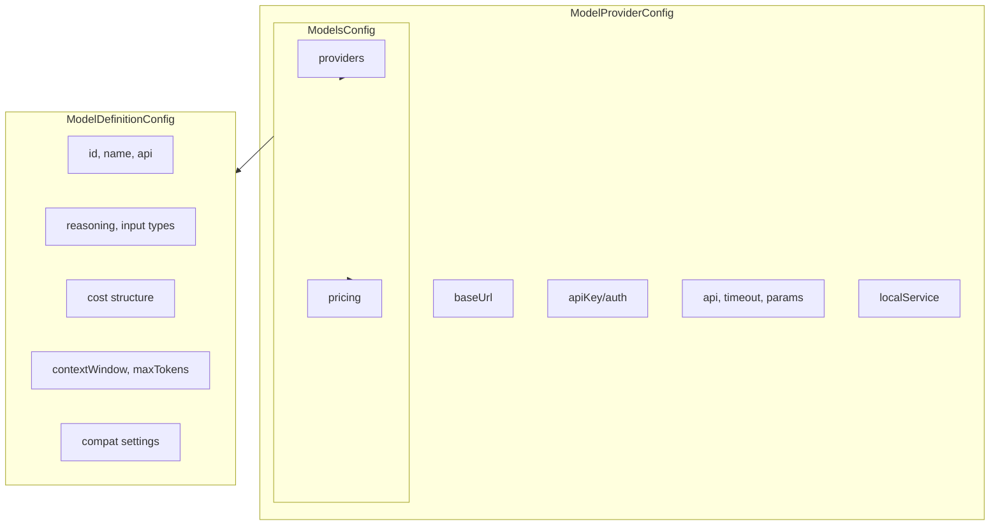
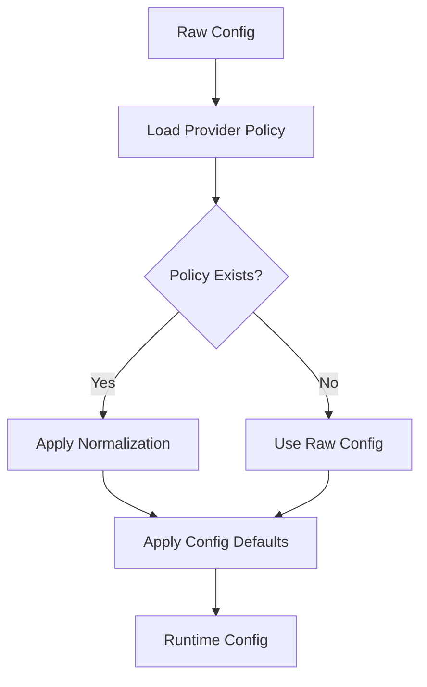

# Provider Config

## Overview

OpenClaw's provider configuration system manages AI model providers and their associated model definitions. Each provider can contain multiple models with specific capabilities, pricing, and compatibility settings.



## Configuration Structure

### Main Models Config

```typescript
// src/config/types.models.ts
interface ModelsConfig {
  /** Merge or replace provider configs ("merge" is default). */
  mode?: "merge" | "replace";
  /** Map of provider id -> provider config. */
  providers?: Record<string, ModelProviderConfig>;
  /** Optional pricing configuration. */
  pricing?: ModelPricingConfig;
}
```

### Provider Configuration

```typescript
interface ModelProviderConfig {
  /** Base URL for API requests. */
  baseUrl: string;
  /** API key or credential for authentication. */
  apiKey?: SecretInput;
  /** Authentication mode (api-key, aws-sdk, oauth, token). */
  auth?: ModelProviderAuthMode;
  /** Override default API type. */
  api?: ModelApi;
  /** Default context window size. */
  contextWindow?: number;
  /** Override for runtime token budgeting. */
  contextTokens?: number;
  /** Override max output tokens. */
  maxTokens?: number;
  /** Request timeout in seconds. */
  timeoutSeconds?: number;
  /** Inject numCtx for OpenAI compat. */
  injectNumCtxForOpenAICompat?: boolean;
  /** Provider-specific runtime parameters. */
  params?: Record<string, unknown>;
  /** Default agent runtime for this provider's models. */
  agentRuntime?: AgentRuntimePolicyConfig;
  /** Local service to start before calling provider. */
  localService?: ModelProviderLocalServiceConfig;
  /** Custom headers (credentials supported). */
  headers?: Record<string, SecretInput>;
  /** Auth header injection control. */
  authHeader?: boolean;
  /** Request configuration. */
  request?: ConfiguredModelProviderRequest;
  /** Array of model definitions. */
  models: ModelDefinitionConfig[];
}
```

### Local Service Configuration

For providers that require a local service (e.g., Ollama):

```typescript
interface ModelProviderLocalServiceConfig {
  /** Command to execute. */
  command: string;
  /** Command arguments. */
  args?: string[];
  /** Working directory. */
  cwd?: string;
  /** Environment variables. */
  env?: Record<string, string>;
  /** Health check URL. */
  healthUrl?: string;
  /** Timeout for service readiness. */
  readyTimeoutMs?: number;
  /** Idle time before stopping service. */
  idleStopMs?: number;
}
```

## Model Definitions

### Basic Model Structure

```typescript
interface ModelDefinitionConfig {
  /** Unique model identifier (e.g., "claude-sonnet-4"). */
  id: string;
  /** Human-readable model name. */
  name: string;
  /** API type override. */
  api?: ModelApi;
  /** Base URL for this specific model. */
  baseUrl?: string;
  /** Whether model supports reasoning. */
  reasoning: boolean;
  /** Supported input types. */
  input: Array<"text" | "image" | "video" | "audio">;
  /** Pricing information. */
  cost: {
    input: number;           // USD per million tokens
    output: number;
    cacheRead: number;
    cacheWrite: number;
    /** Optional tiered pricing. */
    tieredPricing?: TieredPricing[];
  };
  /** Context window size in tokens. */
  contextWindow: number;
  /** Runtime token cap for compaction. */
  contextTokens?: number;
  /** Maximum output tokens. */
  maxTokens: number;
  /** Provider-specific parameters. */
  params?: Record<string, unknown>;
  /** Agent runtime override for this model. */
  agentRuntime?: AgentRuntimePolicyConfig;
  /** Custom request headers. */
  headers?: Record<string, string>;
  /** Compatibility settings. */
  compat?: ModelCompatConfig;
  /** Metadata source indicator. */
  metadataSource?: "models-add";
}
```

### Tiered Pricing

For models with variable pricing based on usage volume:

```typescript
interface TieredPricing {
  input: number;
  output: number;
  cacheRead: number;
  cacheWrite: number;
  /** Bounded tier: [start, end). Open-ended top tier: [start]. */
  range: [number, number] | [number];
}
```

## API Types

OpenClaw supports multiple API types:

```typescript
const MODEL_APIS = [
  "openai-completions",
  "openai-responses",
  "openai-codex-responses",
  "anthropic-messages",
  "google-generative-ai",
  "github-copilot",
  "bedrock-converse-stream",
  "ollama",
  "azure-openai-responses",
] as const;

type ModelApi = (typeof MODEL_APIS)[number];
```

### API Compatibility

Compatibility settings control provider-specific behaviors:

```typescript
interface ModelCompatConfig {
  // OpenAI Completions compat
  supportsStore?: boolean;
  supportsDeveloperRole?: boolean;
  supportsReasoningEffort?: boolean;
  supportsUsageInStreaming?: boolean;
  maxTokensField?: string;
  thinkingFormat?: "deepseek" | "openrouter" | "together";

  // Anthropic compat
  supportsEagerToolInputStreaming?: boolean;
  supportsLongCacheRetention?: boolean;

  // Provider-specific
  requiresMistralToolIds?: boolean;
  requiresOpenAiAnthropicToolPayload?: boolean;
  nativeWebSearchTool?: boolean;
}
```

## Authentication Modes

```typescript
type ModelProviderAuthMode = "api-key" | "aws-sdk" | "oauth" | "token";
```

| Mode | Description | Use Case |
|------|-------------|----------|
| `api-key` | Standard API key in header | OpenAI, Anthropic |
| `aws-sdk` | AWS SDK credential chain | Bedrock |
| `oauth` | OAuth authentication | Google Gemini |
| `token` | Token-based auth | Local/Custom providers |

## Provider Normalization

Providers can define normalization functions:

```typescript
// src/config/provider-policy.ts
interface ProviderPolicySurface {
  normalizeConfig?: (params: {
    provider: string;
    providerConfig: ModelProviderConfig;
  }) => ModelProviderConfig;
  applyConfigDefaults?: (params: {
    provider: string;
    config: OpenClawConfig;
    env: NodeJS.ProcessEnv;
  }) => OpenClawConfig;
}
```

### Normalization Flow



## Secret Management

Provider credentials support secret references:

```typescript
interface SecretInput {
  /** Direct secret value. */
  value?: string;
  /** Reference to credential file. */
  file?: string;
  /** Reference to environment variable. */
  env?: string;
}
```

### Secret Resolution

```typescript
// Credentials stored in ~/.openclaw/credentials/
// Provider config references secrets by key
{
  "providers": {
    "openai": {
      "apiKey": {
        "file": "~/.openclaw/credentials/openai.key"
      }
    }
  }
}
```

## Example Configuration

### OpenAI Provider

```json
{
  "models": {
    "providers": {
      "openai": {
        "baseUrl": "https://api.openai.com/v1",
        "apiKey": { "env": "OPENAI_API_KEY" },
        "api": "openai-responses",
        "models": [
          {
            "id": "gpt-4o",
            "name": "GPT-4o",
            "reasoning": false,
            "input": ["text", "image"],
            "cost": {
              "input": 5.00,
              "output": 15.00,
              "cacheRead": 1.25,
              "cacheWrite": 3.75
            },
            "contextWindow": 128000,
            "maxTokens": 16384
          },
          {
            "id": "o3",
            "name": "o3",
            "reasoning": true,
            "input": ["text"],
            "cost": {
              "input": 15.00,
              "output": 60.00,
              "cacheRead": 0,
              "cacheWrite": 0
            },
            "contextWindow": 200000,
            "maxTokens": 100000
          }
        ]
      }
    }
  }
}
```

### Ollama with Local Service

```json
{
  "models": {
    "providers": {
      "ollama": {
        "baseUrl": "http://localhost:11434/v1",
        "apiKey": "ollama",
        "localService": {
          "command": "ollama",
          "args": ["serve"],
          "healthUrl": "http://localhost:11434/api/tags",
          "readyTimeoutMs": 30000,
          "idleStopMs": 300000
        },
        "models": [
          {
            "id": "llama3.1:8b",
            "name": "Llama 3.1 8B",
            "api": "openai-completions",
            "reasoning": false,
            "input": ["text"],
            "cost": { "input": 0, "output": 0, "cacheRead": 0, "cacheWrite": 0 },
            "contextWindow": 8192,
            "maxTokens": 4096
          }
        ]
      }
    }
  }
}
```

## Related

- [Config Schema](/architecture-book/part-7-config-system/01-config-schema) - Schema architecture
- [Agent Config](/architecture-book/part-7-config-system/05-agent-config) - Agent configuration
- [Auth and Security](/architecture-book/part-4-gateway-protocol/05-auth-security) - Authentication and security