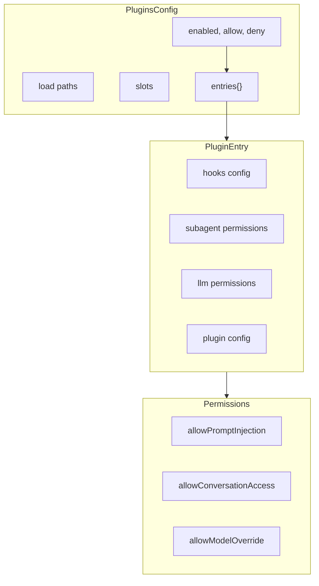
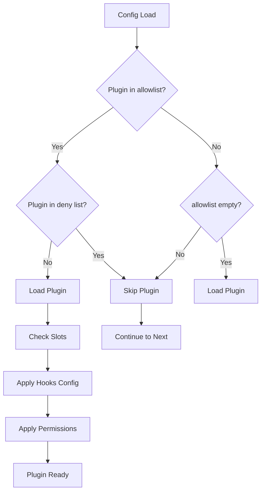

# Plugin Config

## Overview

OpenClaw's plugin configuration system manages extensions with hooks, permissions, and runtime boundaries. Plugins can extend core functionality while operating within defined security constraints.



## Configuration Structure

### Main Plugins Config

```typescript
// src/config/types.plugins.ts
interface PluginsConfig {
  /** Enable or disable plugin loading. */
  enabled?: boolean;
  /** Plugin allowlist (plugin ids). */
  allow?: string[];
  /** Plugin denylist (plugin ids). */
  deny?: string[];
  /** Bundled plugin discovery mode. */
  bundledDiscovery?: "compat" | "allowlist";
  /** Additional plugin paths. */
  load?: PluginsLoadConfig;
  /** Plugin slot assignments. */
  slots?: PluginSlotsConfig;
  /** Per-plugin configurations. */
  entries?: Record<string, PluginEntryConfig>;
  /** Install records (transient, not persisted). */
  installs?: Record<string, PluginInstallRecord>;
}
```

### Plugin Discovery Modes

| Mode | Description |
|------|-------------|
| `allowlist` | Bundled provider plugins gated by `allow` and `entries.<id>.enabled` |
| `compat` | Legacy mode; bundled provider plugins can be force-loaded |

### Plugin Entry Configuration

```typescript
interface PluginEntryConfig {
  /** Enable or disable this plugin. */
  enabled?: boolean;
  /** Hook permissions and timeouts. */
  hooks?: PluginHooksConfig;
  /** Subagent permissions. */
  subagent?: SubagentPermissionsConfig;
  /** LLM/runtime permissions. */
  llm?: LlmPermissionsConfig;
  /** Plugin-specific configuration. */
  config?: Record<string, unknown>;
}
```

## Hook Configuration

### Hook Permissions

```typescript
interface PluginHooksConfig {
  /** Allow prompt mutation via hooks. */
  allowPromptInjection?: boolean;
  /** Allow access to raw conversation content. */
  allowConversationAccess?: boolean;
  /** Default timeout for typed hooks (ms). */
  timeoutMs?: number;
  /** Per-hook timeout overrides (ms). */
  timeouts?: Record<string, number>;
}
```

### Hook Types and Timeouts

| Hook | Purpose | Default Timeout |
|------|---------|-----------------|
| `before_prompt_build` | Modify prompt before building | 5000ms |
| `before_agent_start` | Pre-agent initialization | 10000ms |
| `before_agent_run` | Pre-run processing | 10000ms |
| `before_model_resolve` | Pre-model call processing | 5000ms |
| `before_agent_reply` | Pre-reply processing | 5000ms |
| `llm_input` | Log/modify LLM input | 5000ms |
| `llm_output` | Log/modify LLM output | 5000ms |
| `before_agent_finalize` | Pre-finalization processing | 5000ms |
| `agent_end` | Post-agent completion | 5000ms |

### Hook Configuration Example

```json
{
  "plugins": {
    "entries": {
      "my-plugin": {
        "hooks": {
          "allowPromptInjection": true,
          "allowConversationAccess": false,
          "timeoutMs": 10000,
          "timeouts": {
            "before_agent_run": 15000,
            "llm_output": 8000
          }
        }
      }
    }
  }
}
```

## Model Override Permissions

### Subagent Model Override

```typescript
interface SubagentPermissionsConfig {
  /** Allow per-run provider/model overrides. */
  allowModelOverride?: boolean;
  /** Allowed override targets. Use "*" for any. */
  allowedModels?: string[];
}
```

### LLM Permissions

```typescript
interface LlmPermissionsConfig {
  /** Allow model override for api.runtime.llm.complete. */
  allowModelOverride?: boolean;
  /** Allowed completion model targets. Use "*" for any. */
  allowedModels?: string[];
  /** Allow non-default agent id override. */
  allowAgentIdOverride?: boolean;
}
```

### Permission Matrix

| Permission | Subagent Hooks | LLM Hooks | Default |
|------------|---------------|-----------|---------|
| `allowModelOverride` | Yes | Yes | false |
| `allowedModels` | Yes | Yes | [] (none) |
| `allowAgentIdOverride` | No | Yes | false |

## Plugin Slots

### Slot Assignment

```typescript
interface PluginSlotsConfig {
  /** Memory slot owner ("none" disables). */
  memory?: string;
  /** Context engine slot owner. */
  contextEngine?: string;
}
```

### Slot Resolution

```typescript
// Example slot configuration
{
  "plugins": {
    "slots": {
      "memory": "my-memory-plugin",
      "contextEngine": "my-context-plugin"
    }
  }
}

// A plugin can check slot ownership
if (plugin.id === config.plugins.slots.memory) {
  // This plugin owns memory
}
```

## Plugin Load Configuration

### Additional Paths

```typescript
interface PluginsLoadConfig {
  /** Additional plugin/extension paths. */
  paths?: string[];
}
```

```json
{
  "plugins": {
    "load": {
      "paths": [
        "/home/user/plugins/my-plugin",
        "./custom-plugins"
      ]
    }
  }
}
```

## Plugin Install Records

### Marketplace Installation

```typescript
// Transient record during install flows
interface PluginInstallRecord {
  id: string;
  source: "marketplace" | PluginSource;
  marketplaceName?: string;
  marketplaceSource?: string;
  marketplacePlugin?: string;
  // ... other InstallRecordBase fields
}
```

Note: Install records are transient and not persisted to `openclaw.json`.

## Plugin Schema Extension

### UI Metadata

Plugins can contribute UI metadata and schema:

```typescript
interface PluginUiMetadata {
  id: string;
  name?: string;
  description?: string;
  /** Config path -> UI hint mappings. */
  configUiHints?: Record<
    string,
    {
      label?: string;
      help?: string;
      tags?: string[];
      advanced?: boolean;
      sensitive?: boolean;
      placeholder?: string;
    }
  >;
  /** Additional JSON Schema nodes. */
  configSchema?: JsonSchemaNode;
}
```

### Schema Extension Limits

```typescript
const EXTENSION_SCHEMA_MAX_BYTES = 256 * 1024;      // 256KB per plugin
const EXTENSION_SCHEMA_TOTAL_MAX_BYTES = 2 * 1024 * 1024;  // 2MB total
const EXTENSION_SCHEMA_MAX_ITEMS = 256;            // Max 256 plugins
```

### Omitted Schemas

When plugin schemas exceed limits:

```typescript
{
  type: "object",
  additionalProperties: true,
  description: "plugin config schema for ${id} was omitted due to size limits"
}
```

## Plugin Configuration Pattern



## Example Configuration

### Basic Plugin Setup

```json
{
  "plugins": {
    "enabled": true,
    "allow": ["plugin-a", "plugin-b", "plugin-c"],
    "deny": ["broken-plugin"],
    "bundledDiscovery": "allowlist",
    "slots": {
      "memory": "official-memory-plugin"
    },
    "entries": {
      "plugin-a": {
        "enabled": true,
        "hooks": {
          "allowPromptInjection": true,
          "timeoutMs": 5000
        }
      },
      "plugin-b": {
        "enabled": true,
        "hooks": {
          "allowConversationAccess": true,
          "timeouts": {
            "before_agent_run": 15000
          }
        },
        "llm": {
          "allowModelOverride": true,
          "allowedModels": ["claude-sonnet-4", "gpt-4o"]
        }
      },
      "plugin-c": {
        "enabled": true,
        "subagent": {
          "allowModelOverride": true,
          "allowedModels": ["*"]
        },
        "config": {
          "customSetting": "value"
        }
      }
    }
  }
}
```

### Custom Plugin Path

```json
{
  "plugins": {
    "enabled": true,
    "load": {
      "paths": [
        "/Users/dev/plugins/openclaw-my-plugin",
        "./local-plugins"
      ]
    },
    "entries": {
      "openclaw-my-plugin": {
        "enabled": true,
        "hooks": {
          "allowPromptInjection": false,
          "allowConversationAccess": false
        }
      }
    }
  }
}
```

### Memory Plugin Slot

```json
{
  "plugins": {
    "slots": {
      "memory": "openclaw-vector-memory"
    },
    "entries": {
      "openclaw-vector-memory": {
        "enabled": true,
        "config": {
          "vectorDbUrl": "http://localhost:6333",
          "collectionName": "openclaw_memory"
        }
      }
    }
  }
}
```

## Related

- [Config Schema](/architecture-book/part-7-config-system/01-config-schema) - Schema architecture
- [Plugin SDK](/architecture-book/part-6-sdks-apis/02-plugin-sdk) - Plugin development
- [Provider Config](/architecture-book/part-7-config-system/03-provider-config) - Provider configuration
- [Channel Config](/architecture-book/part-7-config-system/04-channel-config) - Channel configuration