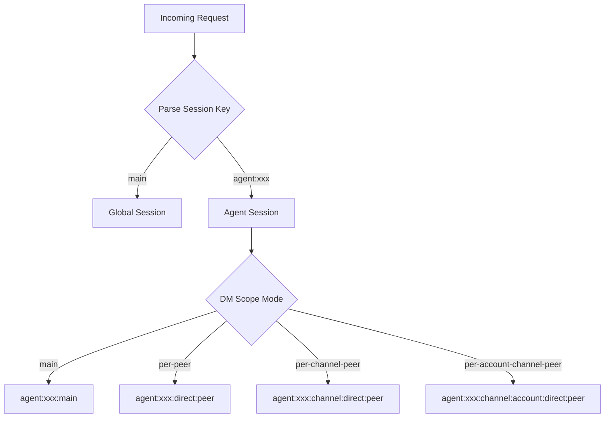
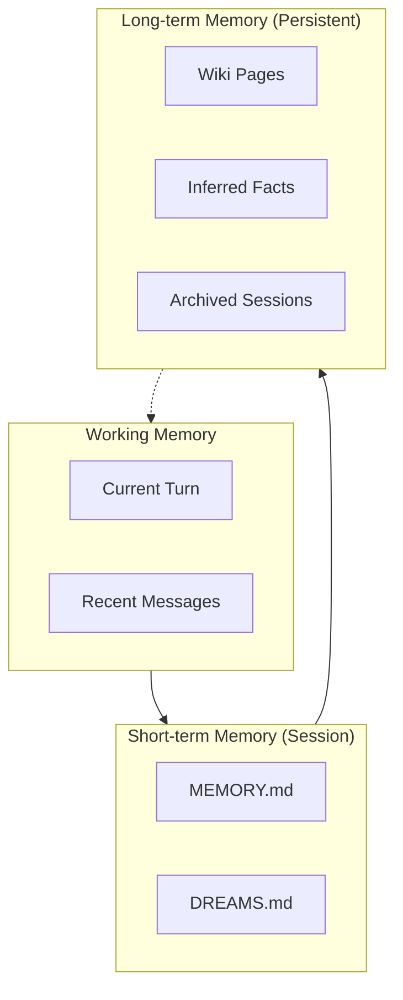
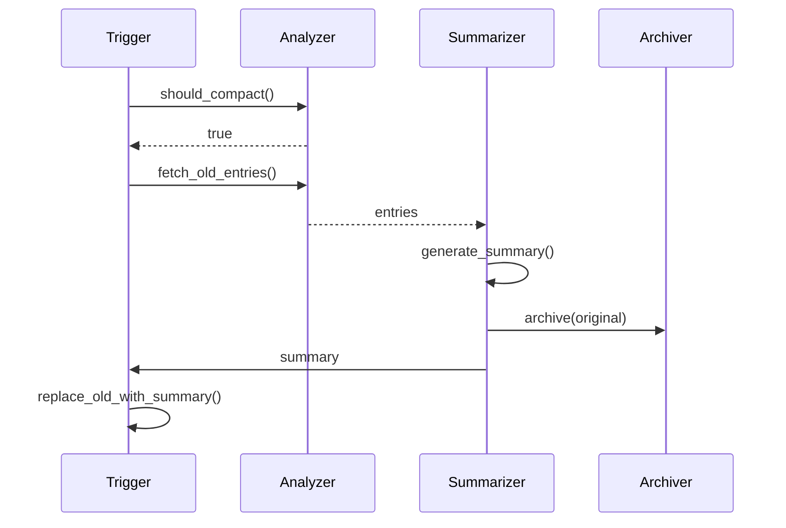

# Session and Memory

This part covers session management, memory architecture, and context assembly for OpenClaw agents.

## Contents

1. [Session Management](#session-management) - Session lifecycle and isolation
2. [Memory System](#memory-system) - Hierarchical memory architecture
3. [Context Engine](#context-engine) - Context assembly and token budgeting
4. [Memory Compaction](#memory-compaction) - Automatic memory optimization

## Session Management

### Session Key Architecture

Sessions use a structured key format for routing and isolation:

```typescript
// Session key format
type SessionKey =
  | "main"                                // Global shared session
  | `agent:${AgentId}:${Rest}`            // Agent-scoped session
  | `agent:${AgentId}:${Channel}:...`     // Channel-specific
  | `agent:${AgentId}:global`              // Global per-agent

// Key parsing
interface ParsedAgentSessionKey {
  agentId: string;
  rest: string;        // Everything after agentId
  accountId?: string;  // Optional account scope
}
```

### Session Resolution



### DM Scope Modes

| Mode | Key Format | Isolation |
|------|------------|-----------|
| `main` | `agent:id:main` | Single shared session |
| `per-peer` | `agent:id:direct:peer` | Per user across channels |
| `per-channel-peer` | `agent:id:channel:direct:peer` | Per user per channel |
| `per-account-channel-peer` | `agent:id:channel:account:direct:peer` | Per account+channel+user |

### Group Sessions

Group sessions follow similar patterns with peer kind:

```typescript
// Group key structure
interface GroupSessionKey {
  channel: string;      // "telegram", "discord"
  accountId?: string;    // Optional account scope
  peerKind: "group" | "channel";
  peerId: string;        // Platform-specific group ID
}

// Example keys
"telegram:group:chat123"
"discord:account1:group:channel456"
```

### Thread Sessions

Threads extend base sessions with a suffix:

```typescript
// Thread session key
const baseKey = "agent:main:telegram:direct:user123";
const threadKey = `${baseKey}:thread:thread456`;

// Parent session tracking
interface ThreadSession {
  sessionKey: string;
  parentSessionKey?: string;
  threadId: string;
}
```

## Memory System

### Three-Tier Model



### Memory Files

| File | Purpose | Content |
|------|---------|---------|
| `MEMORY.md` | Session context | Current tasks, ongoing work |
| `DREAMS.md` | Inferred knowledge | Model reflections, facts |
| `memory/YYYY-MM-DD.md` | Daily archives | Session summaries |
| `memory/archive/` | Long-term storage | Compacted sessions |

### Memory Entry Types

```typescript
type MemoryType =
  | "fact"        // Inferred from conversation
  | "task"        // Task or goal
  | "preference"  // User preference
  | "knowledge"   // General knowledge
  | "context"     // Conversation context
  | "summary"     // Compaction summary
  | "reflection"  // Model reflection
  | "commitment"; // Stated commitment

interface MemoryEntry {
  id: string;
  key: string;
  type: MemoryType;
  content: string;
  metadata: MemoryMetadata;
  createdAt: Date;
  updatedAt: Date;
  embedding?: number[];
}
```

## Context Engine

### Build Pipeline


### Token Budgeting

```typescript
interface ContextBudget {
  totalLimit: number;        // Model context window
  reserved: {
    system: number;          // System prompt
    tools: number;           // Tool definitions
    output: number;          // Response buffer
  };
  available: number;         // For context
  used: number;
}

// Example budgets
const budgets = {
  "gpt-4o": { totalLimit: 128000, available: 100000 },
  "claude-opus-4": { totalLimit: 200000, available: 180000 },
};
```

### Context Injection

Context is assembled from multiple sources:

```typescript
interface ContextAssembly {
  memory: MemoryEntry[];     // Retrieved memories
  recentMessages: Message[]; // Recent conversation
  systemPrompt: string;      // Base system prompt
  agentContext: AgentContext; // Agent-specific data
  tools: ToolDefinition[];   // Available tools
}
```

## Memory Compaction

### Compaction Triggers

| Trigger | Condition |
|---------|-----------|
| Token limit | Exceeds threshold |
| Idle | No activity for period |
| Manual | Explicit `/compact` command |
| Scheduled | Daily cron job |

### Compaction Strategies

```typescript
type CompactionStrategy =
  | { type: "summarize"; maxTokens: number }
  | { type: "selective"; keepTypes: MemoryType[] }
  | { type: "archive"; archiveOlderThan: number }
  | { type: "compress"; algorithm: "gzip" | "lz4" };
```

### Compaction Pipeline



## Multi-Agent Memory

### Memory Isolation

Each agent has isolated memory:

```typescript
// Agent-scoped memory paths
"~/.openclaw/agents/{agentId}/memory/"
```

### Shared Memory

Agents can opt into shared memory:

```typescript
config: {
  agents: {
    sharedMemory: {
      enabled: true,
      scope: "team",  // or "global"
    }
  }
}
```

## Related

- [Agent Architecture](/architecture-book/part-2-core-modules/02-agents) - Agent system
- [Gateway Core](/architecture-book/part-2-core-modules/01-gateway) - Gateway architecture
- [Config System](/architecture-book/part-7-config-system/01-config-schema) - Configuration