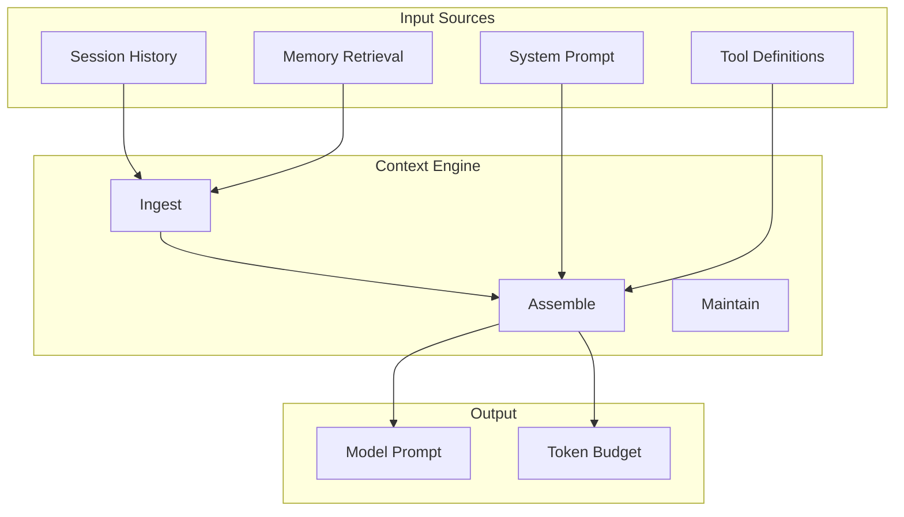
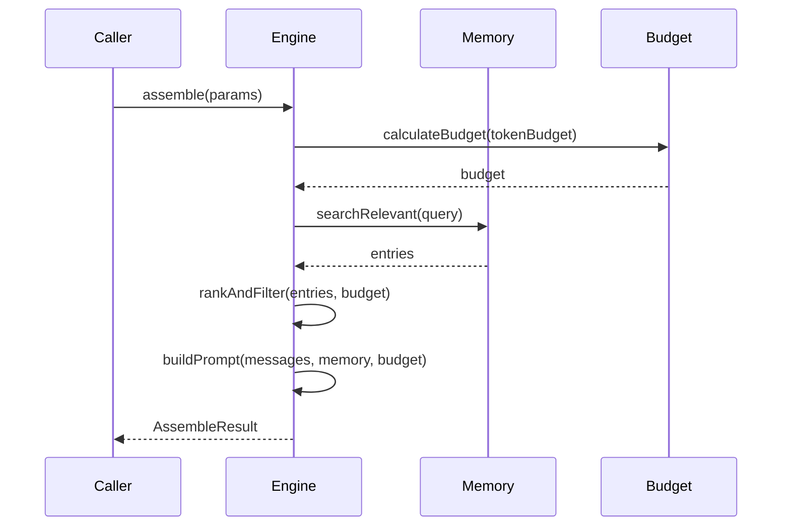
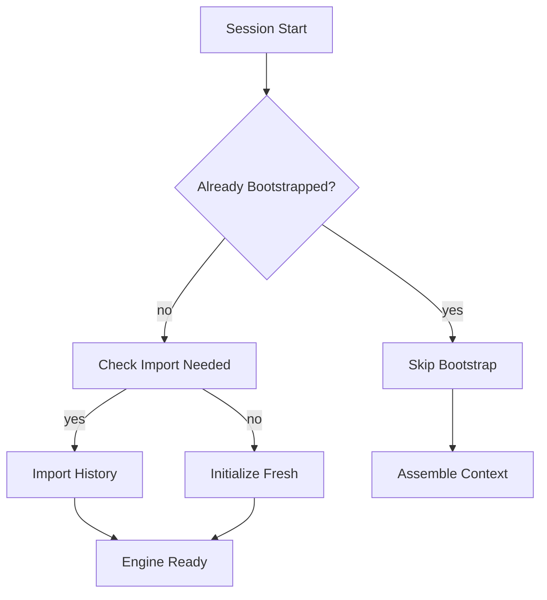

# Context Engine

## Overview

The Context Engine is a pluggable system responsible for assembling model context within token budgets. It manages the flow from session history to model input, handling retrieval, ranking, truncation, and injection.



## Core Interface

### ContextEngine Contract

```typescript
interface ContextEngine {
  readonly info: ContextEngineInfo;

  // Lifecycle
  bootstrap?(params: BootstrapParams): Promise<BootstrapResult>;
  maintain?(params: MaintainParams): Promise<ContextEngineMaintenanceResult>;

  // Message handling
  ingest(params: IngestParams): Promise<IngestResult>;
  ingestBatch?(params: IngestBatchParams): Promise<IngestBatchResult>;
  afterTurn?(params: AfterTurnParams): Promise<void>;

  // Context assembly
  assemble(params: AssembleParams): Promise<AssembleResult>;

  // Compaction
  compact(params: CompactParams): Promise<CompactResult>;

  // Subagent support
  prepareSubagentSpawn?(params: SubagentSpawnParams): Promise<SubagentSpawnPreparation | undefined>;
  onSubagentEnded?(params: { childSessionKey: string; reason: SubagentEndReason }): Promise<void>;

  // Cleanup
  dispose?(): Promise<void>;
}
```

### Engine Info

```typescript
interface ContextEngineInfo {
  id: string;
  name: string;
  version?: string;
  /** True when the engine manages its own compaction lifecycle. */
  ownsCompaction?: boolean;
  /** Controls how turn-triggered maintenance should be executed. */
  turnMaintenanceMode?: "foreground" | "background";
}
```

## Assembling Context

### The assemble() Method

The primary method for building model context:

```typescript
interface AssembleParams {
  sessionId: string;
  sessionKey?: string;
  messages: AgentMessage[];
  tokenBudget?: number;
  /** Tool names available for this run. */
  availableTools?: Set<string>;
  /** Active memory citation mode. */
  citationsMode?: MemoryCitationsMode;
  /** Current model identifier. */
  model?: string;
  /** The incoming user prompt for this turn. */
  prompt?: string;
}

interface AssembleResult {
  /** Ordered messages to use as model context */
  messages: AgentMessage[];
  /** Estimated total tokens in assembled context */
  estimatedTokens: number;
  /**
   * Controls which token estimate the runner treats as authoritative.
   * - "assembled": uses only the assembled prompt's estimate
   * - "preassembly_may_overflow": uses maximum of assembled and pre-assembly estimates
   */
  promptAuthority?: "assembled" | "preassembly_may_overflow";
  /** Optional context-engine-provided instructions prepended to system prompt */
  systemPromptAddition?: string;
  /** Projection lifecycle for hosts with persistent backend threads */
  contextProjection?: ContextEngineProjection;
}
```

### Token Budget Calculation

```typescript
interface ContextBudget {
  totalLimit: number;        // Model context window
  reserved: {
    system: number;          // System prompt tokens
    tools: number;          // Tool definitions tokens
    output: number;         // Response buffer tokens
  };
  available: number;        // For context assembly
  used: number;             // Current estimate
}

// Example budgets by model
const budgets: Record<string, number> = {
  "claude-opus-4-7": 200000,
  "claude-sonnet-4.7": 200000,
  "gpt-4o": 128000,
  "gpt-4o-mini": 128000,
};
```

### Context Assembly Pipeline



## Message Ingestion

### Single Message Ingest

```typescript
interface IngestParams {
  sessionId: string;
  sessionKey?: string;
  message: AgentMessage;
  /** True when the message belongs to a heartbeat run. */
  isHeartbeat?: boolean;
}

interface IngestResult {
  /** Whether the message was ingested (false if duplicate or no-op) */
  ingested: boolean;
}
```

### Batch Ingest

For efficiency, multiple messages can be ingested together:

```typescript
interface IngestBatchParams {
  sessionId: string;
  sessionKey?: string;
  messages: AgentMessage[];
  isHeartbeat?: boolean;
}

interface IngestBatchResult {
  /** Number of messages ingested from the supplied batch */
  ingestedCount: number;
}
```

## Session Bootstrap

### Bootstrap Flow



### Bootstrap Parameters

```typescript
interface BootstrapParams {
  sessionId: string;
  sessionKey?: string;
  sessionFile: string;
}

interface BootstrapResult {
  /** Whether bootstrap ran and initialized the engine's store */
  bootstrapped: boolean;
  /** Number of historical messages imported (if applicable) */
  importedMessages?: number;
  /** Optional reason when bootstrap was skipped */
  reason?: string;
}
```

## Maintenance

### Turn Maintenance

After each turn, engines can perform maintenance tasks:

```typescript
interface MaintainParams {
  sessionId: string;
  sessionKey?: string;
  sessionFile: string;
  runtimeContext?: ContextEngineRuntimeContext;
}

interface ContextEngineRuntimeContext {
  /** True when opted into consuming deferred compaction debt */
  allowDeferredCompactionExecution?: boolean;
  /** Runtime-resolved context window budget for the active model call */
  tokenBudget?: number;
  /** Best-effort current prompt/context token estimate */
  currentTokenCount?: number;
  /** Prompt-cache telemetry for cache-aware engines */
  promptCache?: ContextEnginePromptCacheInfo;
  /** Safe transcript rewrite helper */
  rewriteTranscriptEntries?: (
    request: TranscriptRewriteRequest,
  ) => Promise<TranscriptRewriteResult>;
  /** LLM completion capability */
  llm?: {
    complete: (params: LlmCompleteParams) => Promise<LlmCompleteResult>;
  };
}
```

### Transcript Rewrites

Engines can request safe branch-and-reappend transcript rewrites:

```typescript
interface TranscriptRewriteRequest {
  /** Message entry replacements to apply in one branch-and-reappend pass */
  replacements: TranscriptRewriteReplacement[];
}

interface TranscriptRewriteReplacement {
  /** Existing transcript entry id to replace */
  entryId: string;
  /** Replacement message content */
  message: AgentMessage;
}

interface TranscriptRewriteResult {
  /** Whether the active branch changed */
  changed: boolean;
  /** Estimated bytes removed from the active branch */
  bytesFreed: number;
  /** Number of transcript entries rewritten */
  rewrittenEntries: number;
  reason?: string;
}
```

## Context Projection

For hosts with persistent backend threads:

```typescript
interface ContextEngineProjection {
  /** How the assembled context should be projected */
  mode: "per_turn" | "thread_bootstrap";
  /** Stable context epoch. Changes trigger backend rotation */
  epoch?: string;
  /** Optional diagnostic fingerprint */
  fingerprint?: string;
}
```

## Engine Registry

### Registration

Context engines are registered via the registry:

```typescript
import { registerContextEngine, registerContextEngineForOwner } from "./registry.js";

// For public SDK plugins
registerContextEngine("my-engine", (ctx) => new MyContextEngine());

// For internal/core engines
registerContextEngineForOwner("my-engine", (ctx) => new MyEngine(), "core");
```

### Resolution

```typescript
import { resolveContextEngine, listContextEngineIds } from "./registry.js";

// Resolve the engine for a config
const engine = await resolveContextEngine(config, {
  agentDir: "/path/to/agent",
  workspaceDir: "/path/to/workspace",
});

// List available engines
const ids = listContextEngineIds(); // ["legacy", "my-engine", ...]
```

### Resolution Order

1. `config.plugins.slots.contextEngine` (explicit slot override)
2. Default slot value ("legacy")

## Memory Citations

### Citation Modes

```typescript
type MemoryCitationsMode = "auto" | "on" | "off";
```

| Mode | Behavior |
|------|----------|
| `auto` | Enable when model supports citations |
| `on` | Always enable |
| `off` | Disable |

### Citation Processing

```typescript
interface MemoryCitation {
  memoryId: string;
  source: "memory" | "wiki" | "session";
  relevanceScore: number;
  snippet: string;
}
```

## Subagent Spawn Preparation

Context engines can prepare state before subagent launch:

```typescript
interface SubagentSpawnParams {
  parentSessionKey: string;
  childSessionKey: string;
  contextMode?: "isolated" | "fork";
  parentSessionId?: string;
  parentSessionFile?: string;
  childSessionId?: string;
  childSessionFile?: string;
  ttlMs?: number;
}

interface SubagentSpawnPreparation {
  /** Roll back pre-spawn setup when spawn fails */
  rollback: () => void | Promise<void>;
}

type SubagentEndReason = "deleted" | "completed" | "swept" | "released";
```

## Related

- [Memory System](/architecture-book/part-8-session-memory/00-session-memory-overview) - Memory architecture
- [Memory Compaction](/architecture-book/part-8-session-memory/04-compaction) - Context reduction
- [Multi-Agent](/architecture-book/part-8-session-memory/05-multi-agent) - Multi-agent sessions
- [Agent System](/architecture-book/part-2-core-modules/02-agents) - Agent runtimes