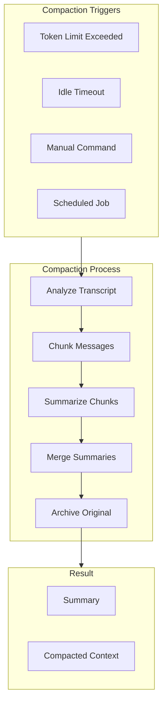
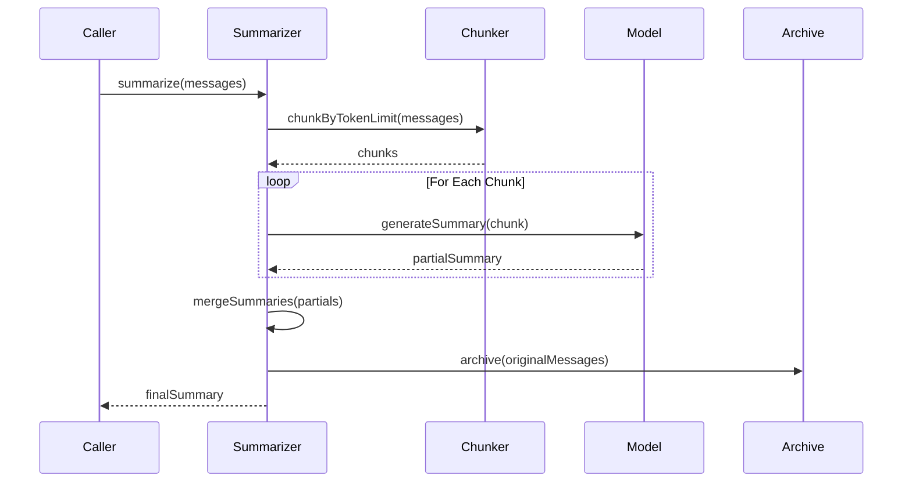

# Memory Compaction

## Overview

Memory compaction reduces context size when token limits are approached. OpenClaw uses a multi-stage summarization approach that handles oversized transcripts gracefully.



## Compaction Result

### CompactResult Structure

```typescript
interface CompactResult {
  ok: boolean;
  compacted: boolean;
  reason?: string;
  result?: {
    /** Generated summary text */
    summary?: string;
    /** First kept entry ID after compaction */
    firstKeptEntryId?: string;
    /** Token count before compaction */
    tokensBefore: number;
    /** Token count after compaction */
    tokensAfter?: number;
    /** Additional details from summarization */
    details?: unknown;
    /** New session ID if transcript was rotated */
    sessionId?: string;
    /** New session file if transcript was rotated */
    sessionFile?: string;
  };
}
```

## Chunking Strategies

### Token-Based Chunking

Messages are split by token count to fit within model limits:

```typescript
export const BASE_CHUNK_RATIO = 0.4;      // 40% of context window
export const MIN_CHUNK_RATIO = 0.15;     // Minimum 15%
export const SAFETY_MARGIN = 1.2;        // 20% buffer for estimation

/**
 * Chunk messages by maximum token limit.
 */
export function chunkMessagesByMaxTokens(
  messages: AgentMessage[],
  maxTokens: number,
): AgentMessage[][] {
  // Apply safety margin to compensate for estimateTokens() underestimation
  const effectiveMax = Math.max(1, Math.floor(maxTokens / SAFETY_MARGIN));

  const chunks: AgentMessage[][] = [];
  let currentChunk: AgentMessage[] = [];
  let currentTokens = 0;

  for (const message of messages) {
    const messageTokens = estimateCompactionMessageTokens(message);
    if (currentChunk.length > 0 && currentTokens + messageTokens > effectiveMax) {
      chunks.push(currentChunk);
      currentChunk = [];
      currentTokens = 0;
    }

    currentChunk.push(message);
    currentTokens += messageTokens;

    if (messageTokens > effectiveMax) {
      chunks.push(currentChunk);
      currentChunk = [];
      currentTokens = 0;
    }
  }

  if (currentChunk.length > 0) {
    chunks.push(currentChunk);
  }

  return chunks;
}
```

### Splitting by Token Share

For multi-part summarization:

```typescript
export const DEFAULT_PARTS = 2;

export function splitMessagesByTokenShare(
  messages: AgentMessage[],
  parts = DEFAULT_PARTS,
): AgentMessage[][] {
  if (messages.length === 0) return [];

  const totalTokens = estimateMessagesTokens(messages);
  const targetTokens = totalTokens / parts;

  const chunks: AgentMessage[][] = [];
  let current: AgentMessage[] = [];
  let currentTokens = 0;
  let pendingToolCallIds = new Set<string>();
  let pendingChunkStartIndex: number | null = null;

  for (const message of messages) {
    // Split logic preserves tool call/result pairing
    // ...
  }

  return chunks;
}
```

### Adaptive Chunk Ratio

Computes optimal chunk size based on average message size:

```typescript
export function computeAdaptiveChunkRatio(
  messages: AgentMessage[],
  contextWindow: number,
): number {
  if (messages.length === 0) {
    return BASE_CHUNK_RATIO;
  }

  const totalTokens = estimateMessagesTokens(messages);
  const avgTokens = totalTokens / messages.length;
  const safeAvgTokens = avgTokens * SAFETY_MARGIN;
  const avgRatio = safeAvgTokens / contextWindow;

  // Reduce chunk ratio for large messages
  if (avgRatio > 0.1) {
    const reduction = Math.min(avgRatio * 2, BASE_CHUNK_RATIO - MIN_CHUNK_RATIO);
    return Math.max(MIN_CHUNK_RATIO, BASE_CHUNK_RATIO - reduction);
  }

  return BASE_CHUNK_RATIO;
}
```

## Summarization Pipeline

### Full Pipeline Flow



### Progressive Summarization

```typescript
export async function summarizeInStages(params: {
  messages: AgentMessage[];
  model: ExtensionContext["model"];
  apiKey: string;
  reserveTokens: number;
  maxChunkTokens: number;
  contextWindow: number;
  customInstructions?: string;
  previousSummary?: string;
  parts?: number;
  minMessagesForSplit?: number;
}): Promise<string> {
  const { messages } = params;

  if (messages.length === 0) {
    return params.previousSummary ?? "No prior history.";
  }

  const minMessagesForSplit = Math.max(2, params.minMessagesForSplit ?? 4);
  const parts = normalizeParts(params.parts ?? DEFAULT_PARTS, messages.length);
  const totalTokens = estimateMessagesTokens(messages);

  // Single chunk if not enough content
  if (parts <= 1 || messages.length < minMessagesForSplit ||
      totalTokens <= params.maxChunkTokens) {
    return summarizeWithFallback(params);
  }

  // Split into parts, summarize each, merge
  const splits = splitMessagesByTokenShare(messages, parts);
  const partialSummaries: string[] = [];

  for (const chunk of splits) {
    const summary = await summarizeWithFallback({
      ...params,
      messages: chunk,
      previousSummary: partialSummaries.length > 0
        ? partialSummaries[partialSummaries.length - 1]
        : undefined,
    });
    partialSummaries.push(summary);
  }

  // Merge all partial summaries
  return mergePartialSummaries(partialSummaries, params);
}
```

### Fallback Strategy

Handles oversized messages that cannot be summarized:

```typescript
export async function summarizeWithFallback(params: {
  messages: AgentMessage[];
  contextWindow: number;
  // ... other params
}): Promise<string> {
  // Try full summarization first
  try {
    return await summarizeChunks(params);
  } catch (fullError) {
    log.warn(`Full summarization failed: ${fullError}`);
  }

  // Fallback: summarize only small messages
  const smallMessages: AgentMessage[] = [];
  const oversizedNotes: string[] = [];

  for (const msg of messages) {
    if (isOversizedForSummary(msg, params.contextWindow)) {
      oversizedNotes.push(
        `[Large ${msg.role} (~${tokens}K tokens) omitted]`
      );
    } else {
      smallMessages.push(msg);
    }
  }

  if (smallMessages.length > 0 && smallMessages.length !== messages.length) {
    try {
      const partialSummary = await summarizeChunks({
        ...params,
        messages: smallMessages,
      });
      return partialSummary + "\n\n" + oversizedNotes.join("\n");
    } catch (partialError) {
      log.warn(`Partial summarization also failed`);
    }
  }

  // Final fallback
  return `Context contained ${messages.length} messages ` +
    `(${oversizedNotes.length} oversized). Summary unavailable.`;
}
```

## Identifier Preservation

### Policy Types

```typescript
type AgentCompactionIdentifierPolicy = "strict" | "loose" | "off";

export const IDENTIFIER_PRESERVATION_INSTRUCTIONS =
  "Preserve all opaque identifiers exactly as written (no shortening " +
  "or reconstruction), including UUIDs, hashes, IDs, hostnames, IPs, " +
  "ports, URLs, and file names.";
```

### Summarization Instructions

```typescript
interface CompactionSummarizationInstructions {
  identifierPolicy?: AgentCompactionIdentifierPolicy;
  identifierInstructions?: string;
}

const MERGE_SUMMARIES_INSTRUCTIONS = [
  "Merge these partial summaries into a single cohesive summary.",
  "",
  "MUST PRESERVE:",
  "- Active tasks and their current status",
  "- Batch operation progress",
  "- The last thing the user requested",
  "- Decisions made and their rationale",
  "- TODOs, open questions, and constraints",
  "- Any commitments or follow-ups promised",
  "",
  "PRIORITIZE recent context over older history.",
].join("\n");
```

## Overhead Calculation

### Summarization Overhead

```typescript
// Overhead reserved for summarization prompt, system prompt,
// previous summary, and serialization wrappers
export const SUMMARIZATION_OVERHEAD_TOKENS = 4096;
```

### Token Estimation

```typescript
function estimateMessagesTokens(messages: AgentMessage[]): number {
  // SECURITY: toolResult.details and runtime-context entries
  // must never enter LLM-facing compaction
  const safe = stripToolResultDetails(
    stripRuntimeContextCustomMessages(messages)
  );
  return safe.reduce((sum, msg) => sum + estimateTokens(msg), 0);
}
```

## Handoff Summaries

For quota-limit handoffs between models:

```typescript
const HANDOFF_INSTRUCTIONS = [
  "Generate a concise recovery briefing for a new LLM taking over this session.",
  "The previous model hit a quota limit and you are providing the context.",
  "",
  "LEADER HIERARCHY REINFORCEMENT:",
  "- Explicitly state that the new model is the LEADER (Orchestrator).",
  "- Identify any active autonomous units as SUBORDINATES.",
  "- Instruct the new model to NOT perform the subordinate's task.",
  "",
  "MUST CAPTURE:",
  "- Current high-level goal and project path.",
  "- Status of the latest tool executions.",
  "- Critical files currently being modified.",
  "- Pending items and next intended steps.",
].join("\n");
```

## Compaction Triggers

### Automatic Triggers

| Trigger | Condition | Priority |
|---------|-----------|----------|
| Token limit | Exceeds threshold | High |
| Turn count | Every N turns | Medium |
| Idle timeout | No activity | Low |

### Manual Triggers

```typescript
// Via command
openclaw compact

// Via tool
await agent.tools.compact({ force: true });
```

### Runtime Integration

```typescript
interface CompactParams {
  sessionId: string;
  sessionKey?: string;
  sessionFile: string;
  tokenBudget?: number;
  /** Force compaction even below default threshold */
  force?: boolean;
  /** Current token estimate from active context */
  currentTokenCount?: number;
  /** Controls convergence target */
  compactionTarget?: "budget" | "threshold";
  customInstructions?: string;
  runtimeContext?: ContextEngineRuntimeContext;
}
```

## Safety Measures

### Oversized Message Detection

```typescript
/**
 * Check if a single message is too large to summarize.
 * If single message > 50% of context, it cannot be summarized safely.
 */
export function isOversizedForSummary(
  msg: AgentMessage,
  contextWindow: number
): boolean {
  const tokens = estimateCompactionMessageTokens(msg) * SAFETY_MARGIN;
  return tokens > contextWindow * 0.5;
}
```

### Retry Logic

```typescript
await retryAsync(
  () => generateSummary(chunk, model, reserveTokens, apiKey, signal, instructions, previousSummary),
  {
    attempts: 3,
    minDelayMs: 500,
    maxDelayMs: 5000,
    jitter: 0.2,
    label: "compaction/generateSummary",
    shouldRetry: (err) => !isAbortError(err) && !isTimeoutError(err),
  }
);
```

## Related

- [Context Engine](/architecture-book/part-8-session-memory/03-context-engine) - Context assembly
- [Memory System](/architecture-book/part-8-session-memory/00-session-memory-overview) - Memory architecture
- [Agent System](/architecture-book/part-2-core-modules/02-agents) - Agent runtimes
- [Session Management](/architecture-book/part-2-core-modules/03-sessions) - Session lifecycle