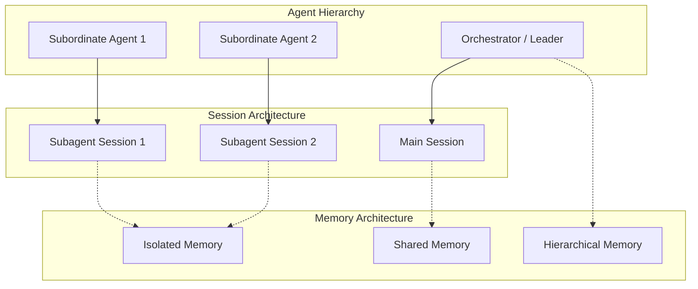
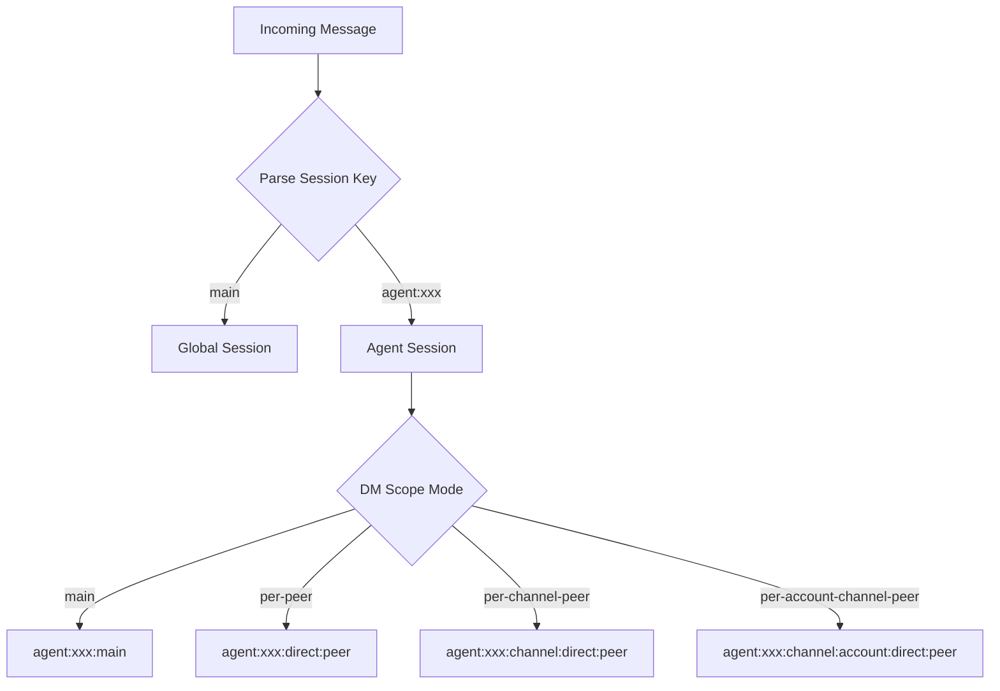

# Multi-Agent Memory and Routing

## Overview

Multi-agent setups require careful session routing, memory isolation, and context sharing strategies. OpenClaw provides flexible mechanisms for managing agent-to-agent communication and shared state.



## Session Key Architecture

### Key Format

Agent sessions use a structured key format:

```typescript
type SessionKey =
  | "main"                              // Global shared session
  | "global"                            // Global across agents
  | `agent:${AgentId}:${Rest}`          // Agent-scoped
  | `agent:${AgentId}:${Channel}:...`   // Channel-specific
  | `agent:${AgentId}:main`             // Main session per agent

// Key parsing
interface ParsedAgentSessionKey {
  agentId: string;
  rest: string;
  accountId?: string;
}
```

### Key Resolution

```typescript
import { parseAgentSessionKey, isSubagentSessionKey } from "../routing/session-key.js";

// Parse a session key
const parsed = parseAgentSessionKey("agent:myagent:telegram:direct:user123");
if (parsed) {
  console.log(parsed.agentId);    // "myagent"
  console.log(parsed.rest);       // "telegram:direct:user123"
}

// Check if it's a subagent session
const isSub = isSubagentSessionKey("agent:parent:agent:child:main");
```

## Agent Scope

### Scope Configuration

```typescript
interface AgentDefaultsConfig {
  session?: {
    dmScope?: DmScopeMode;
    groupScope?: GroupScopeMode;
  };
}

type DmScopeMode = "main" | "per-peer" | "per-channel-peer" | "per-account-channel-peer";
```

### Default Agent Directory

```typescript
// Agent directories follow this structure
"~/.openclaw/agents/{agentId}/"
```

## Subagent Spawning

### ACP Spawn Protocol

Agents can spawn child agents via the ACP (Agent Communication Protocol):

```typescript
interface SpawnAcpParams {
  task: string;                    // Task description
  label?: string;                  // Optional label
  agentId?: string;                // Target agent ID
  resumeSessionId?: string;         // Resume from session
  model?: string;                  // Specific model
  thinking?: string;               // Thinking mode
  runTimeoutSeconds?: number;       // Timeout
  cwd?: string;                    // Working directory
  mode?: SpawnAcpMode;             // "run" | "session"
  thread?: boolean;                // Thread mode
  sandbox?: SpawnAcpSandboxMode;   // Sandbox inheritance
  streamTo?: SpawnAcpStreamTarget; // Stream target
}

type SpawnAcpMode = "run" | "session";
type SpawnAcpSandboxMode = "inherit" | "require";
```

### Spawn Context

```typescript
interface SpawnAcpContext {
  agentSessionKey?: string;
  agentChannel?: string;
  agentAccountId?: string;
  agentTo?: string;
  agentThreadId?: string | number;
  agentGroupId?: string;
  agentGroupSpace?: string | null;
  agentMemberRoleIds?: string[];
  sandboxed?: boolean;
  inheritedToolAllowlist?: string[];
  inheritedToolDenylist?: string[];
}
```

## Context Engine Subagent Support

### Prepare Subagent Spawn

Context engines can prepare state before subagent launch:

```typescript
interface SubagentSpawnParams {
  parentSessionKey: string;
  childSessionKey: string;
  contextMode?: "isolated" | "fork";
  parentSessionId?: string;
  parentSessionFile?: string;
  childSessionId?: string;
  childSessionFile?: string;
  ttlMs?: number;
}

interface SubagentSpawnPreparation {
  rollback: () => void | Promise<void>;
}

type SubagentEndReason = "deleted" | "completed" | "swept" | "released";
```

### Context Modes

| Mode | Behavior |
|------|----------|
| `isolated` | Subagent has its own isolated context |
| `fork` | Subagent starts with forked copy of parent context |

## Memory Isolation Strategies

### Per-Agent Isolation

```mermaid
flowchart LR
    subgraph Agent1["Agent 1"]
        M1_1[memory/]
        M1_2[MEMORY.md]
        M1_3[DREAMS.md]
    end

    subgraph Agent2["Agent 2"]
        M2_1[memory/]
        M2_2[MEMORY.md]
        M2_3[DREAMS.md]
    end

    subgraph Agent3["Agent 3"]
        M3_1[memory/]
        M3_2[MEMORY.md]
        M3_3[DREAMS.md]
    end

    M1_1 -.x M2_1
    M1_1 -.x M3_1
    M2_1 -.x M3_1
```

### Shared Memory Configuration

```typescript
interface SharedMemoryConfig {
  enabled: boolean;
  scope: "team" | "global";
  syncInterval?: number;
}

// Configuration example
const config = {
  agents: {
    sharedMemory: {
      enabled: true,
      scope: "team",
    }
  }
};
```

## Session Routing

### Routing Resolution



### Session Resolution Code

```typescript
import { buildAgentPeerSessionKey, buildAgentMainSessionKey } from "../routing/session-key.js";

// Build a main session key
const mainKey = buildAgentMainSessionKey({
  agentId: "myagent",
  mainKey: "main",
});
// "agent:myagent:main"

// Build a peer session key
const peerKey = buildAgentPeerSessionKey({
  agentId: "myagent",
  channel: "telegram",
  peerKind: "direct",
  peerId: "user123",
  dmScope: "per-peer",
});
// "agent:myagent:telegram:direct:user123"
```

## Cross-Agent Communication

### Via Session Binding

```typescript
import { getSessionBindingService } from "../infra/outbound/session-binding-service.js";

// Create a session binding for cross-agent communication
const binding = await getSessionBindingService().createBinding({
  sourceSessionKey: "agent:parent:main",
  targetSessionKey: "agent:child:main",
  mode: "relay",
});
```

### Via Message Passing

```typescript
// Agent can send messages to other agents' sessions
await agent.sendMessage({
  sessionKey: "agent:other-agent:main",
  content: "Task completed: ...",
  metadata: {
    taskId: "123",
    correlationId: "abc",
  },
});
```

## Subagent Registry

### Active Run Tracking

```typescript
import { countActiveRunsForSession, getSubagentRunByChildSessionKey } from "./subagent-registry.js";

// Count active runs for a session
const activeCount = countActiveRunsForSession("agent:parent:main");

// Get subagent run by child session key
const run = getSubagentRunByChildSessionKey("agent:parent:agent:child:main");
```

### Depth Tracking

```typescript
import { getSubagentDepthFromSessionStore } from "./subagent-depth.js";

// Get nesting depth of a subagent
const depth = getSubagentDepthFromSessionStore(store, "agent:parent:agent:child:main");
// depth = 2
```

## Memory Promotion

### Dreaming System

Memory entries can be promoted through tiers:

```typescript
// Memory dreaming types
type MemoryLightDreamingSource = "daily" | "sessions" | "recall";
type MemoryDeepDreamingSource = "daily" | "memory" | "sessions" | "logs" | "recall";
type MemoryRemDreamingSource = "memory" | "daily" | "deep";

// Configuration
const dreamingConfig = {
  light: {
    cron: "0 */6 * * *",      // Every 6 hours
    lookbackDays: 2,
    limit: 100,
  },
  deep: {
    cron: "0 3 * * *",         // Daily at 3 AM
    limit: 10,
    minScore: 0.8,
  },
  rem: {
    cron: "0 5 * * 0",         // Weekly on Sunday at 5 AM
    lookbackDays: 7,
    limit: 10,
  },
};
```

## Model Fallback in Multi-Agent

### Automatic Fallback Probes

```typescript
interface AutoFallbackPrimaryProbe {
  provider: string;
  model: string;
  fallbackProvider: string;
  fallbackModel: string;
  fallbackAuthProfileId?: string;
  fallbackAuthProfileIdSource?: "auto" | "user";
}
```

### Fallback Resolution

```typescript
import { resolveAutoFallbackPrimaryProbe, markAutoFallbackPrimaryProbe } from "./agent-scope.ts";

// Check if fallback is needed
const probe = resolveAutoFallbackPrimaryProbe({
  entry: sessionEntry,
  primaryProvider: "anthropic",
  primaryModel: "claude-opus-4-7",
});

// Mark probe as active
if (probe) {
  markAutoFallbackPrimaryProbe({ probe, sessionKey });
}
```

## Subagent Capabilities

### Capability Resolution

```typescript
interface SubagentCapabilityStore {
  canSpawnSubagents?: boolean;
  maxChildren?: number;
  maxDepth?: number;
  allowedToolPatterns?: string[];
}

import { resolveSubagentCapabilities, resolveSubagentCapabilityStore } from "./subagent-capabilities.js";

const capabilities = resolveSubagentCapabilities(parentAgentId);
const store = resolveSubagentCapabilityStore(storeEntry);
```

## Event Handling

### Subagent Lifecycle Events

```typescript
// Events emitted during subagent lifecycle
type SubagentEvent =
  | { type: "spawn_start"; childSessionKey: string }
  | { type: "spawn_complete"; childSessionKey: string; runId: string }
  | { type: "spawn_failed"; childSessionKey: string; error: string }
  | { type: "subagent_ended"; childSessionKey: string; reason: SubagentEndReason };
```

### Event Listeners

```typescript
contextEngine.onSubagentEnded?.({
  childSessionKey: "agent:parent:agent:child:main",
  reason: "completed",
});
```

## Configuration Best Practices

### Hierarchical Setup

```typescript
const config = {
  agents: {
    // Orchestrator agent
    orchestrator: {
      slots: {
        contextEngine: "legacy",
      },
    },
    // Worker agents with isolation
    workers: {
      slots: {
        contextEngine: "isolated",
      },
    },
  },
  // Shared memory for team collaboration
  sharedMemory: {
    enabled: true,
    scope: "team",
  },
};
```

### Isolation vs Sharing

| Use Case | Strategy |
|----------|----------|
| Specialized worker agents | Full isolation |
| Collaborative agents | Shared memory |
| Parent-child delegation | Hierarchical with handoff |
| Concurrent tasks | Fork with independent memory |

## Related

- [Session Management](/architecture-book/part-2-core-modules/03-sessions) - Session architecture
- [Context Engine](/architecture-book/part-8-session-memory/03-context-engine) - Context assembly
- [Memory Compaction](/architecture-book/part-8-session-memory/04-compaction) - Context reduction
- [Memory System](/architecture-book/part-8-session-memory/02-memory-system) - Memory architecture
- [Agent System](/architecture-book/part-2-core-modules/02-agents) - Agent runtimes