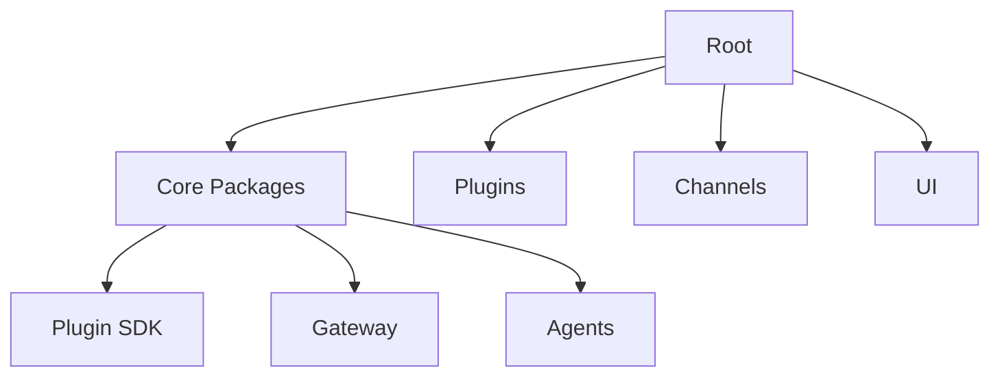

# Developer Guide

## Overview

This guide covers the development workflow, testing, building, and deployment of OpenClaw.

## Development Setup

### Prerequisites

- Node.js 22.19+ (Node 24 recommended)
- pnpm package manager
- Git

### Installation

```bash
# Clone the repository
git clone https://github.com/openclaw/openclaw

# Install dependencies
pnpm install

# Build the project
pnpm build
```

### Running Locally

```bash
# Start the gateway
pnpm dev

# Or with specific config
pnpm openclaw --config ~/.openclaw/config.toml
```

## Build System

### Build Commands

| Command | Description |
|---------|-------------|
| `pnpm build` | Build all packages |
| `pnpm build:watch` | Watch mode for development |
| `pnpm build:types` | Generate TypeScript declarations |

### Package Structure



## Testing

### Test Commands

```bash
# Run all tests
pnpm test

# Run specific test file
pnpm test src/agents/agent-command.test.ts

# Run tests with coverage
pnpm test:coverage

# Run changed tests only
pnpm test:changed

# Run tests in serial
pnpm test:serial
```

### Test Configuration

```typescript
// vitest.config.ts
export default defineConfig({
  test: {
    globals: true,
    environment: "node",
    setupFiles: ["test/helpers/setup.ts"],
    coverage: {
      provider: "v8",
      reporter: ["text", "json", "html"],
    },
  },
});
```

### Writing Tests

```typescript
// src/agents/example.test.ts
import { describe, it, expect, vi } from "vitest";

describe("Agent Command", () => {
  it("should parse command arguments", () => {
    const result = parseCommand("/help arg1 arg2");
    expect(result.command).toBe("help");
    expect(result.args).toEqual(["arg1", "arg2"]);
  });
});
```

## Code Quality

### Linting

```bash
# Run all linters
pnpm lint

# Run specific linter
pnpm lint:oxlint
pnpm lint:tsc

# Format code
pnpm format
```

### Type Checking

```bash
# Type check (tsgo lanes only)
pnpm tsgo

# Full type check
pnpm check:types
```

### Git Hooks

Pre-commit hooks run automatically:

```bash
# Format check
oxlint

# Type check
tsc --noEmit

# Tests
vitest run
```

## Debugging

### Logging

```typescript
// Enable debug logging
OPENCLAW_LOG_LEVEL=debug pnpm dev

// Log to file
OPENCLAW_LOG_FILE=/tmp/openclaw.log pnpm dev
```

### Remote Debugging

```bash
# Attach to running gateway
openclaw debug --attach

# View logs
./scripts/clawlog.sh
```

## Deployment

### Production Build

```bash
# Build for production
pnpm build --prod

# Bundle plugins
pnpm build:bundle
```

### Docker

```dockerfile
FROM node:24-alpine
WORKDIR /app
COPY package.json pnpm-lock.yaml ./
RUN pnpm install --frozen-lockfile
COPY . .
RUN pnpm build
CMD ["pnpm", "start"]
```

### Configuration

```bash
# Export config
openclaw config export > config.toml

# Validate config
openclaw doctor
```

## Related

- [Architecture Overview](/architecture-book/part-1-foundations/02-system-overview) - System design
- [Plugin System](/architecture-book/part-3-plugin-system/01-plugin-architecture) - Plugin development
- [Gateway Protocol](/architecture-book/part-4-gateway-protocol/01-protocol-overview) - Protocol details