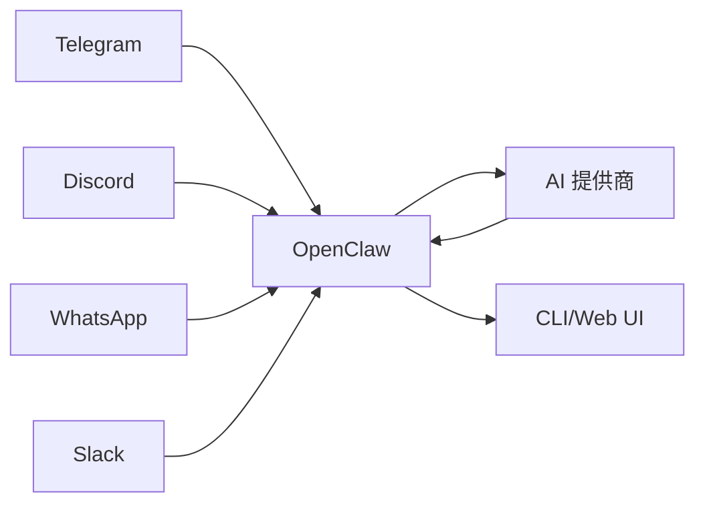
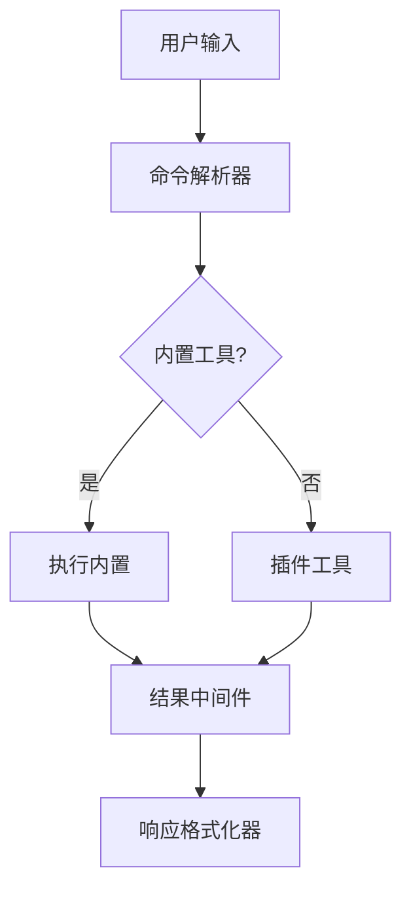

# OpenClaw 简介

## 什么是 OpenClaw？

OpenClaw 是一个开源、自托管的 AI 网关，用于桥接聊天平台与 AI Agent。它提供了统一的接口来管理多个消息通道、AI 提供商和 Agent 运行时，所有这些都在一个可组合的系统中完成。



## 设计理念

OpenClaw 遵循几个核心原则：

### 1. 基于插件的架构

OpenClaw 中的一切都是插件。提供商、通道、工具和运行时都是可以添加、移除或自定义的插件，无需修改核心系统。

**主要优势：**
- 无需核心更改即可扩展
- 组件之间有清晰的边界
- 独立的版本控制和部署

### 2. 自托管优先

OpenClaw 完全运行在您的基础设施上。没有供应商锁定，没有云依赖，完全控制您的数据。

**这意味着：**
- 您的消息永远不会离开您的服务器
- 完全的隐私和合规性
- 可以在离线环境和空气隔离环境中工作

### 3. 核心保持插件无关

核心系统不包含对特定提供商、通道或 AI 模型的内置知识。所有能力都通过定义良好的插件接口提供。

**设计含义：**
- 核心更小、更易于维护
- 插件生态系统可以独立发展
- 新集成不需要核心更改

### 4. 契约优先设计

插件通过严格的契约（TypeScript 接口和 Zod schema）进行通信。这确保了类型安全、验证和清晰的边界。

```typescript
// 示例：插件契约定义
interface ProviderContract {
  readonly id: string;
  readonly name: string;
  listModels(): Promise<Model[]>;
  createCompletion(params: CompletionParams): Promise<CompletionResult>;
}
```

## 核心功能

### 多通道支持

OpenClaw 原生支持众多消息平台：

| 通道 | 协议 | 功能 |
|---------|----------|--------|
| Telegram | Bot API | 消息、媒体、群组、频道 |
| Discord | Webhook/Gateway | 富消息、线程、斜杠命令 |
| WhatsApp | Baileys | 消息、媒体、状态 |
| Slack | Web API | 消息、模态、计划消息 |
| Matrix | Client-Server API | 端到端加密、房间 |
| iMessage | 私有 API | 消息、tapback |
| 飞书 | Webhook/API | 消息、卡片、小程序 |

### 多提供商支持

连接任何 AI 提供商，无需更改您的 Agent 代码：

| 提供商 | 类型 | 模型 |
|----------|------|--------|
| OpenAI | 官方 SDK | GPT-4, GPT-4o, o1, o3 |
| Anthropic | 官方 SDK | Claude 3.5, Claude 3.7 |
| Google | Vertex AI | Gemini 1.5, Gemini 2.0 |
| Azure | Azure 上的 OpenAI | GPT-4, Codex |
| Ollama | 本地 | Llama, Mistral, Qwen |
| LM Studio | 本地 | 任何 GGUF 模型 |
| DeepSeek | 官方 API | DeepSeek Coder, V3 |
| OpenRouter | 统一 API | 100+ 模型 |

### Agent 运行时

多种 Agent 执行策略：

- **PI Runtime** - 内置 Agent，直接访问模型
- **Codex Runtime** - OpenAI Codex app-server 集成
- **ACP Runtime** - 用于分布式 Agent 的 Agent 通信协议

### 工具系统

灵活的工具体系，带有钩子和中间件：



### 会话管理

复杂会话处理，支持隔离策略：

- **每用户会话** - 每个用户有独立的上下文
- **每通道会话** - 跨通道共享上下文
- **每群组会话** - 群组特定隔离
- **跨通道会话** - 跨平台统一上下文

### 内存系统

分层内存架构：

1. **工作内存** - 当前会话上下文
2. **短期内存** - 最近交互（MEMORY.md）
3. **长期内存** - 持久化知识（wiki）
4. **活跃内存** - 推断的事实和承诺

## 使用场景

### 个人 AI 助手

部署您自己的 AI 助手，连接到您喜欢的聊天平台：

```
Telegram Bot → OpenClaw → Claude → Telegram Bot
                 ↓
            长期内存
```

### 团队 Bot

为您的团队提供共享 AI 助手：

```
Slack/Discord → OpenClaw → GPT-4 → 团队响应
                    ↓
              共享知识库
```

### 多平台中心

跨所有通道的统一 AI 接口：

```
Telegram ─┐
WhatsApp ─┼→ OpenClaw → Agent → 响应
Discord ──┤           ↓
Slack ────┘         通道路由
```

### 企业网关

为您的组织提供的自托管 AI 网关：

- SSO 集成
- 审计日志
- 数据存储合规性
- 自定义插件

## 技术栈

| 组件 | 技术 |
|-----------|------------|
| 运行时 | Node.js 22+（推荐 Node 24） |
| 语言 | TypeScript（ESM，严格模式） |
| 构建 | tsdown |
| 测试 | Vitest |
| 包管理器 | pnpm |
| 协议 | WebSocket + JSON |
| 类型 | TypeBox + Zod |

## 许可

OpenClaw 采用 MIT 许可证发布，可免费用于个人和商业用途。

## 入门

下一章：[系统概览](02-system-overview) - 了解 OpenClaw 系统架构