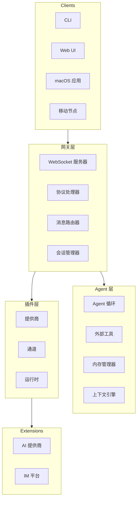
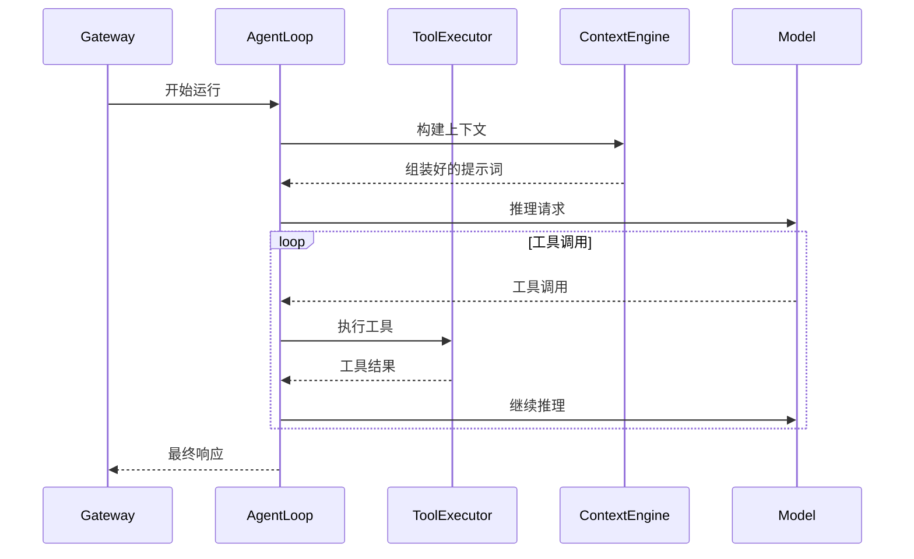
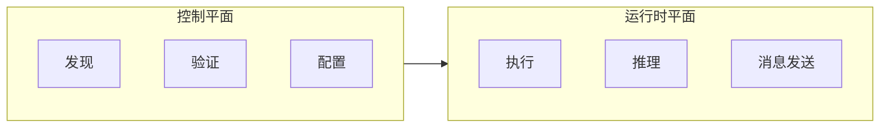
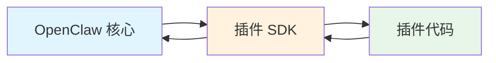
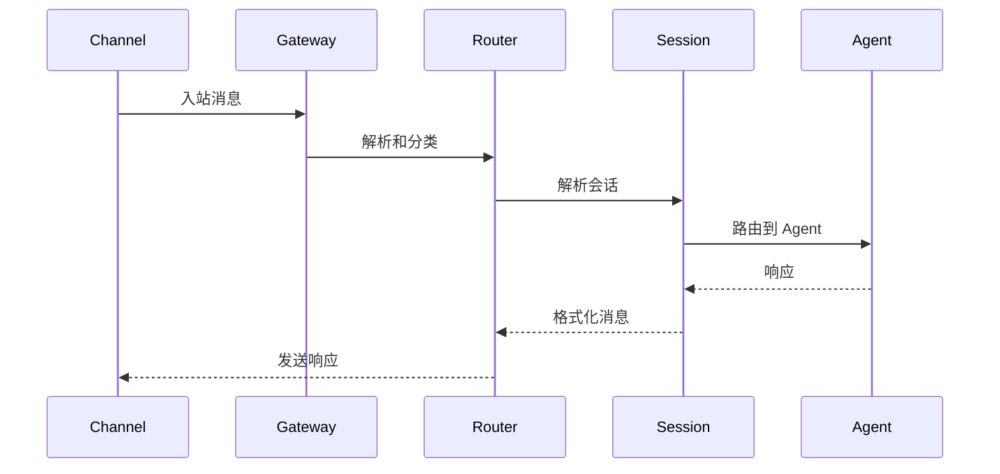
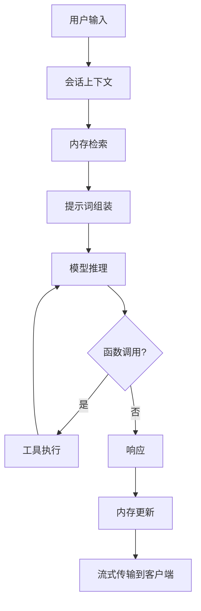
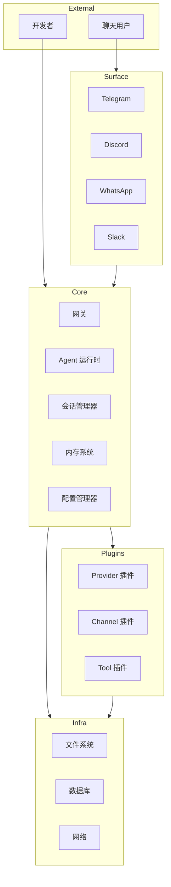

# 系统架构概述

## 分层架构

OpenClaw 遵循严格的分层架构，每个层级都有明确的职责和边界：



## 层级职责

### 网关层

网关是拥有所有消息界面的中心枢纽。

**核心职责：**

| 组件 | 职责 |
|-----------|----------------|
| WebSocket 服务器 | 客户端连接、协议封装 |
| 协议处理器 | 消息验证、路由 |
| 消息路由器 | 会话解析、Agent 路由 |
| 会话管理器 | 会话生命周期、状态管理 |

**关键不变量：**
- 每个主机恰好有一个网关控制消息
- 握手在通信前是强制的
- 所有客户端必须先认证才能使用

### Agent 层

Agent 层处理 AI 交互和工具执行。

**核心职责：**

| 组件 | 职责 |
|-----------|----------------|
| Agent 循环 | 推理、工具调用、响应流式处理 |
| 工具执行器 | 工具发现、执行、结果处理 |
| 内存管理器 | 上下文组装、压缩、检索 |
| 上下文引擎 | 提示词组装、Token 预算 |

**执行模型：**


### 插件层

插件层通过提供商、通道和运行时提供可扩展性。

**插件类型：**

| 类型 | 描述 | 示例 |
|------|-------------|--------|
| Provider | AI 提供商集成 | openai, anthropic |
| Channel | 消息平台 | telegram, discord |
| Tool | 外部能力 | browser, tavily |
| Runtime | Agent 执行 | pi, codex |
| Memory | 知识存储 | wiki, lancedb |

## 核心设计原则

### 1. 控制平面 vs 运行时平面

OpenClaw 将控制平面操作与运行时操作分离：

**控制平面（轻量级）：**
- 插件发现和清单
- Manifest 解析和验证
- 配置检查
- 状态查询

**运行时平面（按需）：**
- 实际插件执行
- 模型推理
- 消息发送
- 工具执行



### 2. Manifest 优先设计

插件配置在运行时执行前从 manifest 元数据派生：

```typescript
// Plugin manifest 定义行为
{
  "id": "provider/openai",
  "name": "OpenAI Provider",
  "version": "1.0.0",
  "providers": [{
    "id": "openai",
    "models": ["gpt-4o", "gpt-4o-mini"]
  }]
}

// 控制平面使用 manifest
const config = await pluginRegistry.validate(manifest);

// 运行时平面使用验证后的配置
const result = await provider.createCompletion(config);
```

### 3. 延迟加载

插件在启动时不预加载，而是按需加载：

```typescript
// 延迟激活模式
const loader = new PluginRuntimeLoader({
  lazy: true,
  manifestResolver: new ManifestResolver(),
});

await loader.activate("provider/openai", { lazy: true });
```

### 4. 契约边界

插件仅通过定义良好的契约进入核心：



**允许的交叉：**
- `openclaw/plugin-sdk/*` - 公共 SDK 表面
- `manifest.json` - 仅元数据
- 注入的运行时辅助函数
- 文档化的 barrel 导出

**禁止的交叉：**
- `src/**` 内部模块
- 其他插件内部
- 核心实现细节

## 数据流

### 消息流（入站）



### Agent 执行流



## 组件图

### 完整系统



## 状态管理

### 会话状态

每个会话维护独立状态：

```typescript
interface SessionState {
  id: string;
  channel: string;
  context: ConversationContext;
  memory: MemorySnapshot;
  tools: ToolBindings;
  metadata: SessionMetadata;
}
```

### 网关状态

网关维护全局状态：

```typescript
interface GatewayState {
  sessions: Map<SessionKey, Session>;
  plugins: PluginRegistry;
  channels: ChannelRegistry;
  providers: ProviderRegistry;
  health: HealthStatus;
}
```

## 错误处理

### 层级特定错误

每个层级处理自己的错误领域：

| 层级 | 错误类型 | 处理方式 |
|-------|------------|----------|
| 网关 | 连接、协议错误 | 拒绝并关闭 |
| Agent | 推理、工具错误 | 优雅降级 |
| 插件 | 加载、执行错误 | 插件隔离 |
| 通道 | 发送、接收错误 | 重试和排队 |

### 错误传播

错误通过上下文向上层层传播：

```typescript
// 带上下文的错误
throw new PluginError("provider/openai", "Model unavailable", {
  cause: originalError,
  recoverable: true,
  retryAfter: 5000,
});
```

## 相关内容

- [核心概念](/architecture-book/part-1-foundations/03-core-concepts) - 关键抽象
- [网关协议](/architecture-book/part-4-gateway-protocol/01-protocol-overview) - 协议详情
- [插件系统](/architecture-book/part-3-plugin-system/01-plugin-architecture) - 插件架构