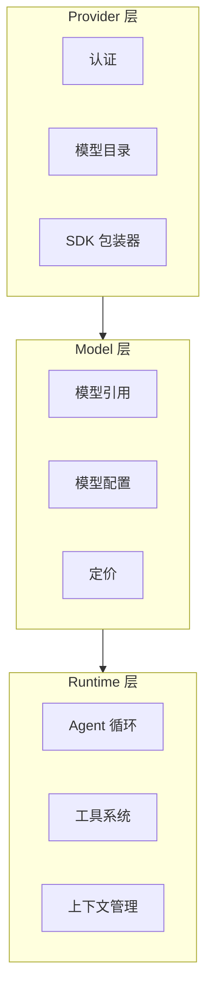
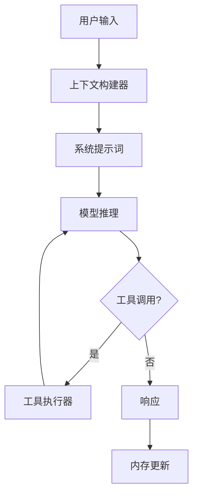
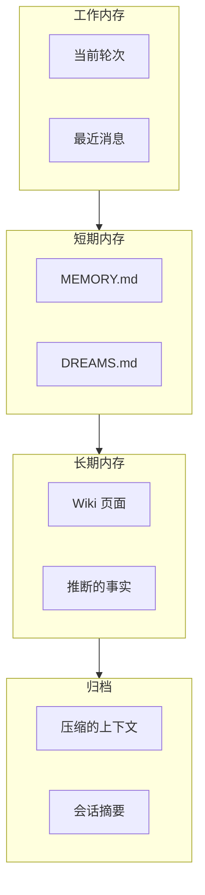
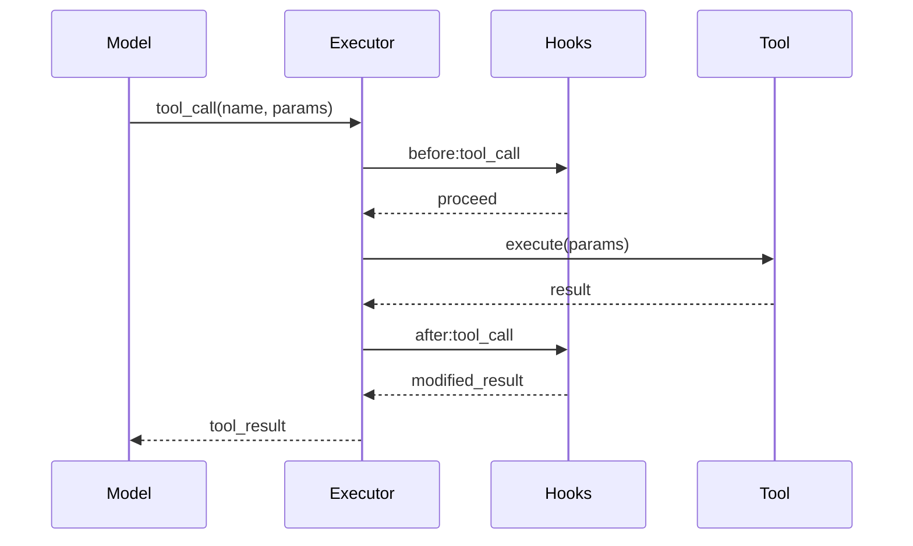

# 核心设计概念

## 三层模型

OpenClaw 区分三个不同的层级，共同提供 AI 能力：



| 层级 | 职责 | 示例 |
|-------|----------------|----------|
| Provider | 认证、发现、SDK 集成 | openai, anthropic |
| Model | 模型选择、配置 | gpt-4o, claude-opus-4 |
| Runtime | 循环执行、工具调用 | pi, codex |

### 为什么这个区别很重要

**Provider ≠ Model:**
- 一个 Provider 可以服务多个模型
- 模型有不同的能力和定价
- 切换模型不需要更改 Provider 凭证

**Model ≠ Runtime:**
- 同一个模型可以在不同的运行时下运行
- 运行时提供不同的执行策略
- 工具接口是运行时特定的

## Provider 系统

### Provider 定义

Provider 是一个包装 AI 服务 SDK 的插件：

```typescript
interface Provider {
  readonly id: string;           // "openai", "anthropic"
  readonly name: string;          // "OpenAI", "Anthropic"
  readonly sdk: SDK;              // 官方或自定义 SDK
  readonly authProfiles: AuthProfile[];
  readonly defaultModel?: string;
}
```

### Provider 接口

```typescript
interface ProviderContract {
  // 发现
  listModels(): Promise<Model[]>;
  getModel(id: string): Promise<Model | null>;

  // 推理
  createCompletion(params: CompletionParams): Promise<AsyncIterable<CompletionDelta>>;
  createStructuredCompletion<T>(params: StructuredCompletionParams): Promise<T>;

  // 健康检查
  healthCheck(): Promise<HealthStatus>;
}
```

### Provider 类型

| 类型 | 描述 | 示例 |
|------|-------------|--------|
| Official | 原生 SDK 集成 | openai, anthropic |
| Proxy | 统一 API 网关 | openrouter |
| Local | 自托管模型 | ollama, lmstudio |
| Cloud | 云平台集成 | vertex-ai, azure-openai |

## Model 系统

### 模型引用

模型由编码 Provider 和模型的引用字符串标识：

```
openai:gpt-4o
anthropic:claude-opus-4-7
google:gemini-2.0-flash
ollama:llama3.1:8b
```

### 模型能力

```typescript
interface Model {
  readonly ref: string;                    // Provider 范围的 ID
  readonly name: string;                    // 人类可读名称
  readonly provider: string;                // Provider ID

  // 能力
  readonly maxTokens: number;
  readonly supportsStreaming: boolean;
  readonly supportsFunctionCalling: boolean;
  readonly supportsVision: boolean;
  readonly supportsJSONMode: boolean;

  // 上下文
  readonly contextWindow: number;
  readonly maxOutputTokens: number;

  // 定价（每 1M Token）
  readonly inputCost?: number;
  readonly outputCost?: number;
}
```

### 模型选择

基于能力要求选择模型：

```typescript
const model = await provider.selectModel({
  requiredCapabilities: ["streaming", "function_calling"],
  maxTokens: 4096,
  preferCheapest: false,
});
```

## Runtime 系统

### Runtime 定义

运行时是 Agent 逻辑的执行引擎：

| Runtime | 类型 | 描述 |
|---------|------|-------------|
| PI | Embedded | 内置 Agent，直接访问模型 |
| Codex | External | OpenAI Codex app-server 集成 |
| ACP | Protocol | 用于分布式 Agent 的 Agent 通信协议 |

### PI Runtime

直接模型访问的内置运行时：



### Runtime 接口

```typescript
interface AgentRuntime {
  readonly id: string;
  readonly type: "pi" | "codex" | "acp";

  // 生命周期
  start(config: RuntimeConfig): Promise<void>;
  stop(): Promise<void>;

  // 执行
  run(params: RunParams): AsyncIterable<RunEvent>;
  abort(runId: string): Promise<void>;

  // 工具
  registerTools(tools: Tool[]): void;
  unregisterTools(toolNames: string[]): void;
}
```

## Channel 系统

### Channel 定义

Channel 是消息平台的抽象：

```typescript
interface Channel {
  readonly id: string;              // "telegram", "discord"
  readonly platform: string;         // 平台标识符

  // 连接
  connect(): Promise<void>;
  disconnect(): Promise<void>;

  // 消息
  send(target: Target, message: OutboundMessage): Promise<void>;
  editMessage(target: Target, messageId: string, content: string): Promise<void>;
  deleteMessage(target: Target, messageId: string): Promise<void>;

  // 事件
  onMessage(handler: MessageHandler): void;
  onReaction(handler: ReactionHandler): void;
  onEdit(handler: EditHandler): void;
}
```

### Channel 功能

| 功能 | 描述 | 支持 |
|---------|-------------|--------|
| 文本 | 纯文本消息 | 所有通道 |
| 媒体 | 图片、视频、文件 | 大多数通道 |
| 格式 | Markdown、HTML | 因平台而异 |
| 反应 | Emoji 反应 | 所有通道 |
| 线程 | 线程回复 | Discord, Slack |
| 临时 | 临时消息 | 某些通道 |

### Channel vs Plugin

Channel 插件包装 Channel 实现：

```typescript
// Channel 插件结构
{
  "id": "channel/telegram",
  "name": "Telegram",
  "type": "channel",
  "entry": "./dist/index.js",
  "channel": {
    "apiId": "telegram-bot-token",
    "commands": ["/start", "/help", "/settings"]
  }
}
```

## Session 系统

### Session 定义

Session 是隔离的对话上下文：

```typescript
interface Session {
  readonly id: string;
  readonly key: SessionKey;
  readonly channel: ChannelRef;
  readonly agent: AgentRef;
  readonly createdAt: Date;

  // 状态
  context: ConversationContext;
  memory: MemorySnapshot;
  metadata: SessionMetadata;

  // 操作
  addMessage(message: Message): Promise<void>;
  getHistory(limit?: number): Promise<Message[]>;
  reset(): Promise<void>;
}
```

### Session Key

Session Key 决定隔离边界：

```typescript
type SessionKey = {
  channel: string;           // "telegram:123456789"
  scope: SessionScope;       // 隔离级别
  target?: string;           // DM、群组或广播目标
};
```

### Session 隔离策略

| 策略 | Key 模式 | 使用场景 |
|----------|-------------|----------|
| Per-user | `{channel}:{userId}` | 私人对话 |
| Per-channel | `{channel}` | 通道范围的上下文 |
| Per-group | `{channel}:{groupId}` | 群组讨论 |
| Global | `main` | 单个共享上下文 |

## Memory 系统

### 内存架构

OpenClaw 使用分层内存系统：



### 内存文件

| 文件 | 用途 | 内容 |
|------|---------|----------|
| MEMORY.md | 会话内存 | 当前会话上下文 |
| DREAMS.md | 推断知识 | 模型生成的反思 |
| `memory/*.md` | 归档会话 | 历史上下文 |

### 内存操作

```typescript
interface MemoryManager {
  // 检索
  search(query: string, limit?: number): Promise<MemoryResult[]>;
  get(key: string): Promise<MemoryEntry | null>;

  // 存储
  store(entry: MemoryEntry): Promise<void>;
  update(key: string, entry: Partial<MemoryEntry>): Promise<void>;

  // 压缩
  compact(sessionId: string, strategy: CompactionStrategy): Promise<void>;
}
```

## Tool 系统

### Tool 定义

工具扩展 Agent 超越模型推理的能力：

```typescript
interface Tool {
  readonly name: string;               // "wikipedia_search"
  readonly description: string;       // 人类可读描述
  readonly schema: JsonSchema;         // 输入验证 schema

  execute(params: unknown): Promise<ToolResult>;
}
```

### Tool 类别

| 类别 | 示例 | 用途 |
|----------|----------|----------|
| 搜索 | web_search, wikipedia | 信息检索 |
| 计算 | calculator, code_execute | 数据处理 |
| 文件 | read_file, write_file | 文件操作 |
| Web | fetch_url, browser | Web 交互 |
| 消息 | send_email, send_sms | 外部通信 |

### Tool 执行管道



## Hook 系统

### Hook 类型

Hook 在关键点提供可扩展性：

```typescript
interface Hooks {
  // 生命周期 Hook
  "gateway:start": () => Promise<void>;
  "gateway:stop": () => Promise<void>;

  // 消息 Hook
  "message:receive": (msg: Message) => Promise<void>;
  "message:send": (msg: OutboundMessage) => Promise<void>;
  "message:error": (err: Error) => Promise<void>;

  // Agent Hook
  "agent:before_run": (params: RunParams) => Promise<void>;
  "agent:after_run": (result: RunResult) => Promise<void>;

  // 工具 Hook
  "tool:before": (tool: Tool, params: unknown) => Promise<void>;
  "tool:after": (tool: Tool, result: ToolResult) => Promise<void>;
}
```

### Hook 注册

```typescript
// 插件 Hook
export const hooks = {
  "message:receive": async (msg) => {
    // 处理传入消息
    return msg;
  },
};
```

## 相关内容

- [网关](/architecture-book/part-2-core-modules/01-gateway) - 网关实现
- [Agent](/architecture-book/part-2-core-modules/02-agents) - Agent 运行时
- [会话](/architecture-book/part-2-core-modules/03-sessions) - 会话管理
- [内存](/architecture-book/part-2-core-modules/04-memory) - 内存系统