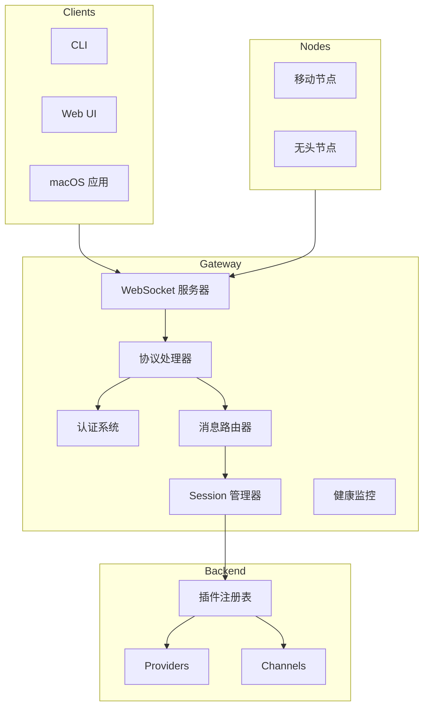
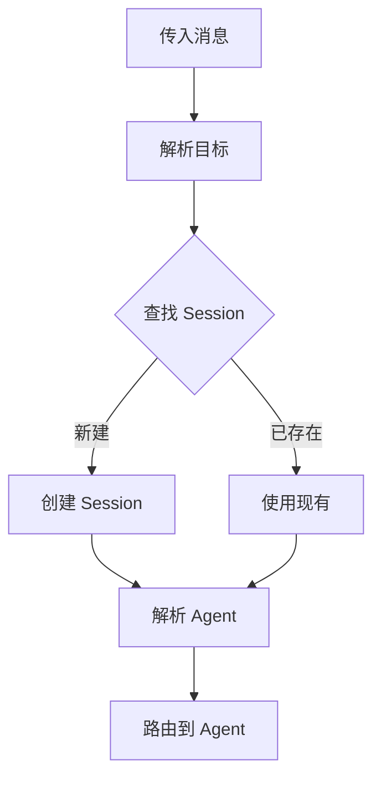
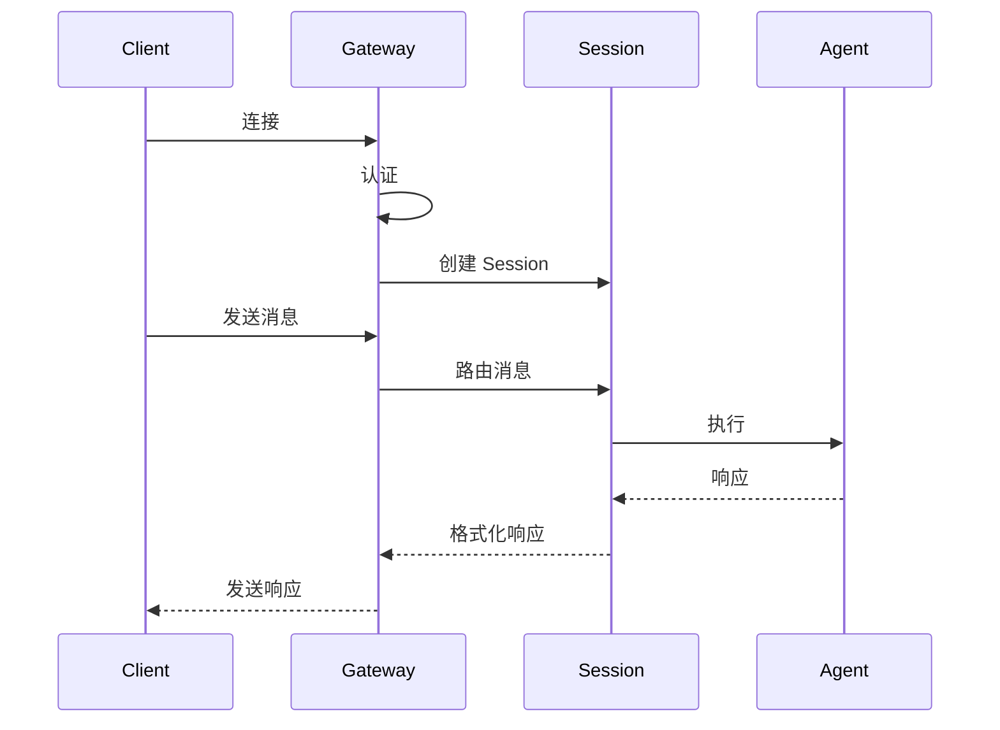
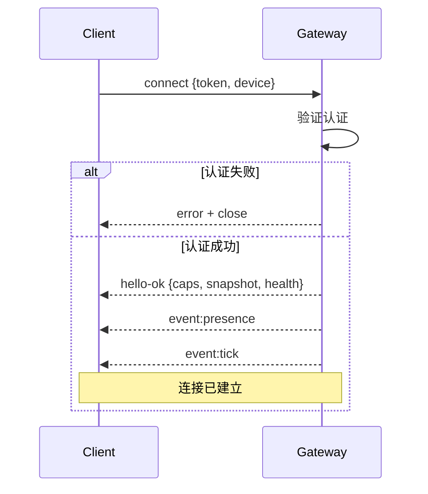

# Gateway 核心

## 概述

Gateway 是 OpenClaw 的核心枢纽，拥有所有消息层并为客户端和节点提供类型化的 WebSocket API。



## 架构原则

### 单一数据源

Gateway 维护以下内容：

1. **Session 状态** - 所有活跃的对话
2. **插件注册表** - 已加载的插件元数据
3. **Channel 连接** - 活跃的消息平台连接
4. **健康状态** - 系统和组件健康状态

### 协议优先设计

Gateway 暴露类型化的 WebSocket API：

```typescript
// 请求
{ type: "req", id: "uuid", method: "agent", params: {...} }

// 响应
{ type: "res", id: "uuid", ok: true, payload: {...} }

// 事件（服务端推送）
{ type: "event", event: "agent", payload: {...} }
```

## 组件职责

### WebSocket 服务器

Gateway 在可配置的 host/port（默认 `127.0.0.1:18789`）上监听：

```typescript
interface GatewayConfig {
  host: string;      // 绑定地址
  port: number;      // 端口号
  auth: AuthConfig;  // 认证模式
}

// 连接生命周期
async function handleConnection(ws: WebSocket, req: IncomingMessage) {
  // 1. 解析第一帧
  // 2. 验证握手
  // 3. 认证
  // 4. 建立 Session
  // 5. 路由消息
}
```

### 协议处理器

协议处理器验证和路由消息：

```typescript
interface ProtocolHandler {
  validateFrame(frame: unknown): ParsedFrame | ValidationError;
  handleRequest(frame: RequestFrame): Promise<ResponseFrame>;
  handleEvent(frame: EventFrame): void;
}
```

### 认证系统

支持的认证模式：

| 模式 | 描述 | 使用场景 |
|------|------|----------|
| `token` | 共享密钥 Token | 本地开发 |
| `password` | 基于密码的认证 | 单用户 |
| `trusted-proxy` | 信任上游代理 | 位于反向代理后 |
| `tailscale` | Tailscale Serve 集成 | 远程访问 |
| `none` | 无认证（仅本地） | 仅开发 |

### 消息路由器

路由器将消息解析到 Session 和 Agent：



## Session 管理

### Session Key 格式

Session 由 Channel 和 Target 键控：

```typescript
type SessionKey = {
  channel: string;     // "telegram"
  peer: string;        // "123456789" 或 "channel:chat_id"
  scope: SessionScope; // "dm", "group", "channel"
};
```

### Session 生命周期



## 连接生命周期

### 握手协议

1. **客户端连接** 首帧为 `connect`
2. **Gateway 验证** 认证凭证
3. **Gateway 响应** `hello-ok` 包含：
   - 服务端能力
   - 当前状态快照
   - 健康状态



### 幂等性

有副作用的操作需要幂等性密钥：

```typescript
interface IdempotentRequest {
  idemKey: string;      // 客户端提供的密钥
  method: string;       // 例如 "agent", "send"
  params: unknown;       // 方法参数
}
```

## 健康监控

### 健康检查

Gateway 暴露健康状态：

```typescript
interface HealthStatus {
  status: "healthy" | "degraded" | "unhealthy";
  uptime: number;
  components: {
    plugins: ComponentHealth;
    channels: ComponentHealth;
    sessions: ComponentHealth;
  };
}
```

### 事件发射

健康事件定期发射：

```typescript
// 定期 tick 事件
{ type: "event", event: "tick", payload: { health, stats } }

// 状态事件
{ type: "event", event: "presence", payload: { channels, agents } }
```

## Canvas 主机

Gateway 提供 Canvas 文件：

| 路径 | 用途 |
|------|------|
| `/__openclaw__/canvas/` | Agent 可编辑的 HTML/CSS/JS |
| `/__openclaw__/a2ui/` | A2UI 主机 |

## Gateway 生命周期

### 启动序列

```typescript
async function startGateway(config: OpenClawConfig) {
  // 1. 加载配置
  // 2. 初始化插件注册表
  // 3. 连接 Channels
  // 4. 启动 WebSocket 服务器
  // 5. 开始健康监控
  // 6. 运行启动序列（可选）
}
```

### 停止序列

```typescript
async function stopGateway() {
  // 1. 停止接受连接
  // 2. 通知已连接的客户端
  // 3. 保存 Session 状态
  // 4. 断开 Channels
  // 5. 卸载插件
  // 6. 释放资源
}
```

## TypeBox Schema

协议使用 TypeBox 进行 schema 定义：

```typescript
import { Type } from "@sinclair/typebox";

// 示例：连接请求
const ConnectRequestSchema = Type.Object({
  type: Type.Literal("connect"),
  params: Type.Object({
    auth: AuthSchema,
    device: DeviceSchema,
    client: ClientInfoSchema,
  }),
});

// 示例：Agent 请求
const AgentRequestSchema = Type.Object({
  type: Type.Literal("req"),
  id: Type.String(),
  method: Type.Literal("agent"),
  params: Type.Object({
    sessionKey: Type.String(),
    agentId: Type.String(),
    input: Type.String(),
    idemKey: Type.Optional(Type.String()),
  }),
});
```

## 错误处理

### 错误响应

```typescript
interface ErrorResponse {
  type: "res";
  id: string;           // 原始请求 ID
  ok: false;
  error: {
    code: string;        // 例如 "AUTH_FAILED"
    message: string;     // 人类可读
    details?: unknown;    // 额外上下文
  };
}
```

### 错误码

| 代码 | 描述 |
|------|------|
| `AUTH_FAILED` | 认证失败 |
| `VALIDATION_ERROR` | 请求验证失败 |
| `SESSION_NOT_FOUND` | Session 不存在 |
| `AGENT_ERROR` | Agent 执行错误 |
| `RATE_LIMITED` | 请求过多 |
| `INTERNAL_ERROR` | 服务器错误 |

## 远程访问

### Tailscale 集成

当 `gateway.auth.allowTailscale: true` 时：

1. Tailscale 在 Header 中提供身份
2. Gateway 信任 Tailscale 身份
3. 无需额外认证

### SSH 隧道

```bash
ssh -N -L 18789:127.0.0.1:18789 user@host
```

通过隧道应用相同的握手和 Token 认证。

## 相关

- [协议概述](/architecture-book/part-4-gateway-protocol/01-protocol-overview) - 协议详情
- [WebSocket 传输](/architecture-book/part-4-gateway-protocol/02-ws-transport) - 传输层
- [事件和 RPC](/architecture-book/part-4-gateway-protocol/04-events-and-rpc) - 通信模式
- [Session 管理](/architecture-book/part-8-session-memory/01-session-management) - Session 架构
