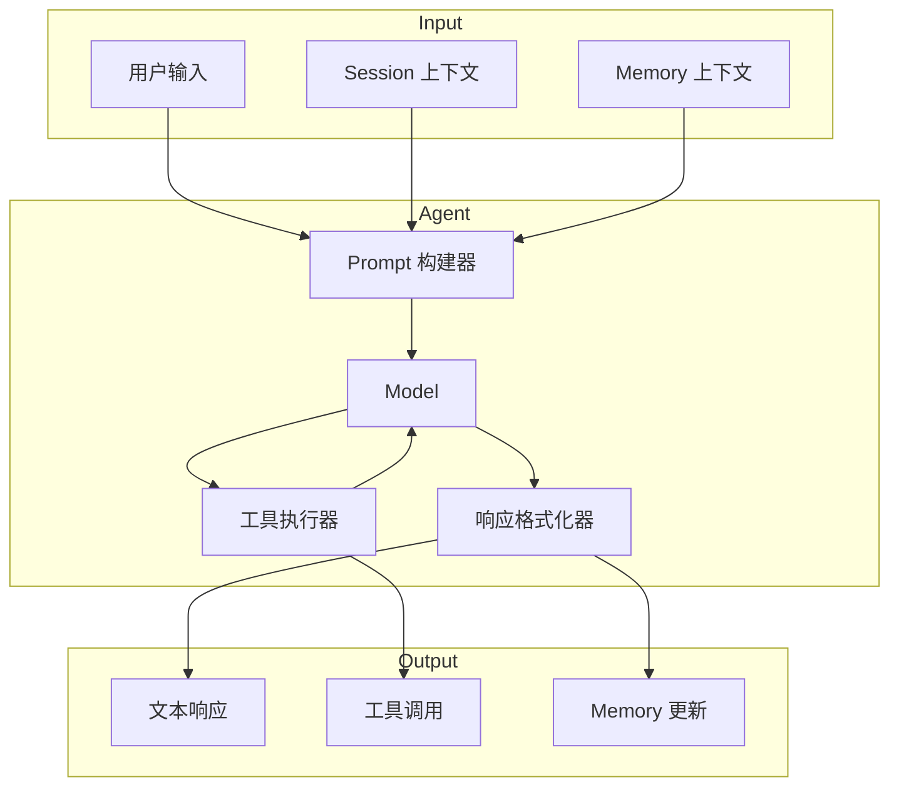
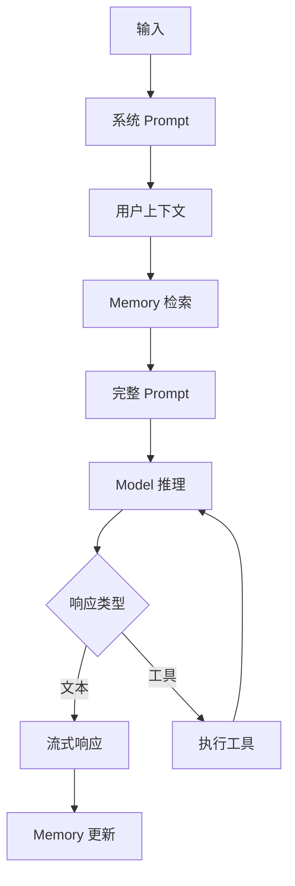
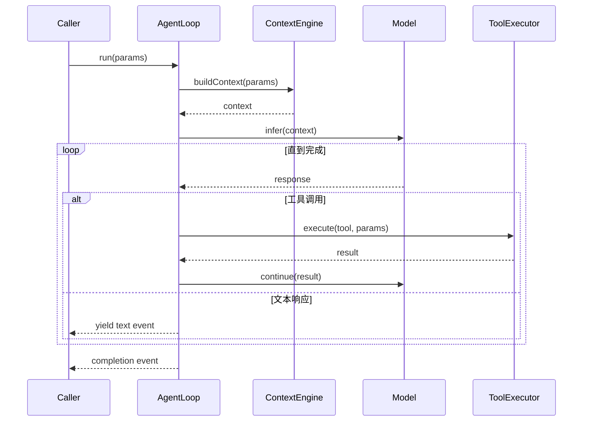
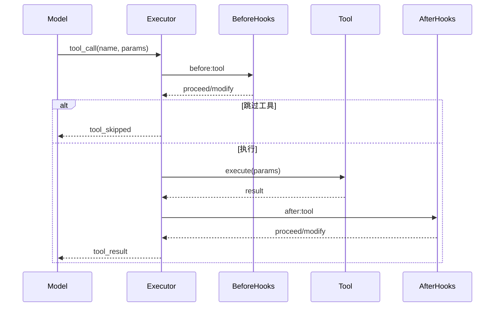
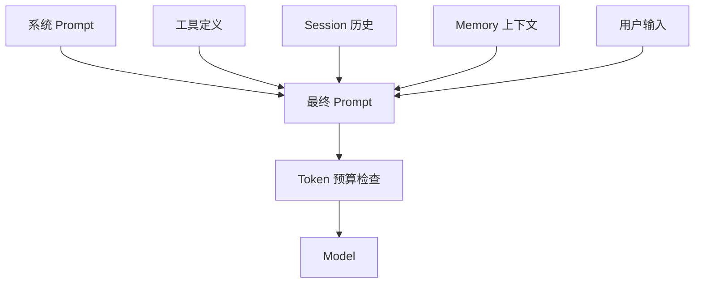
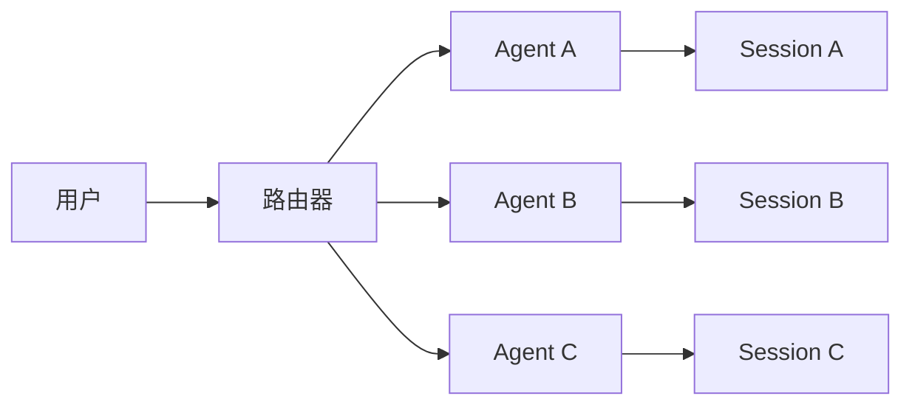

# Agent 系统

## 概述

Agent 系统是运行 AI 推理和管理工具调用的核心执行引擎。



## Agent 运行时

OpenClaw 支持多种 Agent 运行时实现：

| 运行时 | 类型 | 描述 |
|--------|------|------|
| PI | 内置 | 具有直接 Model 访问的内置 Agent |
| Codex | 外部 | OpenAI Codex 应用服务器集成 |
| ACP | 协议 | Agent 通信协议 |

### PI 运行时

内置运行时提供直接的 Model 访问：



### 运行时接口

```typescript
interface AgentRuntime {
  readonly id: string;
  readonly type: "pi" | "codex" | "acp";
  readonly capabilities: RuntimeCapabilities;

  // 生命周期
  start(config: RuntimeConfig): Promise<void>;
  stop(): Promise<void>;

  // 执行
  run(params: RunParams): AsyncIterable<RunEvent>;
  abort(runId: string): Promise<void>;

  // 工具
  registerTools(tools: Tool[]): void;
  unregisterTools(toolNames: string[]): void;
}
```

## Agent 循环

### 执行流程



### Run 参数

```typescript
interface RunParams {
  sessionKey: string;
  agentId: string;
  input: string;

  // 可选
  systemPrompt?: string;
  tools?: Tool[];
  modelRef?: string;
  temperature?: number;
  maxTokens?: number;

  // 幂等性
  idemKey?: string;
}
```

### Run 事件

```typescript
type RunEvent =
  | { type: "start"; runId: string }
  | { type: "assistant.delta"; delta: string }
  | { type: "assistant.text"; text: string }
  | { type: "tool_use"; tool: string; input: unknown }
  | { type: "tool_result"; tool: string; result: unknown }
  | { type: "complete"; summary?: string }
  | { type: "error"; error: string };
```

## 工具系统

### 工具定义

```typescript
interface Tool {
  readonly name: string;
  readonly description: string;
  readonly schema: JsonSchema;
  readonly category?: ToolCategory;

  execute(params: unknown, context: ToolContext): Promise<ToolResult>;
}
```

### 工具类别

| 类别 | 示例 | 用途 |
|------|------|------|
| search | web_search, wikipedia | 信息检索 |
| compute | calculator, code_execute | 数据处理 |
| file | read_file, write_file | 文件操作 |
| web | fetch_url, browser | Web 交互 |
| messaging | send_message, send_email | 外部通信 |
| system | shell, run_command | 系统操作 |

### 工具执行管道



### 内置工具

OpenClaw 提供内置工具：

```typescript
const builtInTools: Tool[] = [
  {
    name: "bash",
    description: "执行 bash 命令",
    schema: { command: "string" },
  },
  {
    name: "read_file",
    description: "读取文件内容",
    schema: { path: "string", limit: "number?" },
  },
  {
    name: "write_file",
    description: "写入文件内容",
    schema: { path: "string", content: "string" },
  },
  {
    name: "web_search",
    description: "网络搜索",
    schema: { query: "string", limit: "number?" },
  },
  {
    name: "image_generation",
    description: "生成图像",
    schema: { prompt: "string", size: "string?" },
  },
];
```

## Prompt 组装

### 上下文构建



### Token 预算

```typescript
interface TokenBudget {
  systemPrompt: number;
  tools: number;
  history: number;
  memory: number;
  userInput: number;
  available: number;    // maxTokens - reserved
  total: number;        // contextWindow
}
```

## Session 集成

### Session 上下文

每个 Agent 运行都在一个 Session 中运行：

```typescript
interface SessionContext {
  sessionKey: string;
  channel: string;
  peer: string;
  history: Message[];
  metadata: SessionMetadata;
  activeAgent?: string;
}
```

### Memory 集成

```typescript
interface MemoryContext {
  workingMemory: Message[];       // 当前轮次
  recentHistory: Message[];        // 最近 N 条消息
  shortTerm: MemoryEntry[];         // MEMORY.md, DREAMS.md
  longTerm: MemoryEntry[];         // Wiki, facts
  compacted: CompactedContext[];    // 压缩的 Session
}
```

## 多 Agent 支持

### Agent 隔离

Agent 可以隔离或共享：



### Agent 选择

Agent 基于以下条件选择：

1. **显式路由** - Session 或消息元数据
2. **能力匹配** - 所需能力
3. **负载均衡** - 跨实例

## 错误处理

### 错误恢复

```typescript
interface ToolErrorHandler {
  onError(error: Error, tool: Tool): ToolErrorAction;
}

type ToolErrorAction =
  | { action: "retry"; after?: number }
  | { action: "skip"; message?: string }
  | { action: "fail"; error: string };
```

### 超时处理

```typescript
interface ToolConfig {
  timeout?: number;           // 最大执行时间 (ms)
  retries?: number;            // 重试次数
  retryDelay?: number;         // 重试间隔 (ms)
}
```

## 监控

### Run 指标

```typescript
interface RunMetrics {
  runId: string;
  startTime: Date;
  endTime?: Date;
  duration?: number;

  inputTokens: number;
  outputTokens: number;
  totalTokens: number;

  toolCalls: number;
  toolErrors: number;

  cacheHits: number;
  cacheMisses: number;
}
```

## 相关

- [Session 管理](/architecture-book/part-8-session-memory/01-session-management) - Session 架构
- [Memory 系统](/architecture-book/part-8-session-memory/02-memory-system) - Memory 架构
- [Context Engine](/architecture-book/part-8-session-memory/03-context-engine) - 上下文组装
- [MCP 支持](/architecture-book/part-2-core-modules/06-mcp) - MCP 集成
