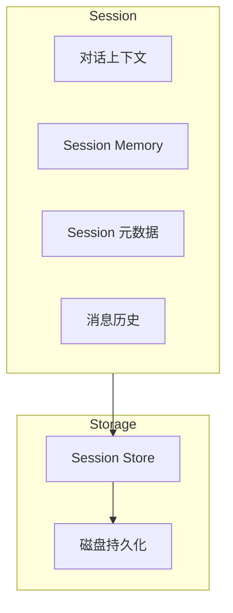
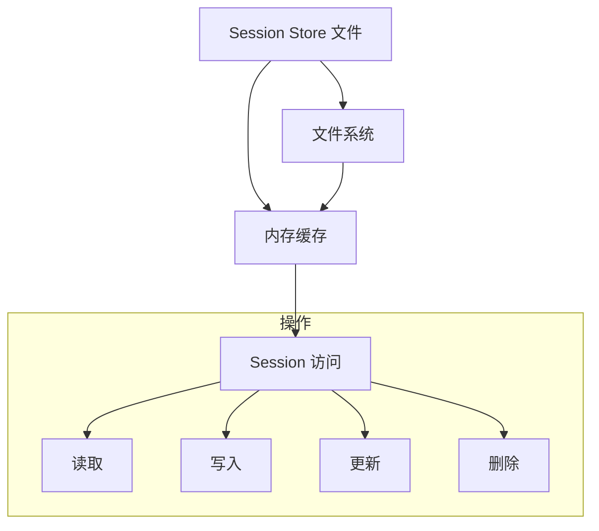
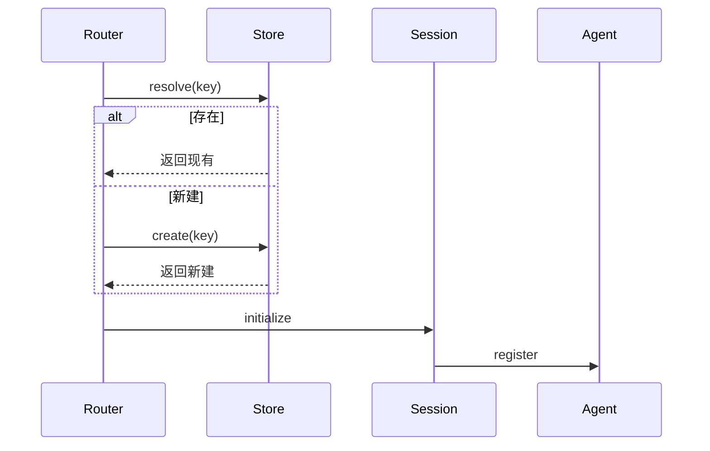
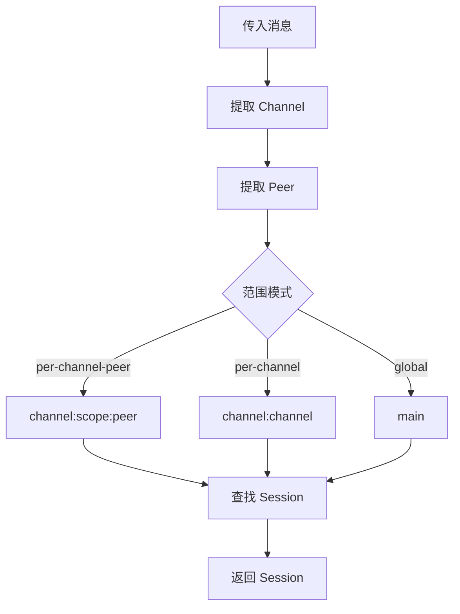

# Session 管理

## 概述

Session 是 OpenClaw 中对话隔离的基本单元。每个 Session 维护独立的状态、Memory 和上下文。



## Session Key

### Key 格式

Session 由复合键标识：

```typescript
type SessionKey = string;  // 格式: {channel}:{scope}:{target}

示例:
  "telegram:dm:123456789"      // Telegram DM 与用户 123456789
  "discord:group:987654321"     // Discord 群组 987654321
  "main"                        // 主共享 Session
```

### Key 组件

| 组件 | 描述 | 示例 |
|-----------|-------------|---------|
| channel | 消息平台 | telegram, discord |
| scope | 隔离级别 | dm, group, channel, main |
| target | 平台特定 ID | user_id, chat_id |

## Session Store

### Store 架构



### Store 位置

默认 Store 路径: `~/.openclaw/agents/{agentId}/sessions.json`

```typescript
interface SessionStore {
  [sessionKey: string]: SessionEntry;
}

interface SessionEntry {
  channel: string;
  peer: string;
  scope: SessionScope;
  activeSessionKey: string;
  createdAt: string;
  updatedAt: string;
  metadata?: Record<string, unknown>;
}
```

## 隔离策略

### DM 范围

每个用户拥有自己的 Session：

```typescript
config: {
  session: {
    dmScope: "per-channel-peer"
  }
}
```

Session keys:
- `telegram:dm:123456789` - Telegram 与用户 123456789
- `discord:dm:987654321` - Discord 与用户 987654321

### 群组范围

每个群组拥有自己的 Session：

```typescript
config: {
  session: {
    dmScope: "per-channel-peer"
  }
}
```

Session keys:
- `telegram:group:chat_id`
- `discord:group:channel_id`

### Channel 范围

Channel 中所有用户共享上下文：

```typescript
config: {
  session: {
    scope: "per-channel"
  }
}
```

Session keys:
- `telegram:channel` - 所有 Telegram 用户共享一个 Session

### 全局范围

所有 Channel 共享单一 Session：

```typescript
config: {
  session: {
    scope: "global"
  }
}
```

Session key: `main`

## Session 生命周期

### 创建



### 消息流

```typescript
interface Session {
  readonly id: string;
  readonly key: SessionKey;
  readonly channel: string;
  readonly peer: string;
  readonly createdAt: Date;

  // 状态
  context: ConversationContext;
  history: Message[];

  // 操作
  addMessage(message: Message): Promise<void>;
  getHistory(limit?: number): Promise<Message[]>;
  reset(): Promise<void>;
}
```

### 重置行为

Session 可以基于以下条件重置：

| 触发器 | 描述 |
|---------|-------------|
| 空闲超时 | N 分钟无活动 |
| 每日重置 | 在特定时间重置 |
| 手动 | 显式重置命令 |
| 错误 | 连续错误过多 |

```typescript
config: {
  session: {
    reset: {
      idleMinutes: 60,
      time: "04:00"  // 每天凌晨 4 点
    }
  }
}
```

## Session 维护

### 修剪

旧的 Session 自动修剪：

```typescript
config: {
  session: {
    maintenance: {
      mode: "enforce",
      pruneAfter: "30d",    // 删除超过 30 天的 Session
      maxEntries: 500        // 或超过 500 条目
    }
  }
}
```

### 写锁

对同一 Session 的并发访问被序列化：

```typescript
// Session 写锁模式
async function withSessionLock<T>(
  key: string,
  fn: () => Promise<T>
): Promise<T> {
  const lock = sessionLocks.get(key);
  await lock.acquire();
  try {
    return await fn();
  } finally {
    lock.release();
  }
}
```

## 消息历史

### 历史存储

消息随 Session 一起存储：

```typescript
interface Message {
  id: string;
  role: "user" | "assistant" | "system";
  content: string;
  timestamp: Date;
  metadata?: MessageMetadata;
}

interface MessageMetadata {
  channel?: string;
  messageId?: string;
  attachments?: Attachment[];
  toolCalls?: ToolCall[];
}
```

### 历史限制

```typescript
config: {
  session: {
    history: {
      maxMessages: 100,      // 保留最后 100 条消息
      maxTokens: 8000        // 或最多 8k tokens
    }
  }
}
```

## Session 解析

### 解析流程



### Session 解析器

```typescript
interface SessionResolver {
  resolve(request: InboundMessage): SessionKey;
  resolveFromKey(key: string): Session;
  createSession(key: string): Session;
  deleteSession(key: string): Promise<void>;
}
```

## 多 Agent Session

### Agent 绑定

Session 可以绑定到特定的 Agent：

```typescript
interface AgentBinding {
  agentId: string;
  defaultModel?: string;
  systemPrompt?: string;
  tools?: string[];
}
```

### 跨 Agent 通信

Agent 可以共享 Session：

```typescript
config: {
  agents: {
    router: {
      sessionScope: "shared"
    }
  }
}
```

## Session 事件

### 事件类型

| 事件 | 描述 |
|-------|-------------|
| `session:created` | 新 Session 创建 |
| `session:accessed` | Session 被访问 |
| `session:reset` | Session 被重置 |
| `session:pruned` | Session 被删除 |
| `session:locked` | Session 锁被获取 |
| `session:unlocked` | Session 锁被释放 |

## 配置

### 完整配置示例

```typescript
const config = {
  session: {
    // 隔离策略
    dmScope: "per-channel-peer",  // "per-channel-peer", "per-channel", "global"
    groupScope: "per-channel-peer",

    // 重置触发器
    reset: {
      idleMinutes: 60,
      time: "04:00",           // 每日重置时间
    },

    // 维护
    maintenance: {
      mode: "enforce",
      pruneAfter: "30d",
      maxEntries: 500,
    },

    // 历史
    history: {
      maxMessages: 100,
      maxTokens: 8000,
      includeSystem: false,
    },

    // 存储
    store: "~/.openclaw/agents/{agentId}/sessions.json",
  }
};
```

## 相关

- [Memory 系统](/architecture-book/part-8-session-memory/02-memory-system) - Memory 架构
- [Context Engine](/architecture-book/part-8-session-memory/03-context-engine) - 上下文组装
- [Multi-Agent](/architecture-book/part-8-session-memory/05-multi-agent) - 多 Agent 路由
- [配置](/architecture-book/part-7-config-system/01-config-overview) - 配置系统
