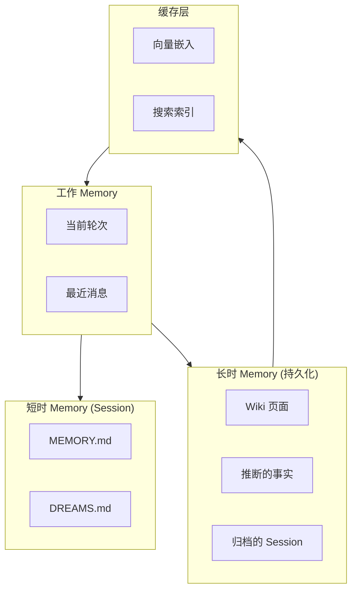
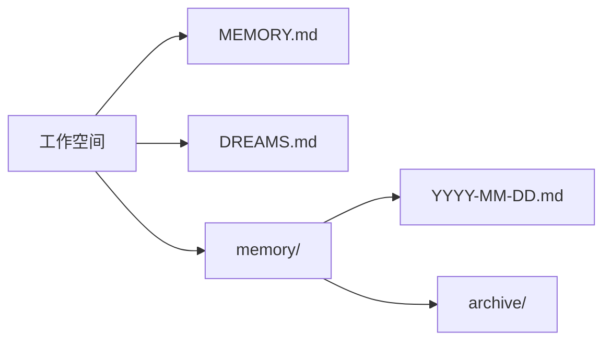
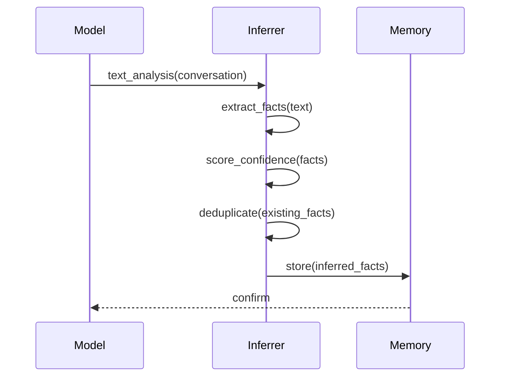
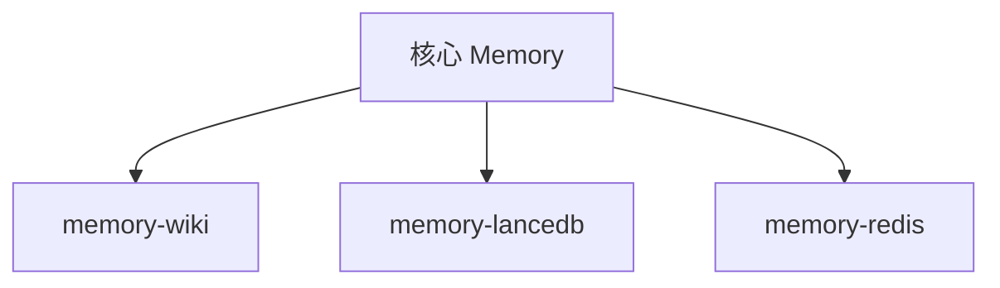
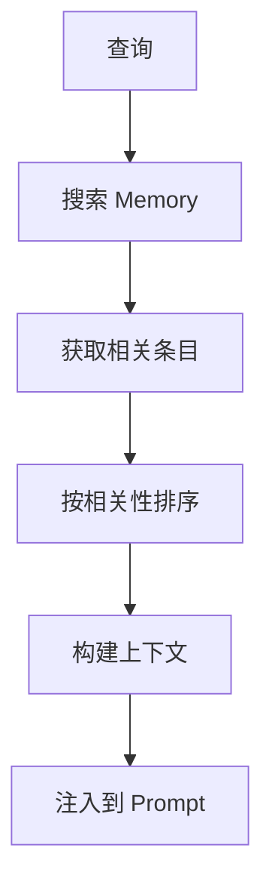
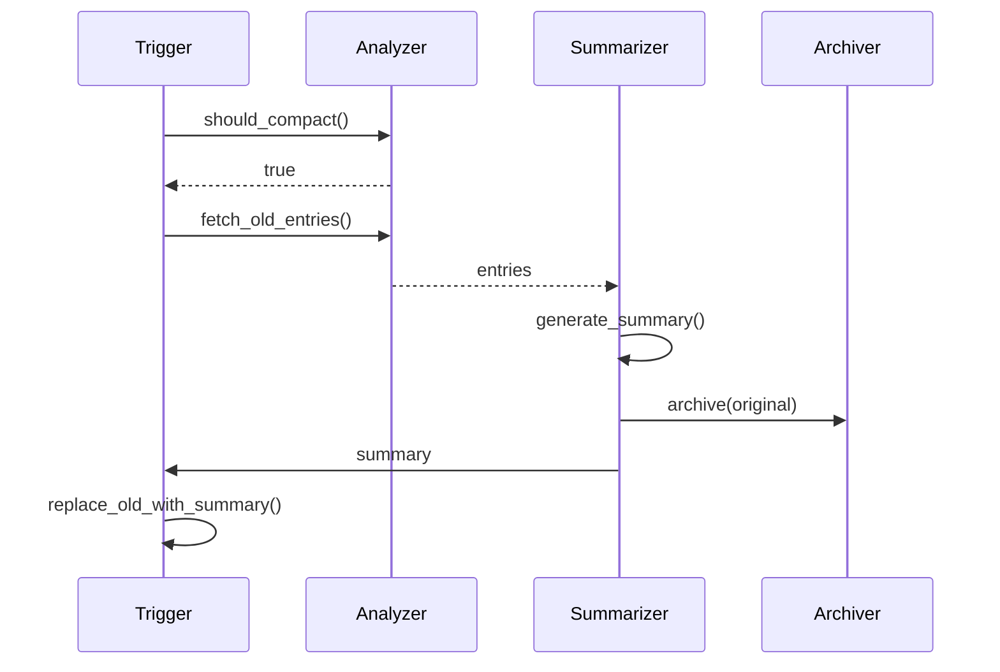

# Memory 系统

## 概述

OpenClaw 使用分层 Memory 系统，结合工作 Memory、短时 Memory 和长时 Memory，提供上下文感知的 AI 响应。



## Memory 架构

### 三层模型

| 层级 | 持续时间 | 容量 | 使用场景 |
|------|----------|------|----------|
| 工作 | 当前轮次 | 完整上下文 | 即时处理 |
| 短时 | Session | ~8k tokens | 最近上下文 |
| 长时 | 持久化 | 无限 | 知识库 |

### Memory 文件结构



### 文件用途

| 文件 | 用途 | 内容 |
|------|------|------|
| `MEMORY.md` | Session Memory | 当前上下文、进行中的任务 |
| `DREAMS.md` | 推断的知识 | Model 反思、事实 |
| `memory/YYYY-MM-DD.md` | 归档的 Session | 每日 Session 摘要 |
| `memory/archive/` | 长期存储 | 压缩的 Session |

## Memory 管理器

### 核心接口

```typescript
interface MemoryManager {
  // 检索
  search(query: string, options?: SearchOptions): Promise<MemoryResult[]>;
  get(key: string): Promise<MemoryEntry | null>;
  getRecent(limit?: number): Promise<MemoryEntry[]>;

  // 存储
  store(entry: MemoryEntry): Promise<void>;
  update(key: string, entry: Partial<MemoryEntry>): Promise<void>;
  delete(key: string): Promise<void>;

  // 压缩
  compact(sessionId: string, strategy?: CompactionStrategy): Promise<void>;

  // 上下文
  buildContext(prompt: string): Promise<MemoryContext>;
}
```

### 搜索选项

```typescript
interface SearchOptions {
  limit?: number;              // 最大结果数
  threshold?: number;          // 相似度阈值
  categories?: string[];       // 按类型过滤
  dateRange?: DateRange;       // 按日期过滤
  includeArchived?: boolean;   // 包含已归档
}
```

## Memory 条目

### 条目结构

```typescript
interface MemoryEntry {
  id: string;
  key: string;                  // 唯一标识符
  type: MemoryType;            // 条目类型
  content: string;              // Memory 内容
  metadata: MemoryMetadata;    // 附加数据
  createdAt: Date;
  updatedAt: Date;
  embedding?: number[];        // 向量嵌入
}

type MemoryType =
  | "fact"        // 推断的事实
  | "task"        // 任务或目标
  | "preference"  // 用户偏好
  | "knowledge"   // 一般知识
  | "context"     // 对话上下文
  | "summary"     // 压缩摘要
  | "reflection"  // Model 反思
  | "commitment"; // 声明的承诺
```

### Memory 元数据

```typescript
interface MemoryMetadata {
  source: "user" | "model" | "system" | "plugin";
  sessionKey?: string;
  channel?: string;
  importance?: number;          // 0-1 重要性分数
  confidence?: number;         // 0-1 置信度分数
  tags?: string[];
  links?: string[];            // 相关的 Memory ID
}
```

## 知识提炼

### 事实推断

系统从对话中推断事实：



### 事实类型

| 类型 | 示例 | 提取方式 |
|------|---------|------------|
| 偏好 | 用户偏好深色模式 | 直接陈述 |
| 事实 | 用户在 Acme 工作 | 隐含或陈述 |
| 关系 | 用户已婚 | 显式陈述 |
| 习惯 | 用户早上查邮件 | 模式检测 |

## DREAMS 系统

### 什么是 DREAMS？

DREAMS.md 包含 Model 生成的关于 Session 的反思：

```markdown
# DREAMS

## 2024-01-15

- 用户询问设置 webhook
- 他们似乎更喜欢实际示例而非文档
- 项目使用 TypeScript 和 Express

## 2024-01-14

- 用户完成了 OAuth 集成
- 他们提到即将推出的功能：支付处理
- 需要记住：用户偏好异步通信
```

### DREAMS 生成

```typescript
interface DreamsGenerator {
  shouldGenerate(session: Session): boolean;
  generateReflection(session: Session): Promise<string>;
  mergeWithExisting(newReflection: string): Promise<void>;
}
```

## Memory 插件

### 插件架构



### 可用插件

| 插件 | 后端 | 使用场景 |
|--------|---------|----------|
| memory-core | 文件系统 | 默认，无依赖 |
| memory-wiki | Markdown | 知识库 |
| memory-lancedb | LanceDB | 向量搜索 |
| memory-redis | Redis | 分布式缓存 |

## 上下文组装

### 构建管道



### Token 预算

```typescript
interface ContextBudget {
  totalLimit: number;          // 例如 128k tokens
  reserved: {
    system: number;
    tools: number;
    output: number;
  };
  available: number;           // 用于上下文
  used: number;
}

// 根据 Model 动态调整
const budgets: Record<string, ContextBudget> = {
  "gpt-4o": { totalLimit: 128000, reserved: {...}, available: 100000 },
  "claude-opus-4": { totalLimit: 200000, reserved: {...}, available: 180000 },
};
```

## Memory 压缩

### 压缩触发器

| 触发器 | 条件 |
|---------|-----------|
| Token 限制 | 超过阈值 |
| 空闲 | 一段时间无活动 |
| 手动 | 显式命令 |
| 定时 | 每日 cron 任务 |

### 压缩策略

```typescript
type CompactionStrategy =
  | { type: "summarize"; maxTokens: number }
  | { type: "selective"; keepTypes: MemoryType[] }
  | { type: "archive"; archiveOlderThan: number }
  | { type: "compress"; algorithm: "gzip" | "lz4" };
```

### 压缩管道



## Memory 访问控制

### 访问策略

```typescript
interface MemoryPolicy {
  defaultAccess: "read" | "write" | "none";
  perPlugin?: Record<string, AccessLevel>;
  perChannel?: Record<string, AccessLevel>;
}
```

## 相关

- [Context Engine](/architecture-book/part-8-session-memory/03-context-engine) - 上下文组装
- [压缩](/architecture-book/part-8-session-memory/04-compaction) - Memory 压缩
- [Multi-Agent](/architecture-book/part-8-session-memory/05-multi-agent) - 多 Agent Memory
- [Session 管理](/architecture-book/part-8-session-memory/01-session-management) - Session 架构
