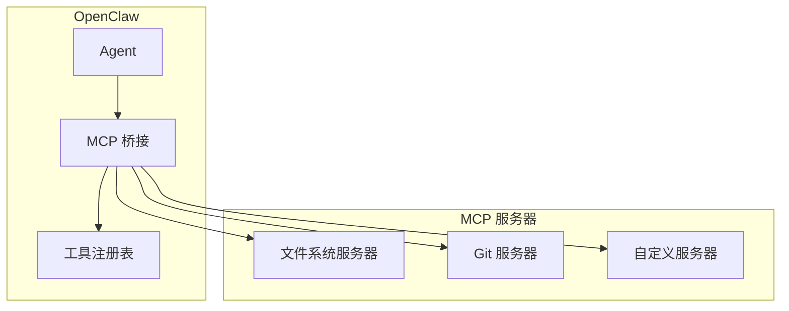
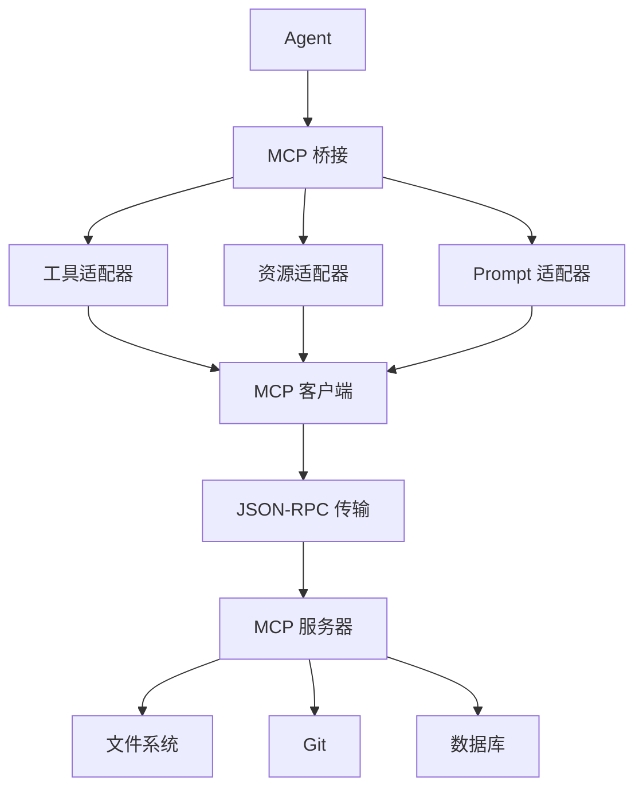
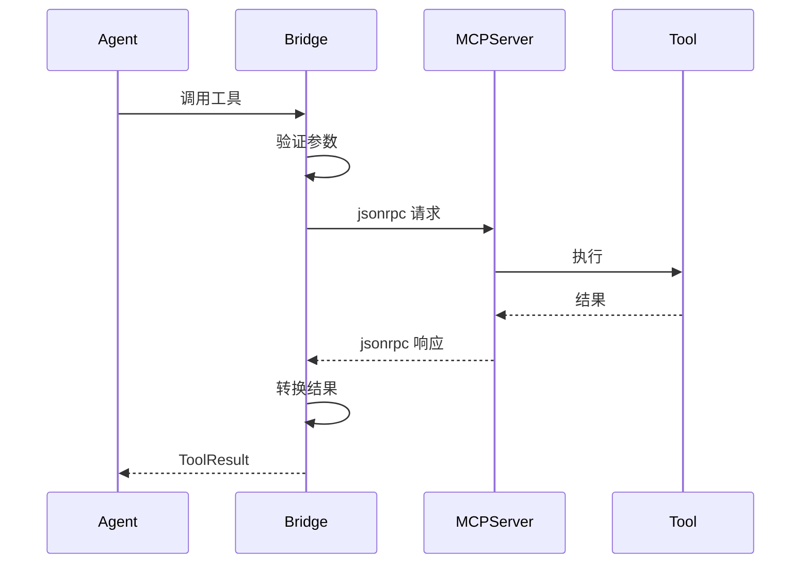
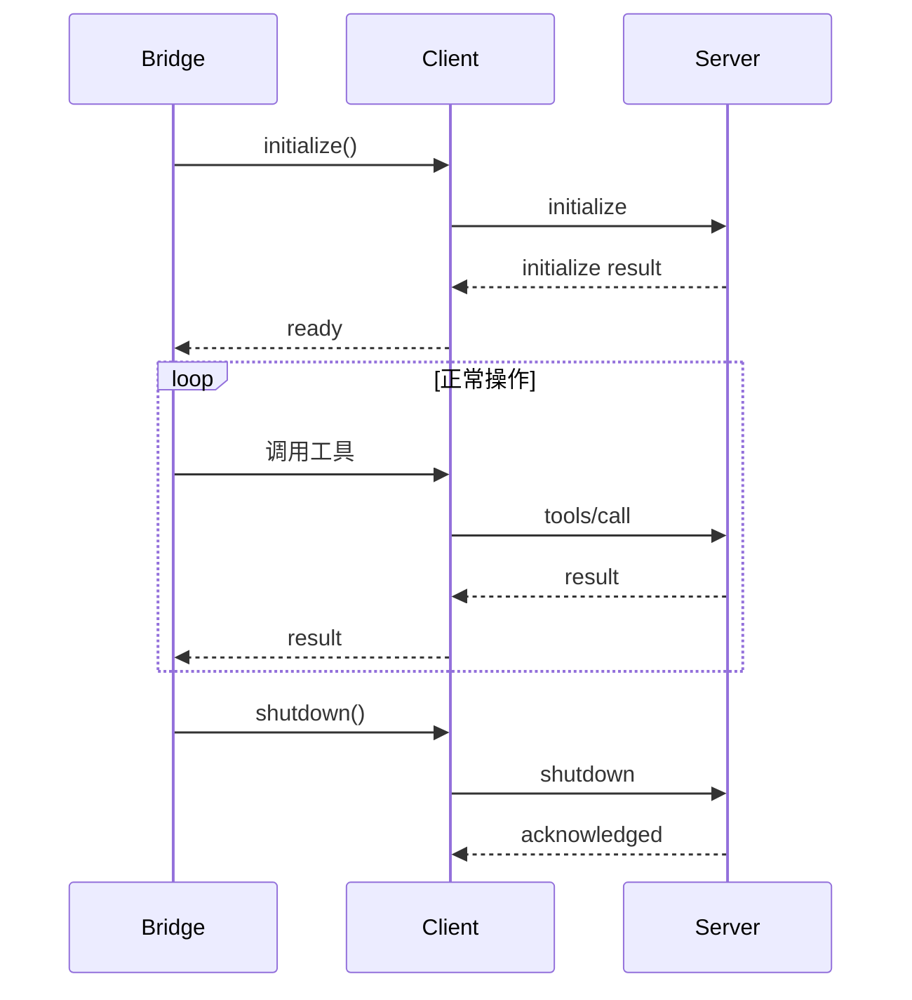

# MCP 支持

## 概述

OpenClaw 支持 Model Context Protocol (MCP)，通过标准化的工具和资源接口扩展 Agent 能力。



## 什么是 MCP？

MCP (Model Context Protocol) 是一种使 AI Model 能够以标准化方式与外部工具和资源交互的协议：

| 方面 | 描述 |
|--------|-------------|
| 传输 | JSON-RPC over stdio 或 HTTP |
| 工具 | 标准化工具调用 |
| 资源 | 文件和数据访问 |
| Prompts | 可重用的 Prompt 模板 |

## MCP 架构

### 组件概述



### 桥接职责

```typescript
interface MCPMCPBridge {
  // 服务器管理
  registerServer(config: MCPServerConfig): Promise<void>;
  unregisterServer(name: string): Promise<void>;

  // 工具桥接
  bridgeTools(serverName: string): Promise<Tool[]>;
  invokeTool(server: string, tool: string, params: unknown): Promise<ToolResult>;

  // 资源访问
  listResources(serverName: string): Promise<Resource[]>;
  readResource(server: string, uri: string): Promise<ResourceContent>;

  // 健康
  getServerStatus(serverName: string): ServerStatus;
}
```

## MCP 服务器配置

### 服务器定义

```typescript
interface MCPServerConfig {
  name: string;
  command: string;
  args?: string[];
  env?: Record<string, string>;
  transport?: "stdio" | "http";
  url?: string;                    // 用于 HTTP 传输
}

const config: MCPServerConfig = {
  name: "filesystem",
  command: "npx",
  args: ["-y", "@modelcontextprotocol/server-filesystem", "/path/to/dir"],
  transport: "stdio",
};
```

### 多服务器设置

```typescript
const mcpConfig = {
  servers: {
    filesystem: {
      command: "npx",
      args: ["-y", "@modelcontextprotocol/server-filesystem", "./workspace"],
    },
    git: {
      command: "npx",
      args: ["-y", "@modelcontextprotocol/server-git"],
    },
    memory: {
      command: "python",
      args: ["mcp_server.py"],
      env: {
        DB_PATH: "./memory.db",
      },
    },
  },
};
```

## 工具桥接

### 桥接过程



### 工具 Schema 映射

MCP 工具使用自己的 schema 格式，桥接到 OpenClaw 工具：

```typescript
// MCP 工具 schema
interface MCPTool {
  name: string;
  description: string;
  inputSchema: object;
}

// 桥接到 OpenClaw Tool
function bridgeMCPTool(mcpTool: MCPTool): Tool {
  return {
    name: `mcp_${serverName}_${mcpTool.name}`,
    description: mcpTool.description,
    schema: mcpTool.inputSchema,
    execute: async (params, context) => {
      return await mcpBridge.invokeTool(serverName, mcpTool.name, params);
    },
  };
}
```

### 工具命名

桥接的工具带有前缀：

```
mcp_filesystem_read_file
mcp_filesystem_write_file
mcp_git_clone
mcp_git_status
```

## 资源访问

### 资源类型

```typescript
interface MCPResource {
  uri: string;
  name: string;
  description?: string;
  mimeType?: string;
}

interface MCPResourceContent {
  uri: string;
  mimeType: string;
  content: string | Uint8Array;
}
```

### 资源桥接

```typescript
interface MCPResourceBridge {
  listResources(): Promise<MCPResource[]>;
  readResource(uri: string): Promise<MCPResourceContent>;

  // 订阅更改
  subscribe(uri: string): void;
  unsubscribe(uri: string): void;
}
```

## MCP 客户端实现

### 客户端生命周期



### 客户端接口

```typescript
interface MCPClient {
  readonly serverName: string;
  readonly capabilities: ServerCapabilities;

  initialize(): Promise<void>;
  listTools(): Promise<MCPTool[]>;
  callTool(name: string, args: Record<string, unknown>): Promise<ToolResult>;
  listResources(): Promise<MCPResource[]>;
  readResource(uri: string): Promise<MCPResourceContent>;

  close(): Promise<void>;
}
```

## 错误处理

### 错误类型

```typescript
interface MCPError {
  code: number;
  message: string;
  data?: unknown;
}

// 错误码
const MCP_ERRORS = {
  PARSE_ERROR: -32700,
  INVALID_REQUEST: -32600,
  METHOD_NOT_FOUND: -32601,
  INVALID_PARAMS: -32602,
  INTERNAL_ERROR: -32603,
};
```

### 错误恢复

```typescript
async function withMCPErrorHandling<T>(
  fn: () => Promise<T>
): Promise<T> {
  try {
    return await fn();
  } catch (error) {
    if (error instanceof MCPError) {
      if (error.code === MCP_ERRORS.SERVER_NOT_INITIALIZED) {
        // 重新初始化
        await client.initialize();
        return await fn();
      }
    }
    throw error;
  }
}
```

## 内置 MCP 工具

### 文件系统工具

```typescript
const fsTools = [
  "mcp_filesystem_read_file",
  "mcp_filesystem_write_file",
  "mcp_filesystem_list_directory",
  "mcp_filesystem_create_directory",
  "mcp_filesystem_move_file",
  "mcp_filesystem_delete_file",
  "mcp_filesystem_search_files",
];
```

### Git 工具

```typescript
const gitTools = [
  "mcp_git_status",
  "mcp_git_log",
  "mcp_git_diff",
  "mcp_git_commit",
  "mcp_git_branch",
  "mcp_git_checkout",
];
```

## 测试 MCP 桥接

### 测试模式

```typescript
describe("MCP 桥接", () => {
  let bridge: MCPMCPBridge;

  beforeEach(async () => {
    bridge = new MCPMCPBridge();
    await bridge.registerServer({
      name: "test",
      command: "echo",
      args: ["test-server"],
    });
  });

  afterEach(async () => {
    await bridge.unregisterServer("test");
  });

  it("应桥接工具", async () => {
    const tools = await bridge.bridgeTools("test");
    expect(tools.length).toBeGreaterThan(0);
  });

  it("应调用工具", async () => {
    const result = await bridge.invokeTool("test", "echo", { msg: "hello" });
    expect(result.success).toBe(true);
  });
});
```

## 相关

- [Agent 工具](/architecture-book/part-2-core-modules/05-tools) - 工具系统
- [插件系统](/architecture-book/part-3-plugin-system/01-plugin-architecture) - 插件架构
- [MCP 服务器](/reference/mcp-server) - MCP 参考
