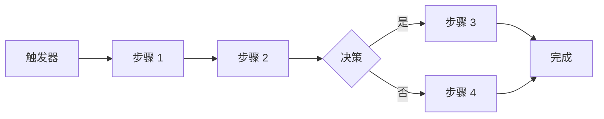
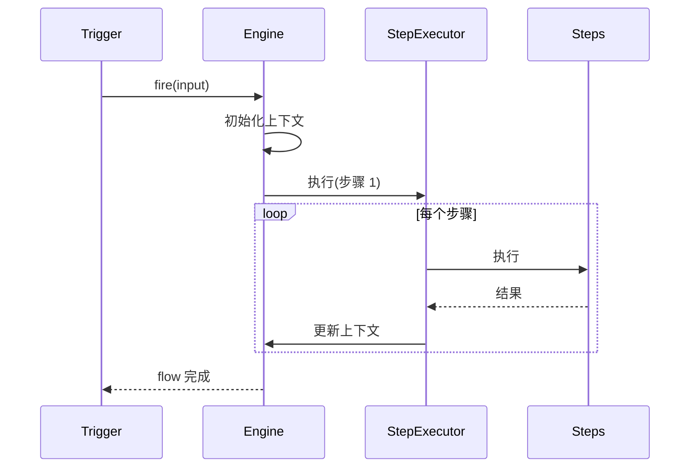
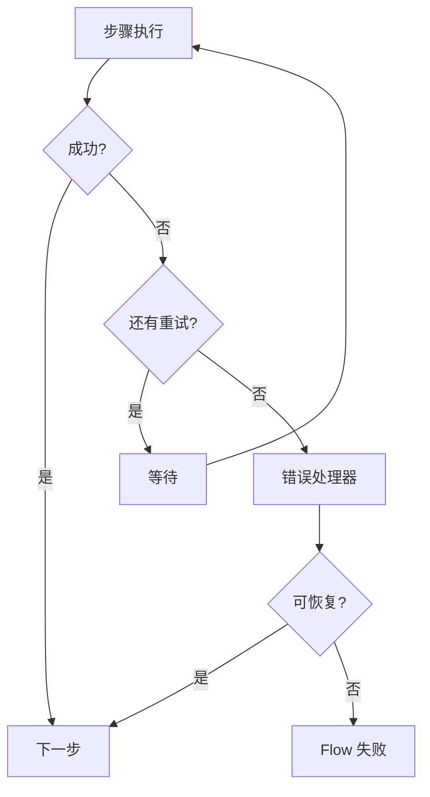

# 工作流编排

## 概述

Flows 系统提供定义和执行复杂多步工作流的方式，可以协调多个 Agent、工具和外部服务。



## Flow 定义

### Flow 结构

```typescript
interface Flow {
  id: string;
  name: string;
  description?: string;
  version: string;

  trigger: Trigger;
  steps: Step[];
  errorHandling: ErrorConfig;
}

interface Trigger {
  type: "manual" | "schedule" | "webhook" | "event";
  config: TriggerConfig;
}

interface Step {
  id: string;
  name: string;
  type: StepType;
  config: StepConfig;
  next?: string;            // 下一步 ID
  onError?: string;        // 错误处理步骤
}
```

### 步骤类型

| 类型 | 描述 | 使用场景 |
|------|-------------|----------|
| `agent` | 运行 Agent | AI 处理 |
| `tool` | 执行工具 | 外部操作 |
| `condition` | 分支逻辑 | 决策 |
| `loop` | 重复步骤 | 批处理 |
| `delay` | 等待 | 速率限制 |
| `http` | HTTP 请求 | API 调用 |
| `transform` | 转换数据 | 数据处理 |
| `subflow` | 运行子流程 | 可重用工作流 |

## Flow 示例

### 简单 Agent Flow

```typescript
const flow: Flow = {
  id: "analyze-pr",
  name: "PR 分析",
  version: "1.0.0",

  trigger: {
    type: "webhook",
    config: { path: "/webhooks/github" },
  },

  steps: [
    {
      id: "fetch",
      name: "获取 PR 详情",
      type: "http",
      config: {
        url: "${env.GITHUB_API}/pulls/${input.prNumber}",
        method: "GET",
      },
    },
    {
      id: "analyze",
      name: "分析代码",
      type: "agent",
      config: {
        prompt: "分析此 PR: ${steps.fetch.body}",
        model: "claude-opus-4",
      },
      next: "notify",
    },
    {
      id: "notify",
      name: "通知团队",
      type: "tool",
      config: {
        tool: "send_slack",
        message: "PR 分析完成: ${steps.analyze.summary}",
      },
    },
  ],

  errorHandling: {
    onError: "notify-error",
    maxRetries: 3,
  },
};
```

### 条件 Flow

```typescript
const flow: Flow = {
  id: "process-order",
  name: "订单处理",

  steps: [
    {
      id: "validate",
      name: "验证订单",
      type: "agent",
      config: { prompt: "验证此订单: ${input}" },
    },
    {
      id: "check-inventory",
      name: "检查库存",
      type: "tool",
      config: { tool: "check_stock", sku: "${input.sku}" },
    },
    {
      id: "decision",
      name: "库存检查",
      type: "condition",
      config: {
        if: "${steps.check-inventory.inStock} == true",
        then: "process-payment",
        else: "notify-out-of-stock",
      },
    },
    {
      id: "process-payment",
      name: "处理支付",
      type: "tool",
      config: { tool: "charge_card", amount: "${input.amount}" },
    },
    {
      id: "notify-out-of-stock",
      name: "通知客户",
      type: "tool",
      config: { tool: "send_email", template: "out-of-stock" },
    },
  ],
};
```

### 循环 Flow

```typescript
const flow: Flow = {
  id: "batch-process",
  name: "批量文件处理",

  steps: [
    {
      id: "get-files",
      name: "列出文件",
      type: "tool",
      config: { tool: "list_files", path: "./input" },
    },
    {
      id: "process-loop",
      name: "处理每个文件",
      type: "loop",
      config: {
        items: "${steps.get-files.files}",
        variable: "file",
        steps: [
          {
            id: "process",
            name: "处理文件",
            type: "agent",
            config: {
              prompt: "处理文件: ${variable.name}",
            },
          },
          {
            id: "archive",
            name: "移动到归档",
            type: "tool",
            config: {
              tool: "move_file",
              from: "${variable.path}",
              to: "./archive/${variable.name}",
            },
          },
        ],
      },
    },
  ],
};
```

## Flow 执行

### 执行引擎



### 上下文管理

```typescript
interface FlowContext {
  flowId: string;
  runId: string;
  input: unknown;
  state: Record<string, unknown>;
  results: Map<string, StepResult>;
  errors: StepError[];
}
```

### 步骤结果

```typescript
interface StepResult {
  stepId: string;
  success: boolean;
  output?: unknown;
  duration: number;
  metadata?: Record<string, unknown>;
}
```

## 错误处理

### 错误策略

```typescript
interface ErrorConfig {
  onError: string;          // 错误时执行的步骤 ID
  maxRetries: number;       // 最大重试次数
  retryDelay: number;       // 重试间隔 (ms)
  exponentialBackoff: boolean;
  continueOnError?: string[];  // 可以失败而不停止的步骤
}

const flow: Flow = {
  steps: [
    {
      id: "risky-operation",
      name: "有风险的 API 调用",
      type: "http",
      config: { url: "https://api.example.com/data" },
      onError: "fallback",
    },
    {
      id: "fallback",
      name: "备用操作",
      type: "tool",
      config: { tool: "use_cache", key: "last-known" },
    },
  ],
  errorHandling: {
    onError: "notify-error",
    maxRetries: 3,
    retryDelay: 1000,
    exponentialBackoff: true,
  },
};
```

### 错误恢复



## 调度

### Cron 触发器

```typescript
const flow: Flow = {
  trigger: {
    type: "schedule",
    config: {
      cron: "0 9 * * 1-5",  // 工作日上午 9 点
      timezone: "America/New_York",
    },
  },
  steps: [
    // 早晨任务
  ],
};
```

### Webhook 触发器

```typescript
const flow: Flow = {
  trigger: {
    type: "webhook",
    config: {
      path: "/webhooks/github",
      method: "POST",
      auth: "github-signature",
    },
  },
};
```

### 事件触发器

```typescript
const flow: Flow = {
  trigger: {
    type: "event",
    config: {
      source: "github",
      event: "pull_request.opened",
      filter: "action == 'opened' && repository == 'my-repo'",
    },
  },
};
```

## Flow 组合

### 子流程

```typescript
const subflow: Flow = {
  id: "send-notification",
  name: "发送通知",
  isSubflow: true,

  steps: [
    {
      id: "format",
      name: "格式化消息",
      type: "transform",
      config: { template: "${input.message}" },
    },
    {
      id: "send",
      name: "发送",
      type: "tool",
      config: { tool: "send_email", ... },
    },
  ],
};

const mainFlow: Flow = {
  steps: [
    {
      id: "task",
      name: "处理任务",
      type: "agent",
      config: { ... },
    },
    {
      id: "notify",
      name: "通知",
      type: "subflow",
      config: {
        flow: "send-notification",
        input: { message: "任务完成: ${steps.task.result}" },
      },
    },
  ],
};
```

## 监控

### 运行状态

```typescript
interface FlowRun {
  id: string;
  flowId: string;
  status: "running" | "completed" | "failed" | "cancelled";
  startTime: Date;
  endTime?: Date;
  currentStep?: string;
  steps: StepResult[];
  error?: string;
}
```

### Webhook 通知

```typescript
const flow: Flow = {
  config: {
    notifications: {
      onStart: "https://hooks.example.com/start",
      onComplete: "https://hooks.example.com/complete",
      onError: "https://hooks.example.com/error",
    },
  },
};
```

## 相关

- [任务](/architecture-book/part-2-core-modules/08-tasks) - 任务管理
- [Agent 系统](/architecture-book/part-2-core-modules/02-agents) - Agent 集成
- [工具](/architecture-book/part-2-core-modules/05-tools) - 工具系统
