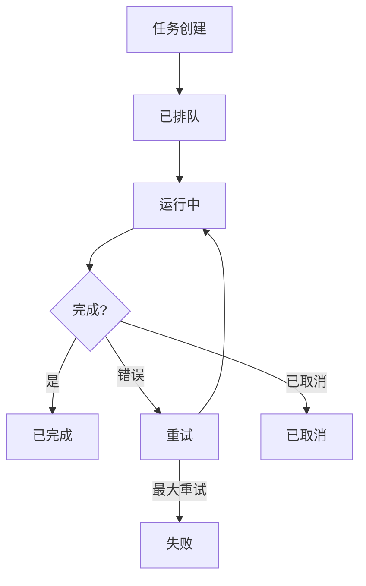
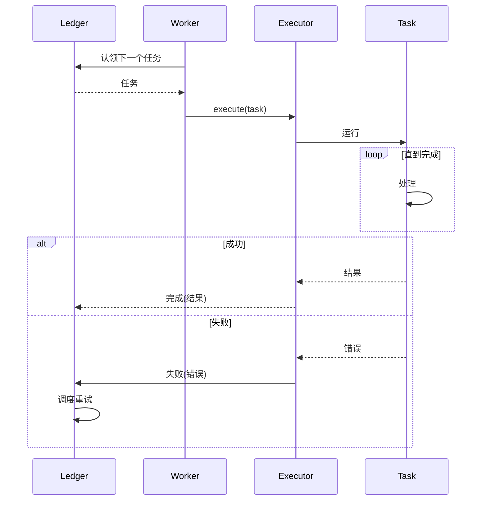
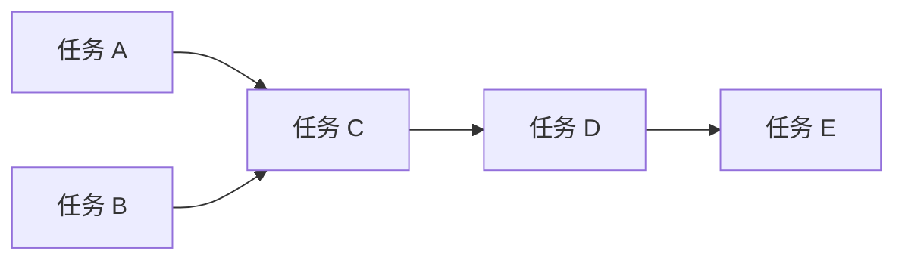
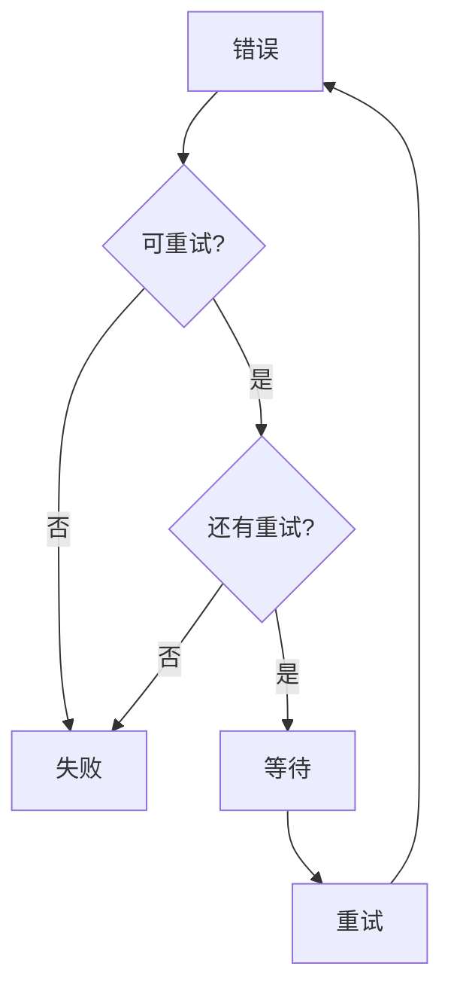

# 任务管理

## 概述

任务系统管理长时间运行和后台操作，提供可靠的执行、状态跟踪和结果检索。



## 任务模型

### 任务定义

```typescript
interface Task {
  id: string;
  type: string;
  status: TaskStatus;
  priority: TaskPriority;

  // 负载
  params: unknown;
  result?: unknown;

  // 执行
  createdAt: Date;
  startedAt?: Date;
  completedAt?: Date;
  retryCount: number;

  // 调度
  scheduledFor?: Date;
  timeout?: number;

  // 跟踪
  metadata: TaskMetadata;
}

type TaskStatus =
  | "pending"
  | "queued"
  | "running"
  | "completed"
  | "failed"
  | "cancelled";

type TaskPriority = "low" | "normal" | "high" | "urgent";
```

### 任务类型

| 类型 | 描述 | 示例 |
|------|-------------|---------|
| `agent` | Agent 运行任务 | "分析此数据" |
| `tool` | 工具执行 | "获取 URL 内容" |
| `flow` | Flow 执行 | "处理订单" |
| `system` | 系统操作 | "清理 Session" |
| `cron` | 定时任务 | "每日报告" |

## 任务账本

### 账本接口

```typescript
interface TaskLedger {
  // CRUD
  create(task: CreateTaskParams): Promise<Task>;
  get(id: string): Promise<Task | null>;
  update(id: string, updates: Partial<Task>): Promise<Task>;
  delete(id: string): Promise<void>;

  // 查询
  list(filter?: TaskFilter): Promise<Task[]>;
  listByStatus(status: TaskStatus): Promise<Task[]>;
  listByType(type: string): Promise<Task[]>;
  count(filter?: TaskFilter): Promise<number>;

  // 操作
  enqueue(id: string): Promise<void>;
  cancel(id: string): Promise<void>;
  retry(id: string): Promise<Task>;
}
```

### 账本存储

```typescript
interface LedgerConfig {
  backend: "memory" | "redis" | "sqlite" | "postgres";
  connection?: string;
  persist?: boolean;
}

const config: LedgerConfig = {
  backend: "redis",
  connection: "redis://localhost:6379",
  persist: true,
};
```

## 任务执行

### Worker 模型



### 任务执行器

```typescript
interface TaskExecutor {
  execute(task: Task): Promise<TaskResult>;
  abort(taskId: string): Promise<void>;
}

interface TaskResult {
  success: boolean;
  result?: unknown;
  error?: TaskError;
  duration: number;
}
```

### Worker 池

```typescript
interface WorkerPool {
  // 池管理
  start(workers: number): Promise<void>;
  stop(): Promise<void>;
  scale(count: number): Promise<void>;

  // 任务处理
  process(task: Task): Promise<void>;
  requeue(task: Task): Promise<void>;
}

const pool = new WorkerPool({
  concurrency: 5,
  maxRetries: 3,
  retryDelay: 5000,
});
```

## 调度

### 定时任务

```typescript
interface ScheduledTask {
  id: string;
  cron: string;
  task: CreateTaskParams;
  enabled: boolean;
  lastRun?: Date;
  nextRun?: Date;
}

const scheduledTask: ScheduledTask = {
  id: "daily-report",
  cron: "0 0 * * *",     // 每天午夜
  task: {
    type: "flow",
    params: { flowId: "generate-report" },
  },
  enabled: true,
};
```

### 延迟任务

```typescript
// 延迟后执行
await taskLedger.create({
  type: "tool",
  params: { tool: "send_reminder", ... },
  scheduledFor: new Date(Date.now() + 3600000),  // 1 小时后
});
```

## 优先级系统

### 优先级级别

| 优先级 | 值 | 使用场景 |
|----------|-------|----------|
| urgent | 100 | 关键操作 |
| high | 75 | 重要任务 |
| normal | 50 | 默认任务 |
| low | 25 | 后台作业 |

### 队列排序

```typescript
// 优先级队列排序
const queueOrder = [
  "urgent",
  "high",
  "normal",
  "low",
];

// 同优先级内 FIFO
const queue = new PriorityQueue<Task>({
  compare: (a, b) => {
    if (a.priority !== b.priority) {
      return b.priority - a.priority;
    }
    return a.createdAt.getTime() - b.createdAt.getTime();
  },
});
```

## 任务依赖

### 依赖图

```typescript
interface TaskDependency {
  taskId: string;
  dependsOn: string[];      // 必须先完成的 Task ID
  blocking?: boolean;       // 失败时阻塞依赖任务
}

// 带依赖的任务
const task: Task = {
  id: "step-2",
  dependsOn: ["step-1"],
  blocking: true,
};
```

### 依赖解析



```typescript
async function resolveDependencies(taskId: string): Promise<Task[]> {
  const task = await ledger.get(taskId);
  const deps = task.dependsOn || [];

  const result: Task[] = [];
  for (const depId of deps) {
    const depTask = await resolveDependencies(depId);
    result.push(...depTask);
    result.push(await ledger.get(depId));
  }

  return result;
}
```

## 取消

### 取消请求

```typescript
interface CancelRequest {
  taskId: string;
  reason?: string;
  force?: boolean;         // 即使正在运行也强制取消
}

// 优雅取消
async function cancelTask(request: CancelRequest): Promise<void> {
  const task = await ledger.get(request.taskId);

  if (task.status === "pending" || task.status === "queued") {
    await ledger.update(task.id, { status: "cancelled" });
    return;
  }

  if (request.force && task.status === "running") {
    await executor.abort(task.id);
    await ledger.update(task.id, { status: "cancelled" });
    return;
  }

  throw new Error("无法取消当前状态的任务");
}
```

## 错误处理

### 重试配置

```typescript
interface RetryConfig {
  maxRetries: number;
  initialDelay: number;      // ms
  maxDelay: number;           // ms
  backoffMultiplier: number;
  retryableErrors?: string[]; // 要重试的错误码
}

const retryConfig: RetryConfig = {
  maxRetries: 3,
  initialDelay: 1000,
  maxDelay: 60000,
  backoffMultiplier: 2,
  retryableErrors: ["TIMEOUT", "RATE_LIMIT", "NETWORK_ERROR"],
};
```

### 重试决策



## 任务事件

### 事件类型

| 事件 | 描述 | 负载 |
|-------|-------------|---------|
| `task:created` | 任务创建 | task |
| `task:queued` | 任务入队 | task |
| `task:started` | 任务开始 | task |
| `task:progress` | 进度更新 | task, progress |
| `task:completed` | 任务完成 | task, result |
| `task:failed` | 任务失败 | task, error |
| `task:cancelled` | 任务取消 | task, reason |

### 事件订阅

```typescript
interface TaskEvents {
  onTaskCreated(handler: (task: Task) => void): void;
  onTaskCompleted(handler: (task: Task, result: unknown) => void): void;
  onTaskFailed(handler: (task: Task, error: Error) => void): void;
  onTaskProgress(handler: (task: Task, progress: number) => void): void;
}

taskLedger.on("task:failed", (task, error) => {
  console.error(`任务 ${task.id} 失败:`, error.message);
  // 发送告警、记录等
});
```

## 监控

### 任务指标

```typescript
interface TaskMetrics {
  totalTasks: number;
  pendingTasks: number;
  runningTasks: number;
  completedTasks: number;
  failedTasks: number;
  averageDuration: number;
  throughput: number;           // 每分钟任务数
  successRate: number;          // 0-100%
}
```

### 健康检查

```typescript
interface TaskHealthCheck {
  status: "healthy" | "degraded" | "unhealthy";
  issues: string[];
  recommendations: string[];
}

// 检查示例
const health = {
  status: "degraded",
  issues: [
    "Worker 池达到 80% 容量",
    "'image-process' 任务失败率较高",
  ],
  recommendations: [
    "将 Worker 池扩展到 10 个 Worker",
    "调查图像处理错误",
  ],
};
```

## 配置

### 完整配置

```typescript
const taskConfig = {
  ledger: {
    backend: "redis",
    connection: "redis://localhost:6379",
  },

  workers: {
    count: 5,
    concurrency: 5,
    prefetch: 2,
  },

  retry: {
    maxRetries: 3,
    initialDelay: 1000,
    maxDelay: 60000,
    backoffMultiplier: 2,
  },

  timeout: {
    default: 300000,      // 工具任务 5 分钟
    overrides: {
      "agent": 600000,    // Agent 任务 10 分钟
      "tool": 60000,      // 工具任务 1 分钟
    },
  },
};
```

## 相关

- [Flows](/architecture-book/part-2-core-modules/07-flows) - 工作流编排
- [Agent 系统](/architecture-book/part-2-core-modules/02-agents) - Agent 集成
- [工具](/architecture-book/part-2-core-modules/05-tools) - 工具系统
