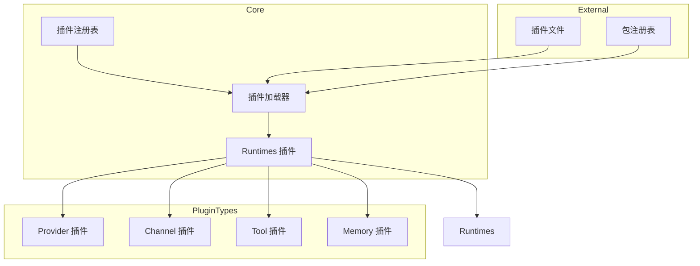
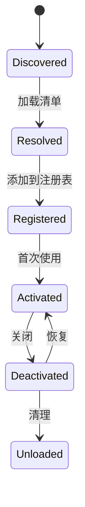
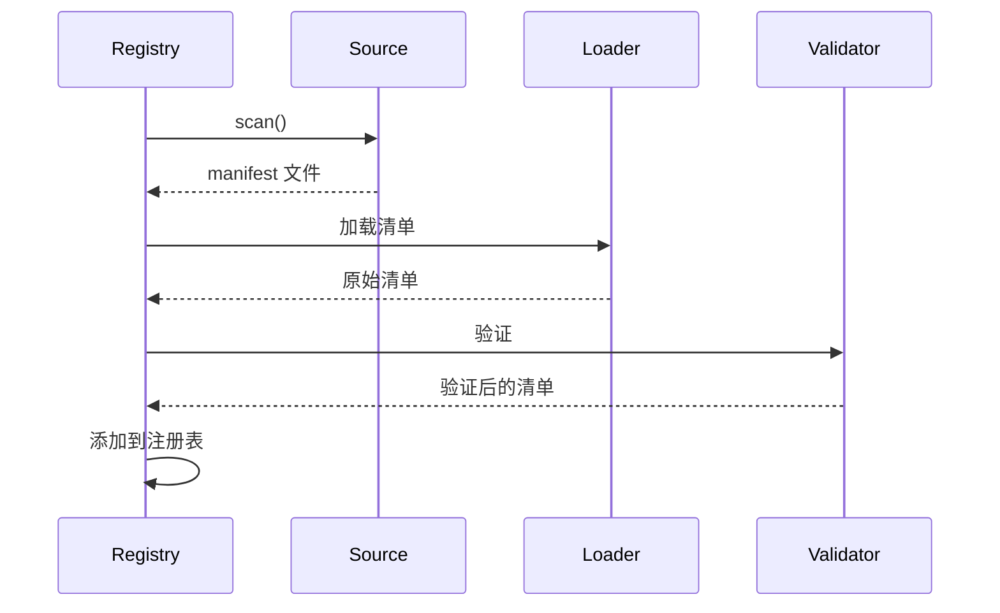

# 插件架构

## 概述

OpenClaw 使用基于插件的架构，使核心系统保持中立，同时通过插件实现广泛的定制能力。



## 设计原则

### 核心保持插件中立

核心系统没有内置以下知识：
- 特定 Provider（OpenAI、Anthropic 等）
- 特定 Channel（Telegram、Discord 等）
- 特定工具
- 特定 AI 模型

所有能力都通过良好定义的插件接口提供。

### 契约优先设计

插件通过严格契约进行通信：

```typescript
interface PluginContract {
  readonly id: string;
  readonly name: string;
  readonly version: string;
  readonly type: PluginType;

  // 生命周期
  activate(context: PluginContext): Promise<void>;
  deactivate(): Promise<void>;
}
```

### 清单优先行为

插件配置在运行时之前从清单元数据派生：

```typescript
// 1. 控制平面：验证清单
const validatedConfig = await registry.validate(manifest);

// 2. 运行时平面：使用验证后的配置执行
await provider.createCompletion(validatedConfig);
```

### 懒加载

插件按需加载：

```typescript
const loader = new PluginLoader({
  lazy: true,
  activationPolicy: "on-demand",
});

// 插件仅在首次使用时激活
await loader.activate("provider/openai");
```

## 插件类型

### 类型层次结构

| 类型 | 描述 | 入口点 |
|------|-------------|-------------|
| provider | AI 模型 Provider | `providerEntry()` |
| channel | 消息平台 | `channelEntry()` |
| tool | 外部能力 | `toolEntry()` |
| memory | 知识存储 | `memoryEntry()` |
| runtime | Agent 执行 | `runtimeEntry()` |

### Provider 插件

连接到 AI 模型 Provider：

```typescript
// extensions/openai/src/index.ts
export const entry = providerEntry({
  id: "openai",
  name: "OpenAI",

  // Provider 方法
  async listModels() {
    // 返回可用模型
    return [
      { ref: "openai:gpt-4o", name: "GPT-4o", ... },
      { ref: "openai:gpt-4o-mini", name: "GPT-4o Mini", ... },
    ];
  },

  async createCompletion(params) {
    // 创建补全
    return openai.chat.completions.create(params);
  },
});
```

### Channel 插件

连接到消息平台：

```typescript
// extensions/telegram/src/index.ts
export const entry = channelEntry({
  id: "telegram",
  name: "Telegram",

  async connect(config) {
    // 连接到 Telegram
    return new TelegramBot(config.token);
  },

  async send(target, message) {
    // 发送消息
    await bot.sendMessage(target.peer, message.content);
  },

  onMessage(handler) {
    // 处理传入消息
    bot.on("message", handler);
  },
});
```

### Tool 插件

提供外部能力：

```typescript
// extensions/tavily/src/index.ts
export const entry = toolEntry({
  id: "tavily",
  name: "Tavily Search",
  tools: [
    {
      name: "web_search",
      description: "搜索网络",
      schema: { query: "string" },
    },
  ],

  async execute(tool, params, context) {
    const result = await tavily.search(params.query);
    return { success: true, content: { type: "text", text: result } };
  },
});
```

## 插件清单

### 清单结构

```json
{
  "id": "provider/openai",
  "name": "OpenAI Provider",
  "version": "1.0.0",
  "type": "provider",
  "description": "OpenAI GPT 模型 Provider",
  "entry": "./dist/index.js",
  "runtime": {
    "node": ">=18.0.0"
  },
  "dependencies": {
    "openai": "^4.0.0"
  },
  "providers": [
    {
      "id": "openai",
      "models": ["gpt-4o", "gpt-4o-mini", "gpt-4-turbo"],
      "capabilities": ["streaming", "function_calling", "vision"]
    }
  ],
  "config": {
    "schema": { /* Zod schema */ }
  }
}
```

### 清单验证

```typescript
const manifestSchema = z.object({
  id: z.string().regex(/^[a-z]+\/[a-z-]+$/),
  name: z.string(),
  version: z.string().regex(/^\d+\.\d+\.\d+/),
  type: z.enum(["provider", "channel", "tool", "memory", "runtime"]),
  entry: z.string(),
  runtime: z.object({
    node: z.string().optional(),
  }).optional(),
  dependencies: z.record(z.string()).optional(),
});

function validateManifest(manifest: unknown) {
  return manifestSchema.parse(manifest);
}
```

## 插件生命周期

### 生命周期状态



### 生命周期方法

```typescript
interface PluginLifecycle {
  // 插件首次激活时调用
  activate(context: PluginContext): Promise<void>;

  // 插件停用时调用
  deactivate(): Promise<void>;

  // 健康检查
  healthCheck(): Promise<HealthStatus>;
}
```

## 插件注册表

### 注册表接口

```typescript
interface PluginRegistry {
  // 发现
  discover(patterns: string[]): Promise<DiscoveredPlugin[]>;
  resolve(id: string): Promise<ResolvedPlugin>;

  // 注册
  register(plugin: Plugin): void;
  unregister(id: string): void;
  get(id: string): Plugin | undefined;
  list(type?: PluginType): Plugin[];

  // 激活
  activate(id: string, options?: ActivationOptions): Promise<void>;
  deactivate(id: string): Promise<void>;

  // 状态
  getStatus(id: string): PluginStatus;
}
```

### 注册表操作

```typescript
// 发现插件
const plugins = await registry.discover([
  "extensions/providers/*",
  "extensions/channels/*",
]);

// 注册插件
registry.register({
  manifest: validatedManifest,
  module: loadedModule,
});

// 按需激活
await registry.activate("provider/openai");

// 检查状态
const status = registry.getStatus("provider/openai");
// { status: "active", activatedAt: Date, ... }
```

## 插件上下文

### 上下文对象

```typescript
interface PluginContext {
  // 配置
  config: Readonly<PluginConfig>;
  secrets: SecretsManager;

  // 服务
  logger: Logger;
  httpClient: HttpClient;
  storage: Storage;

  // OpenClaw API
  session: SessionAPI;
  memory: MemoryAPI;
  tools: ToolsAPI;

  // 生命周期钩子
  hooks: HooksAPI;
}
```

### 使用上下文

```typescript
export async function activate(context: PluginContext) {
  const { config, logger, secrets } = context;

  // 访问配置
  const apiKey = await secrets.get("OPENAI_API_KEY");

  // 使用服务
  logger.info("初始化 OpenAI Provider");

  // 注册到 API
  context.tools.register(myTools);

  // 注册钩子
  context.hooks.on("before:message", myHandler);
}
```

## 插件发现

### 发现源

```typescript
interface DiscoverySource {
  type: "directory" | "npm" | "url";
  path: string;
  patterns?: string[];
}

// 内置发现
const sources: DiscoverySource[] = [
  { type: "directory", path: "./extensions" },
  { type: "directory", path: "~/.openclaw/plugins" },
];

// 自定义发现
await registry.addSource({
  type: "npm",
  package: "@openclaw/plugin-*",
});
```

### 发现过程



## 内置与外部插件

### 内置插件

内置于 OpenClaw 发行版：

```
extensions/              # 内置于核心
├── providers/
│   ├── openai/
│   ├── anthropic/
│   └── ...
├── channels/
│   ├── telegram/
│   ├── discord/
│   └── ...
└── tools/
    ├── browser/
    └── ...
```

### 外部插件

单独安装：

```bash
npm install @openclaw/plugin-custom-provider
```

```typescript
// 配置
const config = {
  plugins: {
    external: [
      {
        name: "@custom/plugin",
        source: "npm",
      },
    ],
  },
};
```

## 安全注意事项

### 插件隔离

插件以最小权限运行：

| 权限 | 默认值 | 可配置 |
|------------|---------|--------------|
| 文件系统 | 读取当前目录 | 按插件配置 |
| 网络 | 无 | 按插件配置 |
| 密钥 | 无 | 显式授权 |
| 工具 | 无 | 显式授权 |

### 沙箱

```typescript
const sandboxConfig = {
  permissions: {
    fs: { allow: ["./workspace/*"], deny: ["~/.openclaw/*"] },
    net: { allow: ["api.example.com"], deny: [] },
    exec: { allow: [], deny: ["rm", "dd", "mkfs"] },
  },
  timeout: 30000,
  memoryLimit: "256MB",
};
```

## 相关

- [插件 SDK](/architecture-book/part-3-plugin-system/02-plugin-sdk) - SDK 文档
- [插件契约](/architecture-book/part-3-plugin-system/03-plugin-contracts) - 契约定义
- [插件运行时](/architecture-book/part-3-plugin-system/04-plugin-runtime) - 运行时实现
- [编写插件](/architecture-book/part-3-plugin-system/05-writing-plugins) - 插件开发