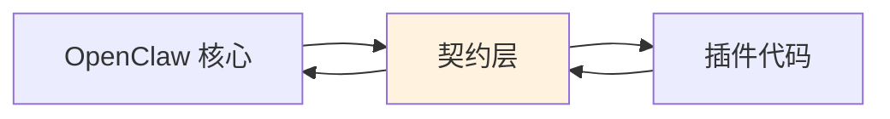
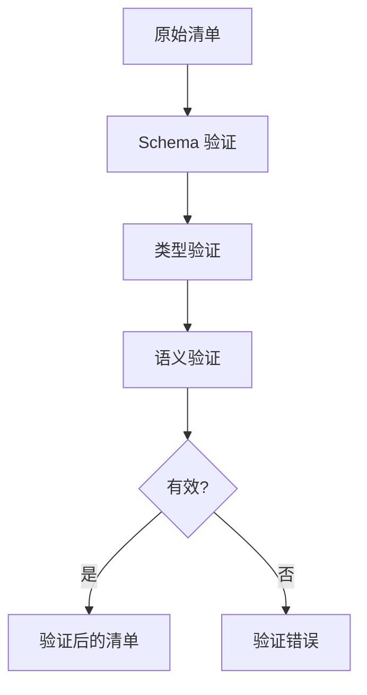

# 插件契约

## 概述

OpenClaw 使用基于契约的设计来确保类型安全、验证以及核心系统与插件之间的清晰边界。



## 契约设计原则

### 什么是契约？

契约定义了双方之间的约定接口：

| 方面 | 描述 |
|--------|-------------|
| 类型 | 数据结构和接口 |
| 方法 | 可用操作 |
| 约束 | 前置条件和后置条件 |
| 事件 | 可观察行为 |
| 错误 | 错误条件和代码 |

### 契约与接口

```typescript
// 接口：存在哪些方法
interface Provider {
  listModels(): Promise<Model[]>;
  createCompletion(params: CompletionParams): Promise<CompletionResult>;
}

// 契约：接口 + 约束 + 语义
interface ProviderContract extends Provider {
  // 约束：listModels 必须返回至少一个模型
  listModels(): Promise<Model[] & { length: number }>;

  // 约束：模型必须有唯一的 ref
  listModels(): Promise<Model[]>; // { every m => isUnique(m.ref) }
}
```

## 注册表契约

### 注册表接口

```typescript
interface RegistryContract {
  // 发现
  discover(patterns: string[]): Promise<DiscoveredPlugin[]>;
  resolve(id: string): Promise<ResolvedPlugin>;

  // 注册
  register(plugin: RegisteredPlugin): void;
  unregister(id: string): void;

  // 状态
  getStatus(id: string): PluginStatus;
  list(type?: PluginType): RegisteredPlugin[];

  // 激活
  activate(id: string): Promise<void>;
  deactivate(id: string): Promise<void>;
}
```

### 注册表不变量

注册表维护这些不变量：

```typescript
const registryInvariants = {
  // 唯一 ID
  uniqueId: () => "所有插件都有唯一的 id",

  // 类型一致性
  typeConsistent: () => "plugin.type 匹配 manifest.type",

  // 生命周期一致性
  lifecycleConsistent: (plugin) =>
    plugin.status === "active" ? plugin.activatedAt : !plugin.activatedAt,

  // 依赖满足: () =>
  //   "所有 plugin.dependencies 解析为已注册的插件",
};
```

## Provider 契约

### Provider 接口

```typescript
interface ProviderContract {
  readonly id: string;
  readonly name: string;

  // 发现
  listModels(): Promise<Model[]>;
  getModel(ref: string): Promise<Model | null>;

  // 推理
  createCompletion(params: CompletionParams): Promise<AsyncIterable<CompletionDelta>>;
  createStructuredCompletion<T>(
    params: StructuredCompletionParams<T>
  ): Promise<T>;

  // 健康
  healthCheck(): Promise<HealthStatus>;
}
```

### Provider 约束

```typescript
// Provider 插件必须满足的约束

interface ProviderConstraints {
  // 模型必须有唯一的引用
  uniqueModelRefs: (models: Model[]) =>
    new Set(models.map((m) => m.ref)).size === models.length,

  // 模型引用必须有命名空间
  namespacedRefs: (models: Model[]) =>
    models.every((m) => m.ref.includes(":")),

  // 如果声明了流式支持则必须支持
  streamingSupport: (model: Model) =>
    model.supportsStreaming ? true : true, // Provider 支持流式 API

  // 视觉模型必须接受图像
  visionCapability: (model: Model) =>
    model.supportsVision ? true : true,
}
```

### 模型 Schema

```typescript
const modelSchema = z.object({
  ref: z.string().regex(/^[a-z]+:[a-z0-9-]+$/),
  name: z.string(),
  provider: z.string(),

  // 能力
  maxTokens: z.number().positive(),
  supportsStreaming: z.boolean(),
  supportsFunctionCalling: z.boolean().default(false),
  supportsVision: z.boolean().default(false),
  supportsJSONMode: z.boolean().default(false),

  // 上下文
  contextWindow: z.number().positive(),
  maxOutputTokens: z.number().positive(),

  // 定价
  inputCost: z.number().nonnegative().optional(),
  outputCost: z.number().nonnegative().optional(),
});
```

## Channel 契约

### Channel 接口

```typescript
interface ChannelContract {
  readonly id: string;
  readonly name: string;
  readonly platform: string;

  // 连接生命周期
  connect(config: ChannelConfig): Promise<void>;
  disconnect(): Promise<void>;
  isConnected(): boolean;

  // 消息
  send(target: ChannelTarget, message: OutboundMessage): Promise<void>;
  editMessage(target: ChannelTarget, messageId: string, content: string): Promise<void>;
  deleteMessage(target: ChannelTarget, messageId: string): Promise<void>;

  // 媒体
  uploadMedia(data: Buffer, type: MediaType): Promise<MediaId>;

  // 事件
  onMessage(handler: MessageHandler): void;
  onEdit(handler: EditHandler): void;
  onReaction(handler: ReactionHandler): void;
}
```

### Channel 约束

```typescript
interface ChannelConstraints {
  // 目标必须有效
  validTarget: (target: ChannelTarget) =>
    target.peer && typeof target.peer === "string",

  // 消息必须有内容或媒体
  nonEmptyMessage: (message: OutboundMessage) =>
    message.content || message.media,

  // 目标必须匹配 Channel 类型
  channelTargetMatch: (target: ChannelTarget, channel: Channel) =>
    channel.platform === target.channel,
}
```

## Tool 契约

### Tool 接口

```typescript
interface ToolContract {
  readonly name: string;
  readonly description: string;
  readonly schema: JsonSchema;
  readonly category?: ToolCategory;

  execute(params: unknown, context: ToolContext): Promise<ToolResult>;
}
```

### Tool 约束

```typescript
interface ToolConstraints {
  // Schema 必须是有效的 JSON Schema
  validSchema: (schema: JsonSchema) =>
    isValidJsonSchema(schema),

  // 名称必须是字母数字加下划线
  validName: (name: string) =>
    /^[a-z][a-z0-9_]*$/.test(name),

  // 结果必须有内容
  nonEmptyResult: (result: ToolResult) =>
    result.success && result.content !== null,

  // 超时时间必须为正数
  validTimeout: (timeout?: number) =>
    timeout === undefined || timeout > 0,
}
```

## Runtime 契约

### Runtime 接口

```typescript
interface RuntimeContract {
  readonly id: string;
  readonly type: RuntimeType;
  readonly capabilities: RuntimeCapabilities;

  // 生命周期
  start(config: RuntimeConfig): Promise<void>;
  stop(): Promise<void>;

  // 执行
  run(params: RunParams): AsyncIterable<RunEvent>;
  abort(runId: string): Promise<void>;

  // 工具
  registerTools(tools: Tool[]): void;
  unregisterTools(names: string[]): void;
}
```

### Runtime 能力

```typescript
interface RuntimeCapabilities {
  streaming: boolean;
  functionCalling: boolean;
  vision: boolean;
  jsonMode: boolean;
  customModes?: string[];
}
```

## 契约验证

### 验证流水线



### 验证函数

```typescript
interface ValidationResult {
  valid: boolean;
  errors: ValidationError[];
}

function validateProviderManifest(manifest: unknown): ValidationResult {
  // 第 1 步：Schema 验证
  const schemaResult = providerManifestSchema.safeParse(manifest);
  if (!schemaResult.success) {
    return { valid: false, errors: schemaResult.error.issues };
  }

  // 第 2 步：模型唯一性
  const refs = schemaResult.data.providers.flatMap(p => p.models);
  const uniqueRefs = new Set(refs);
  if (refs.length !== uniqueRefs.size) {
    return {
      valid: false,
      errors: [{ path: "providers.models", message: "重复的模型 ref" }],
    };
  }

  return { valid: true, errors: [] };
}
```

## 扩展包契约

### 扩展包 Schema

```typescript
const extensionPackageSchema = z.object({
  name: z.string().regex(/^@openclaw\/plugin-[a-z-]+$/),
  version: z.string(),
  type: z.literal("openclaw-plugin"),

  // 插件元数据
  openclaw: z.object({
    id: z.string(),
    type: z.enum(["provider", "channel", "tool", "memory", "runtime"]),
    name: z.string(),
    description: z.string().optional(),
  }),

  // 入口点
  exports: z.object({
    entry: z.string(),
    types: z.string().optional(),
  }),

  // 运行时要求
  runtime: z.object({
    node: z.string().optional(),
    openclaw: z.string(),
  }),
});
```

## 契约测试

### 契约测试

```typescript
describe("Provider 契约", () => {
  it("应该强制模型唯一性", () => {
    const manifest = {
      providers: [{ id: "test", models: ["m1", "m1"] }], // 重复！
    };
    const result = validateProviderManifest(manifest);
    expect(result.valid).toBe(false);
    expect(result.errors).toContainEqual(
      expect.objectContaining({ message: expect.stringContaining("重复") })
    );
  });

  it("应该强制有命名空间的 ref", () => {
    const manifest = {
      providers: [{ id: "test", models: ["invalid"] }], // 没有命名空间！
    };
    const result = validateProviderManifest(manifest);
    expect(result.valid).toBe(false);
  });
});
```

### 不变量测试

```typescript
describe("注册表不变量", () => {
  it("应该维护唯一的插件 ID", () => {
    const registry = new PluginRegistry();
    registry.register(plugin1);
    registry.register(plugin2);

    expect(() => registry.register(pluginWithDuplicateId)).toThrow();
  });

  it("应该维护生命周期一致性", () => {
    const plugin = registry.get("test-plugin");

    expect(plugin.status).toBe("registered");
    expect(plugin.activatedAt).toBeUndefined();

    registry.activate("test-plugin");

    expect(plugin.status).toBe("active");
    expect(plugin.activatedAt).toBeDefined();
  });
});
```

## 错误代码

### 契约错误

```typescript
const CONTRACT_ERRORS = {
  MANIFEST_INVALID: "CONTRACT_001",
  MANIFEST_MISSING_REQUIRED: "CONTRACT_002",
  MODEL_REF_NOT_UNIQUE: "CONTRACT_003",
  MODEL_REF_NOT_NAMESPACED: "CONTRACT_004",
  TARGET_INVALID: "CONTRACT_005",
  TOOL_NAME_INVALID: "CONTRACT_006",
  TOOL_SCHEMA_INVALID: "CONTRACT_007",
  DEPENDENCY_UNSATISFIED: "CONTRACT_008",
  RUNTIME_INCOMPATIBLE: "CONTRACT_009",
};
```

## 相关

- [插件架构](/architecture-book/part-3-plugin-system/01-plugin-architecture) - 插件设计
- [插件 SDK](/architecture-book/part-3-plugin-system/02-plugin-sdk) - SDK 文档
- [插件运行时](/architecture-book/part-3-plugin-system/04-plugin-runtime) - 运行时实现