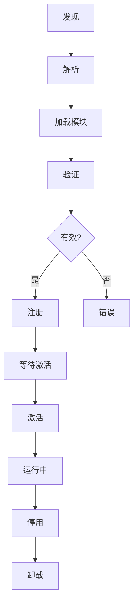
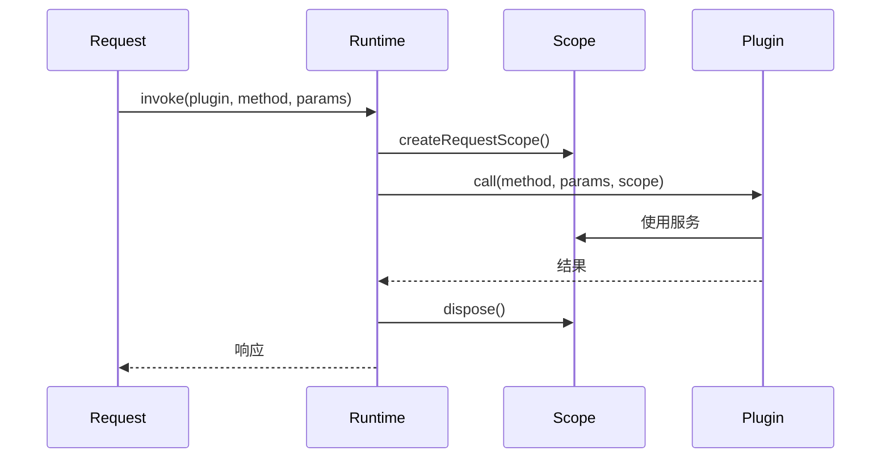
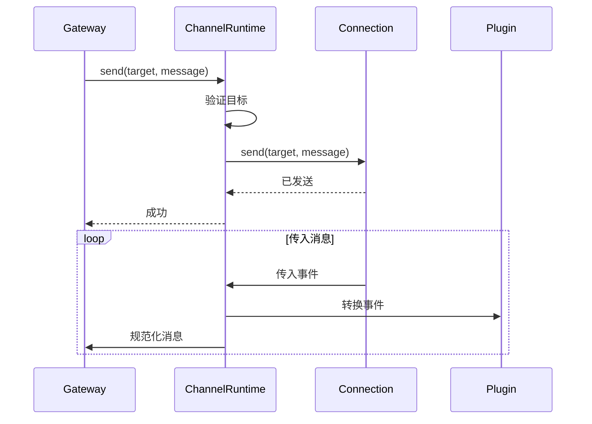

# 插件运行时

## 概述

插件运行时管理插件的加载、激活和执行，提供懒加载、依赖解析和隔离。



## 加载架构

### 模块加载器

```typescript
interface PluginModuleLoader {
  load(id: string, path: string): Promise<PluginModule>;
  reload(id: string): Promise<PluginModule>;
  unload(id: string): Promise<void>;
  getLoaded(id: string): PluginModule | undefined;
}
```

### 懒加载策略

```typescript
class LazyPluginLoader {
  private modules = new Map<string, LazyModule>();
  private activations = new Map<string, ActivationPromise>();

  async load(id: string, path: string): Promise<PluginModule> {
    // 不要在需要之前加载
    const lazyModule = new LazyModule(path);

    // 仅验证清单（轻量级）
    const manifest = await lazyModule.loadManifest();
    this.validateManifest(manifest);

    this.modules.set(id, lazyModule);
    return lazyModule;
  }

  async activate(id: string): Promise<void> {
    // 现在才加载完整模块
    if (this.activations.has(id)) {
      return this.activations.get(id);
    }

    const activation = (async () => {
      const lazyModule = this.modules.get(id);
      if (!lazyModule) throw new Error("模块未加载");

      // 仅在激活时完整加载
      const module = await lazyModule.loadFull();
      const context = await this.createContext(id);

      await module.entry.activate(context);
    })();

    this.activations.set(id, activation);
    return activation;
  }
}
```

## 请求作用域

### 作用域隔离

```typescript
interface RequestScope {
  readonly id: string;
  readonly pluginId: string;
  readonly config: PluginConfig;
  readonly logger: ScopedLogger;

  // 作用域服务
  services: {
    http: ScopedHttpClient;
    storage: ScopedStorage;
    cache: ScopedCache;
  };
}

// 创建请求作用域
function createRequestScope(pluginId: string): RequestScope {
  return {
    id: crypto.randomUUID(),
    pluginId,
    config: getPluginConfig(pluginId),
    logger: createScopedLogger(pluginId),
    services: {
      http: createScopedHttpClient({ timeout: 30000 }),
      storage: createScopedStorage(pluginId),
      cache: createScopedCache(),
    },
  };
}
```

### 作用域生命周期



## 注册表加载器

### 注册表操作

```typescript
class RegistryLoader {
  private registry: PluginRegistry;
  private loader: PluginModuleLoader;
  private contexts = new Map<string, PluginContext>();

  async register(manifest: PluginManifest, module: PluginModule): Promise<void> {
    const validated = this.validate(manifest);

    const plugin: RegisteredPlugin = {
      manifest: validated,
      module,
      status: "registered",
      registeredAt: new Date(),
    };

    this.registry.register(plugin);
  }

  async activate(id: string): Promise<void> {
    const plugin = this.registry.get(id);
    if (!plugin) throw new Error(`找不到插件: ${id}`);

    if (plugin.status === "active") return;

    const context = await this.createContext(id);
    this.contexts.set(id, context);

    try {
      await plugin.module.entry.activate(context);
      this.registry.updateStatus(id, "active");
    } catch (error) {
      this.contexts.delete(id);
      throw error;
    }
  }
}
```

## 任务流运行时

### 任务执行

```typescript
interface TaskFlowRuntime {
  // 启动任务流
  startFlow(flowId: string, input: unknown): Promise<string>; // 返回 runId

  // 检查状态
  getStatus(runId: string): FlowStatus;

  // 等待完成
  awaitCompletion(runId: string): Promise<FlowResult>;

  // 取消
  cancel(runId: string): Promise<void>;
}

interface FlowStatus {
  runId: string;
  flowId: string;
  status: "pending" | "running" | "completed" | "failed" | "cancelled";
  currentStep?: string;
  progress?: number;
  error?: string;
}
```

### 流运行时实现

```typescript
class TaskFlowRuntimeImpl implements TaskFlowRuntime {
  private flows = new Map<string, Flow>();
  private runs = new Map<string, FlowRun>();

  async startFlow(flowId: string, input: unknown): Promise<string> {
    const flow = this.flows.get(flowId);
    if (!flow) throw new Error(`找不到流: ${flowId}`);

    const run: FlowRun = {
      id: crypto.randomUUID(),
      flowId,
      input,
      status: "pending",
      steps: [],
      startTime: new Date(),
    };

    this.runs.set(run.id, run);
    this.executeFlow(run);

    return run.id;
  }

  private async executeFlow(run: FlowRun): Promise<void> {
    run.status = "running";

    for (const step of run.flow.steps) {
      try {
        const result = await this.executeStep(run, step);
        run.steps.push({ stepId: step.id, result, success: true });
      } catch (error) {
        run.steps.push({ stepId: step.id, error, success: false });
        if (!step.onError) {
          run.status = "failed";
          run.error = String(error);
          return;
        }
        // 处理错误步骤
      }
    }

    run.status = "completed";
    run.endTime = new Date();
  }
}
```

## Channel 运行时

### Channel 上下文

```typescript
interface ChannelRuntimeContext {
  readonly channel: string;
  readonly config: ChannelConfig;
  readonly connection: ChannelConnection;

  // 消息
  send(target: ChannelTarget, message: OutboundMessage): Promise<void>;

  // 状态
  getState<T>(key: string, defaultValue: T): T;
  setState<T>(key: string, value: T): void;

  // 事件
  onMessage(handler: MessageHandler): void;
  onError(handler: ErrorHandler): void;
}
```

### Channel 运行时实现



## Memory 运行时

### Memory 上下文

```typescript
interface MemoryRuntimeContext {
  // 存储操作
  store(entry: MemoryEntry): Promise<void>;
  get(key: string): Promise<MemoryEntry | null>;
  update(key: string, updates: Partial<MemoryEntry>): Promise<void>;
  delete(key: string): Promise<void>;

  // 搜索
  search(query: string, options?: SearchOptions): Promise<MemoryResult[]>;

  // 上下文构建
  buildContext(sessionId: string, prompt: string): Promise<MemoryContext>;

  // 压缩
  compact(sessionId: string, strategy?: CompactionStrategy): Promise<void>;
}
```

### Memory 运行时实现

```typescript
class MemoryRuntimeImpl implements MemoryRuntime {
  private store: MemoryStore;
  private index: SearchIndex;

  async search(query: string, options?: SearchOptions): Promise<MemoryResult[]> {
    // 向量搜索
    const embedding = await this.embed(query);
    const results = await this.index.search(embedding, {
      limit: options?.limit ?? 10,
      threshold: options?.threshold ?? 0.7,
    });

    // 按类别过滤
    let filtered = results;
    if (options?.categories) {
      filtered = filtered.filter(r => options.categories!.includes(r.entry.type));
    }

    // 转换为 MemoryResult
    return filtered.map(result => ({
      entry: result.entry,
      score: result.score,
      snippet: this.extractSnippet(result.entry.content, query),
    }));
  }
}
```

## 依赖解析

### 依赖图

```typescript
interface DependencyGraph {
  nodes: Map<string, PluginNode>;
  edges: Map<string, string[]>;  // 插件 -> 依赖

  addNode(plugin: PluginManifest): void;
  removeNode(id: string): void;
  getDependencies(id: string): string[];
  getDependents(id: string): string[];

  // 拓扑排序以确定激活顺序
  getActivationOrder(): string[];

  // 循环检测
  hasCycle(): boolean;
  getCycle(): string[] | null;
}
```

### 解析算法

```typescript
function resolveDependencies(plugins: PluginManifest[]): ResolutionOrder {
  const graph = buildGraph(plugins);

  // 检查循环
  if (graph.hasCycle()) {
    const cycle = graph.getCycle();
    throw new CyclicDependencyError(cycle);
  }

  // 拓扑排序
  const order: string[] = [];
  const visited = new Set<string>();
  const temp = new Set<string>();

  function visit(id: string) {
    if (temp.has(id)) throw new CyclicDependencyError([id]);
    if (visited.has(id)) return;

    temp.add(id);
    for (const dep of graph.getDependencies(id)) {
      visit(dep);
    }
    temp.delete(id);
    visited.add(id);
    order.push(id);
  }

  for (const plugin of plugins) {
    visit(plugin.id);
  }

  return order;
}
```

## 性能优化

### 热路径优化

```typescript
class OptimizedPluginLoader {
  // 在热路径中预计算事实
  private pluginFacts = new Map<string, PluginFacts>();

  async preloadFacts(id: string): Promise<void> {
    const plugin = await this.registry.get(id);
    this.pluginFacts.set(id, {
      providerId: plugin.manifest.providers?.[0]?.id,
      channelId: plugin.manifest.channels?.[0]?.id,
      capabilities: extractCapabilities(plugin.manifest),
      configSchema: buildConfigSchema(plugin.manifest),
    });
  }

  // 避免在热路径中重复查找
  getProviderId(id: string): string | undefined {
    // 使用预计算的事实
    return this.pluginFacts.get(id)?.providerId;
  }
}
```

### 内存优化

```typescript
class MemoryOptimizedLoader {
  // 使用 WeakMap 进行自动清理
  private contexts = new WeakMap<PluginModule, PluginContext>();

  // 延迟初始化重型对象
  private heavyObjects = new Map<string, () => unknown>();

  registerHeavy(id: string, factory: () => unknown): void {
    this.heavyObjects.set(id, factory);
  }

  getHeavy(id: string): unknown {
    const factory = this.heavyObjects.get(id);
    return factory ? factory() : undefined;
  }
}
```

## 相关

- [插件架构](/architecture-book/part-3-plugin-system/01-plugin-architecture) - 插件设计
- [插件契约](/architecture-book/part-3-plugin-system/03-plugin-contracts) - 契约系统
- [编写插件](/architecture-book/part-3-plugin-system/05-writing-plugins) - 插件开发