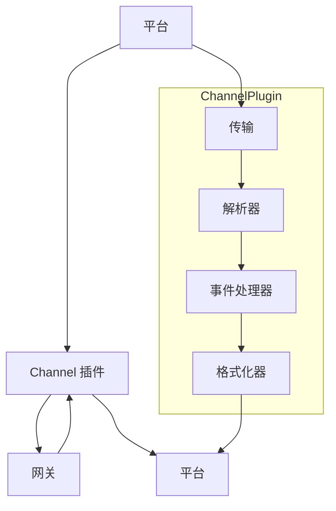

# Channel 插件

## 概述

Channel 插件将 OpenClaw 连接到消息平台，处理传输、消息格式转换和事件规范化。



## Channel 插件结构

### 入口点

```typescript
import { channelEntry } from "@openclaw/plugin-sdk/runtime/channel";

export const entry = channelEntry({
  id: "telegram",
  name: "Telegram",

  // 生命周期
  async connect(config) {
    return new TelegramBot(config.token, config.options);
  },

  async disconnect(bot) {
    await bot.close();
  },

  // 消息
  async send(target, message, bot) {
    // 实现
  },

  // 事件处理
  onMessage(bot, handler) {
    bot.on("message", handler);
  },

  // 媒体处理
  async uploadMedia(bot, data, type) {
    // 实现
  },
});
```

## 传输层

### 传输接口

```typescript
interface ChannelTransport {
  // 连接管理
  connect(config: TransportConfig): Promise<void>;
  disconnect(): Promise<void>;
  isConnected(): boolean;

  // 发送
  send(target: Target, payload: PlatformPayload): Promise<void>;

  // 接收
  onMessage(handler: MessageHandler): void;
  onDisconnect(handler: DisconnectHandler): void;
}
```

### 传输实现

```typescript
class TelegramTransport implements ChannelTransport {
  private bot?: TelegramBot;
  private messageHandlers: MessageHandler[] = [];
  private disconnectHandlers: DisconnectHandler[] = [];

  async connect(config: TelegramConfig): Promise<void> {
    this.bot = new TelegramBot(config.token);

    // 设置 webhook 或长轮询
    if (config.useWebhook) {
      await this.bot.setWebhook(config.webhookUrl);
    } else {
      this.bot.on("polling", { interval: 1000 });
    }

    // 将消息转发给处理器
    this.bot.on("message", (msg) => {
      const normalized = this.normalizeMessage(msg);
      this.messageHandlers.forEach((h) => h(normalized));
    });

    this.bot.on("disconnect", () => {
      this.disconnectHandlers.forEach((h) => h());
    });
  }

  async disconnect(): Promise<void> {
    await this.bot?.stopPolling();
    this.bot = undefined;
  }

  async send(target: Target, payload: PlatformPayload): Promise<void> {
    if (!this.bot) throw new Error("未连接");

    if (payload.text) {
      await this.bot.sendMessage(target.peer, payload.text, {
        parse_mode: payload.format,
      });
    }

    if (payload.media) {
      await this.sendMedia(target, payload.media);
    }
  }

  onMessage(handler: MessageHandler): void {
    this.messageHandlers.push(handler);
  }

  onDisconnect(handler: DisconnectHandler): void {
    this.disconnectHandlers.push(handler);
  }
}
```

## 消息格式转换

### 传出格式化

```typescript
interface OutboundFormatter {
  format(target: Target, message: OutboundMessage): PlatformPayload;
}

class TelegramFormatter implements OutboundFormatter {
  format(target: Target, message: OutboundMessage): PlatformPayload {
    const payload: TelegramPayload = {
      chat_id: target.peer,
    };

    if (message.content) {
      payload.text = this.formatText(message.content);
      payload.parse_mode = message.format === "html" ? "HTML" : "Markdown";
    }

    if (message.media) {
      return this.formatMedia(target, message.media);
    }

    if (message.buttons) {
      payload.reply_markup = this.formatButtons(message.buttons);
    }

    return payload;
  }

  private formatText(content: MessageContent): string {
    if (typeof content === "string") {
      return content;
    }
    // 处理结构化内容
    return content.blocks.map((b) => b.text).join("\n");
  }

  private formatButtons(
    buttons: Button[]
  ): InlineKeyboardMarkup {
    return {
      inline_keyboard: buttons.map((row) =>
        row.buttons.map((btn) => ({
          text: btn.label,
          url: btn.url,
          callback_data: btn.data,
        }))
      ),
    };
  }
}
```

### 传入规范化

```typescript
interface MessageNormalizer {
  normalize(platformMessage: unknown): InboundMessage;
}

class TelegramNormalizer implements MessageNormalizer {
  normalize(raw: TelegramMessage): InboundMessage {
    return {
      id: raw.message_id.toString(),
      channel: "telegram",
      peer: raw.chat.id.toString(),
      peerType: this.getPeerType(raw.chat),
      sender: {
        id: raw.from?.id.toString(),
        name: this.getSenderName(raw.from),
        username: raw.from?.username,
      },
      content: this.extractContent(raw),
      media: this.extractMedia(raw),
      timestamp: new Date(raw.date * 1000),
      replyTo: raw.reply_to_message?.message_id.toString(),
      metadata: {
        chatType: raw.chat.type,
        isEdited: !!raw.edit_date,
      },
    };
  }

  private extractContent(msg: TelegramMessage): string {
    if (msg.text) return msg.text;
    if (msg.caption) return msg.caption;
    if (msg.photo) return "[图片]";
    if (msg.document) return "[文档]";
    if (msg.sticker) return "[表情包]";
    return "";
  }

  private extractMedia(msg: TelegramMessage): MediaAttachment | undefined {
    if (msg.photo) {
      const largest = msg.photo[msg.photo.length - 1];
      return {
        type: "image",
        id: largest.file_id,
        url: largest.file_id, // 稍后解析
        mimeType: "image/jpeg",
        width: largest.width,
        height: largest.height,
      };
    }
    if (msg.document) {
      return {
        type: "file",
        id: msg.document.file_id,
        url: msg.document.file_id,
        mimeType: msg.document.mime_type,
        filename: msg.document.file_name,
        size: msg.document.file_size,
      };
    }
    return undefined;
  }
}
```

## 事件处理

### 事件类型

```typescript
interface ChannelEvents {
  onMessage(handler: MessageHandler): void;
  onEdit(handler: EditHandler): void;
  onReaction(handler: ReactionHandler): void;
  onCommand(handler: CommandHandler): void;
  onCallback(handler: CallbackHandler): void;
}

type MessageHandler = (message: InboundMessage) => void | Promise<void>;
type EditHandler = (edit: MessageEdit) => void | Promise<void>;
type ReactionHandler = (reaction: Reaction) => void | Promise<void>;
type CommandHandler = (command: Command) => void | Promise<void>;
type CallbackHandler = (callback: Callback) => void | Promise<void>;
```

### 命令处理

```typescript
class TelegramCommandHandler {
  private commands: Map<string, CommandHandler> = new Map();

  register(command: string, handler: CommandHandler): void {
    this.commands.set(command, handler);
  }

  handle(message: InboundMessage): void {
    const text = message.content;
    if (!text.startsWith("/")) return;

    const parts = text.slice(1).split(" ");
    const command = parts[0].split("@")[0]; // 移除 @机器人名
    const args = parts.slice(1);

    const handler = this.commands.get(command);
    if (!handler) return;

    handler({
      command,
      args,
      message,
      fullText: text,
    });
  }
}

// 使用
const cmdHandler = new TelegramCommandHandler();
cmdHandler.register("start", async ({ message }) => {
  // 处理 /start 命令
});

bot.on("message", (msg) => {
  const normalized = normalizer.normalize(msg);
  cmdHandler.handle(normalized);
  // 也转发到通用消息处理器
});
```

### 回调查询

```typescript
interface CallbackHandler {
  (callback: {
    id: string;
    data: string;
    message: InboundMessage;
    from: Sender;
    answer: (text?: string, showAlert?: boolean) => Promise<void>;
  }): void | Promise<void>;
}

// 实现
bot.on("callback_query", async (query) => {
  const callback = {
    id: query.id,
    data: query.data || "",
    message: normalizer.normalize(query.message),
    from: normalizer.normalizeSender(query.from),
    answer: async (text?: string, showAlert?: boolean) => {
      await bot.answerCallbackQuery(query.id, {
        text,
        show_alert: showAlert,
      });
    },
  };

  await this.callbackHandler(callback);
});
```

## 媒体处理

### 媒体上传

```typescript
class TelegramMediaHandler {
  async uploadMedia(
    bot: TelegramBot,
    data: Buffer,
    type: MediaType
  ): Promise<string> {
    switch (type) {
      case "image":
        return this.uploadPhoto(bot, data);
      case "video":
        return this.uploadVideo(bot, data);
      case "audio":
        return this.uploadAudio(bot, data);
      case "file":
      default:
        return this.uploadDocument(bot, data);
    }
  }

  private async uploadPhoto(bot: TelegramBot, data: Buffer): Promise<string> {
    const file = await bot.uploadFile("photo", {
      source: data,
      filename: "image.jpg",
    });
    return file.file_id;
  }

  private async uploadDocument(
    bot: TelegramBot,
    data: Buffer
  ): Promise<string> {
    const file = await bot.uploadFile("document", {
      source: data,
      filename: "document",
    });
    return file.file_id;
  }
}
```

### 媒体解析

```typescript
interface MediaResolver {
  resolveMediaUrl(media: MediaAttachment): Promise<string>;
}

class TelegramMediaResolver implements MediaResolver {
  async resolveMediaUrl(media: MediaAttachment): Promise<string> {
    // 从 Telegram API 获取文件路径
    const file = await this.bot.getFile(media.id);
    return `https://api.telegram.org/file/bot${this.bot.token}/${file.file_path}`;
  }
}
```

## 平台特定功能

### 功能检测

```typescript
interface ChannelCapabilities {
  text: boolean;
  markdown: boolean;
  html: boolean;
  images: boolean;
  videos: boolean;
  audio: boolean;
  files: boolean;
  buttons: boolean;
  inlineButtons: boolean;
  reactions: boolean;
  threads: boolean;
  replies: boolean;
  forward: boolean;
  stickers: boolean;
}

const telegramCapabilities: ChannelCapabilities = {
  text: true,
  markdown: true,
  html: true,
  images: true,
  videos: true,
  audio: true,
  files: true,
  buttons: true,
  inlineButtons: true,
  reactions: true,
  threads: false,  // 私聊中不可用
  replies: true,
  forward: true,
  stickers: true,
};
```

### 平台限制

```typescript
const platformLimitations = {
  telegram: {
    maxMessageLength: 4096,
    maxCaptionLength: 1024,
    maxPhotoSize: "10MB",
    maxVideoSize: "50MB",
    maxFileSize: "2000MB",
    buttonRows: 4,
    buttonsPerRow: 12,
  },
  discord: {
    maxMessageLength: 2000,
    maxEmbedTitle: 256,
    maxEmbedDescription: 4096,
    maxFields: 25,
    maxFieldValue: 1024,
    maxFooterText: 2048,
  },
};
```

## 错误处理

### 重试逻辑

```typescript
interface RetryConfig {
  maxRetries: number;
  initialDelay: number;
  maxDelay: number;
  backoffMultiplier: number;
}

async function sendWithRetry(
  target: Target,
  message: OutboundMessage,
  config: RetryConfig = defaultRetryConfig
): Promise<void> {
  let delay = config.initialDelay;
  let lastError: Error;

  for (let i = 0; i <= config.maxRetries; i++) {
    try {
      await this.send(target, message);
      return;
    } catch (error) {
      lastError = error;

      if (!isRetryableError(error)) {
        throw error;
      }

      if (i < config.maxRetries) {
        await sleep(delay);
        delay = Math.min(delay * config.backoffMultiplier, config.maxDelay);
      }
    }
  }

  throw lastError;
}

function isRetryableError(error: Error): boolean {
  // 网络错误、速率限制、临时失败
  return (
    error instanceof NetworkError ||
    error instanceof RateLimitError ||
    error instanceof TemporaryFailureError
  );
}
```

## 测试

### Mock 传输

```typescript
class MockChannelTransport implements ChannelTransport {
  private connected = false;
  private messages: InboundMessage[] = [];

  async connect(): Promise<void> {
    this.connected = true;
  }

  async disconnect(): Promise<void> {
    this.connected = false;
  }

  isConnected(): boolean {
    return this.connected;
  }

  async send(): Promise<void> {
    // 测试时为空操作
  }

  onMessage(handler: MessageHandler): void {
    // 存储处理器以供测试注入
  }

  // 测试辅助方法
  injectMessage(message: InboundMessage): void {
    this.messages.push(message);
    this.messageHandlers.forEach((h) => h(message));
  }
}
```

### 集成测试

```typescript
describe("Telegram Channel 插件", () => {
  it("应该处理传入消息", async () => {
    const plugin = createTestChannelPlugin({
      entry: telegramEntry,
      config: { token: "test-token" },
    });

    await plugin.activate();
    await plugin.connect();

    // 模拟传入消息
    const mockUpdate = {
      message_id: 1,
      chat: { id: 123, type: "private" },
      from: { id: 456, first_name: "Test" },
      text: "/start",
      date: Date.now() / 1000,
    };

    const handler = plugin.getMessageHandler();
    handler(telegramNormalizer.normalize(mockUpdate));

    // 验证行为
    expect(plugin.sentMessages).toHaveLength(1);
  });
});
```

## 相关

- [插件架构](/architecture-book/part-3-plugin-system/01-plugin-architecture) - 插件设计
- [插件 SDK](/architecture-book/part-3-plugin-system/02-plugin-sdk) - SDK 文档
- [Channel 系统](/architecture-book/part-5-channels/01-channel-architecture) - Channel 架构