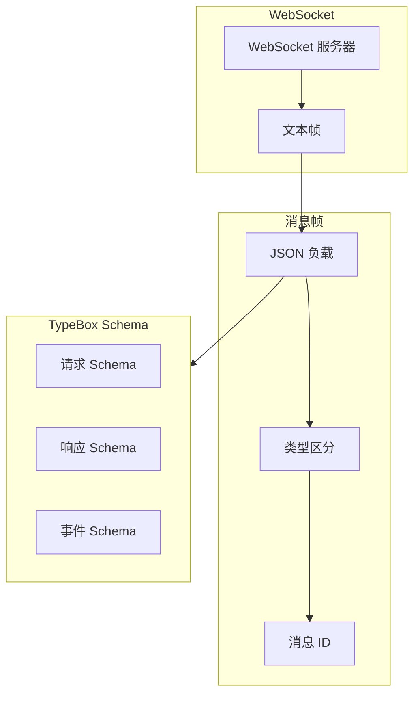
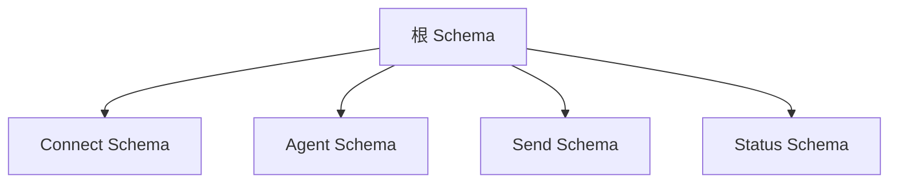
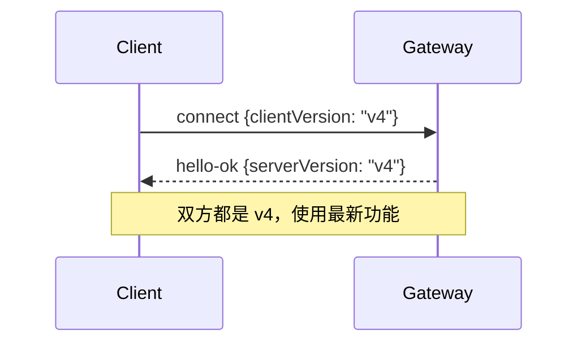
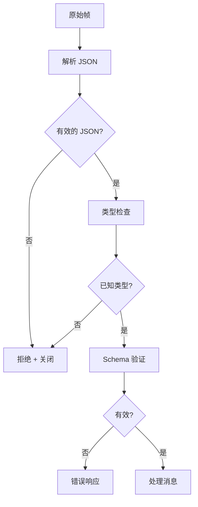

# 协议概述

## 概述

OpenClaw Gateway 使用类型化 WebSocket 协议进行客户端与网关之间的所有通信。该协议设计用于可靠性、类型安全和可扩展性。

## 设计目标

| 目标 | 实现方式 |
|------|----------------|
| 类型安全 | 所有消息使用 TypeBox schema |
| 可靠性 | 幂等键、确认 |
| 可扩展性 | 增量协议版本 |
| 性能 | 流式传输、压缩 |
| 安全性 | 每次连接都需要认证 |

## 协议栈



## 消息类型

### 三种消息类型

| 类型 | 方向 | 描述 |
|------|-----------|-------------|
| `req` | 客户端到网关 | 带响应的请求 |
| `res` | 网关到客户端 | 对请求的响应 |
| `event` | 网关到客户端 | 服务器推送事件 |

### 请求

```typescript
interface RequestFrame {
  type: "req";
  id: string;           // 唯一请求 ID
  method: string;       // RPC 方法名
  params: unknown;      // 方法参数
  idemKey?: string;     // 幂等键
}
```

### 响应

```typescript
interface ResponseFrame {
  type: "res";
  id: string;           // 匹配的请求 ID
  ok: boolean;
  payload?: unknown;    // 成功负载
  error?: {
    code: string;
    message: string;
    details?: unknown;
  };
}
```

### 事件

```typescript
interface EventFrame {
  type: "event";
  event: string;        // 事件类型名
  payload: unknown;     // 事件数据
  seq?: number;         // 序列号
  stateVersion?: number; // 用于状态同步
}
```

## TypeBox Schema 系统

### Schema 层次结构



### Schema 定义

```typescript
import { Type } from "@sinclair/typebox";

// 连接请求
const ConnectRequestSchema = Type.Object({
  type: Type.Literal("connect"),
  params: Type.Object({
    auth: Type.Object({
      token: Type.Optional(Type.String()),
      password: Type.Optional(Type.String()),
    }),
    device: Type.Object({
      id: Type.String(),
      name: Type.String(),
      platform: Type.String(),
    }),
    client: Type.Object({
      version: Type.String(),
      name: Type.String(),
    }),
  }),
});

// Agent 请求
const AgentRequestSchema = Type.Object({
  type: Type.Literal("req"),
  id: Type.String(),
  method: Type.Literal("agent"),
  params: Type.Object({
    sessionKey: Type.String(),
    agentId: Type.String(),
    input: Type.String(),
    idemKey: Type.Optional(Type.String()),
    modelRef: Type.Optional(Type.String()),
  }),
});
```

## 版本控制策略

### 版本兼容性

| 版本 | 变更 | 兼容性 |
|---------|---------|---------------|
| v1 | 初始版本 | 基础协议 |
| v2 | 添加流式传输 | 增量 |
| v3 | 设备元数据 | 增量 |
| v4 | 幂等键 | 增量 |

### 版本协商



## RPC 方法

### 核心方法

| 方法 | 描述 | 幂等 |
|--------|-------------|------------|
| `connect` | 初始握手 | N/A |
| `agent` | 运行 Agent | 是 |
| `send` | 发送消息 | 是 |
| `health` | 健康检查 | 是 |
| `status` | 系统状态 | 是 |

### Agent 方法

```typescript
// 请求
{
  type: "req",
  id: "req-123",
  method: "agent",
  params: {
    sessionKey: "telegram:dm:123456",
    agentId: "main",
    input: "天气怎么样？",
    idemKey: "msg-456"  // 用于重试安全
  }
}

// 响应（流式）
{
  type: "event",
  event: "agent",
  payload: {
    runId: "run-789",
    delta: "今天的天气"
  }
}

// 最终响应
{
  type: "res",
  id: "req-123",
  ok: true,
  payload: {
    runId: "run-789",
    status: "complete",
    summary: "天气晴朗..."
  }
}
```

### Send 方法

```typescript
// 请求
{
  type: "req",
  id: "req-456",
  method: "send",
  params: {
    channel: "telegram",
    target: "123456",
    message: {
      content: "你好，世界！"
    },
    idemKey: "send-789"
  }
}

// 响应
{
  type: "res",
  id: "req-456",
  ok: true,
  payload: {
    messageId: "msg-out-001"
  }
}
```

## 事件类型

### 事件类别

| 类别 | 事件 |
|----------|--------|
| Agent | `agent`, `agent.start`, `agent.complete` |
| 聊天 | `chat`, `chat.reaction`, `chat.edit` |
| 状态 | `presence`, `presence.update` |
| 健康 | `tick`, `health`, `health.degraded` |
| 系统 | `shutdown`, `restart` |

### Tick 事件

```typescript
// 周期性健康/事件快照
{
  type: "event",
  event: "tick",
  payload: {
    timestamp: "2024-01-15T10:30:00Z",
    uptime: 86400,
    sessions: 5,
    channels: ["telegram", "discord"],
    health: "healthy"
  }
}
```

### Presence 事件

```typescript
{
  type: "event",
  event: "presence",
  payload: {
    channels: [
      { id: "telegram", status: "connected", users: 3 },
      { id: "discord", status: "connected", users: 12 }
    ],
    agents: [
      { id: "main", sessions: 15, running: 1 }
    ]
  }
}
```

## 错误处理

### 错误代码

| 代码 | 描述 | HTTP 等价 |
|------|-------------|-----------------|
| `AUTH_FAILED` | 认证失败 | 401 |
| `VALIDATION_ERROR` | 无效请求 | 400 |
| `SESSION_NOT_FOUND` | 会话不存在 | 404 |
| `AGENT_ERROR` | Agent 执行失败 | 500 |
| `RATE_LIMITED` | 请求过多 | 429 |
| `INTERNAL_ERROR` | 网关错误 | 500 |

### 错误响应

```typescript
{
  type: "res",
  id: "req-123",
  ok: false,
  error: {
    code: "VALIDATION_ERROR",
    message: "无效的会话键格式",
    details: {
      field: "params.sessionKey",
      expected: "channel:scope:target"
    }
  }
}
```

## 帧验证

### 验证流水线



### 验证错误

```typescript
function validateFrame(frame: unknown): ValidationResult {
  // 第 1 步：解析 JSON
  if (typeof frame !== "object" || frame === null) {
    return { valid: false, error: "不是对象" };
  }

  // 第 2 步：检查 type 字段
  const obj = frame as Record<string, unknown>;
  if (!obj.type || typeof obj.type !== "string") {
    return { valid: false, error: "缺少 type 字段" };
  }

  // 第 3 步：根据 schema 验证
  const schema = schemas[obj.type];
  if (!schema) {
    return { valid: false, error: `未知类型: ${obj.type}` };
  }

  const result = schema.validate(obj);
  if (!result.valid) {
    return { valid: false, error: result.errors };
  }

  return { valid: true, data: result.data };
}
```

## 相关

- [WebSocket 传输](/architecture-book/part-4-gateway-protocol/02-ws-transport) - 传输实现
- [消息流](/architecture-book/part-4-gateway-protocol/03-message-flow) - 消息处理
- [事件和 RPC](/architecture-book/part-4-gateway-protocol/04-events-and-rpc) - 通信模式