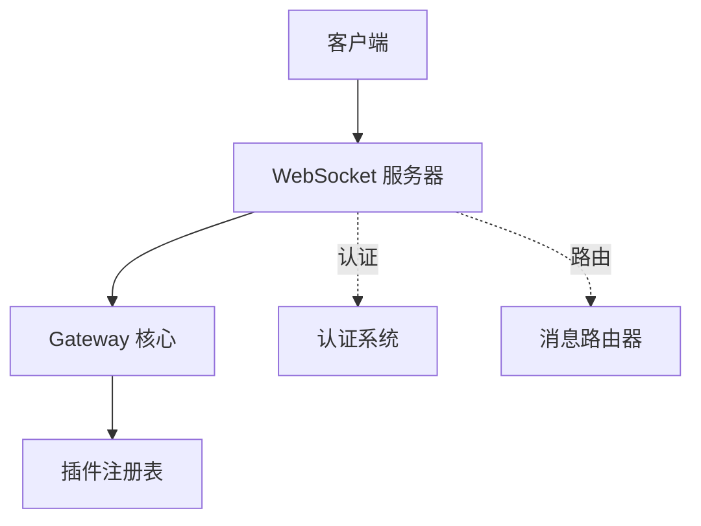
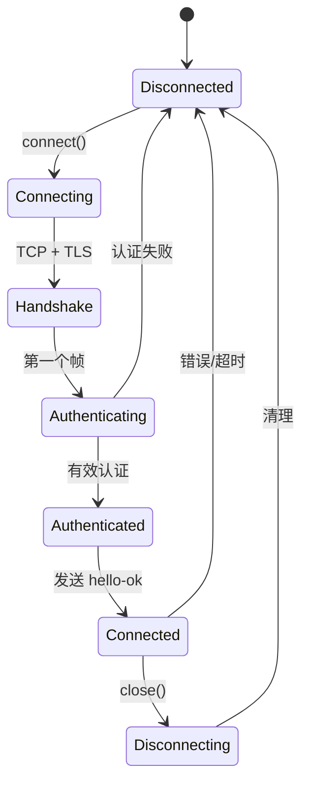
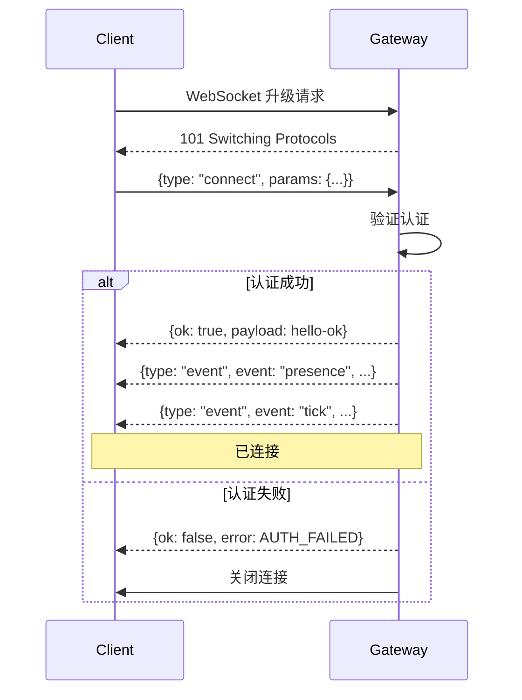
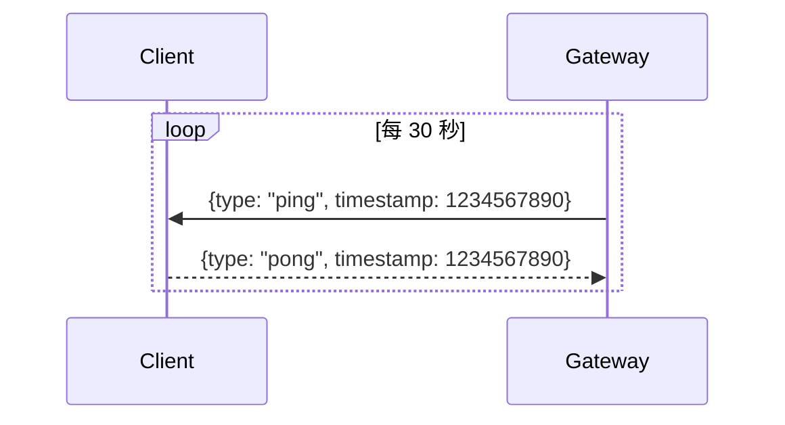
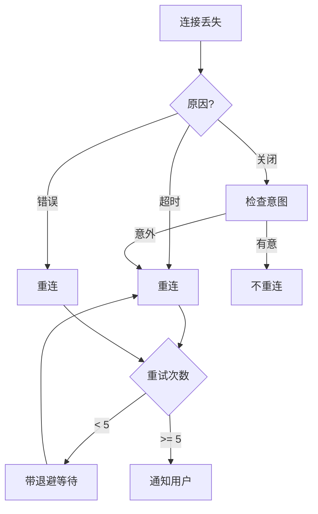

# WebSocket 传输

## 概述

Gateway 使用 WebSocket 作为其传输层，具有用于连接建立的强制握手协议。

## 连接架构



## 连接生命周期

### 生命周期状态



### 第一个帧要求

**关键**：新 WebSocket 连接上的第一个帧必须是 `connect` 请求。任何其他帧都会导致立即关闭连接。

```typescript
// 正确 - 第一个帧是 connect
socket.on("message", (data) => {
  const frame = JSON.parse(data);
  if (frame.type === "connect") {
    handleConnect(frame);
  } else {
    socket.close(4000, "第一个帧必须是 connect");
  }
});
```

## 握手协议

### Connect 请求

```typescript
interface ConnectRequest {
  type: "connect";
  params: {
    auth: {
      token?: string;      // Token 认证
      password?: string;    // 密码认证
    };
    device: {
      id: string;
      name: string;
      platform: string;
      family?: string;      // 例如 "iPhone", "Mac"
    };
    client: {
      version: string;
      name: string;         // 例如 "openclaw-cli", "openclaw-ui"
    };
    role?: "operator" | "node";
    capabilities?: string[];
  };
}
```

### Connect 响应

```typescript
interface HelloOk {
  type: "res";          // Connect 响应的隐式类型
  ok: true;
  payload: {
    serverVersion: string;
    features: {
      methods: string[];
      events: string[];
      streaming: boolean;
    };
    health: HealthStatus;
    presence: PresenceSnapshot;
  };
}
```

### 握手流程



## 认证模式

### Token 认证

```typescript
// 使用 token 连接
{
  type: "connect",
  params: {
    auth: {
      token: "sk-openclaw-xxxxx"
    },
    device: {
      id: "device-uuid",
      name: "My Device",
      platform: "macos"
    },
    client: {
      version: "1.0.0",
      name: "openclaw-cli"
    }
  }
}
```

### 密码认证

```typescript
// 使用密码连接
{
  type: "connect",
  params: {
    auth: {
      password: "my-password"
    },
    // ...
  }
}
```

### Tailscale 认证

当 `gateway.auth.allowTailscale: true` 时，从请求头信任 Tailscale 身份：

```typescript
// 不需要认证参数 - 使用 Tailscale 身份
{
  type: "connect",
  params: {
    device: {
      id: "device-uuid",
      // ...
    }
    // 没有 auth 字段
  }
}
```

## 心跳机制

### Ping/Pong



### 超时处理

```typescript
const TIMEOUTS = {
  pongWait: 10000,      // 等待 pong 10 秒
  reconnectDelay: 1000, // 初始重连延迟
  maxReconnectDelay: 30000,
};

function handlePong(timeout: number) {
  clearTimeout(timeout);
  lastPongReceived = Date.now();
}

function checkHeartbeat() {
  if (Date.now() - lastPongReceived > TIMEOUTS.pongWait) {
    console.warn("心跳超时，正在重连...");
    reconnect();
  }
}
```

## 消息帧

### 帧格式

所有消息都是 JSON 文本帧：

```typescript
// 请求帧
{
  "type": "req",
  "id": "req-abc123",
  "method": "agent",
  "params": {
    "sessionKey": "main",
    "input": "你好！"
  }
}

// 响应帧
{
  "type": "res",
  "id": "req-abc123",
  "ok": true,
  "payload": { ... }
}

// 事件帧
{
  "type": "event",
  "event": "tick",
  "payload": { ... }
}
```

### 大消息处理

对于超过 WebSocket 帧限制的消息：

```typescript
interface ChunkedMessage {
  chunk: {
    total: number;      // 总块数
    index: number;      // 当前块（从 0 开始）
    id: string;         // 用于重组的消息 ID
  };
  data: string;         // UTF-8 字符串块
}

function sendLarge(message: string) {
  const CHUNK_SIZE = 64 * 1024; // 64KB
  const chunks = splitIntoChunks(message, CHUNK_SIZE);

  chunks.forEach((chunk, i) => {
    socket.send(JSON.stringify({
      chunk: {
        total: chunks.length,
        index: i,
        id: generateId()
      },
      data: chunk
    }));
  });
}
```

## 重连处理

### 重连策略



### 指数退避

```typescript
function getReconnectDelay(attempt: number): number {
  const baseDelay = 1000;
  const maxDelay = 30000;
  const delay = Math.min(baseDelay * Math.pow(2, attempt), maxDelay);
  return delay + Math.random() * 1000; // 添加抖动
}
```

## TLS 配置

### TLS 选项

```typescript
interface TLSConfig {
  enabled: boolean;
  certPath?: string;
  keyPath?: string;
  caPath?: string;
  verifyClient?: boolean;
}

const tlsConfig: TLSConfig = {
  enabled: true,
  certPath: "/path/to/cert.pem",
  keyPath: "/path/to/key.pem",
  verifyClient: true,  // 要求客户端证书
};
```

## 客户端示例

### JavaScript 客户端

```typescript
import WebSocket from "ws";

class OpenClawClient {
  private ws?: WebSocket;
  private pendingRequests = new Map();
  private sequence = 0;

  async connect(url: string, token: string) {
    this.ws = new WebSocket(url);

    // 发送 connect 作为第一个帧
    await this.send({
      type: "connect",
      params: {
        auth: { token },
        device: {
          id: generateId(),
          name: "my-client",
          platform: "browser"
        },
        client: {
          version: "1.0.0",
          name: "my-app"
        }
      }
    });

    this.ws.on("message", (data) => this.handleMessage(JSON.parse(data)));
  }

  async request(method: string, params: unknown): Promise<unknown> {
    const id = `req-${++this.sequence}`;
    const promise = new Promise((resolve, reject) => {
      this.pendingRequests.set(id, { resolve, reject });
    });

    await this.send({ type: "req", id, method, params });
    return promise;
  }

  private handleMessage(frame: unknown) {
    if (frame.type === "res") {
      const pending = this.pendingRequests.get(frame.id);
      if (pending) {
        frame.ok ? pending.resolve(frame.payload) : pending.reject(frame.error);
        this.pendingRequests.delete(frame.id);
      }
    } else if (frame.type === "event") {
      this.emit(frame.event, frame.payload);
    }
  }
}
```

## 相关

- [协议概述](/architecture-book/part-4-gateway-protocol/01-protocol-overview) - 协议设计
- [消息流](/architecture-book/part-4-gateway-protocol/03-message-flow) - 消息处理
- [事件和 RPC](/architecture-book/part-4-gateway-protocol/04-events-and-rpc) - 通信模式