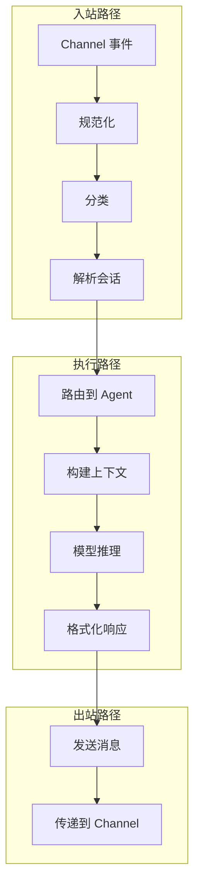
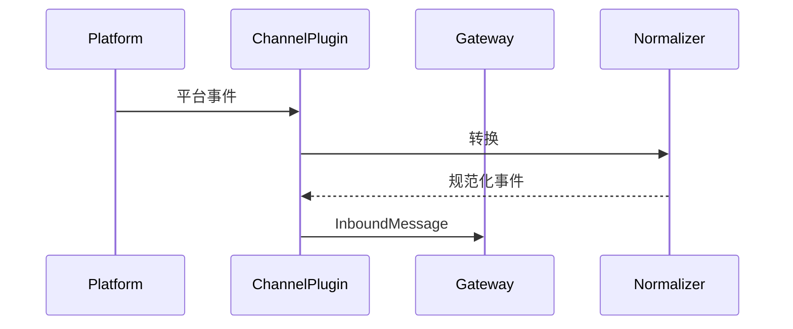
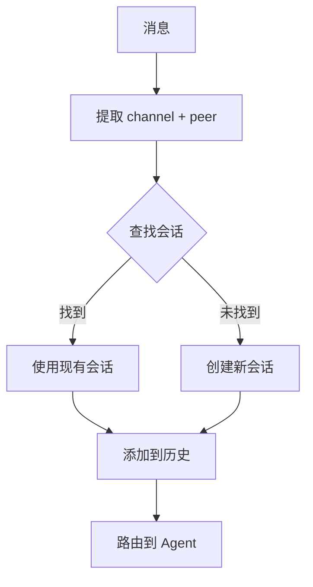
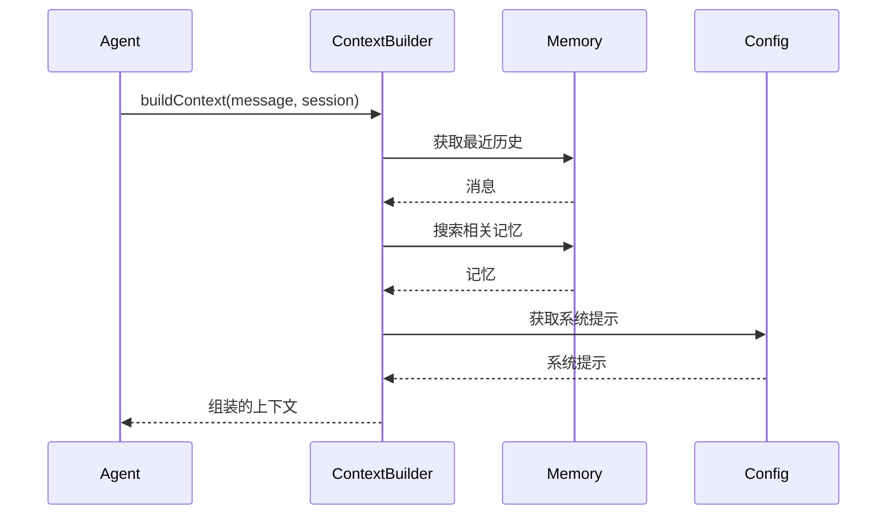
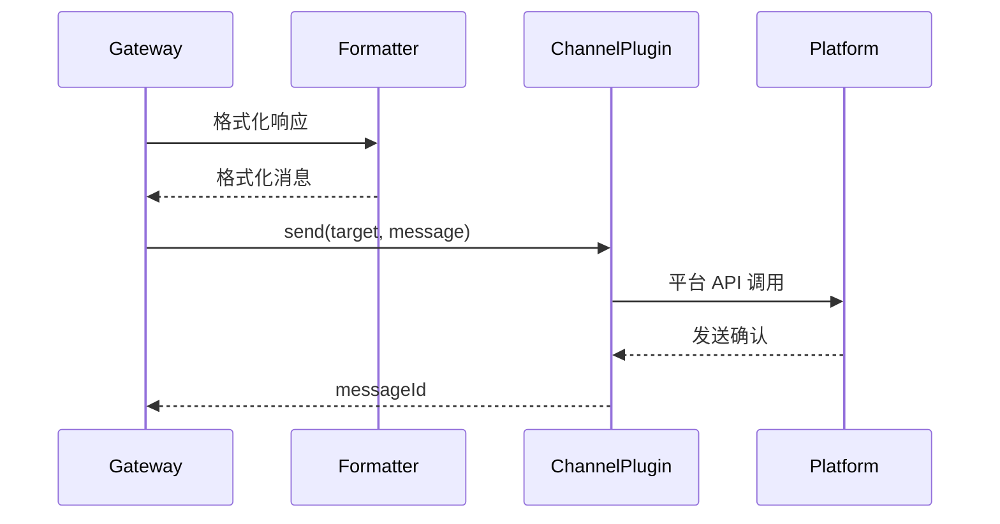
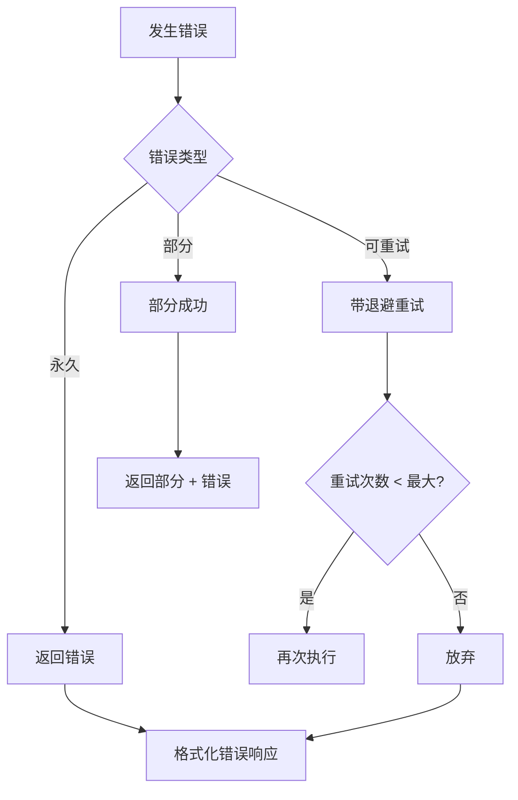

# 消息流

## 概述

消息通过明确定义的管道在 OpenClaw 中流动，从入站 Channel 事件通过会话解析到 Agent 执行和出站传递。

## 消息流概述



## 入站路径

### Channel 事件接收



### 消息规范化

```typescript
interface InboundMessage {
  id: string;
  channel: string;
  peer: string;
  peerType: "user" | "group" | "channel";
  sender: Sender;
  content: string;
  media?: MediaAttachment;
  timestamp: Date;
  replyTo?: string;
  metadata: Record<string, unknown>;
}

interface Sender {
  id: string;
  name: string;
  username?: string;
  mention?: string;
}
```

### 消息分类

```typescript
interface MessageClassification {
  type: "user" | "command" | "mention" | "callback" | "system";
  intent?: string;
  entities?: Entity[];
}

function classifyMessage(msg: InboundMessage): MessageClassification {
  // 检查命令前缀
  if (msg.content.startsWith("/")) {
    return { type: "command", intent: extractCommand(msg.content) };
  }

  // 检查机器人提及
  if (msg.content.includes("@bot")) {
    return { type: "mention", intent: extractIntent(msg.content) };
  }

  // 检查回调查询
  if (msg.metadata.callbackQuery) {
    return { type: "callback", intent: msg.metadata.callbackQuery.data };
  }

  return { type: "user", intent: extractIntent(msg.content) };
}
```

## 会话解析

### 会话键派生

```typescript
interface SessionResolution {
  sessionKey: string;
  agentId: string;
  scope: SessionScope;
}

function resolveSession(msg: InboundMessage, config: Config): SessionResolution {
  const { channel, peer, peerType } = msg;

  let scope: SessionScope;

  switch (config.session.dmScope) {
    case "per-channel-peer":
      scope = peerType === "user" ? "dm" : "group";
      break;
    case "per-channel":
      scope = "channel";
      break;
    case "global":
      scope = "global";
      break;
  }

  // 派生会话键
  const sessionKey = scope === "global"
    ? "main"
    : `${channel}:${scope}:${peer}`;

  // 解析 Agent
  const agentId = resolveAgent(sessionKey, config);

  return { sessionKey, agentId, scope };
}
```

### 会话查找



## 执行路径

### Agent 路由

```typescript
interface AgentRouting {
  agentId: string;
  modelRef?: string;
  tools?: string[];
}

function routeToAgent(
  msg: InboundMessage,
  session: Session,
  config: Config
): AgentRouting {
  // 检查显式 Agent 选择
  if (msg.metadata.agentId) {
    return { agentId: msg.metadata.agentId };
  }

  // 检查会话绑定
  if (session.agentId) {
    return { agentId: session.agentId };
  }

  // 使用默认 Agent
  return { agentId: config.agents.default };
}
```

### 上下文构建



### 推理管道

```typescript
async function runInference(
  params: InferenceParams
): Promise<AsyncIterable<InferenceEvent>> {
  const context = await buildContext(params);

  // 流式响应
  const stream = await provider.createCompletion({
    model: params.modelRef,
    messages: context.messages,
    system: context.systemPrompt,
    temperature: params.temperature,
    stream: true,
  });

  for await (const chunk of stream) {
    yield {
      type: "delta",
      delta: chunk.delta,
      usage: chunk.usage,
    };

    // 处理工具调用
    if (chunk.toolCalls) {
      yield { type: "tool_calls", calls: chunk.toolCalls };
      // 执行工具并继续...
    }
  }

  yield { type: "complete", summary: await generateSummary(context) };
}
```

## 出站路径

### 响应格式化

```typescript
interface OutboundFormatter {
  format(
    response: AgentResponse,
    format: "markdown" | "html" | "plain"
  ): FormattedMessage;
}

class ResponseFormatter implements OutboundFormatter {
  format(response: AgentResponse, format: Format): FormattedMessage {
    return {
      content: this.transformContent(response.content, format),
      media: response.media,
      buttons: response.buttons,
      replyTo: response.replyTo,
    };
  }

  private transformContent(content: string, format: Format): string {
    switch (format) {
      case "html":
        return this.markdownToHtml(content);
      case "plain":
        return this.stripMarkdown(content);
      default:
        return content;
    }
  }
}
```

### Channel 传递



### 发送管道

```typescript
async function sendMessage(
  target: ChannelTarget,
  message: OutboundMessage,
  options: SendOptions = {}
): Promise<SendResult> {
  // 验证目标
  validateTarget(target);

  // 格式化消息
  const formatted = formatter.format(message, options.format);

  // 检查速率限制
  await rateLimiter.check(target.channel);

  // 带重试发送
  const result = await withRetry(
    () => channel.send(target, formatted),
    {
      maxRetries: 3,
      backoff: { initial: 1000, multiplier: 2 },
    }
  );

  return {
    messageId: result.messageId,
    timestamp: new Date(),
  };
}
```

## 错误流

### 错误处理管道



### 错误恢复

```typescript
async function withErrorRecovery<T>(
  operation: () => Promise<T>
): Promise<T> {
  try {
    return await operation();
  } catch (error) {
    if (isRetryableError(error)) {
      return handleRetryableError(error);
    }

    if (isPartialSuccess(error)) {
      return handlePartialSuccess(error);
    }

    throw formatError(error);
  }
}

function isRetryableError(error: Error): boolean {
  return (
    error instanceof NetworkError ||
    error instanceof TimeoutError ||
    error instanceof RateLimitError
  );
}
```

## 幂等性

### 幂等流

```typescript
interface IdempotentOperation {
  idemKey: string;
  operation: () => Promise<Result>;
  cache: Map<string, CachedResult>;
}

async function executeIdempotent(
  op: IdempotentOperation
): Promise<Result> {
  const { idemKey, operation, cache } = op;

  // 检查缓存
  if (cache.has(idemKey)) {
    return cache.get(idemKey).result;
  }

  // 执行操作
  const result = await operation();

  // 缓存结果（短期 TTL）
  cache.set(idemKey, {
    result,
    expiresAt: Date.now() + 60000,
  });

  return result;
}
```

## 相关

- [协议概述](/architecture-book/part-4-gateway-protocol/01-protocol-overview) - 协议设计
- [WebSocket 传输](/architecture-book/part-4-gateway-protocol/02-ws-transport) - 传输层
- [事件和 RPC](/architecture-book/part-4-gateway-protocol/04-events-and-rpc) - 通信模式